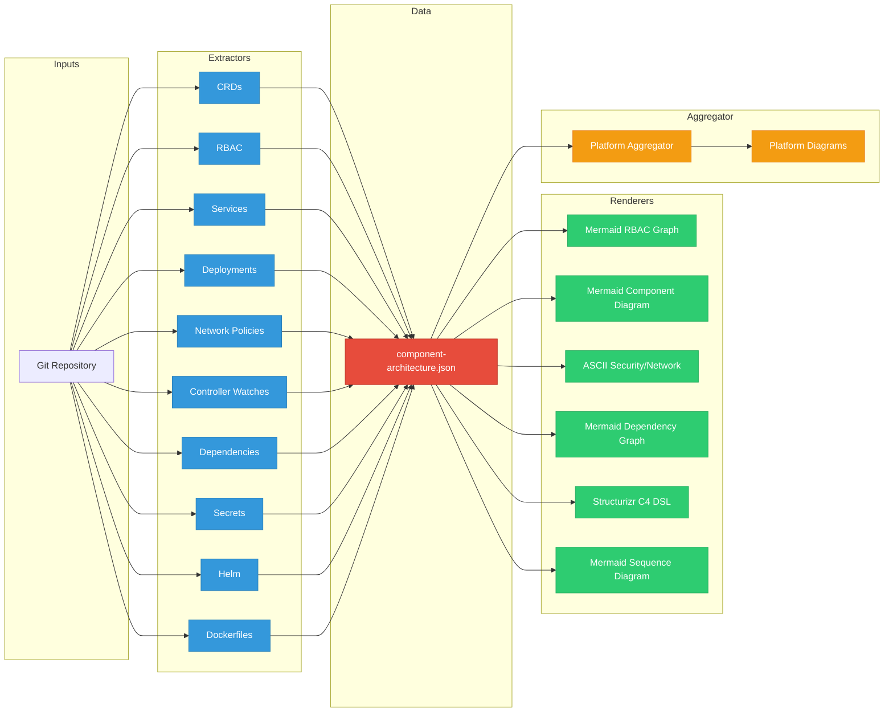

# RHOAI Architecture Analyzer

A static analysis tool that extracts architecture data from Kubernetes/OpenShift component repositories and generates diagrams. Designed for the OpenShift AI (RHOAI) ecosystem, it analyzes CRDs, RBAC, deployments, services, network policies, controller watches, dependencies, secrets, Helm charts, and Dockerfiles.

## Architecture



## Data Model

The central data contract between extractors and renderers is `component-architecture.json`:

```mermaid
graph TD
    ROOT["component-architecture.json"]

    ROOT --> META["component, repo, extracted_at, analyzer_version"]
    ROOT --> CRDS["crds[]"]
    ROOT --> RBAC["rbac{}"]
    ROOT --> DEPS["deployments[]"]
    ROOT --> SVCS["services[]"]
    ROOT --> NP["network_policies[]"]
    ROOT --> CW["controller_watches[]"]
    ROOT --> DEP["dependencies{}"]
    ROOT --> SEC["secrets_referenced[]"]
    ROOT --> DOCK["dockerfiles[]"]
    ROOT --> HELM["helm{}"]

    CRDS --> CRD_FIELDS["group, version, kind, scope, fields_count, validation_rules"]
    RBAC --> RBAC_FIELDS["cluster_roles[], cluster_role_bindings[], roles[], role_bindings[], kubebuilder_markers[]"]
    DEPS --> DEP_FIELDS["name, replicas, service_account, containers[]"]
    SVCS --> SVC_FIELDS["name, type, ports[], selector"]
    NP --> NP_FIELDS["pod_selector, policy_types, ingress_rules[], egress_rules[]"]
    CW --> CW_FIELDS["type (For/Owns/Watches), gvk, source"]
    DEP --> DEPD_FIELDS["go_modules[], internal_odh[]"]
    SEC --> SEC_FIELDS["name, type, referenced_by[], provisioned_by"]
    DOCK --> DOCK_FIELDS["base_image, stages, user, exposed_ports[], issues[]"]
    HELM --> HELM_FIELDS["chart_name, chart_version, values_defaults{}"]

    classDef root fill:#e74c3c,stroke:#c0392b,color:#fff
    classDef section fill:#3498db,stroke:#2980b9,color:#fff
    classDef fields fill:#ecf0f1,stroke:#bdc3c7,color:#333

    class ROOT root
    class CRDS,RBAC,DEPS,SVCS,NP,CW,DEP,SEC,DOCK,HELM section
    class CRD_FIELDS,RBAC_FIELDS,DEP_FIELDS,SVC_FIELDS,NP_FIELDS,CW_FIELDS,DEPD_FIELDS,SEC_FIELDS,DOCK_FIELDS,HELM_FIELDS,META fields
```



## Requirements

- Python 3.12+
- pyyaml (only dependency)

## Installation

```bash
git clone https://github.com/ugiordan/rhoai-architecture-analyzer.git
cd rhoai-architecture-analyzer
pip install -r requirements.txt
```

## Usage

### Analyze a single repository

Extract architecture data and generate all diagrams in one step:

```bash
python3 analyze.py analyze /path/to/repo --output-dir output/
```

This produces:
- `output/component-architecture.json` -- extracted data
- `output/diagrams/rbac.mmd` -- Mermaid RBAC graph
- `output/diagrams/component.mmd` -- Mermaid component diagram
- `output/diagrams/dependencies.mmd` -- Mermaid dependency graph
- `output/diagrams/dataflow.mmd` -- Mermaid sequence diagram
- `output/diagrams/security-network.txt` -- ASCII security/network diagram
- `output/diagrams/c4-context.dsl` -- Structurizr C4 DSL

### Extract only (no diagrams)

```bash
python3 analyze.py extract /path/to/repo --output component-architecture.json
```

### Render diagrams from existing JSON

```bash
python3 analyze.py render component-architecture.json --output-dir diagrams/

# Render specific formats only
python3 analyze.py render component-architecture.json --formats mermaid,security
```

Available format groups:
- `mermaid` -- RBAC, component, dependency, and dataflow diagrams
- `security` -- ASCII security/network diagram
- `c4` -- Structurizr C4 DSL
- `all` -- everything (default)

### Aggregate multiple components

After analyzing multiple repositories, aggregate them into a platform view:

```bash
# Analyze multiple repos
bash scripts/analyze-repo.sh opendatahub-io/opendatahub-operator results/
bash scripts/analyze-repo.sh opendatahub-io/model-registry-operator results/

# Aggregate
python3 analyze.py aggregate results/ --output-dir platform-output/
```

This produces:
- `platform-output/platform-architecture.json` -- aggregated data
- `platform-output/diagrams/platform-dependencies.mmd` -- cross-component dependency graph
- `platform-output/diagrams/platform-crd-ownership.mmd` -- CRD ownership map
- `platform-output/diagrams/platform-rbac-overview.mmd` -- platform RBAC overview
- `platform-output/diagrams/platform-network-topology.mmd` -- network topology

### Batch analysis via shell script

```bash
bash scripts/analyze-repo.sh opendatahub-io/opendatahub-operator results/
```

### Verbose output

Add `-v` for debug logging:

```bash
python3 analyze.py -v analyze /path/to/repo
```

## Extractors

| Extractor | Source Patterns | Data Extracted |
|-----------|----------------|----------------|
| CRDs | `config/crd/bases/`, `deploy/crds/`, `charts/**/crds/` | Group, version, kind, scope, field count, CEL rules |
| RBAC | `config/rbac/`, `deploy/rbac/`, Go kubebuilder markers | ClusterRoles, Bindings, rules, kubebuilder RBAC markers |
| Services | `**/service*.yaml` | Name, type, ports, selector |
| Deployments | `**/deployment*.yaml`, `**/manager*.yaml` | Containers, security context, env refs, volumes, resources |
| Network Policies | `**/networkpolicy*.yaml`, `**/netpol*.yaml` | Pod selector, ingress/egress rules |
| Controller Watches | `**/*_controller.go`, `**/setup.go` | For/Owns/Watches with GVK resolution |
| Dependencies | `go.mod` | Go modules (direct only), internal ODH dependencies |
| Secrets | Deployments, services | Secret names, types, references (never values) |
| Helm | `Chart.yaml`, `values.yaml` | Chart metadata, security-relevant defaults |
| Dockerfiles | `Dockerfile*`, `Containerfile*` | Base image, stages, USER, EXPOSE, security issues |

## Renderers

### Mermaid RBAC Graph (`rbac.mmd`)

Shows the RBAC hierarchy: ServiceAccounts -> RoleBindings -> Roles -> Resources with verb labels. Color-coded: SA (blue), Role (orange), Resources (green).

### Mermaid Component Diagram (`component.mmd`)

Shows CRDs watched via For, owned resources, watched resources, and internal ODH dependencies.

### ASCII Security/Network Diagram (`security-network.txt`)

Layered text diagram covering network topology (services, ports), network policies, RBAC summary, secrets inventory, deployment security controls, and Dockerfile security.

### Mermaid Dependency Graph (`dependencies.mmd`)

Shows the component and its Go module dependencies. Internal ODH deps in green, external notable deps in gray.

### Structurizr C4 DSL (`c4-context.dsl`)

C4 context diagram with persons (admin, data scientist), system containers from deployments, Kubernetes API as external system, and ODH dependencies.

### Mermaid Dataflow Diagram (`dataflow.mmd`)

Sequence diagram showing static connections: controller watches (For/Owns/Watches) and service endpoints.

## Project Structure

```
rhoai-architecture-analyzer/
  extractors/           # Per-aspect extraction modules
    base.py             # Base extractor with YAML/file parsing utilities
    extract_crds.py
    extract_rbac.py
    extract_services.py
    extract_deployments.py
    extract_network_policies.py
    extract_controller_watches.py
    extract_dependencies.py
    extract_secrets.py
    extract_helm.py
    extract_dockerfiles.py
  renderers/            # Diagram generators
    base.py             # Base renderer class
    render_rbac.py
    render_component.py
    render_security_network.py
    render_dependencies.py
    render_c4.py
    render_dataflow.py
  aggregator/           # Platform-wide aggregation
    aggregate.py
    render_platform.py
  scripts/
    analyze-repo.sh     # Clone + analyze + cleanup for one repo
  tests/
    test_extractors.py
    test_renderers.py
    test_aggregator.py
    fixtures/           # Sample YAML/Go/Dockerfile fixtures
  analyze.py            # Main CLI entry point
  scan-config.yaml      # List of repos to analyze
  .github/workflows/
    analyze-all.yml     # Scheduled/manual GitHub Actions workflow
```

## Adding New Extractors

1. Create `extractors/extract_<name>.py` extending `BaseExtractor`
2. Implement the `extract()` method returning a dict with your data key
3. Add the extractor class to `extractors/__init__.py` and `ALL_EXTRACTORS`
4. Add tests in `tests/test_extractors.py` with fixtures

## Adding New Renderers

1. Create `renderers/render_<name>.py` extending `BaseRenderer`
2. Implement `render()` returning a string and `filename()` returning the output filename
3. Add the renderer class to `renderers/__init__.py` and `ALL_RENDERERS`
4. Add it to the `FORMAT_RENDERERS` dict in `analyze.py` or add a new format group
5. Add tests in `tests/test_renderers.py`

## Running Tests

```bash
python3 -m unittest discover -s tests -v
```

## GitHub Actions

The `analyze-all.yml` workflow runs weekly (Monday 06:00 UTC) or on manual dispatch. It clones all repos from `scan-config.yaml`, runs the analyzer, aggregates results, and uploads artifacts.

## Roadmap

### Phase 2: Ambient-Action LLM Enhancement

- Feed extracted JSON to an LLM for architectural analysis
- Generate natural language security assessments
- Identify cross-component dependency risks
- Suggest RBAC least-privilege improvements
- Detect missing network policies
- Generate change impact analysis
