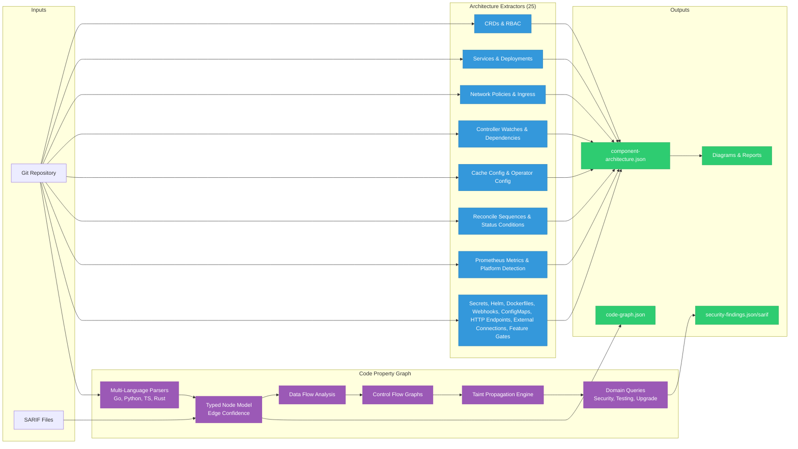

# Architecture Analyzer

A static analysis tool that extracts architecture data from Kubernetes/OpenShift component repositories and generates diagrams, security reports, and code property graphs. Works with any Go-based K8s operator ecosystem.

**[Documentation](https://ugiordan.github.io/architecture-analyzer)** | **[GitHub](https://github.com/ugiordan/architecture-analyzer)**

## Features

- **25 architecture extractors** covering CRDs, RBAC, deployments, services, network policies, controller watches, dependencies, secrets, Helm charts, Dockerfiles, webhooks, configmaps, HTTP endpoints, ingress, external connections, feature gates, cache architecture, operator config constants, reconciliation sequences, Prometheus metrics, status conditions, platform detection, Go CRD extraction, webhook behavioral analysis, and programmatic resource operations
- **Go AST extraction** via `go/packages` for operators that `.gitignore` generated manifests. Extracts CRDs from Go types with kubebuilder markers, analyzes webhook method bodies for field-level mutations and validations, and detects programmatic `client.Create/Update/Patch/Delete` calls in reconcile methods. Security-hardened for untrusted repo analysis (CGO_ENABLED=0, module isolation, boundedFileSystem).
- **Code property graph** with multi-language parsing (Go, Python, TypeScript, Rust), typed node model, edge confidence classification, intraprocedural data flow, control flow graphs, and two-phase taint propagation
- **20 security queries** across 3 domains (security, testing, upgrade) detecting webhook gaps, RBAC bugs, secret leaks, taint paths, complexity hotspots, and more
- **SARIF ingestion** mapping external scanner findings (Semgrep, gosec, etc.) to CPG nodes for unified analysis
- **Structural diff engine** comparing code graphs across versions to detect regressions
- **7 renderers** producing Mermaid diagrams, Structurizr C4 DSL, ASCII security views, and structured markdown reports
- **CRD contract validation** detecting breaking schema changes across repos
- **Platform aggregation** merging multiple component analyses into a cross-repo view

## Architecture



## Requirements

- Go 1.25+

## Installation

```bash
git clone https://github.com/ugiordan/architecture-analyzer.git
cd architecture-analyzer
go build -o arch-analyzer ./cmd/arch-analyzer/
```

## Usage

### Analyze a repository (extract + render)

```bash
./arch-analyzer analyze /path/to/repo --output-dir output/
```

Produces:
- `output/component-architecture.json` (extracted architecture data)
- `output/diagrams/rbac.mmd` (Mermaid RBAC graph)
- `output/diagrams/component.mmd` (Mermaid component diagram)
- `output/diagrams/dependencies.mmd` (Mermaid dependency graph)
- `output/diagrams/dataflow.mmd` (Mermaid sequence diagram)
- `output/diagrams/security-network.txt` (ASCII security/network diagram)
- `output/diagrams/c4-context.dsl` (Structurizr C4 DSL)
- `output/diagrams/report.md` (structured markdown report)

### Extract only (no diagrams)

```bash
./arch-analyzer extract /path/to/repo --output component-architecture.json
```

### Code graph security scan

```bash
./arch-analyzer scan /path/to/repo --format json --output findings.json
./arch-analyzer scan /path/to/repo --format sarif --output findings.sarif

# With specific domains
./arch-analyzer scan /path/to/repo --domains security,testing,upgrade

# Import SARIF from external scanners alongside the scan
./arch-analyzer scan /path/to/repo --import-sarif gosec.sarif,semgrep.sarif

# With architecture context for richer queries
./arch-analyzer scan /path/to/repo --with-arch
```

### Export code property graph

```bash
./arch-analyzer graph /path/to/repo --output code-graph.json
./arch-analyzer graph /path/to/repo --format dot --output code-graph.dot
```

### Structural diff between code graphs

```bash
./arch-analyzer diff base.json head.json --format text
./arch-analyzer diff base.json head.json --format json --output diff.json
```

### Ingest external SARIF findings

```bash
./arch-analyzer ingest gosec.sarif --graph code-graph.json --output enriched-graph.json
```

### Full analysis (architecture + code graph + schemas)

```bash
./arch-analyzer full-analysis /path/to/repo --output-dir output/
./arch-analyzer full-analysis /path/to/repo --import-sarif gosec.sarif --domains security
```

### CRD contract validation

```bash
# Extract schemas as baseline
./arch-analyzer extract-schema /path/to/repo --output-dir contracts/schemas

# Validate changes against baseline
./arch-analyzer validate /path/to/repo --contracts-dir contracts
```

### Aggregate multiple components

```bash
./arch-analyzer analyze /path/to/repo-a --output-dir results/repo-a
./arch-analyzer analyze /path/to/repo-b --output-dir results/repo-b
./arch-analyzer aggregate results/ --output-dir platform-output/
```

### Platform discovery

```bash
./arch-analyzer discover /path/to/operator-repo --format json
./arch-analyzer build-config /path/to/operator-repo
```

## Extractors

| Extractor | Source Patterns | Data Extracted |
|-----------|----------------|----------------|
| CRDs | `config/crd/**`, `deploy/crds/`, `charts/**/crds/`, `manifests/**/crd*` | Group, version, kind, scope, field count, CEL rules |
| RBAC | `config/rbac/`, `deploy/rbac/`, Go kubebuilder markers | ClusterRoles, bindings, rules, kubebuilder RBAC markers |
| Services | `**/service*.yaml` | Name, type, ports, selector |
| Deployments | `**/deployment*.yaml`, `**/manager*.yaml`, `**/statefulset*.yaml` | Containers, security context, env vars, volumes, resources, probes |
| Network Policies | `**/*networkpolicy*`, `**/*network-polic*`, `**/*netpol*`, `**/network-policies/**` | Pod selector, ingress/egress rules |
| Controller Watches | `**/*_controller.go`, `**/setup.go`, `**/*reconciler*.go` | For/Owns/Watches with GVK resolution |
| Dependencies | `go.mod` | Go version, toolchain, modules (direct only), internal ODH deps, replace directives |
| Secrets | Deployments, services | Secret names, types, references (never values) |
| Helm | `Chart.yaml`, `values.yaml` | Chart metadata, security-relevant defaults |
| Dockerfiles | `Dockerfile*`, `Containerfile*` | Base image, stages, USER, EXPOSE, FIPS indicators |
| Webhooks | `**/webhook*.yaml`, `**/mutating*`, `**/validating*` | Webhook rules, failure policy, side effects |
| ConfigMaps | `**/configmap*.yaml` | ConfigMap names, data keys |
| HTTP Endpoints | Go source (`http.HandleFunc`, `mux.Route`, `gin.Engine`) | Method, path, handler, middleware |
| Ingress | `**/ingress*`, `**/virtualservice*`, `**/httproute*` | Gateway API, Istio, K8s Ingress resources |
| External Connections | Go source (`sql.Open`, `redis.NewClient`, `grpc.Dial`, `sarama.New*`) | Database, object storage, gRPC, messaging references with credential redaction |
| Feature Gates | Go source (`DefaultMutableFeatureGate.Add`, `featuregate.Feature` consts) | Gate name, default state, pre-release stage, source location |
| Cache Config | Go source (`ctrl.NewManager`, `cache.Options`) | Cache scope, filtered types, disabled types, implicit informers, GOMEMLIMIT |
| Operator Config | Go source (const/var blocks in controllers, pkg/config) | Classified constants: images, ports, timeouts, env vars, resources, name patterns |
| Reconcile Sequences | Go source (`Reconcile()` methods) | Ordered sub-resource reconciliation steps with conditional guards |
| Prometheus Metrics | Go source (`prometheus.New*`, `promauto.New*`) | Metric name, type (gauge/counter/histogram/summary), help, labels, namespace |
| Status Conditions | Go source (const blocks in controllers, API types) | Condition type constants, associated reason constants, source location |
| Platform Detection | Go source (controllers, reconcilers, config packages) | Capability structs (IsOpenShift, HasRoute), API discovery checks, conditional resource creation |
| Go CRD Extraction | Go types with `+kubebuilder:object:root=true` markers | Group, version, kind, scope, storage version, hub/spoke conversion, field count, CEL rules |
| Webhook Behavioral Analysis | Webhook `Default()` and `Validate*()` method bodies | Field-level mutations, field-level validations, same-receiver method call following |
| Programmatic Resource Ops | Go reconcile methods (`client.Create/Update/Patch/Delete`) | Operation type, target kind, API group, type-resolved via `go/packages` |

### Cache Architecture Analysis

The cache analyzer cross-references controller-runtime cache configuration against controller watches and deployment memory limits. It detects:

- **Cluster-wide informers** for types that should be namespace-scoped or filtered
- **Missing cache filters** on watched types (potential OOM risk at scale)
- **Implicit informers** created by `client.Get` calls for unwatched types
- **Missing DefaultTransform** (managedFields wasting memory)
- **Missing GOMEMLIMIT** in deployment (Go GC cannot pressure-tune)
- **GOMEMLIMIT exceeding 90%** of container memory limit

This catches real bugs like [opendatahub-io/data-science-pipelines-operator#992](https://github.com/opendatahub-io/data-science-pipelines-operator/issues/992) and [opendatahub-io/model-registry-operator#457](https://github.com/opendatahub-io/model-registry-operator/issues/457).

## Code Property Graph

The CPG pipeline builds a multi-language code graph from source using tree-sitter (no compilation required) and runs layered analysis on top of it.

### Multi-Language Parsing

Four language parsers extract AST-level nodes (functions, call sites, struct literals, HTTP endpoints, DB operations) and edges (calls, contains):

| Language | Parser | CFG | Data Flow | Taint |
|----------|--------|-----|-----------|-------|
| Go | tree-sitter-go | Yes | Yes | Yes |
| Python | tree-sitter-python | Yes | Yes | Yes |
| TypeScript | tree-sitter-typescript | Yes | Yes | Yes |
| Rust | tree-sitter-rust | Yes | Yes | Yes |

### Typed Node Model

Nodes carry typed fields instead of string maps, covering function signatures (params, return types), call targets, HTTP routes, DB operations, struct types, cyclomatic complexity, and entrypoint trust level.

### Edge Confidence

Call edges are classified by resolution confidence:

| Confidence | Meaning | Example |
|------------|---------|---------|
| `CERTAIN` | Exact match, same package | Direct function call `doWork()` |
| `INFERRED` | Cross-package short-name match | `utils.Validate()` matched heuristically |
| `UNCERTAIN` | Multiple candidates, interface dispatch | `handler.Process()` with multiple implementations |

Security queries never filter out UNCERTAIN edges; they use confidence to prioritize review order.

### Intraprocedural Data Flow

Per-function analysis tracks variable assignments, reads, argument passing, field access, and return values. Produces `assigns`, `reads`, `passes_to`, `field_access`, and `returns` edges within function bodies.

### Control Flow Graphs

Basic block construction within each function with branching edges (`true_branch`, `false_branch`, `fallthrough`, `loop_back`, `loop_exit`, `exception`, `entry`, `exit`). Enables path-sensitive analysis: distinguishing "validation guards the dangerous operation" from "validation on independent path."

### Taint Propagation

Two-phase taint engine:

1. **Intraprocedural** (Phase A): per-function taint propagation along data flow edges, filtered by CFG block reachability. Produces function summaries.
2. **Interprocedural** (Phase B): walks the call graph using Phase A summaries to trace taint across function boundaries and storage links.

Sources: user input handlers, deserialization calls. Sinks: SQL execution, subprocess calls, command execution, template rendering, HTML output, file access, eval usage. Bounded by configurable depth (20), path (100), and visit (10K) limits with truncation diagnostics.

### SARIF Ingestion

Ingest SARIF 2.1.0 output from external static analyzers (Semgrep, gosec, Trivy, etc.) and map findings to CPG nodes. Enriches external findings with architecture context: "Semgrep found SQL injection at handler.go:42" becomes "that function is an untrusted webhook handler with RBAC for secrets."

Validation: schema validation, path normalization, annotation sanitization, 50K result size limit.

### Structural Diff

Compare two code-graph.json files to detect regressions: new functions, removed functions, changed complexity, new call edges, trust level changes. Useful for PR review automation.

## Security Queries

### Security Domain (12 rules)

| Rule | ID | Severity | Description |
|------|----|----------|-------------|
| Webhook Missing Update | CGA-003 | High | Webhooks intercepting CREATE but not UPDATE |
| RBAC Precedence Bug | CGA-004 | High | Conflicting RBAC rules across bindings |
| Cert as CA | CGA-005 | High | Certificate used as CA without proper validation |
| Cross-Namespace Secret | CGA-006 | High | Secret access crossing namespace boundaries |
| Unfiltered Cache | CGA-007 | Medium | Watched types without cache filters (OOM risk) |
| Plaintext Secrets | CGA-008 | Medium | Hardcoded secrets or credentials in source |
| Weak Serial Entropy | CGA-009 | Medium | Weak randomness in security-sensitive contexts |
| Complexity Hotspot | CGA-010 | Medium | High-complexity functions with security annotations |
| Untrusted Endpoint | CGA-011 | Info | HTTP endpoints without recognized auth middleware |
| Unprotected Ingress | CGA-012 | High | Ingress routes without TLS or auth |
| Overprivileged Secret Access | CGA-013 | Medium | Broad secret access beyond what's needed |
| Uncontrolled Egress | CGA-014 | Medium | Outbound connections without network policy |

### Testing Domain (4 rules)

| Rule | ID | Severity | Description |
|------|----|----------|-------------|
| Untested Security Function | CGA-T01 | Medium | Security-annotated functions without test coverage |
| Fake-Only Integration | CGA-T02 | Low | Integration tests using only fakes/mocks |
| Missing Error Paths | CGA-T03 | Medium | Error return paths without test coverage |
| Consolidation Opportunity | CGA-T04 | Low | Duplicate test patterns that could be consolidated |

### Upgrade Domain (4 rules)

| Rule | ID | Severity | Description |
|------|----|----------|-------------|
| Unconverted CRD | CGA-U01 | Medium | CRDs still using v1beta1 |
| Pre-Release API Usage | CGA-U02 | Low | Usage of alpha/beta Kubernetes APIs |
| Ungated Feature | CGA-U03 | Medium | Features without feature gate protection |
| Unchecked Version Access | CGA-U04 | Low | Version-dependent code without version checks |

## Renderers

| Renderer | Output | Description |
|----------|--------|-------------|
| RBAC | `rbac.mmd` | Mermaid graph: ServiceAccounts -> Bindings -> Roles -> Resources |
| Component | `component.mmd` | Mermaid diagram: CRDs watched, owned, and dependency relationships |
| Security/Network | `security-network.txt` | ASCII layered view: network, RBAC, secrets, security contexts |
| Dependencies | `dependencies.mmd` | Mermaid graph: Go module dependencies (internal ODH highlighted) |
| C4 | `c4-context.dsl` | Structurizr C4 context diagram |
| Dataflow | `dataflow.mmd` | Mermaid sequence diagram: controller watches and service connections |
| Report | `report.md` | Structured markdown with tables for all extracted data and cache issues |

## Project Structure

```
architecture-analyzer/
  cmd/arch-analyzer/
    main.go                # CLI entry point with subcommands
  pkg/
    extractor/             # 25 architecture extractors
    renderer/              # 7 diagram/report renderers
    aggregator/            # Platform-wide aggregation
    validator/             # CRD contract validation
    parser/                # Multi-language parsers (Go, Python, TypeScript, Rust)
                           # with CFG construction per language
    builder/               # Code property graph builder (call resolution, edge confidence)
    graph/                 # CPG data structures (typed nodes, edges, basic blocks)
    dataflow/              # Taint propagation engine (intraprocedural + interprocedural)
    diff/                  # Structural diff engine for code graph comparison
    sarif/                 # SARIF 2.1.0 ingestion and node mapping
    linker/                # Storage linker (DB operations to schemas)
    annotator/             # Security annotation engine
    query/                 # Security query engine (base queries + taint-to-sink)
    domains/               # Domain framework with registered query rules
      security/            # 12 security queries
      testing/             # 4 testing queries
      upgrade/             # 4 upgrade queries
    arch/                  # Architecture data structures
    config/                # Configuration types
  contracts/
    schemas/               # CRD baseline schemas for validation
  scripts/
    analyze-repo.sh        # Clone + analyze + cleanup
  site/
    docs/                  # MkDocs Material documentation
    mkdocs.yml             # Docs site configuration
  .github/workflows/
    analyze-all.yml        # Scheduled analysis workflow
    extract-schemas.yml    # CRD schema extraction workflow
    validate-contracts.yml # CRD contract validation on PRs
    docs.yml               # Deploy docs to GitHub Pages
```

## Running Tests

```bash
go test ./...
```

## Documentation

Full documentation is published at **[ugiordan.github.io/architecture-analyzer](https://ugiordan.github.io/architecture-analyzer)** and covers installation, guides, CLI reference, architecture, and contributing.

## GitHub Actions

- `analyze-all.yml`: runs weekly (Monday 06:00 UTC) or on manual dispatch, analyzes all configured platform repos and uploads artifacts
- `extract-schemas.yml`: extracts CRD schemas weekly and opens automated PRs for changes
- `validate-contracts.yml`: validates CRD contract changes on PRs to the `contracts/` directory
- `docs.yml`: deploys documentation to GitHub Pages on pushes to main
