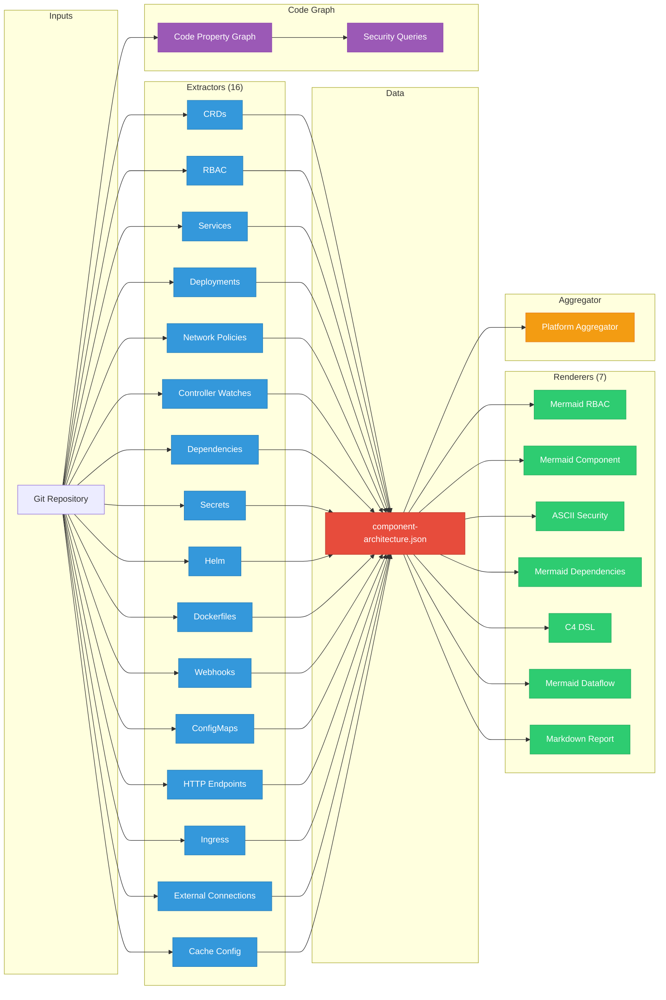

# RHOAI Architecture Analyzer

A static analysis tool that extracts architecture data from Kubernetes/OpenShift component repositories and generates diagrams, security reports, and code property graphs. Designed for the OpenShift AI (RHOAI) ecosystem.

**[Documentation](https://ugiordan.github.io/rhoai-architecture-analyzer)** | **[GitHub](https://github.com/ugiordan/rhoai-architecture-analyzer)**

## Features

- **16 extractors** covering CRDs, RBAC, deployments, services, network policies, controller watches, dependencies, secrets, Helm charts, Dockerfiles, webhooks, configmaps, HTTP endpoints, ingress, external connections, and cache architecture
- **7 renderers** producing Mermaid diagrams, Structurizr C4 DSL, ASCII security views, and structured markdown reports
- **Cache architecture analysis** detecting OOM risks by cross-referencing controller-runtime cache config against watches and deployment memory limits
- **External connection detection** scanning Go source for database, object storage, gRPC, and messaging service references with automatic credential redaction
- **Code property graph** with security queries (taint analysis, SQL injection, hardcoded secrets, missing auth)
- **CRD contract validation** detecting breaking schema changes across repos
- **Platform aggregation** merging multiple component analyses into a cross-repo view

## Architecture



## Requirements

- Go 1.25+

## Installation

```bash
git clone https://github.com/ugiordan/rhoai-architecture-analyzer.git
cd rhoai-architecture-analyzer
go build -o rhoai-analyzer ./cmd/rhoai-analyzer/
```

## Usage

### Analyze a repository (extract + render)

```bash
./rhoai-analyzer analyze /path/to/repo --output-dir output/
```

Produces:
- `output/component-architecture.json` (extracted architecture data)
- `output/diagrams/rbac.mmd` (Mermaid RBAC graph)
- `output/diagrams/component.mmd` (Mermaid component diagram)
- `output/diagrams/dependencies.mmd` (Mermaid dependency graph)
- `output/diagrams/dataflow.mmd` (Mermaid sequence diagram)
- `output/diagrams/security-network.txt` (ASCII security/network diagram)
- `output/diagrams/c4-context.dsl` (Structurizr C4 DSL)
- `output/diagrams/report.md` (structured markdown report)

### Extract only (no diagrams)

```bash
./rhoai-analyzer extract /path/to/repo --output component-architecture.json
```

### Render diagrams from existing JSON

```bash
./rhoai-analyzer render component-architecture.json --output-dir diagrams/
./rhoai-analyzer render component-architecture.json --formats rbac,component
```

### Code graph security scan

```bash
./rhoai-analyzer scan /path/to/repo --format json --output findings.json
./rhoai-analyzer scan /path/to/repo --format sarif --output findings.sarif
```

### Full analysis (architecture + code graph + schemas)

```bash
./rhoai-analyzer full-analysis /path/to/repo --output-dir output/
```

### CRD contract validation

```bash
# Extract schemas as baseline
./rhoai-analyzer extract-schema /path/to/repo --output-dir contracts/schemas

# Validate changes against baseline
./rhoai-analyzer validate /path/to/repo --contracts-dir contracts
```

### Aggregate multiple components

```bash
./rhoai-analyzer analyze /path/to/repo-a --output-dir results/repo-a
./rhoai-analyzer analyze /path/to/repo-b --output-dir results/repo-b
./rhoai-analyzer aggregate results/ --output-dir platform-output/
```

## Extractors

| Extractor | Source Patterns | Data Extracted |
|-----------|----------------|----------------|
| CRDs | `config/crd/**`, `deploy/crds/`, `charts/**/crds/`, `manifests/**/crd*` | Group, version, kind, scope, field count, CEL rules |
| RBAC | `config/rbac/`, `deploy/rbac/`, Go kubebuilder markers | ClusterRoles, bindings, rules, kubebuilder RBAC markers |
| Services | `**/service*.yaml` | Name, type, ports, selector |
| Deployments | `**/deployment*.yaml`, `**/manager*.yaml`, `**/statefulset*.yaml` | Containers, security context, env vars, volumes, resources, probes |
| Network Policies | `**/*networkpolicy*`, `**/*network-polic*`, `**/*netpol*`, `**/network-policies/**` | Pod selector, ingress/egress rules |
| Controller Watches | `**/*_controller.go`, `**/setup.go`, `**/*reconciler*.go` | For/Owns/Watches with GVK resolution |
| Dependencies | `go.mod` | Go version, toolchain, modules (direct only), internal ODH deps, replace directives |
| Secrets | Deployments, services | Secret names, types, references (never values) |
| Helm | `Chart.yaml`, `values.yaml` | Chart metadata, security-relevant defaults |
| Dockerfiles | `Dockerfile*`, `Containerfile*` | Base image, stages, USER, EXPOSE, FIPS indicators |
| Webhooks | `**/webhook*.yaml`, `**/mutating*`, `**/validating*` | Webhook rules, failure policy, side effects |
| ConfigMaps | `**/configmap*.yaml` | ConfigMap names, data keys |
| HTTP Endpoints | Go source (`http.HandleFunc`, `mux.Route`, `gin.Engine`) | Method, path, handler, middleware |
| Ingress | `**/ingress*`, `**/virtualservice*`, `**/httproute*` | Gateway API, Istio, K8s Ingress resources |
| External Connections | Go source (`sql.Open`, `redis.NewClient`, `grpc.Dial`, `sarama.New*`) | Database, object storage, gRPC, messaging references with credential redaction |
| Cache Config | Go source (`ctrl.NewManager`, `cache.Options`) | Cache scope, filtered types, disabled types, implicit informers, GOMEMLIMIT |

### Cache Architecture Analysis

The cache analyzer cross-references controller-runtime cache configuration against controller watches and deployment memory limits. It detects:

- **Cluster-wide informers** for types that should be namespace-scoped or filtered
- **Missing cache filters** on watched types (potential OOM risk at scale)
- **Implicit informers** created by `client.Get` calls for unwatched types
- **Missing DefaultTransform** (managedFields wasting memory)
- **Missing GOMEMLIMIT** in deployment (Go GC cannot pressure-tune)
- **GOMEMLIMIT exceeding 90%** of container memory limit

This catches real bugs like [opendatahub-io/data-science-pipelines-operator#992](https://github.com/opendatahub-io/data-science-pipelines-operator/issues/992) and [opendatahub-io/model-registry-operator#457](https://github.com/opendatahub-io/model-registry-operator/issues/457).

## Renderers

| Renderer | Output | Description |
|----------|--------|-------------|
| RBAC | `rbac.mmd` | Mermaid graph: ServiceAccounts -> Bindings -> Roles -> Resources |
| Component | `component.mmd` | Mermaid diagram: CRDs watched, owned, and dependency relationships |
| Security/Network | `security-network.txt` | ASCII layered view: network, RBAC, secrets, security contexts |
| Dependencies | `dependencies.mmd` | Mermaid graph: Go module dependencies (internal ODH highlighted) |
| C4 | `c4-context.dsl` | Structurizr C4 context diagram |
| Dataflow | `dataflow.mmd` | Mermaid sequence diagram: controller watches and service connections |
| Report | `report.md` | Structured markdown with tables for all extracted data and cache issues |

## Project Structure

```
rhoai-architecture-analyzer/
  cmd/rhoai-analyzer/
    main.go              # CLI entry point with 11 subcommands
  pkg/
    extractor/           # 16 architecture extractors
    renderer/            # 7 diagram/report renderers
    aggregator/          # Platform-wide aggregation
    validator/           # CRD contract validation
    parser/              # Go source parser (tree-sitter)
    builder/             # Code property graph builder
    graph/               # CPG data structure
    linker/              # Storage linker (DB ops to schemas)
    annotator/           # Security annotation engine
    query/               # Security query engine
    domains/             # Domain framework (security, testing, upgrade)
    arch/                # Architecture data structures
    config/              # Configuration types
  contracts/
    schemas/             # CRD baseline schemas for validation
  scripts/
    analyze-repo.sh      # Clone + analyze + cleanup
  site/
    docs/                # MkDocs Material documentation
    mkdocs.yml           # Docs site configuration
  .github/workflows/
    analyze-all.yml      # Scheduled analysis workflow
    extract-schemas.yml  # CRD schema extraction workflow
    validate-contracts.yml  # CRD contract validation on PRs
    docs.yml             # Deploy docs to GitHub Pages
```

## Running Tests

```bash
go test ./...
```

## Documentation

Full documentation is published at **[ugiordan.github.io/rhoai-architecture-analyzer](https://ugiordan.github.io/rhoai-architecture-analyzer)** and covers installation, guides, CLI reference, architecture, and contributing.

## GitHub Actions

- `analyze-all.yml`: runs weekly (Monday 06:00 UTC) or on manual dispatch, analyzes all RHOAI repos and uploads artifacts
- `extract-schemas.yml`: extracts CRD schemas weekly and opens automated PRs for changes
- `validate-contracts.yml`: validates CRD contract changes on PRs to the `contracts/` directory
- `docs.yml`: deploys documentation to GitHub Pages on pushes to main
