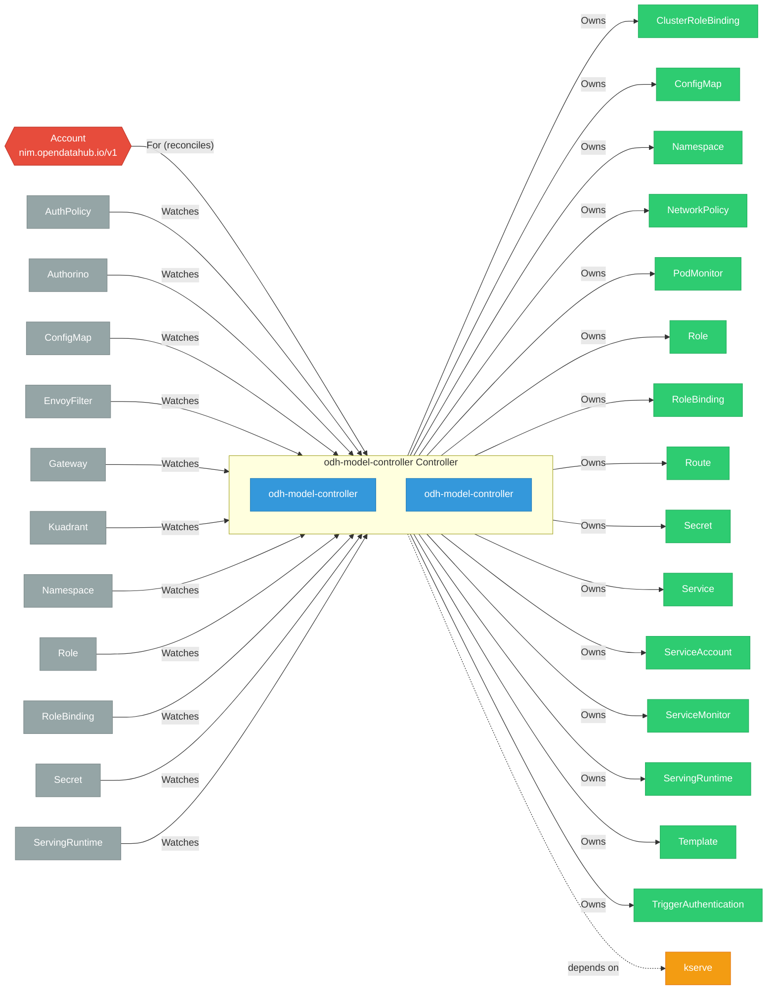

# odh-model-controller

**Repository:** opendatahub-io/odh-model-controller  
**Analyzer:** arch-analyzer 0.2.0  
**Extracted:** 2026-04-16T15:36:18Z

## Summary

| Metric | Count |
|--------|-------|
| CRDs | 1 |
| Deployments | 2 |
| Services | 1 |
| Secrets | 1 |
| Cluster Roles | 7 |
| Controller Watches | 39 |

## Component Architecture

CRDs, controllers, and owned Kubernetes resources.

### CRDs

| Group | Version | Kind | Scope | Fields | Validation Rules | Source |
|-------|---------|------|-------|--------|------------------|--------|
| nim.opendatahub.io | v1 | Account | Namespaced | 57 | 0 | `config/crd/bases/nim.opendatahub.io_accounts.yaml` |

## Dependencies

### Internal RHOAI Dependencies

| Component | Interaction |
|-----------|-------------|
| kserve | Go module dependency: github.com/opendatahub-io/kserve |

### Key External Dependencies

| Module | Version |
|--------|---------|
| github.com/go-logr/logr | v1.4.3 |
| github.com/go-logr/zapr | v1.3.0 |
| github.com/prometheus-operator/prometheus-operator/pkg/apis/monitoring | v0.76.2 |
| k8s.io/api | v0.33.1 |
| k8s.io/apiextensions-apiserver | v0.33.1 |
| k8s.io/apimachinery | v0.33.1 |
| k8s.io/apiserver | v0.33.1 |
| k8s.io/client-go | v0.33.1 |
| sigs.k8s.io/controller-runtime | v0.19.1 |

