# opendatahub-operator

**Repository:** opendatahub-io/opendatahub-operator  
**Analyzer:** arch-analyzer 0.2.0  
**Extracted:** 2026-04-16T15:34:06Z

## Summary

| Metric | Count |
|--------|-------|
| CRDs | 23 |
| Deployments | 57 |
| Services | 14 |
| Secrets | 10 |
| Cluster Roles | 23 |
| Controller Watches | 204 |

## Component Architecture

CRDs, controllers, and owned Kubernetes resources.

```mermaid
graph LR
    %% Component architecture for opendatahub-operator

    classDef crd fill:#e74c3c,stroke:#c0392b,color:#fff
    classDef controller fill:#3498db,stroke:#2980b9,color:#fff
    classDef owned fill:#2ecc71,stroke:#27ae60,color:#fff
    classDef external fill:#95a5a6,stroke:#7f8c8d,color:#fff
    classDef dep fill:#f39c12,stroke:#e67e22,color:#fff

    subgraph controller["opendatahub-operator Controller"]
        dep_1["odh-dashboard"]
        class dep_1 controller
        dep_2["training-operator"]
        class dep_2 controller
        dep_3["azure-cloud-manager-operator"]
        class dep_3 controller
        dep_4["azure-cloud-manager-operator"]
        class dep_4 controller
        dep_5["azure-cloud-manager-operator"]
        class dep_5 controller
        dep_6["coreweave-cloud-manager-operator"]
        class dep_6 controller
        dep_7["coreweave-cloud-manager-operator"]
        class dep_7 controller
        dep_8["coreweave-cloud-manager-operator"]
        class dep_8 controller
        dep_9["controller-manager"]
        class dep_9 controller
        dep_10["controller-manager"]
        class dep_10 controller
        dep_11["controller-manager"]
        class dep_11 controller
        dep_12["controller-manager"]
        class dep_12 controller
        dep_13["controller-manager"]
        class dep_13 controller
        dep_14["controller-manager"]
        class dep_14 controller
        dep_15["controller-manager"]
        class dep_15 controller
        dep_16["rhods-operator"]
        class dep_16 controller
        dep_17["rhods-operator"]
        class dep_17 controller
        dep_18["rhods-operator"]
        class dep_18 controller
        dep_19["rhods-operator"]
        class dep_19 controller
        dep_20["rhods-operator"]
        class dep_20 controller
        dep_21["rhods-operator"]
        class dep_21 controller
        dep_22["controller-manager"]
        class dep_22 controller
        dep_23["controller-manager"]
        class dep_23 controller
        dep_24["controller-manager"]
        class dep_24 controller
        dep_25["kserve-controller-manager"]
        class dep_25 controller
        dep_26["kserve-controller-manager"]
        class dep_26 controller
        dep_27["kserve-controller-manager"]
        class dep_27 controller
        dep_28["kserve-controller-manager"]
        class dep_28 controller
        dep_29["kserve-localmodel-controller-manager"]
        class dep_29 controller
        dep_30["kserve-controller-manager"]
        class dep_30 controller
        dep_31["kserve-controller-manager"]
        class dep_31 controller
        dep_32["kserve-controller-manager"]
        class dep_32 controller
        dep_33["controller-manager"]
        class dep_33 controller
        dep_34["controller-manager"]
        class dep_34 controller
        dep_35["controller-manager"]
        class dep_35 controller
        dep_36["odh-model-controller"]
        class dep_36 controller
        dep_37["odh-model-controller"]
        class dep_37 controller
        dep_38["controller-manager"]
        class dep_38 controller
        dep_39["controller-manager"]
        class dep_39 controller
        dep_40["controller-manager"]
        class dep_40 controller
        dep_41["controller-manager"]
        class dep_41 controller
        dep_42["controller-manager"]
        class dep_42 controller
        dep_43["controller-manager"]
        class dep_43 controller
        dep_44["controller-manager"]
        class dep_44 controller
        dep_45["controller-manager"]
        class dep_45 controller
        dep_46["kuberay-operator"]
        class dep_46 controller
        dep_47["kuberay-operator"]
        class dep_47 controller
        dep_48["training-operator"]
        class dep_48 controller
        dep_49["training-operator"]
        class dep_49 controller
        dep_50["controller-manager"]
        class dep_50 controller
        dep_51["controller-manager"]
        class dep_51 controller
        dep_52["controller-manager"]
        class dep_52 controller
        dep_53["controller-manager"]
        class dep_53 controller
        dep_54["controller-manager"]
        class dep_54 controller
        dep_55["deployment"]
        class dep_55 controller
        dep_56["deployment"]
        class dep_56 controller
        dep_57["manager"]
        class dep_57 controller
    end

    crd_Dashboard{{"Dashboard\ncomponents.platform.opendatahub.io/v1alpha1"}}
    class crd_Dashboard crd
    crd_DataSciencePipelines{{"DataSciencePipelines\ncomponents.platform.opendatahub.io/v1alpha1"}}
    class crd_DataSciencePipelines crd
    crd_FeastOperator{{"FeastOperator\ncomponents.platform.opendatahub.io/v1alpha1"}}
    class crd_FeastOperator crd
    crd_Kserve{{"Kserve\ncomponents.platform.opendatahub.io/v1alpha1"}}
    class crd_Kserve crd
    crd_Kueue{{"Kueue\ncomponents.platform.opendatahub.io/v1alpha1"}}
    class crd_Kueue crd
    crd_LlamaStackOperator{{"LlamaStackOperator\ncomponents.platform.opendatahub.io/v1alpha1"}}
    class crd_LlamaStackOperator crd
    crd_MLflowOperator{{"MLflowOperator\ncomponents.platform.opendatahub.io/v1alpha1"}}
    class crd_MLflowOperator crd
    crd_ModelController{{"ModelController\ncomponents.platform.opendatahub.io/v1alpha1"}}
    class crd_ModelController crd
    crd_ModelRegistry{{"ModelRegistry\ncomponents.platform.opendatahub.io/v1alpha1"}}
    class crd_ModelRegistry crd
    crd_ModelsAsService{{"ModelsAsService\ncomponents.platform.opendatahub.io/v1alpha1"}}
    class crd_ModelsAsService crd
    crd_Ray{{"Ray\ncomponents.platform.opendatahub.io/v1alpha1"}}
    class crd_Ray crd
    crd_SparkOperator{{"SparkOperator\ncomponents.platform.opendatahub.io/v1alpha1"}}
    class crd_SparkOperator crd
    crd_Trainer{{"Trainer\ncomponents.platform.opendatahub.io/v1alpha1"}}
    class crd_Trainer crd
    crd_TrainingOperator{{"TrainingOperator\ncomponents.platform.opendatahub.io/v1alpha1"}}
    class crd_TrainingOperator crd
    crd_TrustyAI{{"TrustyAI\ncomponents.platform.opendatahub.io/v1alpha1"}}
    class crd_TrustyAI crd
    crd_Workbenches{{"Workbenches\ncomponents.platform.opendatahub.io/v1alpha1"}}
    class crd_Workbenches crd
    crd_AzureKubernetesEngine{{"AzureKubernetesEngine\ninfrastructure.opendatahub.io/v1alpha1"}}
    class crd_AzureKubernetesEngine crd
    crd_CoreWeaveKubernetesEngine{{"CoreWeaveKubernetesEngine\ninfrastructure.opendatahub.io/v1alpha1"}}
    class crd_CoreWeaveKubernetesEngine crd
    crd_HardwareProfile{{"HardwareProfile\ninfrastructure.opendatahub.io/v1"}}
    class crd_HardwareProfile crd
    crd_HardwareProfile{{"HardwareProfile\ninfrastructure.opendatahub.io/v1alpha1"}}
    class crd_HardwareProfile crd
    crd_Auth{{"Auth\nservices.platform.opendatahub.io/v1alpha1"}}
    class crd_Auth crd
    crd_GatewayConfig{{"GatewayConfig\nservices.platform.opendatahub.io/v1alpha1"}}
    class crd_GatewayConfig crd
    crd_Monitoring{{"Monitoring\nservices.platform.opendatahub.io/v1alpha1"}}
    class crd_Monitoring crd
    controller -->|"Owns"| owned_58["ClusterRole"]
    class owned_58 owned
    controller -->|"Owns"| owned_59["ClusterRoleBinding"]
    class owned_59 owned
    controller -->|"Owns"| owned_60["ConfigMap"]
    class owned_60 owned
    controller -->|"Owns"| owned_61["ConsoleLink"]
    class owned_61 owned
    controller -->|"Owns"| owned_62["Dashboard"]
    class owned_62 owned
    controller -->|"Owns"| owned_63["DataSciencePipelines"]
    class owned_63 owned
    controller -->|"Owns"| owned_64["Deployment"]
    class owned_64 owned
    controller -->|"Owns"| owned_65["FeastOperator"]
    class owned_65 owned
    controller -->|"Owns"| owned_66["Gateway"]
    class owned_66 owned
    controller -->|"Owns"| owned_67["HTTPRoute"]
    class owned_67 owned
    controller -->|"Owns"| owned_68["Job"]
    class owned_68 owned
    controller -->|"Owns"| owned_69["Kserve"]
    class owned_69 owned
    controller -->|"Owns"| owned_70["Kueue"]
    class owned_70 owned
    controller -->|"Owns"| owned_71["LlamaStackOperator"]
    class owned_71 owned
    controller -->|"Owns"| owned_72["MLflowOperator"]
    class owned_72 owned
    controller -->|"Owns"| owned_73["MaaSTenant"]
    class owned_73 owned
    controller -->|"Owns"| owned_74["ModelController"]
    class owned_74 owned
    controller -->|"Owns"| owned_75["ModelRegistry"]
    class owned_75 owned
    controller -->|"Owns"| owned_76["MutatingWebhookConfiguration"]
    class owned_76 owned
    controller -->|"Owns"| owned_77["NetworkPolicy"]
    class owned_77 owned
    controller -->|"Owns"| owned_78["PodDisruptionBudget"]
    class owned_78 owned
    controller -->|"Owns"| owned_79["PodMonitor"]
    class owned_79 owned
    controller -->|"Owns"| owned_80["PrometheusRule"]
    class owned_80 owned
    controller -->|"Owns"| owned_81["Ray"]
    class owned_81 owned
    controller -->|"Owns"| owned_82["Role"]
    class owned_82 owned
    controller -->|"Owns"| owned_83["RoleBinding"]
    class owned_83 owned
    controller -->|"Owns"| owned_84["Route"]
    class owned_84 owned
    controller -->|"Owns"| owned_85["Secret"]
    class owned_85 owned
    controller -->|"Owns"| owned_86["SecurityContextConstraints"]
    class owned_86 owned
    controller -->|"Owns"| owned_87["Service"]
    class owned_87 owned
    controller -->|"Owns"| owned_88["ServiceAccount"]
    class owned_88 owned
    controller -->|"Owns"| owned_89["ServiceMonitor"]
    class owned_89 owned
    controller -->|"Owns"| owned_90["SparkOperator"]
    class owned_90 owned
    controller -->|"Owns"| owned_91["Template"]
    class owned_91 owned
    controller -->|"Owns"| owned_92["Trainer"]
    class owned_92 owned
    controller -->|"Owns"| owned_93["TrainingOperator"]
    class owned_93 owned
    controller -->|"Owns"| owned_94["TrustyAI"]
    class owned_94 owned
    controller -->|"Owns"| owned_95["ValidatingAdmissionPolicy"]
    class owned_95 owned
    controller -->|"Owns"| owned_96["ValidatingAdmissionPolicyBinding"]
    class owned_96 owned
    controller -->|"Owns"| owned_97["ValidatingWebhookConfiguration"]
    class owned_97 owned
    controller -->|"Owns"| owned_98["Workbenches"]
    class owned_98 owned
    watch_99["Auth"] -->|"Watches"| controller
    class watch_99 external
    watch_100["ClusterRole"] -->|"Watches"| controller
    class watch_100 external
    watch_101["HTTPRoute"] -->|"Watches"| controller
    class watch_101 external
    watch_102["Namespace"] -->|"Watches"| controller
    class watch_102 external
    controller -.->|"depends on"| odh_103["models-as-a-service"]
    class odh_103 dep
    controller -.->|"depends on"| odh_104["opendatahub-operator"]
    class odh_104 dep
    controller -.->|"depends on"| odh_105["opendatahub-operator"]
    class odh_105 dep
    controller -.->|"depends on"| odh_106["opendatahub-operator"]
    class odh_106 dep
```

### CRDs

| Group | Version | Kind | Scope | Fields | Validation Rules | Source |
|-------|---------|------|-------|--------|------------------|--------|
| components.platform.opendatahub.io | v1alpha1 | Dashboard | Cluster | 19 | 1 | `config/crd/bases/components.platform.opendatahub.io_dashboards.yaml` |
| components.platform.opendatahub.io | v1alpha1 | DataSciencePipelines | Cluster | 22 | 1 | `config/crd/bases/components.platform.opendatahub.io_datasciencepipelines.yaml` |
| components.platform.opendatahub.io | v1alpha1 | FeastOperator | Cluster | 20 | 1 | `config/crd/bases/components.platform.opendatahub.io_feastoperators.yaml` |
| components.platform.opendatahub.io | v1alpha1 | Kserve | Cluster | 26 | 1 | `config/crd/bases/components.platform.opendatahub.io_kserves.yaml` |
| components.platform.opendatahub.io | v1alpha1 | Kueue | Cluster | 23 | 1 | `config/crd/bases/components.platform.opendatahub.io_kueues.yaml` |
| components.platform.opendatahub.io | v1alpha1 | LlamaStackOperator | Cluster | 20 | 1 | `config/crd/bases/components.platform.opendatahub.io_llamastackoperators.yaml` |
| components.platform.opendatahub.io | v1alpha1 | MLflowOperator | Cluster | 20 | 1 | `config/crd/bases/components.platform.opendatahub.io_mlflowoperators.yaml` |
| components.platform.opendatahub.io | v1alpha1 | ModelController | Cluster | 23 | 1 | `config/crd/bases/components.platform.opendatahub.io_modelcontrollers.yaml` |
| components.platform.opendatahub.io | v1alpha1 | ModelRegistry | Cluster | 24 | 1 | `config/crd/bases/components.platform.opendatahub.io_modelregistries.yaml` |
| components.platform.opendatahub.io | v1alpha1 | ModelsAsService | Cluster | 21 | 1 | `config/crd/bases/components.platform.opendatahub.io_modelsasservices.yaml` |
| components.platform.opendatahub.io | v1alpha1 | Ray | Cluster | 20 | 1 | `config/crd/bases/components.platform.opendatahub.io_rays.yaml` |
| components.platform.opendatahub.io | v1alpha1 | SparkOperator | Cluster | 20 | 1 | `config/crd/bases/components.platform.opendatahub.io_sparkoperators.yaml` |
| components.platform.opendatahub.io | v1alpha1 | Trainer | Cluster | 20 | 1 | `config/crd/bases/components.platform.opendatahub.io_trainers.yaml` |
| components.platform.opendatahub.io | v1alpha1 | TrainingOperator | Cluster | 20 | 1 | `config/crd/bases/components.platform.opendatahub.io_trainingoperators.yaml` |
| components.platform.opendatahub.io | v1alpha1 | TrustyAI | Cluster | 24 | 1 | `config/crd/bases/components.platform.opendatahub.io_trustyais.yaml` |
| components.platform.opendatahub.io | v1alpha1 | Workbenches | Cluster | 22 | 2 | `config/crd/bases/components.platform.opendatahub.io_workbenches.yaml` |
| infrastructure.opendatahub.io | v1alpha1 | AzureKubernetesEngine | Cluster | 26 | 1 | `config/crd/bases/infrastructure.opendatahub.io_azurekubernetesengines.yaml` |
| infrastructure.opendatahub.io | v1alpha1 | CoreWeaveKubernetesEngine | Cluster | 26 | 1 | `config/crd/bases/infrastructure.opendatahub.io_coreweavekubernetesengines.yaml` |
| infrastructure.opendatahub.io | v1 | HardwareProfile | Namespaced | 25 | 2 | `config/crd/bases/infrastructure.opendatahub.io_hardwareprofiles.yaml` |
| infrastructure.opendatahub.io | v1alpha1 | HardwareProfile | Namespaced | 25 | 2 | `config/crd/bases/infrastructure.opendatahub.io_hardwareprofiles.yaml` |
| services.platform.opendatahub.io | v1alpha1 | Auth | Cluster | 18 | 4 | `config/crd/bases/services.platform.opendatahub.io_auths.yaml` |
| services.platform.opendatahub.io | v1alpha1 | GatewayConfig | Cluster | 42 | 1 | `config/crd/bases/services.platform.opendatahub.io_gatewayconfigs.yaml` |
| services.platform.opendatahub.io | v1alpha1 | Monitoring | Cluster | 38 | 10 | `config/crd/bases/services.platform.opendatahub.io_monitorings.yaml` |

## Dependencies

### Internal RHOAI Dependencies

| Component | Interaction |
|-----------|-------------|
| models-as-a-service | Go module dependency: github.com/opendatahub-io/models-as-a-service/maas-controller |
| opendatahub-operator | Go module dependency: github.com/opendatahub-io/opendatahub-operator/v2/pkg/clusterhealth |
| opendatahub-operator | Go module dependency: github.com/opendatahub-io/opendatahub-operator/v2/pkg/clusterhealth |
| opendatahub-operator | Go module dependency: github.com/opendatahub-io/opendatahub-operator/v2/pkg/clusterhealth |

### Key External Dependencies

| Module | Version |
|--------|---------|
| github.com/go-logr/logr | v1.4.3 |
| github.com/operator-framework/api | v0.31.0 |
| github.com/prometheus-operator/prometheus-operator/pkg/apis/monitoring | v0.68.0 |
| github.com/prometheus/client_golang | v1.23.2 |
| k8s.io/api | v0.35.2 |
| k8s.io/apiextensions-apiserver | v0.35.2 |
| k8s.io/apimachinery | v0.35.2 |
| k8s.io/client-go | v0.35.2 |
| sigs.k8s.io/controller-runtime | v0.22.4 |
| k8s.io/apimachinery | v0.35.2 |
| k8s.io/client-go | v0.35.2 |
| sigs.k8s.io/controller-runtime | v0.22.4 |
| k8s.io/client-go | v0.35.2 |
| sigs.k8s.io/controller-runtime | v0.22.4 |
| k8s.io/api | v0.35.2 |
| k8s.io/apimachinery | v0.35.2 |
| k8s.io/client-go | v0.35.2 |
| sigs.k8s.io/controller-runtime | v0.22.4 |

