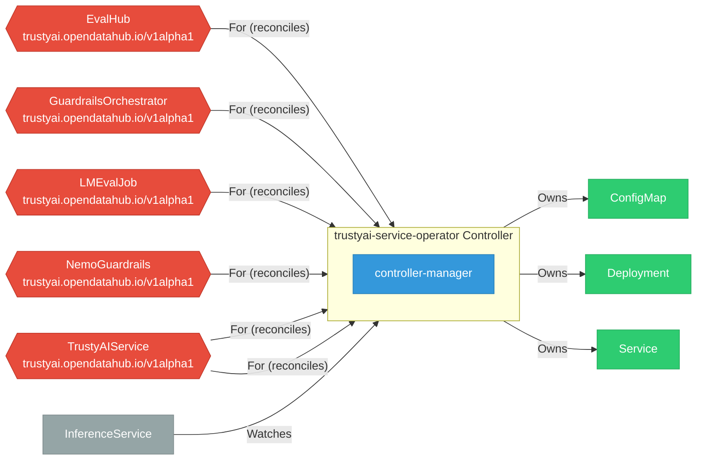

# trustyai-service-operator

**Repository:** trustyai-explainability/trustyai-service-operator  
**Analyzer:** arch-analyzer 0.2.0  
**Extracted:** 2026-04-16T15:34:14Z

## Summary

| Metric | Count |
|--------|-------|
| CRDs | 6 |
| Deployments | 1 |
| Services | 0 |
| Secrets | 0 |
| Cluster Roles | 9 |
| Controller Watches | 11 |

## Component Architecture

CRDs, controllers, and owned Kubernetes resources.

### CRDs

| Group | Version | Kind | Scope | Fields | Validation Rules | Source |
|-------|---------|------|-------|--------|------------------|--------|
| trustyai.opendatahub.io | v1alpha1 | EvalHub | Namespaced | 38 | 0 | `config/crd/bases/trustyai.opendatahub.io_evalhubs.yaml` |
| trustyai.opendatahub.io | v1alpha1 | GuardrailsOrchestrator | Namespaced | 70 | 0 | `config/crd/bases/trustyai.opendatahub.io_guardrailsorchestrators.yaml` |
| trustyai.opendatahub.io | v1alpha1 | LMEvalJob | Namespaced | 740 | 0 | `config/crd/bases/trustyai.opendatahub.io_lmevaljobs.yaml` |
| trustyai.opendatahub.io | v1alpha1 | NemoGuardrails | Namespaced | 46 | 0 | `config/crd/bases/trustyai.opendatahub.io_nemoguardrails.yaml` |
| trustyai.opendatahub.io | v1 | TrustyAIService | Namespaced | 26 | 0 | `config/crd/bases/trustyai.opendatahub.io_trustyaiservices.yaml` |
| trustyai.opendatahub.io | v1alpha1 | TrustyAIService | Namespaced | 26 | 0 | `config/crd/bases/trustyai.opendatahub.io_trustyaiservices.yaml` |

## Dependencies

### Key External Dependencies

| Module | Version |
|--------|---------|
| github.com/prometheus-operator/prometheus-operator/pkg/apis/monitoring | v0.64.1 |
| k8s.io/api | v0.29.2 |
| k8s.io/apimachinery | v0.29.2 |
| k8s.io/client-go | v0.29.2 |
| sigs.k8s.io/controller-runtime | v0.17.0 |
| github.com/go-logr/logr | v1.4.2 |
| github.com/prometheus/client_golang | v1.18.0 |
| k8s.io/apiextensions-apiserver | v0.29.0 |

