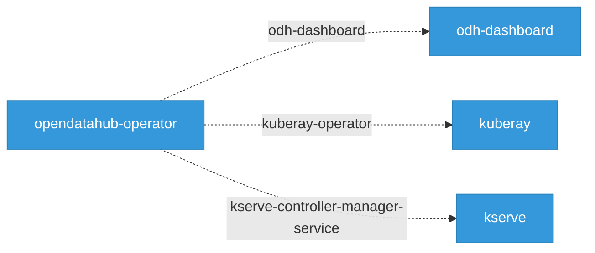

# Network Topology

29 Kubernetes services across the platform.

## Network Topology Graph

Service mesh view of the platform. Components are grouped with their services. Arrows show inter-component dependencies (CRD watches, Go module imports, sidecar injection) and external service connections.

```mermaid
%%{init: {'theme': 'base', 'flowchart': {'nodeSpacing': 20, 'rankSpacing': 40, 'curve': 'basis'}}}%%
graph TB
    classDef comp fill:#3498db,stroke:#2980b9,color:#fff
    classDef svc fill:#2ecc71,stroke:#27ae60,color:#fff,font-size:10px
    classDef ext fill:#e74c3c,stroke:#c0392b,color:#fff
    classDef netpol fill:#f39c12,stroke:#d68910,color:#fff,font-size:10px
    classDef webhook fill:#9b59b6,stroke:#8e44ad,color:#fff,font-size:10px

    subgraph data_science_pipelines_operator_sub["data-science-pipelines-operator"]
        data_science_pipelines_operator(["data-science-pipelines-operator"]):::comp
        data_science_pipelines_operator_svc_0["mariadb\n:3306"]:::svc
        data_science_pipelines_operator --- data_science_pipelines_operator_svc_0
        data_science_pipelines_operator_svc_1["minio\n:9000,9001"]:::svc
        data_science_pipelines_operator --- data_science_pipelines_operator_svc_1
        data_science_pipelines_operator_svc_2["pypi-server\n:8080"]:::svc
        data_science_pipelines_operator --- data_science_pipelines_operator_svc_2
    end
    subgraph kserve_sub["kserve"]
        kserve(["kserve"]):::comp
        kserve_svc_0["llmisvc-controller-manager-service\n:8443"]:::svc
        kserve --- kserve_svc_0
        kserve_svc_1["kserve-controller-manager-service\n:8443"]:::svc
        kserve --- kserve_svc_1
        kserve_svc_2["llmisvc-webhook-server-service\n:443"]:::svc
        kserve --- kserve_svc_2
        kserve_svc_3["localmodel-webhook-server-service\n:443"]:::svc
        kserve --- kserve_svc_3
        kserve_svc_4["kserve-webhook-server-service\n:443"]:::svc
        kserve --- kserve_svc_4
        kserve_svc_more["+1 more"]:::svc
        kserve_np{{"1 NetworkPolicies"}}:::netpol
        kserve_np -.- kserve
    end
    subgraph kube_auth_proxy_sub["kube-auth-proxy"]
        kube_auth_proxy(["kube-auth-proxy"]):::comp
    end
    subgraph kube_rbac_proxy_sub["kube-rbac-proxy"]
        kube_rbac_proxy(["kube-rbac-proxy"]):::comp
        kube_rbac_proxy_svc_0["kube-rbac-proxy\n:8443"]:::svc
        kube_rbac_proxy --- kube_rbac_proxy_svc_0
    end
    subgraph kuberay_sub["kuberay"]
        kuberay(["kuberay"]):::comp
        kuberay_svc_0["kuberay-operator\n:8080"]:::svc
        kuberay --- kuberay_svc_0
        kuberay_svc_1["webhook-service\n:443"]:::svc
        kuberay --- kuberay_svc_1
    end
    subgraph model_registry_operator_sub["model-registry-operator"]
        model_registry_operator(["model-registry-operator"]):::comp
        model_registry_operator_svc_0["webhook-service\n:443"]:::svc
        model_registry_operator --- model_registry_operator_svc_0
    end
    subgraph notebooks_sub["notebooks"]
        notebooks(["notebooks"]):::comp
        notebooks_svc_0["notebook\n:8888"]:::svc
        notebooks --- notebooks_svc_0
    end
    subgraph odh_dashboard_sub["odh-dashboard"]
        odh_dashboard(["odh-dashboard"]):::comp
        odh_dashboard_svc_0["odh-dashboard\n:8443"]:::svc
        odh_dashboard --- odh_dashboard_svc_0
        odh_dashboard_svc_1["workspaces-backend\n:4000"]:::svc
        odh_dashboard --- odh_dashboard_svc_1
        odh_dashboard_svc_2["workspaces-webhook-service\n:443"]:::svc
        odh_dashboard --- odh_dashboard_svc_2
        odh_dashboard_svc_3["workspaces-controller-metrics-service\n:8080"]:::svc
        odh_dashboard --- odh_dashboard_svc_3
        odh_dashboard_svc_4["workspaces-frontend\n:8080"]:::svc
        odh_dashboard --- odh_dashboard_svc_4
        odh_dashboard_np{{"5 NetworkPolicies"}}:::netpol
        odh_dashboard_np -.- odh_dashboard
    end
    subgraph odh_model_controller_sub["odh-model-controller"]
        odh_model_controller(["odh-model-controller"]):::comp
        odh_model_controller_svc_0["odh-model-controller-webhook-service\n:443"]:::svc
        odh_model_controller --- odh_model_controller_svc_0
    end
    subgraph opendatahub_operator_sub["opendatahub-operator"]
        opendatahub_operator(["opendatahub-operator"]):::comp
        opendatahub_operator_svc_0["webhook-service\n:443"]:::svc
        opendatahub_operator --- opendatahub_operator_svc_0
        opendatahub_operator_svc_1["odh-dashboard\n:8443"]:::svc
        opendatahub_operator --- opendatahub_operator_svc_1
        opendatahub_operator_svc_2["kserve-controller-manager-service\n:8443"]:::svc
        opendatahub_operator --- opendatahub_operator_svc_2
        opendatahub_operator_svc_3["kserve-webhook-server-service\n:443"]:::svc
        opendatahub_operator --- opendatahub_operator_svc_3
        opendatahub_operator_svc_4["odh-model-controller-webhook-service\n:443"]:::svc
        opendatahub_operator --- opendatahub_operator_svc_4
        opendatahub_operator_svc_more["+3 more"]:::svc
        opendatahub_operator_np{{"2 NetworkPolicies"}}:::netpol
        opendatahub_operator_np -.- opendatahub_operator
    end
    trustyai_service_operator(["trustyai-service-operator"]):::comp

    ext_mysql[["mysql\ndatabase"]]:::ext
    ext_minio[["minio\nobject-storage"]]:::ext
    ext_azure_blob[["azure-blob\nobject-storage"]]:::ext
    ext_gcs[["gcs\nobject-storage"]]:::ext
    ext_s3[["s3\nobject-storage"]]:::ext
    ext_redis[["redis\ndatabase"]]:::ext
    ext_grpc[["grpc\ngrpc"]]:::ext

    odh_dashboard -.->|module| llama_stack_k8s_operator
    odh_dashboard -.->|module| mlflow_go
    odh_model_controller ==>|watches| kserve
    opendatahub_operator -.->|module| models_as_a_service
    kserve -->|sidecar| kube_rbac_proxy
    kube_auth_proxy -->|sidecar| kube_rbac_proxy
    odh_dashboard -->|sidecar| kube_rbac_proxy
    opendatahub_operator -->|sidecar| kube_rbac_proxy
    opendatahub_operator -->|sidecar| kserve
    data_science_pipelines_operator -.-> ext_mysql
    data_science_pipelines_operator -.-> ext_minio
    kserve -.-> ext_azure_blob
    kserve -.-> ext_gcs
    kserve -.-> ext_s3
    kube_auth_proxy -.-> ext_redis
    kuberay -.-> ext_grpc
    odh_dashboard -.-> ext_s3
    opendatahub_operator -.-> ext_s3
```

## Cross-Component Service References

Services referenced across component boundaries. When component A defines a service that component B also references, it indicates a deployment dependency.

## Services by Component

| Component | Services | Webhook (443) | Metrics (8443) | Data |
|-----------|----------|---------------|----------------|------|
| data-science-pipelines-operator | 3 | 0 | 0 | 3 |
| kserve | 6 | 4 | 2 | 0 |
| kube-auth-proxy | 1 | 0 | 1 | 0 |
| kube-rbac-proxy | 1 | 0 | 1 | 0 |
| kuberay | 2 | 1 | 0 | 1 |
| model-registry-operator | 1 | 1 | 0 | 0 |
| notebooks | 1 | 0 | 0 | 1 |
| odh-dashboard | 5 | 1 | 1 | 3 |
| odh-model-controller | 1 | 1 | 0 | 0 |
| opendatahub-operator | 8 | 5 | 2 | 1 |

## Service Detail

Per-component service breakdown with exact port numbers and protocols.

### data-science-pipelines-operator (3 services)

| Service | Type | Ports |
|---------|------|-------|
| mariadb | ClusterIP | 3306/TCP |
| minio | ClusterIP | 9000/TCP, 9001/TCP |
| pypi-server | ClusterIP | 8080/TCP |

### kserve (6 services)

| Service | Type | Ports |
|---------|------|-------|
| llmisvc-controller-manager-service | ClusterIP | 8443/TCP |
| kserve-controller-manager-service | ClusterIP | 8443/TCP |
| llmisvc-webhook-server-service | ClusterIP | 443/TCP |
| localmodel-webhook-server-service | ClusterIP | 443/TCP |
| kserve-webhook-server-service | ClusterIP | 443/TCP |
| webhook-service | ClusterIP | 443/TCP |

### kube-auth-proxy (1 services)

| Service | Type | Ports |
|---------|------|-------|
| kube-rbac-proxy | ClusterIP | 8443/TCP |

### kube-rbac-proxy (1 services)

| Service | Type | Ports |
|---------|------|-------|
| kube-rbac-proxy | ClusterIP | 8443/TCP |

### kuberay (2 services)

| Service | Type | Ports |
|---------|------|-------|
| kuberay-operator | ClusterIP | 8080/TCP |
| webhook-service | ClusterIP | 443/TCP |

### model-registry-operator (1 services)

| Service | Type | Ports |
|---------|------|-------|
| webhook-service | ClusterIP | 443/TCP |

### notebooks (1 services)

| Service | Type | Ports |
|---------|------|-------|
| notebook | ClusterIP | 8888/TCP |

### odh-dashboard (5 services)

| Service | Type | Ports |
|---------|------|-------|
| odh-dashboard | ClusterIP | 8443/TCP |
| workspaces-backend | ClusterIP | 4000/TCP |
| workspaces-webhook-service | ClusterIP | 443/TCP |
| workspaces-controller-metrics-service | ClusterIP | 8080/TCP |
| workspaces-frontend | ClusterIP | 8080/TCP |

### odh-model-controller (1 services)

| Service | Type | Ports |
|---------|------|-------|
| odh-model-controller-webhook-service | ClusterIP | 443/TCP |

### opendatahub-operator (8 services)

| Service | Type | Ports |
|---------|------|-------|
| webhook-service | ClusterIP | 443/TCP |
| odh-dashboard | ClusterIP | 8443/TCP |
| kserve-controller-manager-service | ClusterIP | 8443/TCP |
| kserve-webhook-server-service | ClusterIP | 443/TCP |
| odh-model-controller-webhook-service | ClusterIP | 443/TCP |
| kuberay-operator | ClusterIP | 8080/TCP |
| training-operator | ClusterIP | 8080/TCP, 443/TCP |
| service | ClusterIP | 443/TCP |

## Port Patterns

- **3306/TCP**: mariadb
- **4000/TCP**: workspaces-backend
- **443/TCP**: llmisvc-webhook-server-service, localmodel-webhook-server-service, kserve-webhook-server-service, webhook-service, webhook-service, webhook-service, workspaces-webhook-service, odh-model-controller-webhook-service, webhook-service, kserve-webhook-server-service, odh-model-controller-webhook-service, training-operator, service
- **8080/TCP**: pypi-server, kuberay-operator, workspaces-controller-metrics-service, workspaces-frontend, kuberay-operator, training-operator
- **8443/TCP**: llmisvc-controller-manager-service, kserve-controller-manager-service, kube-rbac-proxy, kube-rbac-proxy, odh-dashboard, odh-dashboard, kserve-controller-manager-service
- **8888/TCP**: notebook
- **9000/TCP**: minio
- **9001/TCP**: minio

