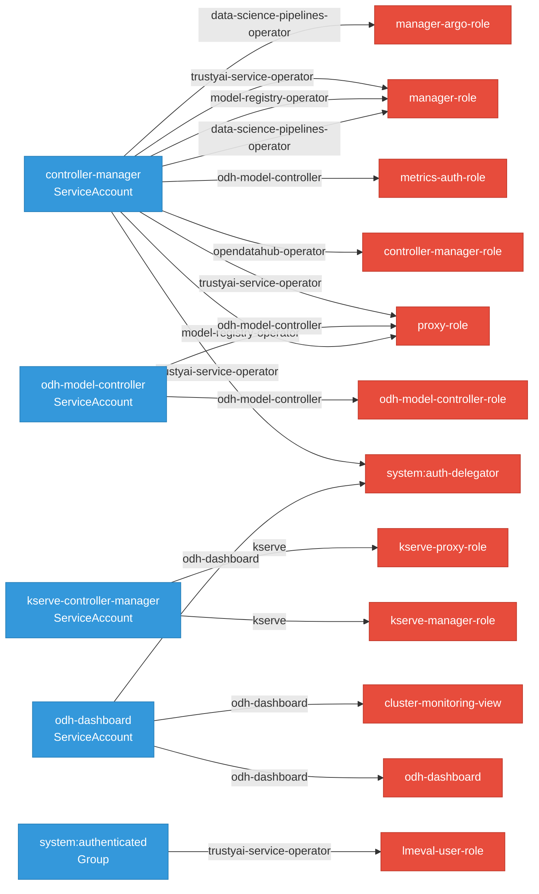

# RBAC Surface

52 cluster roles across the platform.

## Permission Scope by Component

How many distinct Kubernetes resource types can each component's most powerful ClusterRole access? A wider scope means the component can read/write more types of resources, which increases its blast radius if compromised. Color: 🔴 wide (>30 types), 🟠 medium (10-30), 🟢 narrow (<10).

**Widest Role Scope (resource types)**

  data-science-pipelines-operator
  

    

  

  55

  kserve
  

    

  

  45

  model-registry-operator
  

    

  

  27

  odh-dashboard
  

    

  

  40

  odh-model-controller
  

    

  

  41

  opendatahub-operator
  

    

  

  2

  trustyai-service-operator
  

    

  

  44

## RBAC Binding Graph

Subject-to-role bindings across all platform components. Edge direction shows who has access to what.

## Roles by Component

| Component | Roles | Widest Role | Resources | Scope |
|-----------|-------|-------------|-----------|-------|
| data-science-pipelines-operator | 4 | manager-role | 55 | **wide** |
| kserve | 2 | kserve-manager-role | 45 | **wide** |
| model-registry-operator | 6 | manager-role | 27 | medium |
| odh-dashboard | 1 | odh-dashboard | 40 | **wide** |
| odh-model-controller | 7 | odh-model-controller-role | 41 | **wide** |
| opendatahub-operator | 23 | modelregistry-viewer-role | 2 | narrow |
| trustyai-service-operator | 9 | manager-role | 44 | **wide** |

