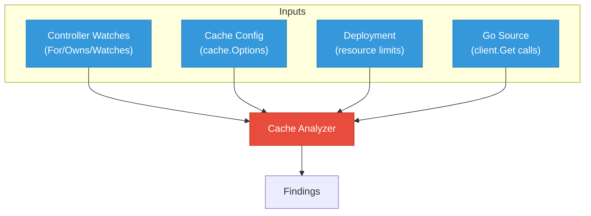

# Cache Architecture Analysis

The cache analyzer is one of the most impactful features. It cross-references controller-runtime cache configuration against controller watches and deployment memory limits to detect OOM risks.

## Why this matters

Kubernetes operators use controller-runtime's informer cache to watch resources. By default, the cache watches resources cluster-wide. In large clusters with thousands of resources, this can consume gigabytes of memory, causing OOM kills.

The analyzer has caught real production bugs:

- [opendatahub-io/data-science-pipelines-operator#992](https://github.com/opendatahub-io/data-science-pipelines-operator/issues/992)
- [opendatahub-io/model-registry-operator#457](https://github.com/opendatahub-io/model-registry-operator/issues/457)

## What it detects

| Finding | Severity | Description |
|---------|----------|-------------|
| Cluster-wide informers | Warning | Types watched cluster-wide that should be namespace-scoped or filtered |
| Missing cache filters | Warning | Watched types without `ByObject` cache filters |
| Implicit informers | Info | `client.Get` calls for types not in the watch list (creates hidden informers) |
| Missing DefaultTransform | Warning | No `cache.DefaultTransform` configured (managedFields waste memory) |
| Missing GOMEMLIMIT | Warning | No `GOMEMLIMIT` in deployment (Go GC can't pressure-tune) |
| GOMEMLIMIT > 90% | Warning | `GOMEMLIMIT` exceeds 90% of container memory limit |

## How it works

The cache analyzer runs after deployments and controller watches are extracted. It performs a 4-way cross-reference:



### Step 1: Extract cache configuration

From Go source code, the analyzer finds `ctrl.NewManager` and `cache.Options`:

```go
// Detected patterns
ctrl.NewManager(cfg, ctrl.Options{
    Cache: cache.Options{
        ByObject: map[client.Object]cache.ByObject{
            &corev1.ConfigMap{}: {Field: ...},
        },
        DefaultTransform: cache.TransformStripManagedFields(),
    },
})
```

### Step 2: Extract controller watches

From controller `SetupWithManager` functions:

```go
// For() - primary watched type
// Owns() - owned child resources
// Watches() - secondary watches
```

### Step 3: Cross-reference

For each watched type:

1. Is there a `ByObject` cache filter? If not, it's a cluster-wide informer.
2. Is the type namespace-scoped? If yes and watched cluster-wide, flag as OOM risk.
3. Are there `client.Get` calls for unwatched types? These create implicit informers.

### Step 4: Check deployment limits

- Is `GOMEMLIMIT` set in the deployment?
- If set, is it less than 90% of the container memory limit?
- What's the total memory limit vs. estimated cache memory?

## Example output

```json
{
  "cache_config": {
    "scope": "cluster",
    "filtered_types": ["ConfigMap"],
    "disabled_types": [],
    "implicit_informers": [
      {
        "type": "Namespace",
        "source": "controllers/dsc_controller.go:145",
        "reason": "client.Get call for unwatched type"
      }
    ],
    "gomemlimit": "",
    "container_memory_limit": "1Gi",
    "default_transform": false,
    "findings": [
      {
        "severity": "warning",
        "message": "Missing GOMEMLIMIT in deployment - Go GC cannot pressure-tune memory usage",
        "recommendation": "Set GOMEMLIMIT to 80-90% of container memory limit"
      },
      {
        "severity": "warning",
        "message": "Missing DefaultTransform - managedFields consuming extra memory in cache",
        "recommendation": "Add cache.DefaultTransform to strip managedFields from cached objects"
      },
      {
        "severity": "info",
        "message": "Implicit informer for Namespace via client.Get at controllers/dsc_controller.go:145",
        "recommendation": "Add Namespace to controller watches or use uncached client for this call"
      }
    ]
  }
}
```

## Limitations

- The analyzer uses tree-sitter for Go parsing, not full type resolution. Complex cache configurations using variables or factory functions may not be detected.
- Implicit informer detection is based on `client.Get` call patterns and may produce false positives for calls using uncached clients.
- Memory estimation is approximate. Actual memory consumption depends on cluster size, resource count, and field sizes.
