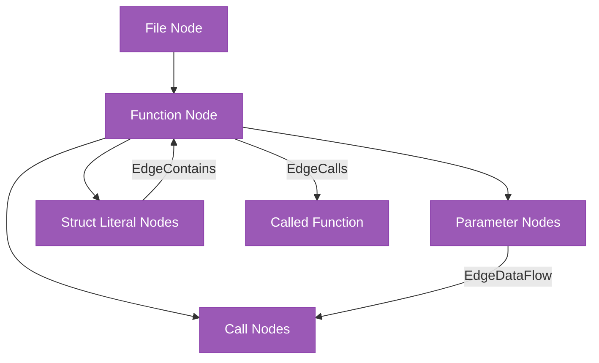
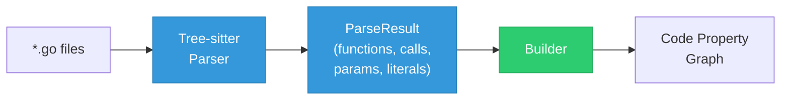
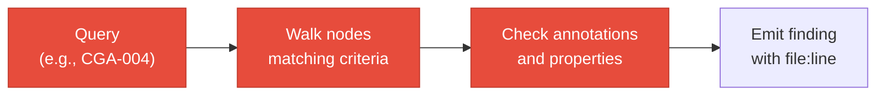

# Code Property Graph

The code property graph (CPG) is a unified representation of Go source code that supports cross-function analysis and security queries.

## Structure



### Node kinds

| Kind | Description |
|------|-------------|
| `File` | Source file |
| `Function` | Function or method declaration |
| `Parameter` | Function parameter with type |
| `Call` | Function call expression |
| `StructLiteral` | Composite literal (struct instantiation) |

### Edge kinds

| Kind | Description |
|------|-------------|
| `EdgeCalls` | Function A calls function B |
| `EdgeAliases` | Type alias relationship |
| `EdgeContains` | Containment (file contains function, function contains literal) |

### Properties

Each node carries:

- **Name**: Identifier
- **File**: Source file path
- **Line**: Line number
- **Properties**: Key-value metadata (e.g., parameter type, return type)
- **Annotations**: Domain-specific metadata added by annotators

## Thread safety

The CPG implementation (`pkg/graph/cpg.go`) is thread-safe:

- `sync.RWMutex` protects all node and edge operations
- Multiple annotators can read concurrently
- Write operations (adding nodes/edges) are serialized

## Building the CPG



1. **Parser** (`pkg/parser/go_parser.go`): Tree-sitter parses each Go file, extracting:
    - Function declarations with parameters and return types
    - Function call expressions with arguments
    - Composite literals (struct instantiation)
    - Switch/case statements

2. **Builder** (`pkg/builder/builder.go`): Assembles parse results into the CPG:
    - Creates nodes for each function, parameter, call, literal
    - Creates edges (calls, contains, aliases)
    - Resolves cross-file references

## Architecture enrichment

When `--with-arch` is provided, the CPG gains an `ArchData` sidecar:

```go
type CPG struct {
    nodes    map[string]*Node
    edges    map[string][]*Edge
    ArchData *arch.ArchitectureData  // Optional
}
```

Architecture data enables queries that cross-reference code against extracted architecture:

- CGA-U01: Compare CRD version references in code against extracted CRD schemas
- Architecture-aware taint analysis: Follow data through known API boundaries
- Finding enrichment: Add `ArchRef` to findings linking code to architecture components

## Query execution

Queries traverse the CPG looking for patterns:



The query engine (`pkg/query/engine.go`) provides:

- `RunDomain(domain)`: Execute all queries for a domain
- Results grouped by domain with deduplication
- Per-domain SARIF output support

## Taint analysis

Taint analysis (`pkg/query/taint.go`) traces data flow from sources to sinks:

1. **Sources**: Functions that introduce untrusted data (HTTP request params, env vars, user input)
2. **Propagators**: Functions that pass data through (assignments, returns, function calls)
3. **Sinks**: Functions that perform sensitive operations (SQL queries, command execution, file writes)

A taint finding is emitted when data flows from a source to a sink without passing through a sanitizer.
