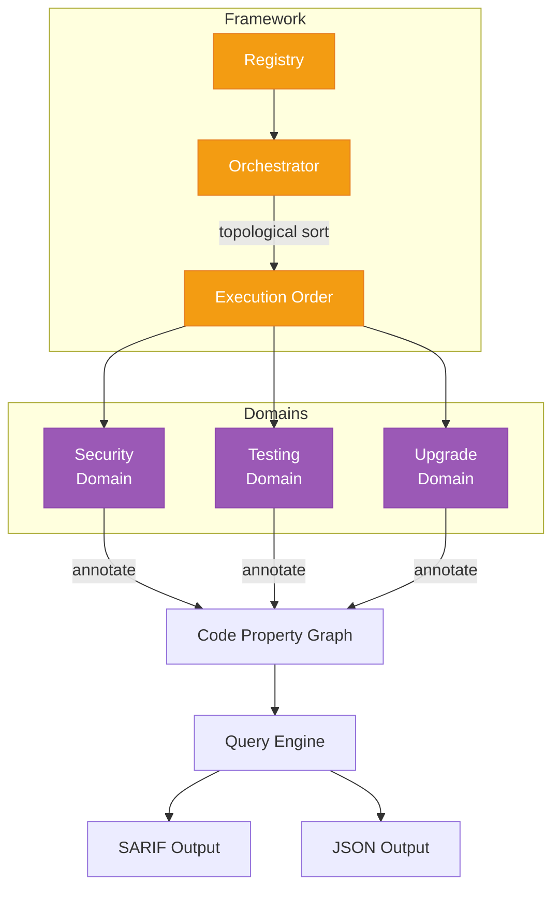

# Domain Framework

The domain analysis framework enables pluggable analysis capabilities on top of the code property graph. Each domain adds its own annotations and queries without modifying the CPG itself.

## Architecture



## DomainAnalyzer interface

Every domain implements this interface (`pkg/domains/domain.go`):

```go
type DomainAnalyzer interface {
    Name() string
    Description() string
    Dependencies() []string
    Languages() []string
    Annotators() map[string]annotator.Annotator
    Queries() []query.Query
}
```

| Method | Purpose |
|--------|---------|
| `Name()` | Unique domain identifier |
| `Description()` | Human-readable description |
| `Dependencies()` | Other domains that must run first |
| `Languages()` | Supported languages (currently Go) |
| `Annotators()` | Map of language to annotator implementation |
| `Queries()` | List of query functions to run |

## Registry

The domain registry (`pkg/domains/registry.go`) holds all registered domains:

```go
// In main.go
registry := domains.NewRegistry()
registry.Register(security.NewAnalyzer())
registry.Register(testing.NewAnalyzer())
registry.Register(upgrade.NewAnalyzer())
```

## Orchestrator

The orchestrator (`pkg/domains/orchestrator.go`) handles execution:

1. **Dependency resolution**: Topological sort of domains by `Dependencies()`
2. **Annotation phase**: Run each domain's annotator against the CPG in order
3. **Query phase**: Run all queries after all annotators complete
4. **Collection**: Gather findings grouped by domain

Domains without dependencies can run annotators in parallel (the CPG supports concurrent reads).

## ArchitectureData

When architecture data is available, it's passed to domains via `ArchitectureData`:

```go
type ArchitectureData struct {
    CRDs             []arch.CRD
    Services         []arch.Service
    Deployments      []arch.Deployment
    ControllerWatches []arch.ControllerWatch
    // ... other architecture fields
}
```

Domains use this for cross-cutting queries (e.g., checking code references against extracted CRD schemas).

## Adding a new domain

1. Create `pkg/domains/mydomain/` directory
2. Implement `DomainAnalyzer` interface in `analyzer.go`
3. Define annotation types in `annotations.go`
4. Implement annotator in `go_annotator.go`
5. Implement queries in `queries.go`
6. Register in `main.go`
7. Add tests in `*_test.go` files

### Example: Minimal domain

```go
package mydomain

type Analyzer struct{}

func NewAnalyzer() *Analyzer { return &Analyzer{} }

func (a *Analyzer) Name() string        { return "mydomain" }
func (a *Analyzer) Description() string { return "My custom analysis" }
func (a *Analyzer) Dependencies() []string { return nil }
func (a *Analyzer) Languages() []string { return []string{"go"} }

func (a *Analyzer) Annotators() map[string]annotator.Annotator {
    return map[string]annotator.Annotator{
        "go": &GoAnnotator{},
    }
}

func (a *Analyzer) Queries() []query.Query {
    return []query.Query{
        {ID: "MY-001", Name: "My Query", Run: myQueryFunc},
    }
}
```
