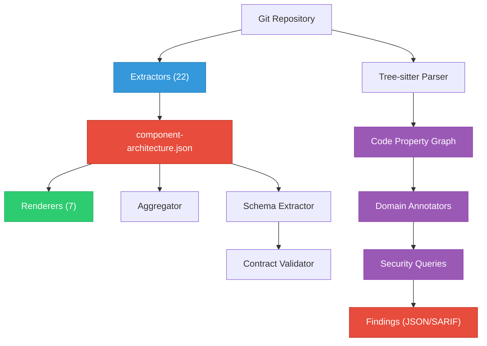

# Design Overview

The Architecture Analyzer is a deterministic static analysis tool. No LLM involvement, no non-determinism, no API calls. It reads a repository and produces structured architecture data.

## Core pipeline



## Design decisions

### Why static analysis?

- **Deterministic**: Same input always produces same output. No model variability.
- **Fast**: Full analysis of a typical K8s operator repo takes under 10 seconds.
- **Free**: No API calls, no token consumption. Run as often as you want.
- **Source-traceable**: Every fact in the output can be traced back to a specific file and line.

### Why extractors + renderers separation?

Extraction and rendering are decoupled through the JSON intermediate format:

- **Extract once, render many**: Extract JSON, then produce different visualizations without re-scanning
- **Aggregate**: Merge multiple JSON files for cross-component analysis
- **Custom processing**: Use the JSON with any tool (jq, Python, etc.)
- **CI artifacts**: Store JSON as build artifacts, render on demand

### Why tree-sitter for Go parsing?

- **No Go toolchain dependency**: Tree-sitter parses syntax without needing `go build` to succeed
- **Fast incremental parsing**: Can parse individual files without resolving the full module graph
- **Cross-language potential**: Same approach extends to Python, TypeScript, etc.
- **Partial-file resilience**: Parses what it can even if the file has errors

### Why a code property graph?

The CPG provides:

- **Cross-function analysis**: Trace data flow across function boundaries
- **Annotation layers**: Multiple domains (security, testing, upgrade) annotate the same graph
- **Composable queries**: Each query traverses the same graph independently
- **Architecture integration**: CPG nodes link to architecture data for cross-cutting analysis

## Package structure

```
pkg/
  extractor/      # 22 architecture extractors
  renderer/       # 7 diagram/report renderers
  aggregator/     # Platform-wide aggregation
  validator/      # CRD contract validation
  parser/         # Tree-sitter Go parser
  builder/        # CPG builder
  graph/          # CPG data structure (thread-safe)
  annotator/      # Annotation engine
  query/          # Query engine + taint analysis
  domains/        # Pluggable domain framework
    security/     # Security domain
    testing/      # Testing domain
    upgrade/      # Upgrade domain
  arch/           # Architecture data types and parsing
  linker/         # Storage linker
  config/         # Configuration types
```

## Data flow

1. **Input**: Path to a git repository (local checkout)
2. **YAML extraction**: Walk filesystem for Kubernetes manifests, parse into typed structs
3. **Go extraction**: Parse controller files for watches, endpoints, cache config, operator constants, reconcile sequences, Prometheus metrics, status conditions, and platform detection
4. **File extraction**: Parse Dockerfiles, Helm charts, go.mod
5. **Assembly**: All extracted data merged into `ComponentArchitecture` struct
6. **Serialization**: JSON output
7. **Rendering**: Each renderer reads JSON, produces its format
8. **CPG** (optional): Tree-sitter parses all Go files, builds graph, runs domain queries
9. **Aggregation** (optional): Multiple component JSONs merged into platform view
10. **Validation** (optional): CRD schemas compared against baseline contracts
