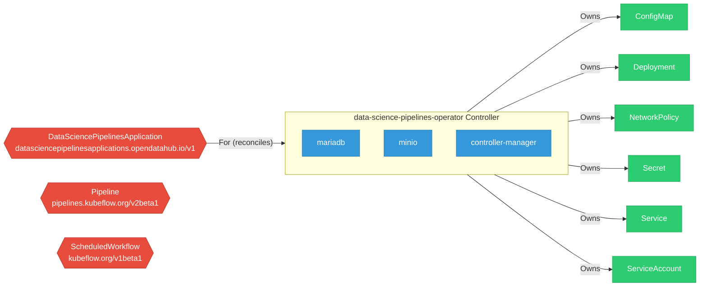
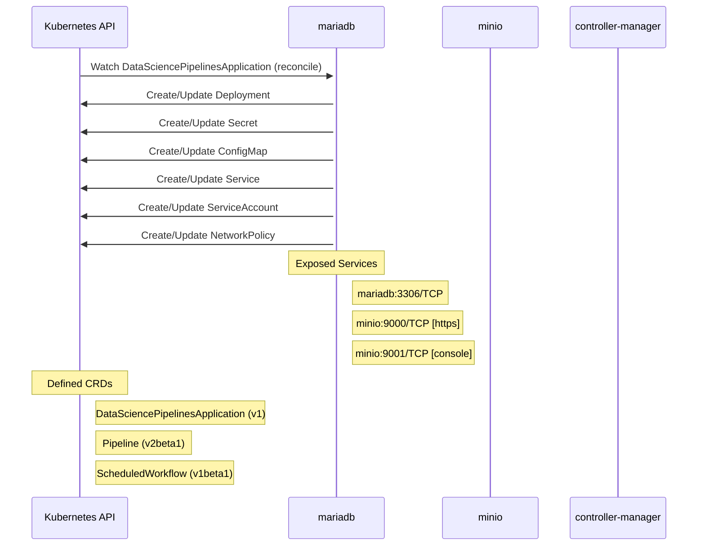

# Example Output

This page shows real output from running `arch-analyzer` against production RHOAI components, both single-component analysis and platform-wide aggregation across 11 repositories.

---

## Platform Aggregation (11 Components)

Running the analyzer against all locally available RHOAI repositories and aggregating the results:

```bash
# Analyze each component
for repo in opendatahub-operator kserve data-science-pipelines-operator \
            model-registry-operator trustyai-service-operator kuberay \
            notebooks odh-dashboard odh-model-controller \
            kube-rbac-proxy kube-auth-proxy; do
  cd /tmp/platform/$repo
  arch-analyzer analyze /path/to/$repo
done

# Aggregate into platform view
arch-analyzer aggregate /tmp/platform
```

### Platform Summary

| Metric | Count |
|--------|-------|
| Components | 11 |
| CRDs | 50 |
| Services | 29 |
| Secrets | 25 |
| Cluster Roles | 52 |
| Cross-Component Dependencies | 9 |

### CRD Ownership Map

The platform defines 86 CRDs across 11 components. Here's the ownership breakdown:

| Owner | CRDs |
|-------|------|
| **opendatahub-operator** | Auth, AzureKubernetesEngine, CoreWeaveKubernetesEngine, Dashboard, DataSciencePipelines, FeastOperator, GatewayConfig, HardwareProfile, Kserve, Kueue, LlamaStackOperator, MLflowOperator, ModelController, ModelRegistry, ModelsAsService, Monitoring, Ray, SparkOperator, Trainer, TrainingOperator, TrustyAI, Workbenches |
| **kserve** | ClusterServingRuntime, ClusterStorageContainer, InferenceGraph, InferenceService, LLMInferenceService, LLMInferenceServiceConfig, LocalModelCache, LocalModelNamespaceCache, LocalModelNode, LocalModelNodeGroup, ServingRuntime, TrainedModel |
| **trustyai-service-operator** | EvalHub, GuardrailsOrchestrator, LMEvalJob, NemoGuardrails, TrustyAIService |
| **data-science-pipelines-operator** | DataSciencePipelinesApplication, Pipeline, PipelineVersion, ScheduledWorkflow |
| **odh-model-controller** | Account |
| **kuberay** | RayCluster, RayJob, RayService |
| **notebooks** | Notebook |

### Cross-Component Dependencies

The aggregator detects relationships between components through Go module imports and CRD watch patterns:

| From | To | Type |
|------|----|------|
| odh-dashboard | llama-stack-k8s-operator | go-module |
| odh-dashboard | mlflow-go | go-module |
| odh-model-controller | kserve | go-module |
| odh-model-controller | kserve | watches-crd:InferenceGraph |
| odh-model-controller | kserve | watches-crd:InferenceService |
| odh-model-controller | kserve | watches-crd:LLMInferenceService |
| odh-model-controller | kserve | watches-crd:ServingRuntime |
| opendatahub-operator | models-as-a-service | go-module |
| opendatahub-operator | opendatahub-operator | go-module |

This reveals that `odh-model-controller` watches 4 kserve CRDs, `odh-dashboard` has Go module dependencies on llama-stack and mlflow, and `opendatahub-operator` has internal module references.

### Platform Network Topology

29 services discovered across all components:

| Owner | Service | Ports |
|-------|---------|-------|
| data-science-pipelines-operator | mariadb | 3306/TCP |
| data-science-pipelines-operator | minio | 9000/TCP, 9001/TCP |
| data-science-pipelines-operator | pypi-server | 8080/TCP |
| kserve | kserve-controller-manager-service | 8443/TCP |
| kserve | llmisvc-controller-manager-service | 8443/TCP |
| kserve | kserve-webhook-server-service | 443/TCP |
| kserve | llmisvc-webhook-server-service | 443/TCP |
| kserve | localmodel-webhook-server-service | 443/TCP |
| kube-auth-proxy | kube-rbac-proxy | 8443/TCP |
| kuberay | kuberay-operator | 8080/TCP |
| kuberay | webhook-service | 443/TCP |
| model-registry-operator | webhook-service | 443/TCP |
| notebooks | notebook | 8888/TCP |
| odh-dashboard | odh-dashboard | 8443/TCP |
| odh-dashboard | workspaces-backend | 4000/TCP |
| odh-dashboard | workspaces-frontend | 8080/TCP |
| odh-dashboard | workspaces-webhook-service | 443/TCP |
| odh-model-controller | odh-model-controller-webhook-service | 443/TCP |
| opendatahub-operator | odh-dashboard | 8443/TCP |
| opendatahub-operator | kserve-controller-manager-service | 8443/TCP |
| opendatahub-operator | training-operator | 8080/TCP, 443/TCP |
| opendatahub-operator | kuberay-operator | 8080/TCP |

### Platform RBAC Surface

52 cluster roles across all components:

| Owner | Cluster Roles | Total Resource Types |
|-------|---------------|---------------------|
| opendatahub-operator | 22 roles (editor/viewer pairs per component) | ~44 |
| data-science-pipelines-operator | 4 roles (aggregate admin, argo, manager) | 85 |
| trustyai-service-operator | 9 roles (proxy, eval, nemo, lmeval, manager, editor/viewer) | 58 |
| odh-model-controller | 7 roles (account editor/viewer, proxy, prometheus, metrics, manager) | 50 |
| kserve | 2 roles (proxy, manager) | 47 |
| odh-dashboard | 1 role (odh-dashboard) | 40 |
| model-registry-operator | 6 roles (metrics, proxy, admin/editor/viewer, manager) | 35 |

### Platform Secrets Inventory

25 secrets referenced across all components:

| Owner | Secret | Type |
|-------|--------|------|
| data-science-pipelines-operator | mariadb-certs, minio-certs, ds-pipeline-db-test, minio | Opaque |
| kserve | kserve-webhook-server-cert, llmisvc-webhook-server-cert, localmodel-webhook-server-cert | Opaque |
| kube-auth-proxy | kube-auth-proxy-secret, kube-rbac-proxy-client-certificates | Opaque |
| kuberay | webhook-server-cert | Opaque |
| model-registry-operator | webhook-server-cert, controller-manager-metrics-service | Opaque |
| odh-dashboard | dashboard-proxy-tls (kubernetes.io/tls), webhook-server-cert | Mixed |
| odh-model-controller | odh-model-controller-webhook-cert | kubernetes.io/tls |
| opendatahub-operator | redhat-ods-operator-controller-webhook-cert, opendatahub-operator-controller-webhook-cert, odh-model-controller-webhook-cert, odh-notebook-controller-webhook-cert, dashboard-proxy-tls | kubernetes.io/tls |
| opendatahub-operator | kserve-webhook-server-cert, training-operator-webhook-cert, controller-manager-metrics-service, webhook-server-cert, kubeflow-training-operator-webhook-cert | Opaque |

---

## Single Component Analysis

The rest of this page shows detailed output from analyzing [data-science-pipelines-operator](https://github.com/opendatahub-io/data-science-pipelines-operator), one of the 11 components above.

```bash
./arch-analyzer full-analysis ./data-science-pipelines-operator --output-dir output
```

The tool produced:

- `component-architecture.json` (54 KB): structured architecture data
- 7 diagrams in `output/diagrams/`
- `security-findings.json`: 128 findings across security, testing, and upgrade domains
- `code-graph.json`: full code property graph (4,972 nodes, 8,276 edges)
- 6 CRD JSON schemas in `output/schemas/`

## Architecture JSON

The core output is a structured JSON capturing everything the tool extracted. Here's the top-level structure from DSPO:

```json
{
  "component": "data-science-pipelines-operator",
  "repo": "opendatahub-io/data-science-pipelines-operator",
  "extracted_at": "2026-04-16T13:50:56Z",
  "analyzer_version": "0.2.0",
  "crds": [
    {
      "group": "datasciencepipelinesapplications.opendatahub.io",
      "version": "v1",
      "kind": "DataSciencePipelinesApplication",
      "scope": "Namespaced",
      "fields_count": 205,
      "validation_rules": [
        "has(self.accessModes) && size(self.accessModes) > 0",
        "has(self.storageClassName) && self.storageClassName != \"\""
      ],
      "source": "config/crd/bases/...datasciencepipelinesapplications.yaml"
    },
    {
      "group": "pipelines.kubeflow.org",
      "version": "v2beta1",
      "kind": "Pipeline",
      "scope": "Namespaced",
      "fields_count": 7
    }
  ],
  "rbac": { "cluster_roles": ["..."], "cluster_role_bindings": ["..."] },
  "deployments": ["..."],
  "services": ["..."],
  "network_policies": ["..."],
  "controller_watches": ["..."],
  "dependencies": { "module": "...", "go_version": "...", "deps": ["..."] },
  "secrets": ["..."],
  "dockerfiles": ["..."],
  "webhooks": ["..."],
  "configmaps": ["..."],
  "http_endpoints": ["..."],
  "ingress": ["..."],
  "external_connections": ["..."],
  "feature_gates": ["..."],
  "cache_config": { "cache_issues": ["..."] }
}
```

Each section contains the full extracted data with source file references, line numbers, and cross-references to other sections.

## Component Diagram

Shows CRDs, controller relationships, and owned resources:



## Dataflow Diagram

Controller watches and service interactions:



## Security and Network View

ASCII-rendered layered view of network topology, RBAC, secrets, and deployment security controls:

```
+==============================================================================+
|                       SECURITY & NETWORK ARCHITECTURE                        |
|                       data-science-pipelines-operator                        |
+==============================================================================+

================================================================================
  NETWORK TOPOLOGY
================================================================================

--- Services -------------------------------------------------------------------
  [ClusterIP] mariadb
    Port: 3306 -> 3306/TCP []
  [ClusterIP] minio
    Port: 9000 -> 9000/TCP [https] (TLS)
    Port: 9001 -> 9001/TCP [console]
  [ClusterIP] pypi-server
    Port: 8080 -> 8080/TCP [pypi-server]

--- Network Policies -----------------------------------------------------------
  (none found - all traffic allowed by default)

================================================================================
  RBAC SUMMARY
================================================================================
  ClusterRoles:        4
  ClusterRoleBindings: 2
  Roles:               1
  RoleBindings:        1
  Kubebuilder markers: 32
    CR: aggregate-dspa-admin-edit (4 resource types)
    CR: aggregate-dspa-admin-view (4 resource types)
    CR: manager-argo-role (22 resource types)
    CR: manager-role (55 resource types)

================================================================================
  SECRETS INVENTORY
================================================================================
  Secret: mariadb-certs
    Type: Opaque
    Provisioned by: volume-mounted
    Referenced by: deployment/mariadb
  Secret: ds-pipeline-db-test
    Type: Opaque
    Provisioned by: env-var
    Referenced by: deployment/mariadb
  Secret: minio-certs
    Type: Opaque
    Provisioned by: volume-mounted
    Referenced by: deployment/minio

================================================================================
  DEPLOYMENT SECURITY CONTROLS
================================================================================
  Deployment: mariadb
    Service Account: (default)
    Automount SA Token: true
    Container: mariadb
      (no security context)
  Deployment: minio
    Service Account: (default)
    Automount SA Token: true
    Container: minio
      (no security context)
  Deployment: controller-manager
    Service Account: controller-manager
    Automount SA Token: true
    Container: manager
      allowPrivilegeEscalation: false
      capabilities: add=[], drop=[ALL]

================================================================================
  DOCKERFILE SECURITY
================================================================================
  Dockerfile
    Base image: registry.access.redhat.com/ubi9/ubi-minimal:latest
    Stages: 2
    User: ${USER}:${USER}
    [!] Unpinned base image: registry.access.redhat.com/ubi9/ubi-minimal:latest
  .github/build/Dockerfile
    Base image: ${CI_BASE}
    Stages: 2
    User: root
    [!] Container runs as root user

+==============================================================================+
```

## Security Findings (Code Property Graph)

The CPG scan found 128 findings across 3 domains. Here are representative examples:

### Cache OOM Risk (CGA-007)

```json
{
  "rule_id": "CGA-007",
  "severity": "medium",
  "message": "ByObject{} at main.go:227 has no Field or Label selector (unfiltered cache may cause OOM)",
  "file": "main.go",
  "line": 227,
  "domain": "security",
  "architecture_ref": "cache_issues: Type ConfigMap is watched but has no cache filter (cluster-wide informer); Type Deployment is watched but has no cache filter (cluster-wide informer); Type Secret is watched but has no cache filter (cluster-wide informer)"
}
```

This finding cross-references the cache config extractor with the code graph. The `architecture_ref` field shows exactly which types lack cache filters, linking the static analysis to the architectural concern.

!!! success "Real impact"
    This exact pattern led to [opendatahub-io/data-science-pipelines-operator#992](https://github.com/opendatahub-io/data-science-pipelines-operator/issues/992), a real OOM bug in production.

### Test Quality (CGA-T03, CGA-T04)

```json
{
  "rule_id": "CGA-T03",
  "severity": "medium",
  "message": "Test function TestRegistryAllowlist_BlocksDisallowedRegistry has no error path assertions",
  "file": "controllers/managed_pipelines_validation_test.go",
  "line": 708,
  "domain": "testing"
}
```

```json
{
  "rule_id": "CGA-T04",
  "severity": "low",
  "message": "File controllers/managed_pipelines_validation_test.go has 66 non-table-driven tests (consolidation opportunity)",
  "file": "controllers/managed_pipelines_validation_test.go",
  "line": 1,
  "domain": "testing"
}
```

The testing domain identified 121 tests without error path assertions and 6 files with consolidation opportunities.

## Markdown Report (excerpt)

The generated `component-report.md` is a human-readable summary of all extracted data:

| Section | Content |
|---------|---------|
| APIs Exposed | 4 CRDs with group, version, kind, scope, field count, validation rules |
| Dependencies | Key Go modules with versions, ODH-internal deps highlighted |
| Network Architecture | Services with ports, protocols, TLS indicators |
| Security | ClusterRoles with resources and verbs, per-rule source files |
| Deployments | Security contexts, SA tokens, privilege escalation settings |
| Dockerfiles | Base images, stages, USER directives, pinning status |
| Cache Analysis | OOM risk indicators, unfiltered informers, missing selectors |
| External Connections | Database, object storage, gRPC endpoints with credential redaction |

## SARIF Output

For GitHub Code Scanning integration, use `--format sarif`:

```bash
./arch-analyzer scan ./data-science-pipelines-operator --format sarif --output findings.sarif
```

The SARIF output integrates directly with GitHub's security tab, showing findings inline with source code.

## Running Against Your Own Repo

```bash
# Full analysis (architecture + code graph + schemas)
./arch-analyzer full-analysis ./your-operator --output-dir output

# Architecture only
./arch-analyzer analyze ./your-operator --output-dir output

# Security scan only
./arch-analyzer scan ./your-operator --domains security,upgrade

# Specific output format
./arch-analyzer scan ./your-operator --format sarif --output findings.sarif
```

The tool works on any Kubernetes operator project with Go source and YAML manifests. No configuration required.
