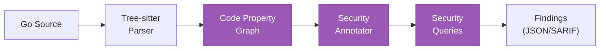

# Security Scanning

The analyzer builds a code property graph (CPG) from Go source code and runs security queries to detect vulnerabilities.

## Usage

```bash
# JSON output
arch-analyzer scan /path/to/repo --format json --output findings.json

# SARIF output (for GitHub Code Scanning, VS Code, etc.)
arch-analyzer scan /path/to/repo --format sarif --output findings.sarif

# With architecture data enrichment
arch-analyzer scan /path/to/repo --with-arch /path/to/component-architecture.json

# Run specific domains only
arch-analyzer scan /path/to/repo --domains security,testing
```

## Security queries

The security domain runs these queries against the CPG:

| Query ID | Name | What it detects |
|----------|------|-----------------|
| CGA-003 | Taint Analysis | Data flows from untrusted sources to sensitive sinks |
| CGA-004 | Hardcoded Secrets | API keys, passwords, tokens in source code |
| CGA-005 | SQL Injection | Unsanitized input in database queries |
| CGA-006 | Missing Auth | HTTP endpoints without authentication checks |
| CGA-007 | Unconverted CRD | References to deprecated CRD versions |
| CGA-008 | Dangerous Functions | Usage of known-unsafe functions |
| CGA-009 | Source Trust | Trust boundary violations in data flow |

## How it works

1. **Parse**: Tree-sitter parses all Go source files into ASTs
2. **Build CPG**: Functions, parameters, calls, struct literals are extracted into a graph
3. **Annotate**: Domain-specific annotators add security metadata to CPG nodes
4. **Query**: Security queries traverse the annotated graph looking for vulnerability patterns
5. **Report**: Findings are emitted with file:line references and severity



## Architecture enrichment

When `--with-arch` is provided, the CPG is enriched with architecture data. This enables cross-cutting queries:

- **CGA-U01** (Unconverted CRD): Compares CRD versions in code against extracted CRD schemas
- Architecture-aware taint analysis: Traces data flow through known API boundaries
- Finding annotations include `ArchRef` linking to the relevant architecture component

```bash
# First extract architecture
arch-analyzer extract /path/to/repo --output arch.json

# Then scan with architecture context
arch-analyzer scan /path/to/repo --with-arch arch.json --format sarif --output findings.sarif
```

## SARIF integration

SARIF output integrates with:

- **GitHub Code Scanning**: Upload via `github/codeql-action/upload-sarif`
- **VS Code SARIF Viewer**: Open `.sarif` files directly
- **Azure DevOps**: Native SARIF support in Advanced Security

## Domain-specific scanning

Beyond security, two additional domains are available:

| Domain | Queries | Description |
|--------|---------|-------------|
| `testing` | Test coverage, mock usage | Identifies untested code paths and test patterns |
| `upgrade` | Deprecation detection | Tracks API version compatibility issues |

```bash
# List all registered domains
arch-analyzer domains

# Run specific domains
arch-analyzer scan /path/to/repo --domains security,testing
```

See [Domains reference](../reference/domains.md) for full details.
