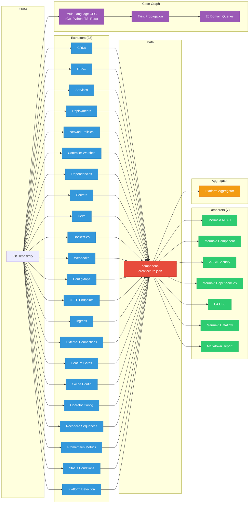

---
hide:
  - navigation
  - toc
---

  
  <h1 style="margin: 0; font-size: 2.4em;">Architecture Analyzer</h1>
  

    Static analysis for Kubernetes/OpenShift architecture. 
    25 extractors. 7 renderers. Code property graph with security queries.
  

  

    <a href="getting-started/installation/" class="md-button md-button--primary">Get Started</a>
    <a href="https://github.com/ugiordan/architecture-analyzer" class="md-button">GitHub</a>
  

## What Is This?

A Go-based static analysis tool that extracts architecture data from Kubernetes/OpenShift component repositories and produces diagrams, security reports, and code property graphs. Works with any Go-based K8s operator ecosystem. Currently deployed for OpenShift AI (RHOAI) and Open Data Hub (ODH) analysis.

Zero LLM involvement. Deterministic, reproducible, and free to run.

## Architecture

## Key Features

- **22 Architecture Extractors**

    ---

    CRDs, RBAC, deployments, services, network policies, controller watches, dependencies, secrets, Helm charts, Dockerfiles, webhooks, ConfigMaps, HTTP endpoints, ingress, external connections (database, gRPC, messaging), feature gates, cache architecture, operator config constants, reconciliation sequences, Prometheus metrics, status conditions, and platform detection.

    [:octicons-arrow-right-24: Extractors reference](reference/extractors.md)

- **Code Property Graph**

    ---

    Multi-language CPG (Go, Python, TypeScript, Rust) via tree-sitter. Typed nodes with edge confidence, intraprocedural data flow, control flow graphs, two-phase taint propagation, SARIF ingestion, and structural diff. 20 security queries across 3 domains (security, testing, upgrade).

    [:octicons-arrow-right-24: CPG architecture](architecture/cpg.md)

- **OOM Risk Detection**

    ---

    Cross-references controller-runtime cache config against watches and deployment memory limits. Catches real production bugs.

    [:octicons-arrow-right-24: Cache analysis](architecture/cache-analysis.md)

- **CRD Contract Validation**

    ---

    Detects breaking schema changes across repos. Runs on every PR that modifies CRD definitions.

    [:octicons-arrow-right-24: CRD validation guide](guides/crd-validation.md)

## Output Formats

| Format | File | Description |
|--------|------|-------------|
| Mermaid RBAC | `rbac.mmd` | ServiceAccounts, bindings, roles, resources |
| Mermaid Component | `component.mmd` | CRDs watched/owned, dependencies |
| ASCII Security | `security-network.txt` | Layered network, RBAC, secrets view |
| Mermaid Dependencies | `dependencies.mmd` | Go module graph (internal deps highlighted) |
| C4 DSL | `c4-context.dsl` | Structurizr C4 context diagram |
| Mermaid Dataflow | `dataflow.mmd` | Controller watches and service connections |
| Markdown Report | `report.md` | Structured tables for all extracted data |
| JSON | `component-architecture.json` | Machine-readable extracted data |
| Code Graph | `code-graph.json` | CPG nodes, edges, basic blocks, taint findings |
| Security JSON | `security-findings.json` | Domain query findings with file:line references |
| SARIF | `findings.sarif` | Security findings in SARIF 2.1.0 format |

## Real-world impact

The cache analysis has caught real production bugs:

- [opendatahub-io/data-science-pipelines-operator#992](https://github.com/opendatahub-io/data-science-pipelines-operator/issues/992): OOM from cluster-wide informers
- [opendatahub-io/model-registry-operator#457](https://github.com/opendatahub-io/model-registry-operator/issues/457): Missing cache filters on watched types
