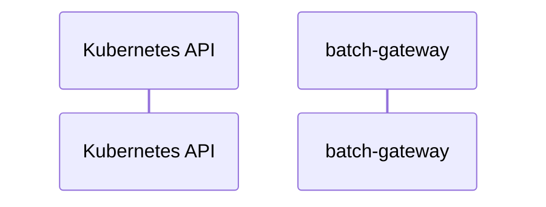

# batch-gateway: Dataflow

## Controller Watches

Kubernetes resources this controller monitors for changes. Each watch triggers reconciliation when the watched resource is created, updated, or deleted.

No controller watches found.

## Reconciliation Flow

How the controller interacts with the Kubernetes API during reconciliation.

### HTTP Endpoints

| Method | Path | Source |
|--------|------|--------|
| * | / | [`internal/apiserver/common/rest.go:74`](https://github.com/llm-d-incubation/batch-gateway/blob/d07515bb29d744e21a7d0875cadc5f99d2ad9525/internal/apiserver/common/rest.go#L74) |

## Configuration

ConfigMaps and Helm values that control this component's runtime behavior.

### Helm

**Chart:** batch-gateway v0.1.0

