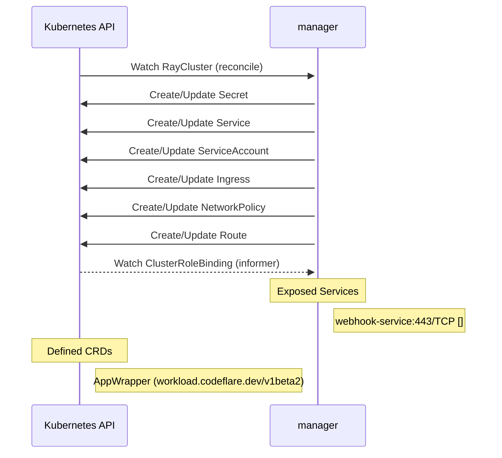

# codeflare-operator: Dataflow

## Controller Watches

Kubernetes resources this controller monitors for changes. Each watch triggers reconciliation when the watched resource is created, updated, or deleted.

| Type | GVK | Source |
|------|-----|--------|
| For | ray/v1/RayCluster | [`pkg/controllers/raycluster_controller.go:680`](https://github.com/project-codeflare/codeflare-operator/blob/fb0d403419a114d26adcf65215b6a89e723667d8/pkg/controllers/raycluster_controller.go#L680) |
| Owns | /v1/Secret | [`pkg/controllers/raycluster_controller.go:683`](https://github.com/project-codeflare/codeflare-operator/blob/fb0d403419a114d26adcf65215b6a89e723667d8/pkg/controllers/raycluster_controller.go#L683) |
| Owns | /v1/Service | [`pkg/controllers/raycluster_controller.go:682`](https://github.com/project-codeflare/codeflare-operator/blob/fb0d403419a114d26adcf65215b6a89e723667d8/pkg/controllers/raycluster_controller.go#L682) |
| Owns | /v1/ServiceAccount | [`pkg/controllers/raycluster_controller.go:681`](https://github.com/project-codeflare/codeflare-operator/blob/fb0d403419a114d26adcf65215b6a89e723667d8/pkg/controllers/raycluster_controller.go#L681) |
| Owns | networking.k8s.io/v1/Ingress | [`pkg/controllers/raycluster_controller.go:684`](https://github.com/project-codeflare/codeflare-operator/blob/fb0d403419a114d26adcf65215b6a89e723667d8/pkg/controllers/raycluster_controller.go#L684) |
| Owns | networking.k8s.io/v1/NetworkPolicy | [`pkg/controllers/raycluster_controller.go:685`](https://github.com/project-codeflare/codeflare-operator/blob/fb0d403419a114d26adcf65215b6a89e723667d8/pkg/controllers/raycluster_controller.go#L685) |
| Owns | route/v1/Route | [`pkg/controllers/raycluster_controller.go:705`](https://github.com/project-codeflare/codeflare-operator/blob/fb0d403419a114d26adcf65215b6a89e723667d8/pkg/controllers/raycluster_controller.go#L705) |
| Watches | rbac.authorization.k8s.io/v1/ClusterRoleBinding | [`pkg/controllers/raycluster_controller.go:686`](https://github.com/project-codeflare/codeflare-operator/blob/fb0d403419a114d26adcf65215b6a89e723667d8/pkg/controllers/raycluster_controller.go#L686) |

## Reconciliation Flow

How the controller interacts with the Kubernetes API during reconciliation.

### Webhooks

| Name | Type | Path | Failure Policy | Service | Source |
|------|------|------|----------------|---------|--------|
| mappwrapper.kb.io | mutating | /mutate-workload-codeflare-dev-v1beta2-appwrapper | Fail | system/webhook-service | [`config/webhook/manifests.yaml`](https://github.com/project-codeflare/codeflare-operator/blob/fb0d403419a114d26adcf65215b6a89e723667d8/config/webhook/manifests.yaml) |
| mappwrapper.kb.io | mutating | /mutate-workload-codeflare-dev-v1beta2-appwrapper | fail |  | [`pkg/controllers/appwrapper_webhook.go`](https://github.com/project-codeflare/codeflare-operator/blob/fb0d403419a114d26adcf65215b6a89e723667d8/pkg/controllers/appwrapper_webhook.go) |
| mraycluster.ray.openshift.ai | mutating | /mutate-ray-io-v1-raycluster | Fail | system/webhook-service | [`config/webhook/manifests.yaml`](https://github.com/project-codeflare/codeflare-operator/blob/fb0d403419a114d26adcf65215b6a89e723667d8/config/webhook/manifests.yaml) |
| vappwrapper.kb.io | validating | /validate-workload-codeflare-dev-v1beta2-appwrapper | Fail | system/webhook-service | [`config/webhook/manifests.yaml`](https://github.com/project-codeflare/codeflare-operator/blob/fb0d403419a114d26adcf65215b6a89e723667d8/config/webhook/manifests.yaml) |
| vappwrapper.kb.io | validating | /validate-workload-codeflare-dev-v1beta2-appwrapper | fail |  | [`pkg/controllers/appwrapper_webhook.go`](https://github.com/project-codeflare/codeflare-operator/blob/fb0d403419a114d26adcf65215b6a89e723667d8/pkg/controllers/appwrapper_webhook.go) |
| vraycluster.ray.openshift.ai | validating | /validate-ray-io-v1-raycluster | Fail | system/webhook-service | [`config/webhook/manifests.yaml`](https://github.com/project-codeflare/codeflare-operator/blob/fb0d403419a114d26adcf65215b6a89e723667d8/config/webhook/manifests.yaml) |

## Configuration

ConfigMaps and Helm values that control this component's runtime behavior.

