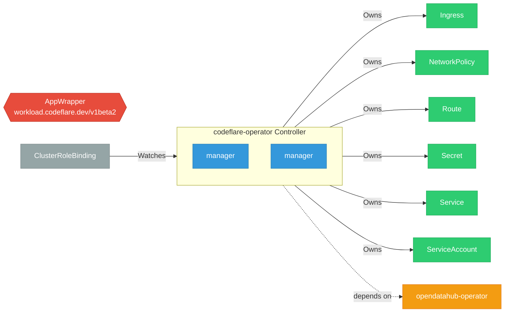

# codeflare-operator

> **Architecture snapshot: 2026-05-05** (2026-05-05)

**Repository:** project-codeflare/codeflare-operator  
**Analyzer:** arch-analyzer 0.2.0  
**Extracted:** 2026-05-05T15:09:23Z

## Summary

| Metric | Count |
|--------|-------|
| CRDs | 1 |
| Deployments | 2 |
| Services | 1 |
| Secrets | 1 |
| Cluster Roles | 3 |
| Controller Watches | 8 |

## Component Architecture

CRDs, controllers, and owned Kubernetes resources.

### CRDs

| Group | Version | Kind | Scope | Fields | Validation Rules | Source |
|-------|---------|------|-------|--------|------------------|--------|
| workload.codeflare.dev | v1beta2 | AppWrapper | Namespaced | 50 | 0 | [`config/crd/crd-appwrapper.yml`](https://github.com/project-codeflare/codeflare-operator/blob/fb0d403419a114d26adcf65215b6a89e723667d8/config/crd/crd-appwrapper.yml) |

## Dependencies

### Internal Platform Dependencies

| Component | Interaction |
|-----------|-------------|
| opendatahub-operator | Go module dependency: github.com/opendatahub-io/opendatahub-operator/v2 |

### Key External Dependencies

| Module | Version |
|--------|---------|
| github.com/go-logr/logr | v1.4.2 |
| k8s.io/api | v0.31.4 |
| k8s.io/apiextensions-apiserver | v0.31.2 |
| k8s.io/apimachinery | v0.31.4 |
| k8s.io/client-go | v0.31.4 |
| sigs.k8s.io/controller-runtime | v0.19.3 |

