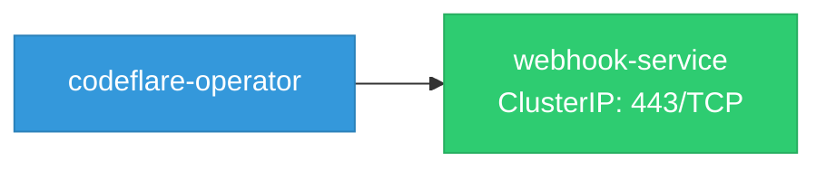

# codeflare-operator: Network

## Service Map

### Services

| Name | Type | Ports | Source |
|------|------|-------|--------|
| webhook-service | ClusterIP | 443/TCP | [`config/webhook/service.yaml`](https://github.com/project-codeflare/codeflare-operator/blob/fb0d403419a114d26adcf65215b6a89e723667d8/config/webhook/service.yaml) |

### Ingress / Routing

| Kind | Name | Hosts | Paths | TLS | Source |
|------|------|-------|-------|-----|--------|
| Ingress | rbac-inferred |  |  | no | [`rbac/manager-role`](https://github.com/project-codeflare/codeflare-operator/blob/fb0d403419a114d26adcf65215b6a89e723667d8/rbac/manager-role) |
| Route | rbac-inferred |  |  | no | [`rbac/manager-role`](https://github.com/project-codeflare/codeflare-operator/blob/fb0d403419a114d26adcf65215b6a89e723667d8/rbac/manager-role) |

!!! warning "No Network Policies"
    No NetworkPolicy resources found. All pod-to-pod traffic is allowed by default.

