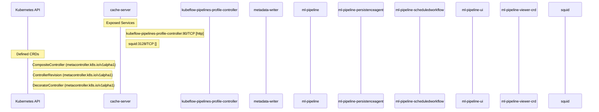

# data-science-pipelines: Dataflow

## Controller Watches

Kubernetes resources this controller monitors for changes. Each watch triggers reconciliation when the watched resource is created, updated, or deleted.

No controller watches found.

## Reconciliation Flow

How the controller interacts with the Kubernetes API during reconciliation.

### HTTP Endpoints

| Method | Path | Source |
|--------|------|--------|
| * | /apis/v1beta1/runs/{run_id}/nodes/{node_id}/artifacts/{artifact_name}:read | [`backend/src/apiserver/main.go:523`](https://github.com/kubeflow/data-science-pipelines/blob/1e2007f4374655ad9e06fdcfb68a36d0a6fc2d0f/backend/src/apiserver/main.go#L523) |
| * | /apis/v2beta1/runs/{run_id}/nodes/{node_id}/artifacts/{artifact_name}:read | [`backend/src/apiserver/main.go:524`](https://github.com/kubeflow/data-science-pipelines/blob/1e2007f4374655ad9e06fdcfb68a36d0a6fc2d0f/backend/src/apiserver/main.go#L524) |
| * | /metrics | [`backend/src/crd/controller/scheduledworkflow/main.go:170`](https://github.com/kubeflow/data-science-pipelines/blob/1e2007f4374655ad9e06fdcfb68a36d0a6fc2d0f/backend/src/crd/controller/scheduledworkflow/main.go#L170) |

## Configuration

ConfigMaps and Helm values that control this component's runtime behavior.

### ConfigMaps

| Name | Data Keys | Source |
|------|-----------|--------|
| envoy-config | envoy-config.yaml | [`manifests/kustomize/env/cert-manager/platform-agnostic-standalone-tls/patches/metadata-envoy-configmap.yaml`](https://github.com/kubeflow/data-science-pipelines/blob/1e2007f4374655ad9e06fdcfb68a36d0a6fc2d0f/manifests/kustomize/env/cert-manager/platform-agnostic-standalone-tls/patches/metadata-envoy-configmap.yaml) |
| inverse-proxy-config |  | [`manifests/kustomize/env/gcp/inverse-proxy/proxy-configmap.yaml`](https://github.com/kubeflow/data-science-pipelines/blob/1e2007f4374655ad9e06fdcfb68a36d0a6fc2d0f/manifests/kustomize/env/gcp/inverse-proxy/proxy-configmap.yaml) |
| kfp-launcher | defaultPipelineRoot | [`manifests/kustomize/base/pipeline/kfp-launcher-configmap.yaml`](https://github.com/kubeflow/data-science-pipelines/blob/1e2007f4374655ad9e06fdcfb68a36d0a6fc2d0f/manifests/kustomize/base/pipeline/kfp-launcher-configmap.yaml) |
| metadata-envoy-configmap | envoy-config.yaml | [`manifests/kustomize/base/metadata/base/metadata-envoy-configmap.yaml`](https://github.com/kubeflow/data-science-pipelines/blob/1e2007f4374655ad9e06fdcfb68a36d0a6fc2d0f/manifests/kustomize/base/metadata/base/metadata-envoy-configmap.yaml) |
| metadata-grpc-configmap | METADATA_GRPC_SERVICE_HOST, METADATA_GRPC_SERVICE_PORT | [`manifests/kustomize/base/metadata/base/metadata-grpc-configmap.yaml`](https://github.com/kubeflow/data-science-pipelines/blob/1e2007f4374655ad9e06fdcfb68a36d0a6fc2d0f/manifests/kustomize/base/metadata/base/metadata-grpc-configmap.yaml) |
| ml-pipeline-ui-configmap | viewer-pod-template.json | [`manifests/kustomize/base/installs/multi-user/pipelines-ui/configmap-patch.yaml`](https://github.com/kubeflow/data-science-pipelines/blob/1e2007f4374655ad9e06fdcfb68a36d0a6fc2d0f/manifests/kustomize/base/installs/multi-user/pipelines-ui/configmap-patch.yaml) |
| ml-pipeline-ui-configmap | viewer-pod-template.json | [`manifests/kustomize/base/pipeline/ml-pipeline-ui-configmap.yaml`](https://github.com/kubeflow/data-science-pipelines/blob/1e2007f4374655ad9e06fdcfb68a36d0a6fc2d0f/manifests/kustomize/base/pipeline/ml-pipeline-ui-configmap.yaml) |
| workflow-controller-configmap | artifactRepository, executor | [`manifests/kustomize/third-party/argo/base/workflow-controller-configmap-patch.yaml`](https://github.com/kubeflow/data-science-pipelines/blob/1e2007f4374655ad9e06fdcfb68a36d0a6fc2d0f/manifests/kustomize/third-party/argo/base/workflow-controller-configmap-patch.yaml) |

### Helm

**Chart:** kubeflow-pipelines v1.0.0

