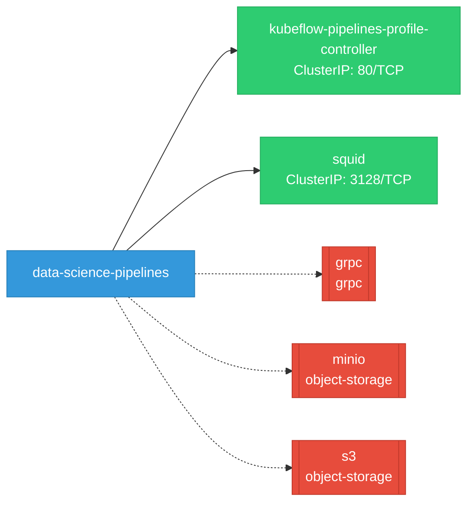
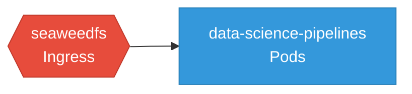

# data-science-pipelines: Network

## Service Map

### Services

| Name | Type | Ports | Source |
|------|------|-------|--------|
| kubeflow-pipelines-profile-controller | ClusterIP | 80/TCP | [`manifests/kustomize/base/installs/multi-user/pipelines-profile-controller/service.yaml`](https://github.com/kubeflow/data-science-pipelines/blob/1e2007f4374655ad9e06fdcfb68a36d0a6fc2d0f/manifests/kustomize/base/installs/multi-user/pipelines-profile-controller/service.yaml) |
| squid | ClusterIP | 3128/TCP | [`.github/resources/squid/manifests/service.yaml`](https://github.com/kubeflow/data-science-pipelines/blob/1e2007f4374655ad9e06fdcfb68a36d0a6fc2d0f/.github/resources/squid/manifests/service.yaml) |

### Ingress / Routing

| Kind | Name | Hosts | Paths | TLS | Source |
|------|------|-------|-------|-----|--------|
| DestinationRule | rbac-inferred |  |  | no | [`rbac/kubeflow-metacontroller`](https://github.com/kubeflow/data-science-pipelines/blob/1e2007f4374655ad9e06fdcfb68a36d0a6fc2d0f/rbac/kubeflow-metacontroller) |
| Route | ml-pipeline-ui |  |  | yes | [`manifests/kustomize/env/openshift/base/route.yaml`](https://github.com/kubeflow/data-science-pipelines/blob/1e2007f4374655ad9e06fdcfb68a36d0a6fc2d0f/manifests/kustomize/env/openshift/base/route.yaml) |

### Network Policies

| Name | Policy Types | Source |
|------|-------------|--------|
| seaweedfs | Ingress | [`manifests/kustomize/third-party/seaweedfs/base/seaweedfs/seaweedfs-networkpolicy.yaml`](https://github.com/kubeflow/data-science-pipelines/blob/1e2007f4374655ad9e06fdcfb68a36d0a6fc2d0f/manifests/kustomize/third-party/seaweedfs/base/seaweedfs/seaweedfs-networkpolicy.yaml) |

## Network Policy Graph

Visual representation of NetworkPolicy rules. Ingress rules show what traffic is allowed into pods, egress rules show what traffic is allowed out.

