# data-science-pipelines: RBAC

ServiceAccount bindings, roles, and resource permissions.

## RBAC Overview

This component defines a large RBAC surface (341 diagram lines). The graph below groups roles by permission scope.

```mermaid
graph LR
    classDef wide fill:#e74c3c,stroke:#c0392b,color:#fff
    classDef medium fill:#f39c12,stroke:#d68910,color:#fff
    classDef narrow fill:#2ecc71,stroke:#27ae60,color:#fff
    classDef subject fill:#3498db,stroke:#2980b9,color:#fff

    subgraph wide["Wide Scope (>30 resources)"]
    aggregate_to_kubeflow_pipelines_edit["aggregate-to-kubeflow-pipelines-edit\n13 resources\n!! wildcard"]:::wide
    application_manager_role["application-manager-role\n2 resources\n!! wildcard"]:::wide
    pipeline_runner["pipeline-runner\n16 resources\n!! wildcard"]:::wide
    proxy_agent_runner["proxy-agent-runner\n1 resources\n!! wildcard"]:::wide
    end
    subgraph med["Medium Scope (10-30)"]
    kubeflow_metacontroller["kubeflow-metacontroller\n12 resources"]:::medium
    end
    subgraph nar["Narrow Scope (<10)"]
    aggregate_to_kubeflow_pipelines_view["aggregate-to-kubeflow-pipelines-view\n7 resources"]:::narrow
    kubeflow_pipelines_cache_deployer_clusterrole["kubeflow-pipelines-cache-deployer-clusterrole\n4 resources"]:::narrow
    kubeflow_pipelines_cache_deployer_clusterrole["kubeflow-pipelines-cache-deployer-clusterrole"]:::narrow
    kubeflow_pipelines_cache_role["kubeflow-pipelines-cache-role\n3 resources"]:::narrow
    kubeflow_pipelines_edit["kubeflow-pipelines-edit"]:::narrow
    kubeflow_pipelines_metadata_writer_role["kubeflow-pipelines-metadata-writer-role\n3 resources"]:::narrow
    kubeflow_pipelines_view["kubeflow-pipelines-view"]:::narrow
    ml_pipeline["ml-pipeline\n8 resources"]:::narrow
    ml_pipeline_persistenceagent_role["ml-pipeline-persistenceagent-role\n5 resources"]:::narrow
    ml_pipeline_scheduledworkflow_role["ml-pipeline-scheduledworkflow-role\n5 resources"]:::narrow
    ml_pipeline_ui["ml-pipeline-ui\n5 resources"]:::narrow
    ml_pipeline_viewer_controller_role["ml-pipeline-viewer-controller-role\n4 resources"]:::narrow
    kubeflow_pipelines_cache_deployer_role["kubeflow-pipelines-cache-deployer-role\n1 resources"]:::narrow
    kubeflow_pipelines_cache_deployer_role["kubeflow-pipelines-cache-deployer-role"]:::narrow
    kubeflow_pipelines_cache_role["kubeflow-pipelines-cache-role\n3 resources"]:::narrow
    kubeflow_pipelines_metadata_writer_role["kubeflow-pipelines-metadata-writer-role\n3 resources"]:::narrow
    kubeflow_pipelines_public["kubeflow-pipelines-public\n1 resources"]:::narrow
    ml_pipeline["ml-pipeline\n8 resources"]:::narrow
    ml_pipeline_persistenceagent_role["ml-pipeline-persistenceagent-role\n5 resources"]:::narrow
    ml_pipeline_scheduledworkflow_role["ml-pipeline-scheduledworkflow-role\n5 resources"]:::narrow
    ml_pipeline_ui["ml-pipeline-ui\n7 resources"]:::narrow
    ml_pipeline_viewer_controller_role["ml-pipeline-viewer-controller-role\n4 resources"]:::narrow
    end

    subj_kubeflow_pipelines_cache["kubeflow-pipelines-cache\nServiceAccount"]:::subject
    subj_kubeflow_pipelines_cache -->|binds| kubeflow_pipelines_cache_role
    subj_kubeflow_pipelines_cache_deployer_sa["kubeflow-pipelines-cache-deployer-sa\nServiceAccount"]:::subject
    subj_kubeflow_pipelines_cache_deployer_sa -->|binds| kubeflow_pipelines_cache_deployer_clusterrole
    subj_kubeflow_pipelines_metadata_writer["kubeflow-pipelines-metadata-writer\nServiceAccount"]:::subject
    subj_kubeflow_pipelines_metadata_writer -->|binds| kubeflow_pipelines_metadata_writer_role
    subj_meta_controller_service["meta-controller-service\nServiceAccount"]:::subject
    subj_meta_controller_service -->|binds| kubeflow_metacontroller
    subj_ml_pipeline["ml-pipeline\nServiceAccount"]:::subject
    subj_ml_pipeline -->|binds| ml_pipeline
    subj_ml_pipeline_persistenceagent["ml-pipeline-persistenceagent\nServiceAccount"]:::subject
    subj_ml_pipeline_persistenceagent -->|binds| ml_pipeline_persistenceagent_role
    subj_ml_pipeline_scheduledworkflow["ml-pipeline-scheduledworkflow\nServiceAccount"]:::subject
    subj_ml_pipeline_scheduledworkflow -->|binds| ml_pipeline_scheduledworkflow_role
    subj_ml_pipeline_ui["ml-pipeline-ui\nServiceAccount"]:::subject
    subj_ml_pipeline_ui -->|binds| ml_pipeline_ui
    subj_ml_pipeline_viewer_crd_service_account["ml-pipeline-viewer-crd-service-account\nServiceAccount"]:::subject
    subj_ml_pipeline_viewer_crd_service_account -->|binds| ml_pipeline_viewer_controller_role
    subj_application["application\nServiceAccount"]:::subject
    subj_application -->|binds| application_manager_role
    subj_kubeflow_pipelines_cache -->|binds| kubeflow_pipelines_cache_role
    subj_kubeflow_pipelines_cache_deployer_sa -->|binds| kubeflow_pipelines_cache_deployer_role
    subj_kubeflow_pipelines_metadata_writer -->|binds| kubeflow_pipelines_metadata_writer_role
    subj_system_authenticated["system:authenticated\nGroup"]:::subject
    subj_system_authenticated -->|binds| kubeflow_pipelines_public
    subj_ml_pipeline -->|binds| ml_pipeline
    subj_ml_pipeline_persistenceagent -->|binds| ml_pipeline_persistenceagent_role
    subj_ml_pipeline_scheduledworkflow -->|binds| ml_pipeline_scheduledworkflow_role
    subj_ml_pipeline_ui -->|binds| ml_pipeline_ui
    subj_ml_pipeline_viewer_crd_service_account -->|binds| ml_pipeline_viewer_controller_role
    subj_pipeline_runner["pipeline-runner\nServiceAccount"]:::subject
    subj_pipeline_runner -->|binds| pipeline_runner
    subj_proxy_agent_runner["proxy-agent-runner\nServiceAccount"]:::subject
    subj_proxy_agent_runner -->|binds| proxy_agent_runner
```

## Bindings

Subject-to-role mappings defining who has access to what.

| Binding | Type | Role | Subject |
|---------|------|------|---------|
| kubeflow-pipelines-cache-binding | ClusterRoleBinding | kubeflow-pipelines-cache-role | ServiceAccount/kubeflow-pipelines-cache |
| kubeflow-pipelines-cache-deployer-clusterrolebinding | ClusterRoleBinding | kubeflow-pipelines-cache-deployer-clusterrole | ServiceAccount/kubeflow-pipelines-cache-deployer-sa |
| kubeflow-pipelines-metadata-writer-binding | ClusterRoleBinding | kubeflow-pipelines-metadata-writer-role | ServiceAccount/kubeflow-pipelines-metadata-writer |
| meta-controller-cluster-role-binding | ClusterRoleBinding | kubeflow-metacontroller | ServiceAccount/meta-controller-service |
| ml-pipeline | ClusterRoleBinding | ml-pipeline | ServiceAccount/ml-pipeline |
| ml-pipeline-persistenceagent-binding | ClusterRoleBinding | ml-pipeline-persistenceagent-role | ServiceAccount/ml-pipeline-persistenceagent |
| ml-pipeline-scheduledworkflow-binding | ClusterRoleBinding | ml-pipeline-scheduledworkflow-role | ServiceAccount/ml-pipeline-scheduledworkflow |
| ml-pipeline-ui | ClusterRoleBinding | ml-pipeline-ui | ServiceAccount/ml-pipeline-ui |
| ml-pipeline-viewer-crd-binding | ClusterRoleBinding | ml-pipeline-viewer-controller-role | ServiceAccount/ml-pipeline-viewer-crd-service-account |
| application-manager-rolebinding | RoleBinding | application-manager-role | ServiceAccount/application |
| kubeflow-pipelines-cache-binding | RoleBinding | kubeflow-pipelines-cache-role | ServiceAccount/kubeflow-pipelines-cache |
| kubeflow-pipelines-cache-deployer-rolebinding | RoleBinding | kubeflow-pipelines-cache-deployer-role | ServiceAccount/kubeflow-pipelines-cache-deployer-sa |
| kubeflow-pipelines-metadata-writer-binding | RoleBinding | kubeflow-pipelines-metadata-writer-role | ServiceAccount/kubeflow-pipelines-metadata-writer |
| kubeflow-pipelines-public | RoleBinding | kubeflow-pipelines-public | Group/system:authenticated |
| ml-pipeline | RoleBinding | ml-pipeline | ServiceAccount/ml-pipeline |
| ml-pipeline-persistenceagent-binding | RoleBinding | ml-pipeline-persistenceagent-role | ServiceAccount/ml-pipeline-persistenceagent |
| ml-pipeline-scheduledworkflow-binding | RoleBinding | ml-pipeline-scheduledworkflow-role | ServiceAccount/ml-pipeline-scheduledworkflow |
| ml-pipeline-ui | RoleBinding | ml-pipeline-ui | ServiceAccount/ml-pipeline-ui |
| ml-pipeline-viewer-crd-binding | RoleBinding | ml-pipeline-viewer-controller-role | ServiceAccount/ml-pipeline-viewer-crd-service-account |
| pipeline-runner-binding | RoleBinding | pipeline-runner | ServiceAccount/pipeline-runner |
| proxy-agent-runner | RoleBinding | proxy-agent-runner | ServiceAccount/proxy-agent-runner |

## Role Details

Per-rule breakdown of API groups, resources, and verbs for each role.

| Role | Kind | API Groups | Resources | Verbs |
|------|------|------------|-----------|-------|
| aggregate-to-kubeflow-pipelines-edit | ClusterRole |  | pipelines, pipelineversions | create, delete, update |
| aggregate-to-kubeflow-pipelines-edit | ClusterRole |  | experiments | archive, create, delete, unarchive |
| aggregate-to-kubeflow-pipelines-edit | ClusterRole |  | runs | archive, create, delete, retry, terminate, unarchive, reportMetrics, readArtifact |
| aggregate-to-kubeflow-pipelines-edit | ClusterRole |  | jobs | create, delete, disable, enable |
| aggregate-to-kubeflow-pipelines-edit | ClusterRole |  | scheduledworkflows | * |
| aggregate-to-kubeflow-pipelines-edit | ClusterRole |  | cronworkflows, cronworkflows/finalizers, workflows, workflows/finalizers, workfloweventbindings, workflowtemplates, workflowtaskresults | * |
| aggregate-to-kubeflow-pipelines-view | ClusterRole |  | pipelines, pipelineversions, experiments, jobs | get, list |
| aggregate-to-kubeflow-pipelines-view | ClusterRole |  | runs | get, list, readArtifact |
| aggregate-to-kubeflow-pipelines-view | ClusterRole |  | viewers | create, get, delete |
| aggregate-to-kubeflow-pipelines-view | ClusterRole |  | visualizations | create |
| kubeflow-metacontroller | ClusterRole |  | namespaces | get, list, watch, update |
| kubeflow-metacontroller | ClusterRole |  | namespaces/status | get, list, watch, update, patch |
| kubeflow-metacontroller | ClusterRole |  | secrets, configmaps | get, list, watch, create, update, patch, delete |
| kubeflow-metacontroller | ClusterRole |  | deployments | get, list, watch, create, update, patch, delete |
| kubeflow-metacontroller | ClusterRole |  | services | get, list, watch, create, update, patch, delete |
| kubeflow-metacontroller | ClusterRole |  | destinationrules | get, list, watch, create, update, patch, delete |
| kubeflow-metacontroller | ClusterRole |  | authorizationpolicies | get, list, watch, create, update, patch, delete |
| kubeflow-metacontroller | ClusterRole |  | compositecontrollers, controllerrevisions, decoratorcontrollers | get, list, watch |
| kubeflow-metacontroller | ClusterRole |  | events | create, patch |
| kubeflow-pipelines-cache-deployer-clusterrole | ClusterRole |  | certificatesigningrequests, certificatesigningrequests/approval | create, delete, get, update |
| kubeflow-pipelines-cache-deployer-clusterrole | ClusterRole |  | mutatingwebhookconfigurations | create, delete, get, list, patch |
| kubeflow-pipelines-cache-deployer-clusterrole | ClusterRole |  | signers | approve |
| kubeflow-pipelines-cache-role | ClusterRole |  | pods | get, list, watch, update, patch |
| kubeflow-pipelines-cache-role | ClusterRole |  | configmaps | get |
| kubeflow-pipelines-cache-role | ClusterRole |  | workflows | get, list, watch, update, patch |
| kubeflow-pipelines-metadata-writer-role | ClusterRole |  | pods | get, list, watch, update, patch |
| kubeflow-pipelines-metadata-writer-role | ClusterRole |  | configmaps | get |
| kubeflow-pipelines-metadata-writer-role | ClusterRole |  | workflows | get, list, watch, update, patch |
| ml-pipeline | ClusterRole |  | pods, pods/log | get, list, delete |
| ml-pipeline | ClusterRole |  | workflows | create, get, list, watch, update, patch, delete |
| ml-pipeline | ClusterRole |  | scheduledworkflows | create, get, list, update, patch, delete |
| ml-pipeline | ClusterRole |  | scheduledworkflows/finalizers | update |
| ml-pipeline | ClusterRole |  | pipelines | get, list, watch |
| ml-pipeline | ClusterRole |  | subjectaccessreviews | create |
| ml-pipeline | ClusterRole |  | tokenreviews | create |
| ml-pipeline-persistenceagent-role | ClusterRole |  | workflows | get, list, watch |
| ml-pipeline-persistenceagent-role | ClusterRole |  | scheduledworkflows | get, list, watch |
| ml-pipeline-persistenceagent-role | ClusterRole |  | scheduledworkflows, workflows | report |
| ml-pipeline-persistenceagent-role | ClusterRole |  | runs | reportMetrics, readArtifact |
| ml-pipeline-scheduledworkflow-role | ClusterRole |  | workflows | create, get, list, watch, update, patch, delete |
| ml-pipeline-scheduledworkflow-role | ClusterRole |  | runs | create |
| ml-pipeline-scheduledworkflow-role | ClusterRole |  | scheduledworkflows, scheduledworkflows/finalizers | create, get, list, watch, update, patch, delete |
| ml-pipeline-scheduledworkflow-role | ClusterRole |  | events | create, patch |
| ml-pipeline-ui | ClusterRole |  | pods, pods/log | get |
| ml-pipeline-ui | ClusterRole |  | events | list |
| ml-pipeline-ui | ClusterRole |  | viewers | create, get, list, watch, delete |
| ml-pipeline-ui | ClusterRole |  | workflows | get, list |
| ml-pipeline-viewer-controller-role | ClusterRole |  | deployments, services | create, get, list, watch, update, patch, delete |
| ml-pipeline-viewer-controller-role | ClusterRole |  | viewers, viewers/finalizers | create, get, list, watch, update, patch, delete |
| application-manager-role | Role |  | * | get, list, update, patch, watch |
| application-manager-role | Role |  | * | * |
| kubeflow-pipelines-cache-deployer-role | Role |  | secrets | create, delete, get, patch, list |
| kubeflow-pipelines-cache-role | Role |  | pods | get, list, watch, update, patch |
| kubeflow-pipelines-cache-role | Role |  | configmaps | get |
| kubeflow-pipelines-cache-role | Role |  | workflows | get, list, watch, update, patch |
| kubeflow-pipelines-metadata-writer-role | Role |  | pods | get, list, watch, update, patch |
| kubeflow-pipelines-metadata-writer-role | Role |  | configmaps | get |
| kubeflow-pipelines-metadata-writer-role | Role |  | workflows | get, list, watch, update, patch |
| kubeflow-pipelines-public | Role |  | configmaps | get, list, watch |
| ml-pipeline | Role |  | pods, pods/log | get, list, delete |
| ml-pipeline | Role |  | workflows | create, get, list, watch, update, patch, delete |
| ml-pipeline | Role |  | scheduledworkflows | create, get, list, update, patch, delete |
| ml-pipeline | Role |  | scheduledworkflows/finalizers | update |
| ml-pipeline | Role |  | pipelines | get, list, watch |
| ml-pipeline | Role |  | subjectaccessreviews | create |
| ml-pipeline | Role |  | tokenreviews | create |
| ml-pipeline-persistenceagent-role | Role |  | workflows | get, list, watch |
| ml-pipeline-persistenceagent-role | Role |  | scheduledworkflows | get, list, watch |
| ml-pipeline-persistenceagent-role | Role |  | scheduledworkflows, workflows | report |
| ml-pipeline-persistenceagent-role | Role |  | runs | reportMetrics, readArtifact |
| ml-pipeline-scheduledworkflow-role | Role |  | workflows | create, get, list, watch, update, patch, delete |
| ml-pipeline-scheduledworkflow-role | Role |  | scheduledworkflows, scheduledworkflows/finalizers | create, get, list, watch, update, patch, delete |
| ml-pipeline-scheduledworkflow-role | Role |  | runs | create |
| ml-pipeline-scheduledworkflow-role | Role |  | events | create, patch |
| ml-pipeline-ui | Role |  | pods, pods/log | get |
| ml-pipeline-ui | Role |  | events | list |
| ml-pipeline-ui | Role |  | secrets, configmaps | get, list |
| ml-pipeline-ui | Role |  | viewers | create, get, list, watch, delete |
| ml-pipeline-ui | Role |  | workflows | get, list |
| ml-pipeline-viewer-controller-role | Role |  | deployments, services | create, get, list, watch, update, patch, delete |
| ml-pipeline-viewer-controller-role | Role |  | viewers, viewers/finalizers | create, get, list, watch, update, patch, delete |
| pipeline-runner | Role |  | secrets | get |
| pipeline-runner | Role |  | configmaps | get, watch, list |
| pipeline-runner | Role |  | persistentvolumes, persistentvolumeclaims | * |
| pipeline-runner | Role |  | volumesnapshots | create, delete, get |
| pipeline-runner | Role |  | workflows | get, list, watch, update, patch |
| pipeline-runner | Role |  | pods, pods/exec, pods/log, services | * |
| pipeline-runner | Role |  | deployments, replicasets | * |
| pipeline-runner | Role |  | * | * |
| pipeline-runner | Role |  | jobs | * |
| pipeline-runner | Role |  | seldondeployments | * |
| pipeline-runner | Role |  | workflowtaskresults | create, patch |
| proxy-agent-runner | Role |  | configmaps | * |

### Cluster Roles

| Name | Resources | Verbs | Source |
|------|-----------|-------|--------|
| aggregate-to-kubeflow-pipelines-edit | pipelines, pipelineversions | create, delete, update | [`manifests/kustomize/base/installs/multi-user/view-edit-cluster-roles.yaml`](https://github.com/kubeflow/data-science-pipelines/blob/1e2007f4374655ad9e06fdcfb68a36d0a6fc2d0f/manifests/kustomize/base/installs/multi-user/view-edit-cluster-roles.yaml) |
| aggregate-to-kubeflow-pipelines-edit | experiments | archive, create, delete, unarchive | [`manifests/kustomize/base/installs/multi-user/view-edit-cluster-roles.yaml`](https://github.com/kubeflow/data-science-pipelines/blob/1e2007f4374655ad9e06fdcfb68a36d0a6fc2d0f/manifests/kustomize/base/installs/multi-user/view-edit-cluster-roles.yaml) |
| aggregate-to-kubeflow-pipelines-edit | runs | archive, create, delete, retry, terminate, unarchive, reportMetrics, readArtifact | [`manifests/kustomize/base/installs/multi-user/view-edit-cluster-roles.yaml`](https://github.com/kubeflow/data-science-pipelines/blob/1e2007f4374655ad9e06fdcfb68a36d0a6fc2d0f/manifests/kustomize/base/installs/multi-user/view-edit-cluster-roles.yaml) |
| aggregate-to-kubeflow-pipelines-edit | jobs | create, delete, disable, enable | [`manifests/kustomize/base/installs/multi-user/view-edit-cluster-roles.yaml`](https://github.com/kubeflow/data-science-pipelines/blob/1e2007f4374655ad9e06fdcfb68a36d0a6fc2d0f/manifests/kustomize/base/installs/multi-user/view-edit-cluster-roles.yaml) |
| aggregate-to-kubeflow-pipelines-edit | scheduledworkflows | * | [`manifests/kustomize/base/installs/multi-user/view-edit-cluster-roles.yaml`](https://github.com/kubeflow/data-science-pipelines/blob/1e2007f4374655ad9e06fdcfb68a36d0a6fc2d0f/manifests/kustomize/base/installs/multi-user/view-edit-cluster-roles.yaml) |
| aggregate-to-kubeflow-pipelines-edit | cronworkflows, cronworkflows/finalizers, workflows, workflows/finalizers, workfloweventbindings, workflowtemplates, workflowtaskresults | * | [`manifests/kustomize/base/installs/multi-user/view-edit-cluster-roles.yaml`](https://github.com/kubeflow/data-science-pipelines/blob/1e2007f4374655ad9e06fdcfb68a36d0a6fc2d0f/manifests/kustomize/base/installs/multi-user/view-edit-cluster-roles.yaml) |
| aggregate-to-kubeflow-pipelines-view | pipelines, pipelineversions, experiments, jobs | get, list | [`manifests/kustomize/base/installs/multi-user/view-edit-cluster-roles.yaml`](https://github.com/kubeflow/data-science-pipelines/blob/1e2007f4374655ad9e06fdcfb68a36d0a6fc2d0f/manifests/kustomize/base/installs/multi-user/view-edit-cluster-roles.yaml) |
| aggregate-to-kubeflow-pipelines-view | runs | get, list, readArtifact | [`manifests/kustomize/base/installs/multi-user/view-edit-cluster-roles.yaml`](https://github.com/kubeflow/data-science-pipelines/blob/1e2007f4374655ad9e06fdcfb68a36d0a6fc2d0f/manifests/kustomize/base/installs/multi-user/view-edit-cluster-roles.yaml) |
| aggregate-to-kubeflow-pipelines-view | viewers | create, get, delete | [`manifests/kustomize/base/installs/multi-user/view-edit-cluster-roles.yaml`](https://github.com/kubeflow/data-science-pipelines/blob/1e2007f4374655ad9e06fdcfb68a36d0a6fc2d0f/manifests/kustomize/base/installs/multi-user/view-edit-cluster-roles.yaml) |
| aggregate-to-kubeflow-pipelines-view | visualizations | create | [`manifests/kustomize/base/installs/multi-user/view-edit-cluster-roles.yaml`](https://github.com/kubeflow/data-science-pipelines/blob/1e2007f4374655ad9e06fdcfb68a36d0a6fc2d0f/manifests/kustomize/base/installs/multi-user/view-edit-cluster-roles.yaml) |
| kubeflow-metacontroller | namespaces | get, list, watch, update | [`manifests/kustomize/third-party/metacontroller/base/cluster-role.yaml`](https://github.com/kubeflow/data-science-pipelines/blob/1e2007f4374655ad9e06fdcfb68a36d0a6fc2d0f/manifests/kustomize/third-party/metacontroller/base/cluster-role.yaml) |
| kubeflow-metacontroller | namespaces/status | get, list, watch, update, patch | [`manifests/kustomize/third-party/metacontroller/base/cluster-role.yaml`](https://github.com/kubeflow/data-science-pipelines/blob/1e2007f4374655ad9e06fdcfb68a36d0a6fc2d0f/manifests/kustomize/third-party/metacontroller/base/cluster-role.yaml) |
| kubeflow-metacontroller | secrets, configmaps | get, list, watch, create, update, patch, delete | [`manifests/kustomize/third-party/metacontroller/base/cluster-role.yaml`](https://github.com/kubeflow/data-science-pipelines/blob/1e2007f4374655ad9e06fdcfb68a36d0a6fc2d0f/manifests/kustomize/third-party/metacontroller/base/cluster-role.yaml) |
| kubeflow-metacontroller | deployments | get, list, watch, create, update, patch, delete | [`manifests/kustomize/third-party/metacontroller/base/cluster-role.yaml`](https://github.com/kubeflow/data-science-pipelines/blob/1e2007f4374655ad9e06fdcfb68a36d0a6fc2d0f/manifests/kustomize/third-party/metacontroller/base/cluster-role.yaml) |
| kubeflow-metacontroller | services | get, list, watch, create, update, patch, delete | [`manifests/kustomize/third-party/metacontroller/base/cluster-role.yaml`](https://github.com/kubeflow/data-science-pipelines/blob/1e2007f4374655ad9e06fdcfb68a36d0a6fc2d0f/manifests/kustomize/third-party/metacontroller/base/cluster-role.yaml) |
| kubeflow-metacontroller | destinationrules | get, list, watch, create, update, patch, delete | [`manifests/kustomize/third-party/metacontroller/base/cluster-role.yaml`](https://github.com/kubeflow/data-science-pipelines/blob/1e2007f4374655ad9e06fdcfb68a36d0a6fc2d0f/manifests/kustomize/third-party/metacontroller/base/cluster-role.yaml) |
| kubeflow-metacontroller | authorizationpolicies | get, list, watch, create, update, patch, delete | [`manifests/kustomize/third-party/metacontroller/base/cluster-role.yaml`](https://github.com/kubeflow/data-science-pipelines/blob/1e2007f4374655ad9e06fdcfb68a36d0a6fc2d0f/manifests/kustomize/third-party/metacontroller/base/cluster-role.yaml) |
| kubeflow-metacontroller | compositecontrollers, controllerrevisions, decoratorcontrollers | get, list, watch | [`manifests/kustomize/third-party/metacontroller/base/cluster-role.yaml`](https://github.com/kubeflow/data-science-pipelines/blob/1e2007f4374655ad9e06fdcfb68a36d0a6fc2d0f/manifests/kustomize/third-party/metacontroller/base/cluster-role.yaml) |
| kubeflow-metacontroller | events | create, patch | [`manifests/kustomize/third-party/metacontroller/base/cluster-role.yaml`](https://github.com/kubeflow/data-science-pipelines/blob/1e2007f4374655ad9e06fdcfb68a36d0a6fc2d0f/manifests/kustomize/third-party/metacontroller/base/cluster-role.yaml) |
| kubeflow-pipelines-cache-deployer-clusterrole | certificatesigningrequests, certificatesigningrequests/approval | create, delete, get, update | [`manifests/kustomize/base/cache-deployer/cluster-scoped/cache-deployer-clusterrole.yaml`](https://github.com/kubeflow/data-science-pipelines/blob/1e2007f4374655ad9e06fdcfb68a36d0a6fc2d0f/manifests/kustomize/base/cache-deployer/cluster-scoped/cache-deployer-clusterrole.yaml) |
| kubeflow-pipelines-cache-deployer-clusterrole | mutatingwebhookconfigurations | create, delete, get, list, patch | [`manifests/kustomize/base/cache-deployer/cluster-scoped/cache-deployer-clusterrole.yaml`](https://github.com/kubeflow/data-science-pipelines/blob/1e2007f4374655ad9e06fdcfb68a36d0a6fc2d0f/manifests/kustomize/base/cache-deployer/cluster-scoped/cache-deployer-clusterrole.yaml) |
| kubeflow-pipelines-cache-deployer-clusterrole | signers | approve | [`manifests/kustomize/base/cache-deployer/cluster-scoped/cache-deployer-clusterrole.yaml`](https://github.com/kubeflow/data-science-pipelines/blob/1e2007f4374655ad9e06fdcfb68a36d0a6fc2d0f/manifests/kustomize/base/cache-deployer/cluster-scoped/cache-deployer-clusterrole.yaml) |
| kubeflow-pipelines-cache-role | pods | get, list, watch, update, patch | [`manifests/kustomize/base/installs/multi-user/cache/cluster-role.yaml`](https://github.com/kubeflow/data-science-pipelines/blob/1e2007f4374655ad9e06fdcfb68a36d0a6fc2d0f/manifests/kustomize/base/installs/multi-user/cache/cluster-role.yaml) |
| kubeflow-pipelines-cache-role | configmaps | get | [`manifests/kustomize/base/installs/multi-user/cache/cluster-role.yaml`](https://github.com/kubeflow/data-science-pipelines/blob/1e2007f4374655ad9e06fdcfb68a36d0a6fc2d0f/manifests/kustomize/base/installs/multi-user/cache/cluster-role.yaml) |
| kubeflow-pipelines-cache-role | workflows | get, list, watch, update, patch | [`manifests/kustomize/base/installs/multi-user/cache/cluster-role.yaml`](https://github.com/kubeflow/data-science-pipelines/blob/1e2007f4374655ad9e06fdcfb68a36d0a6fc2d0f/manifests/kustomize/base/installs/multi-user/cache/cluster-role.yaml) |
| kubeflow-pipelines-metadata-writer-role | pods | get, list, watch, update, patch | [`manifests/kustomize/base/installs/multi-user/metadata-writer/cluster-role.yaml`](https://github.com/kubeflow/data-science-pipelines/blob/1e2007f4374655ad9e06fdcfb68a36d0a6fc2d0f/manifests/kustomize/base/installs/multi-user/metadata-writer/cluster-role.yaml) |
| kubeflow-pipelines-metadata-writer-role | configmaps | get | [`manifests/kustomize/base/installs/multi-user/metadata-writer/cluster-role.yaml`](https://github.com/kubeflow/data-science-pipelines/blob/1e2007f4374655ad9e06fdcfb68a36d0a6fc2d0f/manifests/kustomize/base/installs/multi-user/metadata-writer/cluster-role.yaml) |
| kubeflow-pipelines-metadata-writer-role | workflows | get, list, watch, update, patch | [`manifests/kustomize/base/installs/multi-user/metadata-writer/cluster-role.yaml`](https://github.com/kubeflow/data-science-pipelines/blob/1e2007f4374655ad9e06fdcfb68a36d0a6fc2d0f/manifests/kustomize/base/installs/multi-user/metadata-writer/cluster-role.yaml) |
| ml-pipeline | pods, pods/log | get, list, delete | [`manifests/kustomize/base/installs/multi-user/api-service/cluster-role.yaml`](https://github.com/kubeflow/data-science-pipelines/blob/1e2007f4374655ad9e06fdcfb68a36d0a6fc2d0f/manifests/kustomize/base/installs/multi-user/api-service/cluster-role.yaml) |
| ml-pipeline | workflows | create, get, list, watch, update, patch, delete | [`manifests/kustomize/base/installs/multi-user/api-service/cluster-role.yaml`](https://github.com/kubeflow/data-science-pipelines/blob/1e2007f4374655ad9e06fdcfb68a36d0a6fc2d0f/manifests/kustomize/base/installs/multi-user/api-service/cluster-role.yaml) |
| ml-pipeline | scheduledworkflows | create, get, list, update, patch, delete | [`manifests/kustomize/base/installs/multi-user/api-service/cluster-role.yaml`](https://github.com/kubeflow/data-science-pipelines/blob/1e2007f4374655ad9e06fdcfb68a36d0a6fc2d0f/manifests/kustomize/base/installs/multi-user/api-service/cluster-role.yaml) |
| ml-pipeline | scheduledworkflows/finalizers | update | [`manifests/kustomize/base/installs/multi-user/api-service/cluster-role.yaml`](https://github.com/kubeflow/data-science-pipelines/blob/1e2007f4374655ad9e06fdcfb68a36d0a6fc2d0f/manifests/kustomize/base/installs/multi-user/api-service/cluster-role.yaml) |
| ml-pipeline | pipelines | get, list, watch | [`manifests/kustomize/base/installs/multi-user/api-service/cluster-role.yaml`](https://github.com/kubeflow/data-science-pipelines/blob/1e2007f4374655ad9e06fdcfb68a36d0a6fc2d0f/manifests/kustomize/base/installs/multi-user/api-service/cluster-role.yaml) |
| ml-pipeline | subjectaccessreviews | create | [`manifests/kustomize/base/installs/multi-user/api-service/cluster-role.yaml`](https://github.com/kubeflow/data-science-pipelines/blob/1e2007f4374655ad9e06fdcfb68a36d0a6fc2d0f/manifests/kustomize/base/installs/multi-user/api-service/cluster-role.yaml) |
| ml-pipeline | tokenreviews | create | [`manifests/kustomize/base/installs/multi-user/api-service/cluster-role.yaml`](https://github.com/kubeflow/data-science-pipelines/blob/1e2007f4374655ad9e06fdcfb68a36d0a6fc2d0f/manifests/kustomize/base/installs/multi-user/api-service/cluster-role.yaml) |
| ml-pipeline-persistenceagent-role | workflows | get, list, watch | [`manifests/kustomize/base/installs/multi-user/persistence-agent/cluster-role.yaml`](https://github.com/kubeflow/data-science-pipelines/blob/1e2007f4374655ad9e06fdcfb68a36d0a6fc2d0f/manifests/kustomize/base/installs/multi-user/persistence-agent/cluster-role.yaml) |
| ml-pipeline-persistenceagent-role | scheduledworkflows | get, list, watch | [`manifests/kustomize/base/installs/multi-user/persistence-agent/cluster-role.yaml`](https://github.com/kubeflow/data-science-pipelines/blob/1e2007f4374655ad9e06fdcfb68a36d0a6fc2d0f/manifests/kustomize/base/installs/multi-user/persistence-agent/cluster-role.yaml) |
| ml-pipeline-persistenceagent-role | scheduledworkflows, workflows | report | [`manifests/kustomize/base/installs/multi-user/persistence-agent/cluster-role.yaml`](https://github.com/kubeflow/data-science-pipelines/blob/1e2007f4374655ad9e06fdcfb68a36d0a6fc2d0f/manifests/kustomize/base/installs/multi-user/persistence-agent/cluster-role.yaml) |
| ml-pipeline-persistenceagent-role | runs | reportMetrics, readArtifact | [`manifests/kustomize/base/installs/multi-user/persistence-agent/cluster-role.yaml`](https://github.com/kubeflow/data-science-pipelines/blob/1e2007f4374655ad9e06fdcfb68a36d0a6fc2d0f/manifests/kustomize/base/installs/multi-user/persistence-agent/cluster-role.yaml) |
| ml-pipeline-scheduledworkflow-role | workflows | create, get, list, watch, update, patch, delete | [`manifests/kustomize/base/installs/multi-user/scheduled-workflow/cluster-role.yaml`](https://github.com/kubeflow/data-science-pipelines/blob/1e2007f4374655ad9e06fdcfb68a36d0a6fc2d0f/manifests/kustomize/base/installs/multi-user/scheduled-workflow/cluster-role.yaml) |
| ml-pipeline-scheduledworkflow-role | runs | create | [`manifests/kustomize/base/installs/multi-user/scheduled-workflow/cluster-role.yaml`](https://github.com/kubeflow/data-science-pipelines/blob/1e2007f4374655ad9e06fdcfb68a36d0a6fc2d0f/manifests/kustomize/base/installs/multi-user/scheduled-workflow/cluster-role.yaml) |
| ml-pipeline-scheduledworkflow-role | scheduledworkflows, scheduledworkflows/finalizers | create, get, list, watch, update, patch, delete | [`manifests/kustomize/base/installs/multi-user/scheduled-workflow/cluster-role.yaml`](https://github.com/kubeflow/data-science-pipelines/blob/1e2007f4374655ad9e06fdcfb68a36d0a6fc2d0f/manifests/kustomize/base/installs/multi-user/scheduled-workflow/cluster-role.yaml) |
| ml-pipeline-scheduledworkflow-role | events | create, patch | [`manifests/kustomize/base/installs/multi-user/scheduled-workflow/cluster-role.yaml`](https://github.com/kubeflow/data-science-pipelines/blob/1e2007f4374655ad9e06fdcfb68a36d0a6fc2d0f/manifests/kustomize/base/installs/multi-user/scheduled-workflow/cluster-role.yaml) |
| ml-pipeline-ui | pods, pods/log | get | [`manifests/kustomize/base/installs/multi-user/pipelines-ui/cluster-role.yaml`](https://github.com/kubeflow/data-science-pipelines/blob/1e2007f4374655ad9e06fdcfb68a36d0a6fc2d0f/manifests/kustomize/base/installs/multi-user/pipelines-ui/cluster-role.yaml) |
| ml-pipeline-ui | events | list | [`manifests/kustomize/base/installs/multi-user/pipelines-ui/cluster-role.yaml`](https://github.com/kubeflow/data-science-pipelines/blob/1e2007f4374655ad9e06fdcfb68a36d0a6fc2d0f/manifests/kustomize/base/installs/multi-user/pipelines-ui/cluster-role.yaml) |
| ml-pipeline-ui | viewers | create, get, list, watch, delete | [`manifests/kustomize/base/installs/multi-user/pipelines-ui/cluster-role.yaml`](https://github.com/kubeflow/data-science-pipelines/blob/1e2007f4374655ad9e06fdcfb68a36d0a6fc2d0f/manifests/kustomize/base/installs/multi-user/pipelines-ui/cluster-role.yaml) |
| ml-pipeline-ui | workflows | get, list | [`manifests/kustomize/base/installs/multi-user/pipelines-ui/cluster-role.yaml`](https://github.com/kubeflow/data-science-pipelines/blob/1e2007f4374655ad9e06fdcfb68a36d0a6fc2d0f/manifests/kustomize/base/installs/multi-user/pipelines-ui/cluster-role.yaml) |
| ml-pipeline-viewer-controller-role | deployments, services | create, get, list, watch, update, patch, delete | [`manifests/kustomize/base/installs/multi-user/viewer-controller/cluster-role.yaml`](https://github.com/kubeflow/data-science-pipelines/blob/1e2007f4374655ad9e06fdcfb68a36d0a6fc2d0f/manifests/kustomize/base/installs/multi-user/viewer-controller/cluster-role.yaml) |
| ml-pipeline-viewer-controller-role | viewers, viewers/finalizers | create, get, list, watch, update, patch, delete | [`manifests/kustomize/base/installs/multi-user/viewer-controller/cluster-role.yaml`](https://github.com/kubeflow/data-science-pipelines/blob/1e2007f4374655ad9e06fdcfb68a36d0a6fc2d0f/manifests/kustomize/base/installs/multi-user/viewer-controller/cluster-role.yaml) |

