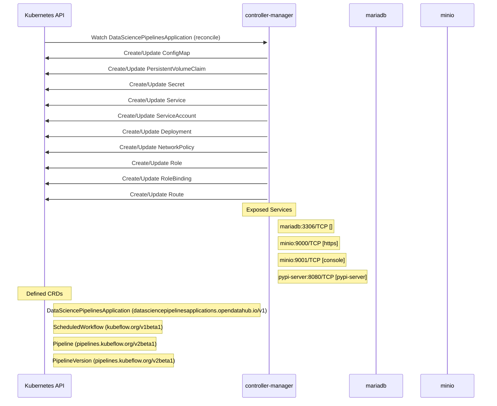

# data-science-pipelines-operator: Dataflow

## Controller Watches

Kubernetes resources this controller monitors for changes. Each watch triggers reconciliation when the watched resource is created, updated, or deleted.

| Type | GVK | Source |
|------|-----|--------|
| For | api/v1/DataSciencePipelinesApplication | [`controllers/dspipeline_controller.go:799`](https://github.com/opendatahub-io/data-science-pipelines-operator/blob/2817bdf9613754dac1961dffa738007de3b398da/controllers/dspipeline_controller.go#L799) |
| Owns | /v1/ConfigMap | [`controllers/dspipeline_controller.go:802`](https://github.com/opendatahub-io/data-science-pipelines-operator/blob/2817bdf9613754dac1961dffa738007de3b398da/controllers/dspipeline_controller.go#L802) |
| Owns | /v1/PersistentVolumeClaim | [`controllers/dspipeline_controller.go:805`](https://github.com/opendatahub-io/data-science-pipelines-operator/blob/2817bdf9613754dac1961dffa738007de3b398da/controllers/dspipeline_controller.go#L805) |
| Owns | /v1/Secret | [`controllers/dspipeline_controller.go:801`](https://github.com/opendatahub-io/data-science-pipelines-operator/blob/2817bdf9613754dac1961dffa738007de3b398da/controllers/dspipeline_controller.go#L801) |
| Owns | /v1/Service | [`controllers/dspipeline_controller.go:803`](https://github.com/opendatahub-io/data-science-pipelines-operator/blob/2817bdf9613754dac1961dffa738007de3b398da/controllers/dspipeline_controller.go#L803) |
| Owns | /v1/ServiceAccount | [`controllers/dspipeline_controller.go:804`](https://github.com/opendatahub-io/data-science-pipelines-operator/blob/2817bdf9613754dac1961dffa738007de3b398da/controllers/dspipeline_controller.go#L804) |
| Owns | apps/v1/Deployment | [`controllers/dspipeline_controller.go:800`](https://github.com/opendatahub-io/data-science-pipelines-operator/blob/2817bdf9613754dac1961dffa738007de3b398da/controllers/dspipeline_controller.go#L800) |
| Owns | networking.k8s.io/v1/NetworkPolicy | [`controllers/dspipeline_controller.go:806`](https://github.com/opendatahub-io/data-science-pipelines-operator/blob/2817bdf9613754dac1961dffa738007de3b398da/controllers/dspipeline_controller.go#L806) |
| Owns | rbac.authorization.k8s.io/v1/Role | [`controllers/dspipeline_controller.go:807`](https://github.com/opendatahub-io/data-science-pipelines-operator/blob/2817bdf9613754dac1961dffa738007de3b398da/controllers/dspipeline_controller.go#L807) |
| Owns | rbac.authorization.k8s.io/v1/RoleBinding | [`controllers/dspipeline_controller.go:808`](https://github.com/opendatahub-io/data-science-pipelines-operator/blob/2817bdf9613754dac1961dffa738007de3b398da/controllers/dspipeline_controller.go#L808) |
| Owns | route/v1/Route | [`controllers/dspipeline_controller.go:809`](https://github.com/opendatahub-io/data-science-pipelines-operator/blob/2817bdf9613754dac1961dffa738007de3b398da/controllers/dspipeline_controller.go#L809) |

## Reconciliation Flow

How the controller interacts with the Kubernetes API during reconciliation.

## Configuration

ConfigMaps and Helm values that control this component's runtime behavior.

### ConfigMaps

| Name | Data Keys | Source |
|------|-----------|--------|
| custom-ui-configmap | viewer-pod-template.json | [`config/samples/custom-configs/ui-configmap.yaml`](https://github.com/opendatahub-io/data-science-pipelines-operator/blob/2817bdf9613754dac1961dffa738007de3b398da/config/samples/custom-configs/ui-configmap.yaml) |
| custom-workflow-controller-configmap | artifactRepository, executor | [`config/samples/custom-workflow-controller-config/custom-workflow-controller-configmap.yaml`](https://github.com/opendatahub-io/data-science-pipelines-operator/blob/2817bdf9613754dac1961dffa738007de3b398da/config/samples/custom-workflow-controller-config/custom-workflow-controller-configmap.yaml) |
| ds-pipeline-server-config-testdsp0 | config.json | [`controllers/testdata/declarative/case_0/expected/created/configmap_server_config.yaml`](https://github.com/opendatahub-io/data-science-pipelines-operator/blob/2817bdf9613754dac1961dffa738007de3b398da/controllers/testdata/declarative/case_0/expected/created/configmap_server_config.yaml) |
| ds-pipeline-server-config-testdspa | config.json | [`controllers/testdata/declarative/case_7/expected/created/configmap_server_config.yaml`](https://github.com/opendatahub-io/data-science-pipelines-operator/blob/2817bdf9613754dac1961dffa738007de3b398da/controllers/testdata/declarative/case_7/expected/created/configmap_server_config.yaml) |
| dsp-trusted-ca-testdsp5 | testcabundleconfigmapkey5.crt | [`controllers/testdata/declarative/case_5/expected/created/configmap_dspa_trusted_ca.yaml`](https://github.com/opendatahub-io/data-science-pipelines-operator/blob/2817bdf9613754dac1961dffa738007de3b398da/controllers/testdata/declarative/case_5/expected/created/configmap_dspa_trusted_ca.yaml) |
| workflow-controller-configmap |  | [`config/argo/configmap.workflow-controller-configmap.yaml`](https://github.com/opendatahub-io/data-science-pipelines-operator/blob/2817bdf9613754dac1961dffa738007de3b398da/config/argo/configmap.workflow-controller-configmap.yaml) |

