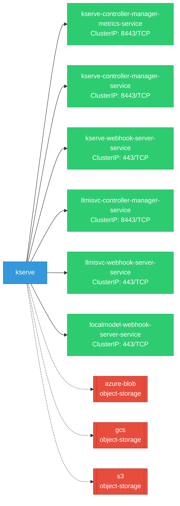

# kserve: Network

## Service Map

### Services

| Name | Type | Ports | Source |
|------|------|-------|--------|
| kserve-controller-manager-metrics-service | ClusterIP | 8443/TCP | [`kustomize:config/overlays/all`](https://github.com/kserve/kserve/blob/d5aea2c6d8f2f2c8dcf22897e23e5d929cf654dd/kustomize:config/overlays/all) |
| kserve-controller-manager-service | ClusterIP | 8443/TCP | [`kustomize:config/overlays/all`](https://github.com/kserve/kserve/blob/d5aea2c6d8f2f2c8dcf22897e23e5d929cf654dd/kustomize:config/overlays/all) |
| kserve-webhook-server-service | ClusterIP | 443/TCP | [`kustomize:config/overlays/all`](https://github.com/kserve/kserve/blob/d5aea2c6d8f2f2c8dcf22897e23e5d929cf654dd/kustomize:config/overlays/all) |
| llmisvc-controller-manager-service | ClusterIP | 8443/TCP | [`kustomize:config/overlays/all`](https://github.com/kserve/kserve/blob/d5aea2c6d8f2f2c8dcf22897e23e5d929cf654dd/kustomize:config/overlays/all) |
| llmisvc-webhook-server-service | ClusterIP | 443/TCP | [`kustomize:config/overlays/all`](https://github.com/kserve/kserve/blob/d5aea2c6d8f2f2c8dcf22897e23e5d929cf654dd/kustomize:config/overlays/all) |
| localmodel-webhook-server-service | ClusterIP | 443/TCP | [`kustomize:config/overlays/all`](https://github.com/kserve/kserve/blob/d5aea2c6d8f2f2c8dcf22897e23e5d929cf654dd/kustomize:config/overlays/all) |

### Ingress / Routing

| Kind | Name | Hosts | Paths | TLS | Source |
|------|------|-------|-------|-----|--------|
| HTTPRoute | rbac-inferred |  |  | no | [`rbac/kserve-manager-role`](https://github.com/kserve/kserve/blob/d5aea2c6d8f2f2c8dcf22897e23e5d929cf654dd/rbac/kserve-manager-role) |
| Ingress | rbac-inferred |  |  | no | [`rbac/kserve-manager-role`](https://github.com/kserve/kserve/blob/d5aea2c6d8f2f2c8dcf22897e23e5d929cf654dd/rbac/kserve-manager-role) |
| VirtualService | rbac-inferred |  |  | no | [`rbac/kserve-manager-role`](https://github.com/kserve/kserve/blob/d5aea2c6d8f2f2c8dcf22897e23e5d929cf654dd/rbac/kserve-manager-role) |

!!! warning "No Network Policies"
    No NetworkPolicy resources found. All pod-to-pod traffic is allowed by default.

