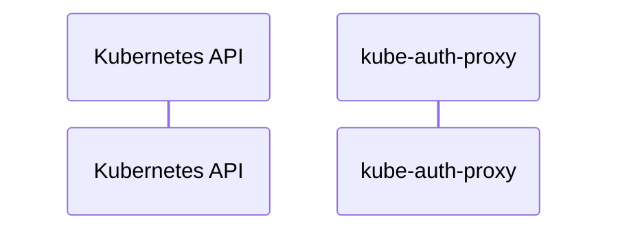

# kube-auth-proxy: Dataflow

## Controller Watches

Kubernetes resources this controller monitors for changes. Each watch triggers reconciliation when the watched resource is created, updated, or deleted.

No controller watches found.

## Reconciliation Flow

How the controller interacts with the Kubernetes API during reconciliation.

### HTTP Endpoints

| Method | Path | Source |
|--------|------|--------|
| * | / | [`kube-rbac-proxy/cmd/kube-rbac-proxy/app/kube-rbac-proxy.go:324`](https://github.com/opendatahub-io/kube-auth-proxy/blob/1ad41e6bbfbb259e69e16b10c8743acd24318a35/kube-rbac-proxy/cmd/kube-rbac-proxy/app/kube-rbac-proxy.go#L324) |

## Configuration

ConfigMaps and Helm values that control this component's runtime behavior.

### Helm

**Chart:** kubernetes v7.14.1

