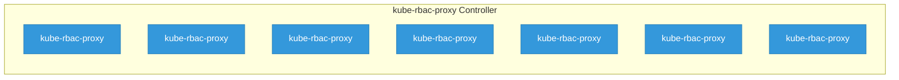

# kube-rbac-proxy

> **Architecture snapshot: 2026-04-24** (2026-04-24)

**Repository:** brancz/kube-rbac-proxy  
**Analyzer:** arch-analyzer 0.2.0  
**Extracted:** 2026-04-24T08:14:03Z

## Summary

| Metric | Count |
|--------|-------|
| CRDs | 0 |
| Deployments | 7 |
| Services | 1 |
| Secrets | 0 |
| Cluster Roles | 0 |
| Controller Watches | 0 |

## Component Architecture

CRDs, controllers, and owned Kubernetes resources.

### CRDs

No CRDs defined.

## Dependencies

### Key External Dependencies

| Module | Version |
|--------|---------|
| k8s.io/api | v0.35.4 |
| k8s.io/apimachinery | v0.35.4 |
| k8s.io/apiserver | v0.35.4 |
| k8s.io/client-go | v0.35.4 |

