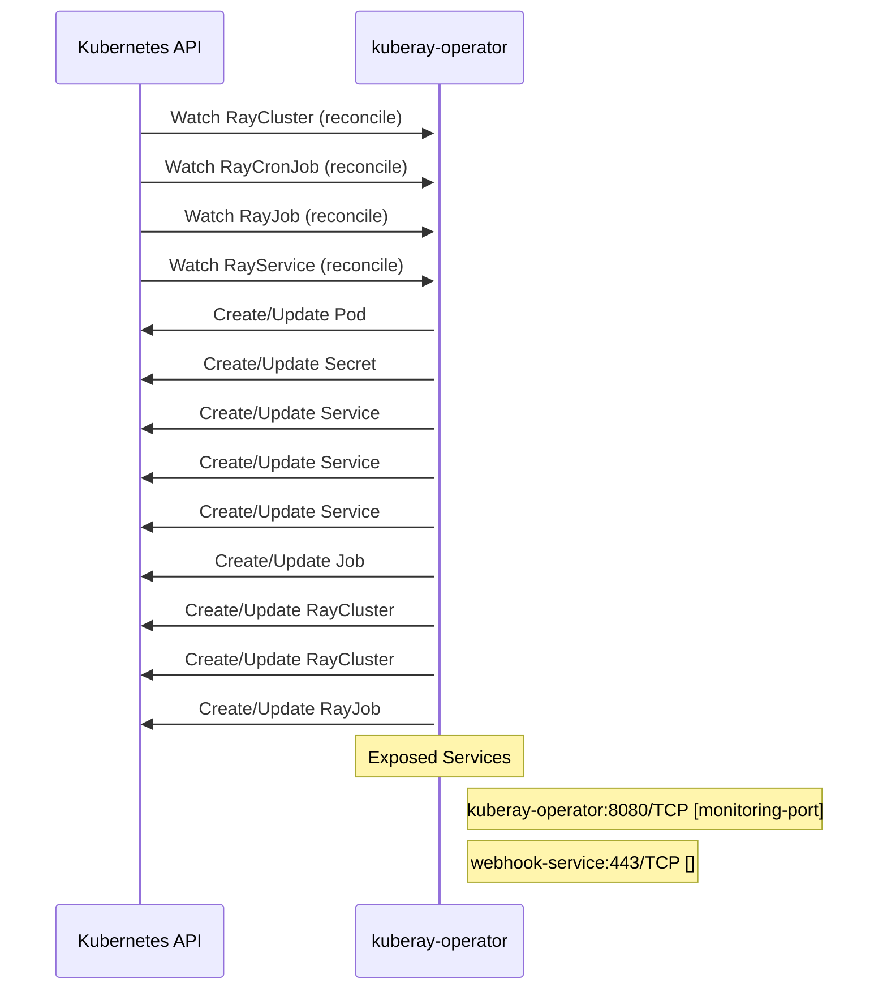

# kuberay: Dataflow

## Controller Watches

Kubernetes resources this controller monitors for changes. Each watch triggers reconciliation when the watched resource is created, updated, or deleted.

| Type | GVK | Source |
|------|-----|--------|
| For | ray/v1/RayCluster | [`ray-operator/controllers/ray/raycluster_controller.go:1526`](https://github.com/ray-project/kuberay/blob/acbf7e027447a2ca3057213fc4ebba83ac1547c7/ray-operator/controllers/ray/raycluster_controller.go#L1526) |
| For | ray/v1/RayCronJob | [`ray-operator/controllers/ray/raycronjob_controller.go:182`](https://github.com/ray-project/kuberay/blob/acbf7e027447a2ca3057213fc4ebba83ac1547c7/ray-operator/controllers/ray/raycronjob_controller.go#L182) |
| For | ray/v1/RayJob | [`ray-operator/controllers/ray/rayjob_controller.go:827`](https://github.com/ray-project/kuberay/blob/acbf7e027447a2ca3057213fc4ebba83ac1547c7/ray-operator/controllers/ray/rayjob_controller.go#L827) |
| For | ray/v1/RayService | [`ray-operator/controllers/ray/rayservice_controller.go:582`](https://github.com/ray-project/kuberay/blob/acbf7e027447a2ca3057213fc4ebba83ac1547c7/ray-operator/controllers/ray/rayservice_controller.go#L582) |
| Owns | /v1/Pod | [`ray-operator/controllers/ray/raycluster_controller.go:1531`](https://github.com/ray-project/kuberay/blob/acbf7e027447a2ca3057213fc4ebba83ac1547c7/ray-operator/controllers/ray/raycluster_controller.go#L1531) |
| Owns | /v1/Secret | [`ray-operator/controllers/ray/raycluster_controller.go:1533`](https://github.com/ray-project/kuberay/blob/acbf7e027447a2ca3057213fc4ebba83ac1547c7/ray-operator/controllers/ray/raycluster_controller.go#L1533) |
| Owns | /v1/Service | [`ray-operator/controllers/ray/rayjob_controller.go:829`](https://github.com/ray-project/kuberay/blob/acbf7e027447a2ca3057213fc4ebba83ac1547c7/ray-operator/controllers/ray/rayjob_controller.go#L829) |
| Owns | /v1/Service | [`ray-operator/controllers/ray/raycluster_controller.go:1532`](https://github.com/ray-project/kuberay/blob/acbf7e027447a2ca3057213fc4ebba83ac1547c7/ray-operator/controllers/ray/raycluster_controller.go#L1532) |
| Owns | /v1/Service | [`ray-operator/controllers/ray/rayservice_controller.go:588`](https://github.com/ray-project/kuberay/blob/acbf7e027447a2ca3057213fc4ebba83ac1547c7/ray-operator/controllers/ray/rayservice_controller.go#L588) |
| Owns | batch/v1/Job | [`ray-operator/controllers/ray/rayjob_controller.go:830`](https://github.com/ray-project/kuberay/blob/acbf7e027447a2ca3057213fc4ebba83ac1547c7/ray-operator/controllers/ray/rayjob_controller.go#L830) |
| Owns | ray/v1/RayCluster | [`ray-operator/controllers/ray/rayjob_controller.go:828`](https://github.com/ray-project/kuberay/blob/acbf7e027447a2ca3057213fc4ebba83ac1547c7/ray-operator/controllers/ray/rayjob_controller.go#L828) |
| Owns | ray/v1/RayCluster | [`ray-operator/controllers/ray/rayservice_controller.go:587`](https://github.com/ray-project/kuberay/blob/acbf7e027447a2ca3057213fc4ebba83ac1547c7/ray-operator/controllers/ray/rayservice_controller.go#L587) |
| Owns | ray/v1/RayJob | [`ray-operator/controllers/ray/raycronjob_controller.go:183`](https://github.com/ray-project/kuberay/blob/acbf7e027447a2ca3057213fc4ebba83ac1547c7/ray-operator/controllers/ray/raycronjob_controller.go#L183) |

## Reconciliation Flow

How the controller interacts with the Kubernetes API during reconciliation.

### Webhooks

| Name | Type | Path | Failure Policy | Service | Source |
|------|------|------|----------------|---------|--------|
| vraycluster.kb.io | validating | /validate-ray-io-v1-raycluster | fail |  | [`ray-operator/pkg/webhooks/v1/raycluster_webhook.go`](https://github.com/ray-project/kuberay/blob/acbf7e027447a2ca3057213fc4ebba83ac1547c7/ray-operator/pkg/webhooks/v1/raycluster_webhook.go) |
| vrayjob.kb.io | validating | /validate-ray-io-v1-rayjob | fail |  | [`ray-operator/pkg/webhooks/v1/rayjob_webhook.go`](https://github.com/ray-project/kuberay/blob/acbf7e027447a2ca3057213fc4ebba83ac1547c7/ray-operator/pkg/webhooks/v1/rayjob_webhook.go) |
| vrayservice.kb.io | validating | /validate-ray-io-v1-rayservice | fail |  | [`ray-operator/pkg/webhooks/v1/rayservice_webhook.go`](https://github.com/ray-project/kuberay/blob/acbf7e027447a2ca3057213fc4ebba83ac1547c7/ray-operator/pkg/webhooks/v1/rayservice_webhook.go) |

### HTTP Endpoints

| Method | Path | Source |
|--------|------|--------|
| * | / | [`experimental/cmd/main.go:111`](https://github.com/ray-project/kuberay/blob/acbf7e027447a2ca3057213fc4ebba83ac1547c7/experimental/cmd/main.go#L111) |
| GET | / | [`historyserver/pkg/historyserver/router.go:102`](https://github.com/ray-project/kuberay/blob/acbf7e027447a2ca3057213fc4ebba83ac1547c7/historyserver/pkg/historyserver/router.go#L102) |
| GET | / | [`historyserver/pkg/historyserver/router.go:64`](https://github.com/ray-project/kuberay/blob/acbf7e027447a2ca3057213fc4ebba83ac1547c7/historyserver/pkg/historyserver/router.go#L64) |
| GET | / | [`historyserver/pkg/historyserver/router.go:55`](https://github.com/ray-project/kuberay/blob/acbf7e027447a2ca3057213fc4ebba83ac1547c7/historyserver/pkg/historyserver/router.go#L55) |
| GET | /actors | [`historyserver/pkg/historyserver/router.go:277`](https://github.com/ray-project/kuberay/blob/acbf7e027447a2ca3057213fc4ebba83ac1547c7/historyserver/pkg/historyserver/router.go#L277) |
| GET | /actors/{single_actor:*} | [`historyserver/pkg/historyserver/router.go:285`](https://github.com/ray-project/kuberay/blob/acbf7e027447a2ca3057213fc4ebba83ac1547c7/historyserver/pkg/historyserver/router.go#L285) |
| * | /api/v1/namespaces/{namespace}/services/{service}/proxy | [`apiserversdk/proxy.go:64`](https://github.com/ray-project/kuberay/blob/acbf7e027447a2ca3057213fc4ebba83ac1547c7/apiserversdk/proxy.go#L64) |
| * | /api/v1/namespaces/{namespace}/services/{service}/proxy/ | [`apiserversdk/proxy.go:65`](https://github.com/ray-project/kuberay/blob/acbf7e027447a2ca3057213fc4ebba83ac1547c7/apiserversdk/proxy.go#L65) |
| * | /apis/ray.io/v1/ | [`apiserversdk/proxy.go:46`](https://github.com/ray-project/kuberay/blob/acbf7e027447a2ca3057213fc4ebba83ac1547c7/apiserversdk/proxy.go#L46) |
| GET | /cluster_status | [`historyserver/pkg/historyserver/router.go:111`](https://github.com/ray-project/kuberay/blob/acbf7e027447a2ca3057213fc4ebba83ac1547c7/historyserver/pkg/historyserver/router.go#L111) |
| POST | /events | [`historyserver/pkg/collector/eventcollector/eventcollector.go:91`](https://github.com/ray-project/kuberay/blob/acbf7e027447a2ca3057213fc4ebba83ac1547c7/historyserver/pkg/collector/eventcollector/eventcollector.go#L91) |
| GET | /grafana_health | [`historyserver/pkg/historyserver/router.go:114`](https://github.com/ray-project/kuberay/blob/acbf7e027447a2ca3057213fc4ebba83ac1547c7/historyserver/pkg/historyserver/router.go#L114) |
| GET | /jobs/ | [`historyserver/pkg/historyserver/router.go:121`](https://github.com/ray-project/kuberay/blob/acbf7e027447a2ca3057213fc4ebba83ac1547c7/historyserver/pkg/historyserver/router.go#L121) |
| GET | /jobs/{job_id} | [`historyserver/pkg/historyserver/router.go:125`](https://github.com/ray-project/kuberay/blob/acbf7e027447a2ca3057213fc4ebba83ac1547c7/historyserver/pkg/historyserver/router.go#L125) |
| * | /livez | [`historyserver/pkg/historyserver/router.go:262`](https://github.com/ray-project/kuberay/blob/acbf7e027447a2ca3057213fc4ebba83ac1547c7/historyserver/pkg/historyserver/router.go#L262) |
| GET | /prometheus_health | [`historyserver/pkg/historyserver/router.go:117`](https://github.com/ray-project/kuberay/blob/acbf7e027447a2ca3057213fc4ebba83ac1547c7/historyserver/pkg/historyserver/router.go#L117) |
| * | /readz | [`historyserver/pkg/historyserver/router.go:256`](https://github.com/ray-project/kuberay/blob/acbf7e027447a2ca3057213fc4ebba83ac1547c7/historyserver/pkg/historyserver/router.go#L256) |
| GET | /v0/cluster_metadata | [`historyserver/pkg/historyserver/router.go:130`](https://github.com/ray-project/kuberay/blob/acbf7e027447a2ca3057213fc4ebba83ac1547c7/historyserver/pkg/historyserver/router.go#L130) |
| GET | /v0/logs | [`historyserver/pkg/historyserver/router.go:134`](https://github.com/ray-project/kuberay/blob/acbf7e027447a2ca3057213fc4ebba83ac1547c7/historyserver/pkg/historyserver/router.go#L134) |
| GET | /v0/logs/{media_type} | [`historyserver/pkg/historyserver/router.go:140`](https://github.com/ray-project/kuberay/blob/acbf7e027447a2ca3057213fc4ebba83ac1547c7/historyserver/pkg/historyserver/router.go#L140) |
| GET | /v0/tasks | [`historyserver/pkg/historyserver/router.go:163`](https://github.com/ray-project/kuberay/blob/acbf7e027447a2ca3057213fc4ebba83ac1547c7/historyserver/pkg/historyserver/router.go#L163) |
| GET | /v0/tasks/summarize | [`historyserver/pkg/historyserver/router.go:174`](https://github.com/ray-project/kuberay/blob/acbf7e027447a2ca3057213fc4ebba83ac1547c7/historyserver/pkg/historyserver/router.go#L174) |
| GET | /v0/tasks/timeline | [`historyserver/pkg/historyserver/router.go:182`](https://github.com/ray-project/kuberay/blob/acbf7e027447a2ca3057213fc4ebba83ac1547c7/historyserver/pkg/historyserver/router.go#L182) |
| GET | /{namespace}/{name}/{session} | [`historyserver/pkg/historyserver/router.go:297`](https://github.com/ray-project/kuberay/blob/acbf7e027447a2ca3057213fc4ebba83ac1547c7/historyserver/pkg/historyserver/router.go#L297) |
| GET | /{node_id} | [`historyserver/pkg/historyserver/router.go:91`](https://github.com/ray-project/kuberay/blob/acbf7e027447a2ca3057213fc4ebba83ac1547c7/historyserver/pkg/historyserver/router.go#L91) |
| GET | /{subpath:*} | [`historyserver/pkg/historyserver/router.go:191`](https://github.com/ray-project/kuberay/blob/acbf7e027447a2ca3057213fc4ebba83ac1547c7/historyserver/pkg/historyserver/router.go#L191) |
| * | GET /api/v1/namespaces/{namespace}/events | [`apiserversdk/proxy.go:47`](https://github.com/ray-project/kuberay/blob/acbf7e027447a2ca3057213fc4ebba83ac1547c7/apiserversdk/proxy.go#L47) |
| * | POST /apis/ray.io/v1/namespaces/{namespace}/rayclusters | [`apiserversdk/proxy.go:53`](https://github.com/ray-project/kuberay/blob/acbf7e027447a2ca3057213fc4ebba83ac1547c7/apiserversdk/proxy.go#L53) |
| * | POST /apis/ray.io/v1/namespaces/{namespace}/rayjobs | [`apiserversdk/proxy.go:55`](https://github.com/ray-project/kuberay/blob/acbf7e027447a2ca3057213fc4ebba83ac1547c7/apiserversdk/proxy.go#L55) |
| * | POST /apis/ray.io/v1/namespaces/{namespace}/rayservices | [`apiserversdk/proxy.go:57`](https://github.com/ray-project/kuberay/blob/acbf7e027447a2ca3057213fc4ebba83ac1547c7/apiserversdk/proxy.go#L57) |
| * | PUT /apis/ray.io/v1/namespaces/{namespace}/rayclusters/{name} | [`apiserversdk/proxy.go:54`](https://github.com/ray-project/kuberay/blob/acbf7e027447a2ca3057213fc4ebba83ac1547c7/apiserversdk/proxy.go#L54) |
| * | PUT /apis/ray.io/v1/namespaces/{namespace}/rayjobs/{name} | [`apiserversdk/proxy.go:56`](https://github.com/ray-project/kuberay/blob/acbf7e027447a2ca3057213fc4ebba83ac1547c7/apiserversdk/proxy.go#L56) |
| * | PUT /apis/ray.io/v1/namespaces/{namespace}/rayservices/{name} | [`apiserversdk/proxy.go:58`](https://github.com/ray-project/kuberay/blob/acbf7e027447a2ca3057213fc4ebba83ac1547c7/apiserversdk/proxy.go#L58) |

## Configuration

ConfigMaps and Helm values that control this component's runtime behavior.

### Helm

**Chart:** kuberay-apiserver v1.1.0

