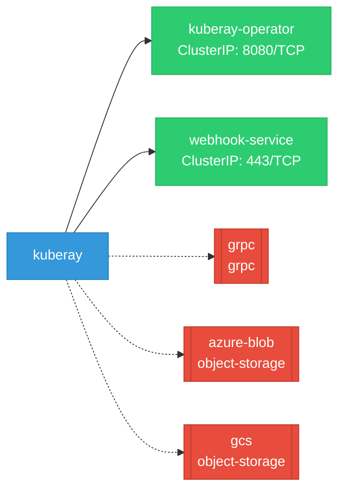

# kuberay: Network

## Service Map

### Services

| Name | Type | Ports | Source |
|------|------|-------|--------|
| kuberay-operator | ClusterIP | 8080/TCP | [`ray-operator/config/manager/service.yaml`](https://github.com/ray-project/kuberay/blob/acbf7e027447a2ca3057213fc4ebba83ac1547c7/ray-operator/config/manager/service.yaml) |
| webhook-service | ClusterIP | 443/TCP | [`ray-operator/config/webhook/service.yaml`](https://github.com/ray-project/kuberay/blob/acbf7e027447a2ca3057213fc4ebba83ac1547c7/ray-operator/config/webhook/service.yaml) |

!!! warning "No Network Policies"
    No NetworkPolicy resources found. All pod-to-pod traffic is allowed by default.

