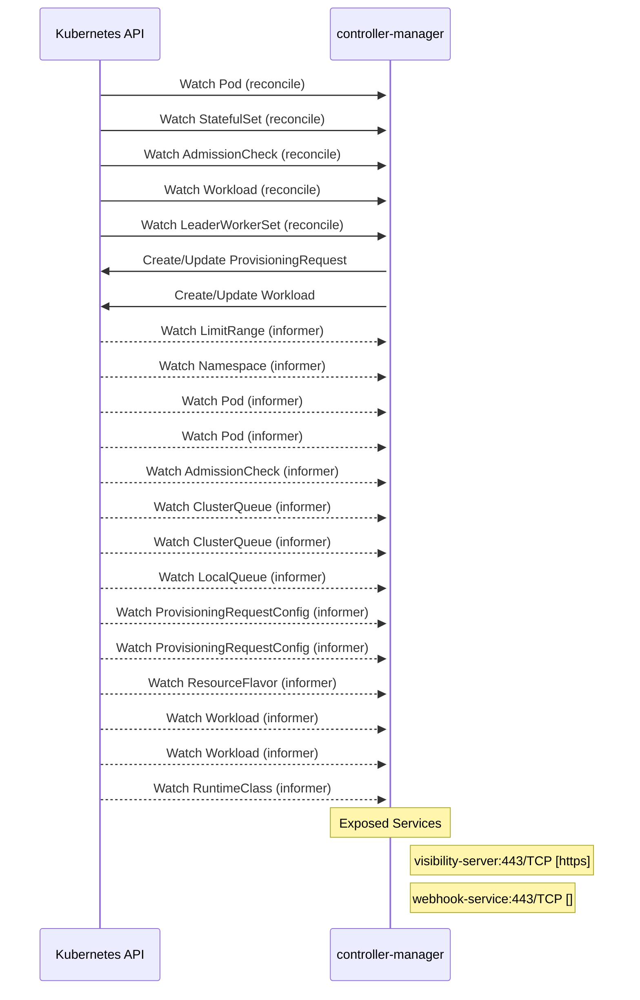

# kueue: Dataflow

## Controller Watches

Kubernetes resources this controller monitors for changes. Each watch triggers reconciliation when the watched resource is created, updated, or deleted.

| Type | GVK | Source |
|------|-----|--------|
| For | /v1/Pod | [`pkg/controller/jobs/leaderworkerset/leaderworkerset_pod_reconciler.go:57`](https://github.com/opendatahub-io/kueue/blob/97024bd289d2cc5c9369b40d9f3483ab1483143d/pkg/controller/jobs/leaderworkerset/leaderworkerset_pod_reconciler.go#L57) |
| For | apps/v1/StatefulSet | [`pkg/controller/jobs/statefulset/statefulset_reconciler.go:145`](https://github.com/opendatahub-io/kueue/blob/97024bd289d2cc5c9369b40d9f3483ab1483143d/pkg/controller/jobs/statefulset/statefulset_reconciler.go#L145) |
| For | kueue/v1beta1/AdmissionCheck | [`pkg/controller/admissionchecks/provisioning/controller.go:849`](https://github.com/opendatahub-io/kueue/blob/97024bd289d2cc5c9369b40d9f3483ab1483143d/pkg/controller/admissionchecks/provisioning/controller.go#L849) |
| For | kueue/v1beta1/Workload | [`pkg/controller/admissionchecks/provisioning/controller.go:830`](https://github.com/opendatahub-io/kueue/blob/97024bd289d2cc5c9369b40d9f3483ab1483143d/pkg/controller/admissionchecks/provisioning/controller.go#L830) |
| For | leaderworkerset/v1/LeaderWorkerSet | [`pkg/controller/jobs/leaderworkerset/leaderworkerset_reconciler.go:83`](https://github.com/opendatahub-io/kueue/blob/97024bd289d2cc5c9369b40d9f3483ab1483143d/pkg/controller/jobs/leaderworkerset/leaderworkerset_reconciler.go#L83) |
| Owns | autoscaling.x-k8s.io/v1beta1/ProvisioningRequest | [`pkg/controller/admissionchecks/provisioning/controller.go:831`](https://github.com/opendatahub-io/kueue/blob/97024bd289d2cc5c9369b40d9f3483ab1483143d/pkg/controller/admissionchecks/provisioning/controller.go#L831) |
| Owns | kueue/v1beta1/Workload | [`pkg/controller/jobframework/reconciler.go:1281`](https://github.com/opendatahub-io/kueue/blob/97024bd289d2cc5c9369b40d9f3483ab1483143d/pkg/controller/jobframework/reconciler.go#L1281) |
| Watches | /v1/LimitRange | [`pkg/controller/core/workload_controller.go:797`](https://github.com/opendatahub-io/kueue/blob/97024bd289d2cc5c9369b40d9f3483ab1483143d/pkg/controller/core/workload_controller.go#L797) |
| Watches | /v1/Namespace | [`pkg/controller/core/clusterqueue_controller.go:591`](https://github.com/opendatahub-io/kueue/blob/97024bd289d2cc5c9369b40d9f3483ab1483143d/pkg/controller/core/clusterqueue_controller.go#L591) |
| Watches | /v1/Pod | [`pkg/controller/jobs/pod/pod_controller.go:131`](https://github.com/opendatahub-io/kueue/blob/97024bd289d2cc5c9369b40d9f3483ab1483143d/pkg/controller/jobs/pod/pod_controller.go#L131) |
| Watches | /v1/Pod | [`pkg/controller/jobs/statefulset/statefulset_reconciler.go:147`](https://github.com/opendatahub-io/kueue/blob/97024bd289d2cc5c9369b40d9f3483ab1483143d/pkg/controller/jobs/statefulset/statefulset_reconciler.go#L147) |
| Watches | kueue/v1beta1/AdmissionCheck | [`pkg/controller/admissionchecks/provisioning/controller.go:832`](https://github.com/opendatahub-io/kueue/blob/97024bd289d2cc5c9369b40d9f3483ab1483143d/pkg/controller/admissionchecks/provisioning/controller.go#L832) |
| Watches | kueue/v1beta1/ClusterQueue | [`pkg/controller/core/workload_controller.go:799`](https://github.com/opendatahub-io/kueue/blob/97024bd289d2cc5c9369b40d9f3483ab1483143d/pkg/controller/core/workload_controller.go#L799) |
| Watches | kueue/v1beta1/ClusterQueue | [`pkg/controller/core/localqueue_controller.go:338`](https://github.com/opendatahub-io/kueue/blob/97024bd289d2cc5c9369b40d9f3483ab1483143d/pkg/controller/core/localqueue_controller.go#L338) |
| Watches | kueue/v1beta1/LocalQueue | [`pkg/controller/core/workload_controller.go:800`](https://github.com/opendatahub-io/kueue/blob/97024bd289d2cc5c9369b40d9f3483ab1483143d/pkg/controller/core/workload_controller.go#L800) |
| Watches | kueue/v1beta1/ProvisioningRequestConfig | [`pkg/controller/admissionchecks/provisioning/controller.go:833`](https://github.com/opendatahub-io/kueue/blob/97024bd289d2cc5c9369b40d9f3483ab1483143d/pkg/controller/admissionchecks/provisioning/controller.go#L833) |
| Watches | kueue/v1beta1/ProvisioningRequestConfig | [`pkg/controller/admissionchecks/provisioning/controller.go:850`](https://github.com/opendatahub-io/kueue/blob/97024bd289d2cc5c9369b40d9f3483ab1483143d/pkg/controller/admissionchecks/provisioning/controller.go#L850) |
| Watches | kueue/v1beta1/ResourceFlavor | [`pkg/controller/tas/topology_controller.go:82`](https://github.com/opendatahub-io/kueue/blob/97024bd289d2cc5c9369b40d9f3483ab1483143d/pkg/controller/tas/topology_controller.go#L82) |
| Watches | kueue/v1beta1/Workload | [`pkg/controller/jobs/job/job_controller.go:88`](https://github.com/opendatahub-io/kueue/blob/97024bd289d2cc5c9369b40d9f3483ab1483143d/pkg/controller/jobs/job/job_controller.go#L88) |
| Watches | kueue/v1beta1/Workload | [`pkg/controller/jobs/pod/pod_controller.go:132`](https://github.com/opendatahub-io/kueue/blob/97024bd289d2cc5c9369b40d9f3483ab1483143d/pkg/controller/jobs/pod/pod_controller.go#L132) |
| Watches | node/v1/RuntimeClass | [`pkg/controller/core/workload_controller.go:798`](https://github.com/opendatahub-io/kueue/blob/97024bd289d2cc5c9369b40d9f3483ab1483143d/pkg/controller/core/workload_controller.go#L798) |

## Reconciliation Flow

How the controller interacts with the Kubernetes API during reconciliation.

### Webhooks

| Name | Type | Path | Failure Policy | Service | Source |
|------|------|------|----------------|---------|--------|
| mdeployment.kb.io | mutating |  |  |  | [`config/rhoai/mutating_webhook_patch.yaml`](https://github.com/opendatahub-io/kueue/blob/97024bd289d2cc5c9369b40d9f3483ab1483143d/config/rhoai/mutating_webhook_patch.yaml) |
| mjob.kb.io | mutating |  |  |  | [`config/rhoai/mutating_webhook_patch.yaml`](https://github.com/opendatahub-io/kueue/blob/97024bd289d2cc5c9369b40d9f3483ab1483143d/config/rhoai/mutating_webhook_patch.yaml) |
| mpod.kb.io | mutating |  |  |  | [`config/rhoai/mutating_webhook_patch.yaml`](https://github.com/opendatahub-io/kueue/blob/97024bd289d2cc5c9369b40d9f3483ab1483143d/config/rhoai/mutating_webhook_patch.yaml) |
| vcohort.kb.io | validating | /validate-kueue-x-k8s-io-v1alpha1-cohort | fail |  | [`pkg/webhooks/cohort_webhook.go`](https://github.com/opendatahub-io/kueue/blob/97024bd289d2cc5c9369b40d9f3483ab1483143d/pkg/webhooks/cohort_webhook.go) |
| vdeployment.kb.io | validating |  |  |  | [`config/rhoai/validating_webhook_patch.yaml`](https://github.com/opendatahub-io/kueue/blob/97024bd289d2cc5c9369b40d9f3483ab1483143d/config/rhoai/validating_webhook_patch.yaml) |
| vjob.kb.io | validating |  |  |  | [`config/rhoai/validating_webhook_patch.yaml`](https://github.com/opendatahub-io/kueue/blob/97024bd289d2cc5c9369b40d9f3483ab1483143d/config/rhoai/validating_webhook_patch.yaml) |
| vpod.kb.io | validating |  |  |  | [`config/rhoai/validating_webhook_patch.yaml`](https://github.com/opendatahub-io/kueue/blob/97024bd289d2cc5c9369b40d9f3483ab1483143d/config/rhoai/validating_webhook_patch.yaml) |

### HTTP Endpoints

| Method | Path | Source |
|--------|------|--------|
| GET | /ws/cluster-queue/:cluster_queue_name | [`cmd/experimental/kueue-viz/backend/handlers/handlers.go:41`](https://github.com/opendatahub-io/kueue/blob/97024bd289d2cc5c9369b40d9f3483ab1483143d/cmd/experimental/kueue-viz/backend/handlers/handlers.go#L41) |
| GET | /ws/cluster-queues | [`cmd/experimental/kueue-viz/backend/handlers/handlers.go:40`](https://github.com/opendatahub-io/kueue/blob/97024bd289d2cc5c9369b40d9f3483ab1483143d/cmd/experimental/kueue-viz/backend/handlers/handlers.go#L40) |
| GET | /ws/cohort/:cohort_name | [`cmd/experimental/kueue-viz/backend/handlers/handlers.go:45`](https://github.com/opendatahub-io/kueue/blob/97024bd289d2cc5c9369b40d9f3483ab1483143d/cmd/experimental/kueue-viz/backend/handlers/handlers.go#L45) |
| GET | /ws/cohorts | [`cmd/experimental/kueue-viz/backend/handlers/handlers.go:44`](https://github.com/opendatahub-io/kueue/blob/97024bd289d2cc5c9369b40d9f3483ab1483143d/cmd/experimental/kueue-viz/backend/handlers/handlers.go#L44) |
| GET | /ws/local-queue/:namespace/:queue_name | [`cmd/experimental/kueue-viz/backend/handlers/handlers.go:36`](https://github.com/opendatahub-io/kueue/blob/97024bd289d2cc5c9369b40d9f3483ab1483143d/cmd/experimental/kueue-viz/backend/handlers/handlers.go#L36) |
| GET | /ws/local-queue/:namespace/:queue_name/workloads | [`cmd/experimental/kueue-viz/backend/handlers/handlers.go:37`](https://github.com/opendatahub-io/kueue/blob/97024bd289d2cc5c9369b40d9f3483ab1483143d/cmd/experimental/kueue-viz/backend/handlers/handlers.go#L37) |
| GET | /ws/local-queues | [`cmd/experimental/kueue-viz/backend/handlers/handlers.go:35`](https://github.com/opendatahub-io/kueue/blob/97024bd289d2cc5c9369b40d9f3483ab1483143d/cmd/experimental/kueue-viz/backend/handlers/handlers.go#L35) |
| GET | /ws/resource-flavor/:flavor_name | [`cmd/experimental/kueue-viz/backend/handlers/handlers.go:49`](https://github.com/opendatahub-io/kueue/blob/97024bd289d2cc5c9369b40d9f3483ab1483143d/cmd/experimental/kueue-viz/backend/handlers/handlers.go#L49) |
| GET | /ws/resource-flavors | [`cmd/experimental/kueue-viz/backend/handlers/handlers.go:48`](https://github.com/opendatahub-io/kueue/blob/97024bd289d2cc5c9369b40d9f3483ab1483143d/cmd/experimental/kueue-viz/backend/handlers/handlers.go#L48) |
| GET | /ws/workload/:namespace/:workload_name | [`cmd/experimental/kueue-viz/backend/handlers/handlers.go:31`](https://github.com/opendatahub-io/kueue/blob/97024bd289d2cc5c9369b40d9f3483ab1483143d/cmd/experimental/kueue-viz/backend/handlers/handlers.go#L31) |
| GET | /ws/workload/:namespace/:workload_name/events | [`cmd/experimental/kueue-viz/backend/handlers/handlers.go:32`](https://github.com/opendatahub-io/kueue/blob/97024bd289d2cc5c9369b40d9f3483ab1483143d/cmd/experimental/kueue-viz/backend/handlers/handlers.go#L32) |
| GET | /ws/workloads | [`cmd/experimental/kueue-viz/backend/handlers/handlers.go:28`](https://github.com/opendatahub-io/kueue/blob/97024bd289d2cc5c9369b40d9f3483ab1483143d/cmd/experimental/kueue-viz/backend/handlers/handlers.go#L28) |
| GET | /ws/workloads/dashboard | [`cmd/experimental/kueue-viz/backend/handlers/handlers.go:29`](https://github.com/opendatahub-io/kueue/blob/97024bd289d2cc5c9369b40d9f3483ab1483143d/cmd/experimental/kueue-viz/backend/handlers/handlers.go#L29) |

## Configuration

ConfigMaps and Helm values that control this component's runtime behavior.

### Helm

**Chart:** kueue v0.1.0

