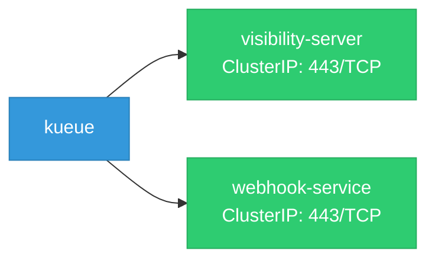

# kueue: Network

## Service Map

### Services

| Name | Type | Ports | Source |
|------|------|-------|--------|
| visibility-server | ClusterIP | 443/TCP | [`config/components/visibility/service.yaml`](https://github.com/opendatahub-io/kueue/blob/97024bd289d2cc5c9369b40d9f3483ab1483143d/config/components/visibility/service.yaml) |
| webhook-service | ClusterIP | 443/TCP | [`config/components/webhook/service.yaml`](https://github.com/opendatahub-io/kueue/blob/97024bd289d2cc5c9369b40d9f3483ab1483143d/config/components/webhook/service.yaml) |

!!! warning "No Network Policies"
    No NetworkPolicy resources found. All pod-to-pod traffic is allowed by default.

