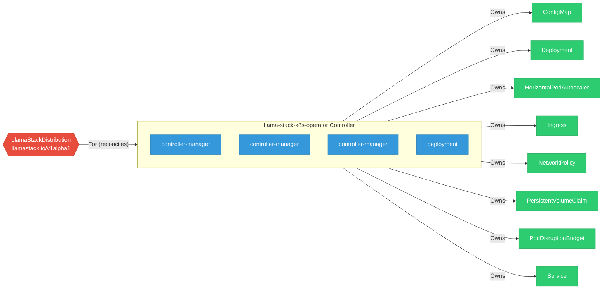

# llama-stack-k8s-operator

> **Architecture snapshot: 2026-04-24** (2026-04-24)

**Repository:** llamastack/llama-stack-k8s-operator  
**Analyzer:** arch-analyzer 0.2.0  
**Extracted:** 2026-04-24T08:14:45Z

## Summary

| Metric | Count |
|--------|-------|
| CRDs | 1 |
| Deployments | 4 |
| Services | 1 |
| Secrets | 0 |
| Cluster Roles | 5 |
| Controller Watches | 9 |

## Component Architecture

CRDs, controllers, and owned Kubernetes resources.

### CRDs

| Group | Version | Kind | Scope | Fields | Validation Rules | Source |
|-------|---------|------|-------|--------|------------------|--------|
| llamastack.io | v1alpha1 | LlamaStackDistribution | Namespaced | 371 | 1 | [`config/crd/bases/llamastack.io_llamastackdistributions.yaml`](https://github.com/llamastack/llama-stack-k8s-operator/blob/ba8020a4fc5b6ac86e14aea251992ee2ccdde5ef/config/crd/bases/llamastack.io_llamastackdistributions.yaml) |

## Dependencies

### Key External Dependencies

| Module | Version |
|--------|---------|
| github.com/go-logr/logr | v1.4.3 |
| k8s.io/api | v0.34.3 |
| k8s.io/apiextensions-apiserver | v0.34.3 |
| k8s.io/apimachinery | v0.34.3 |
| k8s.io/client-go | v0.34.3 |
| sigs.k8s.io/controller-runtime | v0.22.4 |

