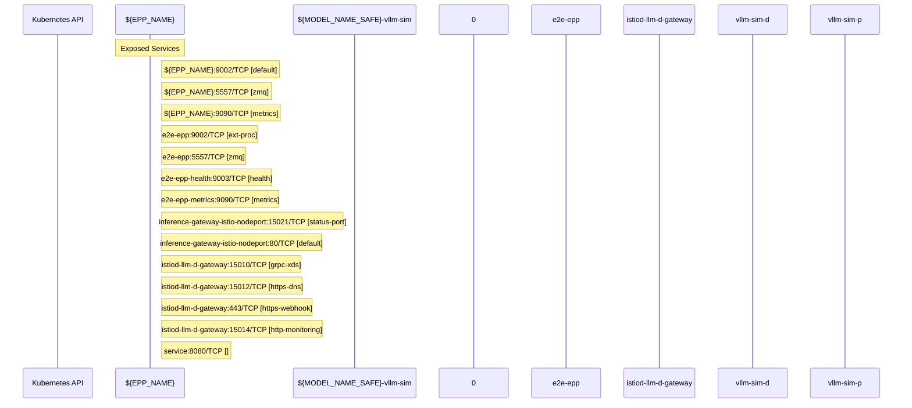

# llm-d-inference-scheduler: Dataflow

## Controller Watches

Kubernetes resources this controller monitors for changes. Each watch triggers reconciliation when the watched resource is created, updated, or deleted.

No controller watches found.

## Reconciliation Flow

How the controller interacts with the Kubernetes API during reconciliation.

### Webhooks

| Name | Type | Path | Failure Policy | Service | Source |
|------|------|------|----------------|---------|--------|
| namespace.sidecar-injector.istio.io | mutating | /inject | Fail | llm-d-istio-system/istiod-llm-d-gateway | [`deploy/components/istio-control-plane/webhooks.yaml`](https://github.com/llm-d/llm-d-inference-scheduler/blob/c7c0201b58d76321e79e12446a5e8d1397e8dcf0/deploy/components/istio-control-plane/webhooks.yaml) |
| object.sidecar-injector.istio.io | mutating | /inject | Fail | llm-d-istio-system/istiod-llm-d-gateway | [`deploy/components/istio-control-plane/webhooks.yaml`](https://github.com/llm-d/llm-d-inference-scheduler/blob/c7c0201b58d76321e79e12446a5e8d1397e8dcf0/deploy/components/istio-control-plane/webhooks.yaml) |
| rev.namespace.sidecar-injector.istio.io | mutating | /inject | Fail | llm-d-istio-system/istiod-llm-d-gateway | [`deploy/components/istio-control-plane/webhooks.yaml`](https://github.com/llm-d/llm-d-inference-scheduler/blob/c7c0201b58d76321e79e12446a5e8d1397e8dcf0/deploy/components/istio-control-plane/webhooks.yaml) |
| rev.object.sidecar-injector.istio.io | mutating | /inject | Fail | llm-d-istio-system/istiod-llm-d-gateway | [`deploy/components/istio-control-plane/webhooks.yaml`](https://github.com/llm-d/llm-d-inference-scheduler/blob/c7c0201b58d76321e79e12446a5e8d1397e8dcf0/deploy/components/istio-control-plane/webhooks.yaml) |
| rev.validation.istio.io | validating | /validate | Ignore | llm-d-istio-system/istiod-llm-d-gateway | [`deploy/components/istio-control-plane/webhooks.yaml`](https://github.com/llm-d/llm-d-inference-scheduler/blob/c7c0201b58d76321e79e12446a5e8d1397e8dcf0/deploy/components/istio-control-plane/webhooks.yaml) |

### HTTP Endpoints

| Method | Path | Source |
|--------|------|--------|
| * | / | [`pkg/sidecar/proxy/proxy.go:310`](https://github.com/llm-d/llm-d-inference-scheduler/blob/c7c0201b58d76321e79e12446a5e8d1397e8dcf0/pkg/sidecar/proxy/proxy.go#L310) |
| * | GET /health | [`pkg/sidecar/proxy/proxy.go:302`](https://github.com/llm-d/llm-d-inference-scheduler/blob/c7c0201b58d76321e79e12446a5e8d1397e8dcf0/pkg/sidecar/proxy/proxy.go#L302) |
| * | POST  | [`pkg/sidecar/proxy/proxy.go:305`](https://github.com/llm-d/llm-d-inference-scheduler/blob/c7c0201b58d76321e79e12446a5e8d1397e8dcf0/pkg/sidecar/proxy/proxy.go#L305) |
| * | POST  | [`pkg/sidecar/proxy/proxy.go:306`](https://github.com/llm-d/llm-d-inference-scheduler/blob/c7c0201b58d76321e79e12446a5e8d1397e8dcf0/pkg/sidecar/proxy/proxy.go#L306) |

## Configuration

ConfigMaps and Helm values that control this component's runtime behavior.

### ConfigMaps

| Name | Data Keys | Source |
|------|-----------|--------|
| istio-llm-d-gateway | mesh, meshNetworks | [`deploy/components/istio-control-plane/configmaps.yaml`](https://github.com/llm-d/llm-d-inference-scheduler/blob/c7c0201b58d76321e79e12446a5e8d1397e8dcf0/deploy/components/istio-control-plane/configmaps.yaml) |
| istio-sidecar-injector-llm-d-gateway | config, values | [`deploy/components/istio-control-plane/configmaps.yaml`](https://github.com/llm-d/llm-d-inference-scheduler/blob/c7c0201b58d76321e79e12446a5e8d1397e8dcf0/deploy/components/istio-control-plane/configmaps.yaml) |

