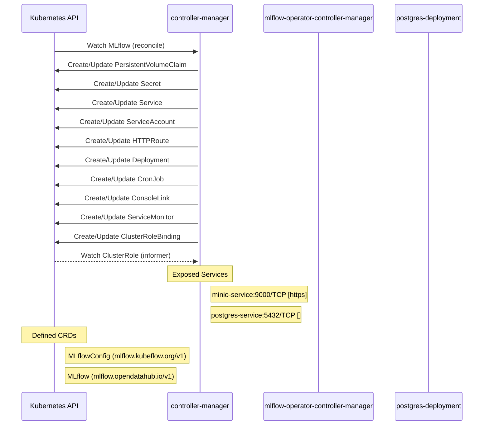

# mlflow-operator: Dataflow

## Controller Watches

Kubernetes resources this controller monitors for changes. Each watch triggers reconciliation when the watched resource is created, updated, or deleted.

| Type | GVK | Source |
|------|-----|--------|
| For | api/v1/MLflow | [`internal/controller/mlflow_controller.go:408`](https://github.com/opendatahub-io/mlflow-operator/blob/f753d470caec527a7f134dec1863ddfa8fd975e5/internal/controller/mlflow_controller.go#L408) |
| Owns | /v1/PersistentVolumeClaim | [`internal/controller/mlflow_controller.go:414`](https://github.com/opendatahub-io/mlflow-operator/blob/f753d470caec527a7f134dec1863ddfa8fd975e5/internal/controller/mlflow_controller.go#L414) |
| Owns | /v1/Secret | [`internal/controller/mlflow_controller.go:411`](https://github.com/opendatahub-io/mlflow-operator/blob/f753d470caec527a7f134dec1863ddfa8fd975e5/internal/controller/mlflow_controller.go#L411) |
| Owns | /v1/Service | [`internal/controller/mlflow_controller.go:412`](https://github.com/opendatahub-io/mlflow-operator/blob/f753d470caec527a7f134dec1863ddfa8fd975e5/internal/controller/mlflow_controller.go#L412) |
| Owns | /v1/ServiceAccount | [`internal/controller/mlflow_controller.go:413`](https://github.com/opendatahub-io/mlflow-operator/blob/f753d470caec527a7f134dec1863ddfa8fd975e5/internal/controller/mlflow_controller.go#L413) |
| Owns | apis/v1/HTTPRoute | [`internal/controller/mlflow_controller.go:443`](https://github.com/opendatahub-io/mlflow-operator/blob/f753d470caec527a7f134dec1863ddfa8fd975e5/internal/controller/mlflow_controller.go#L443) |
| Owns | apps/v1/Deployment | [`internal/controller/mlflow_controller.go:409`](https://github.com/opendatahub-io/mlflow-operator/blob/f753d470caec527a7f134dec1863ddfa8fd975e5/internal/controller/mlflow_controller.go#L409) |
| Owns | batch/v1/CronJob | [`internal/controller/mlflow_controller.go:410`](https://github.com/opendatahub-io/mlflow-operator/blob/f753d470caec527a7f134dec1863ddfa8fd975e5/internal/controller/mlflow_controller.go#L410) |
| Owns | console/v1/ConsoleLink | [`internal/controller/mlflow_controller.go:435`](https://github.com/opendatahub-io/mlflow-operator/blob/f753d470caec527a7f134dec1863ddfa8fd975e5/internal/controller/mlflow_controller.go#L435) |
| Owns | monitoring/v1/ServiceMonitor | [`internal/controller/mlflow_controller.go:451`](https://github.com/opendatahub-io/mlflow-operator/blob/f753d470caec527a7f134dec1863ddfa8fd975e5/internal/controller/mlflow_controller.go#L451) |
| Owns | rbac.authorization.k8s.io/v1/ClusterRoleBinding | [`internal/controller/mlflow_controller.go:420`](https://github.com/opendatahub-io/mlflow-operator/blob/f753d470caec527a7f134dec1863ddfa8fd975e5/internal/controller/mlflow_controller.go#L420) |
| Watches | rbac.authorization.k8s.io/v1/ClusterRole | [`internal/controller/mlflow_controller.go:419`](https://github.com/opendatahub-io/mlflow-operator/blob/f753d470caec527a7f134dec1863ddfa8fd975e5/internal/controller/mlflow_controller.go#L419) |

## Reconciliation Flow

How the controller interacts with the Kubernetes API during reconciliation.

## Configuration

ConfigMaps and Helm values that control this component's runtime behavior.

### Helm

**Chart:** mlflow v0.1.0

