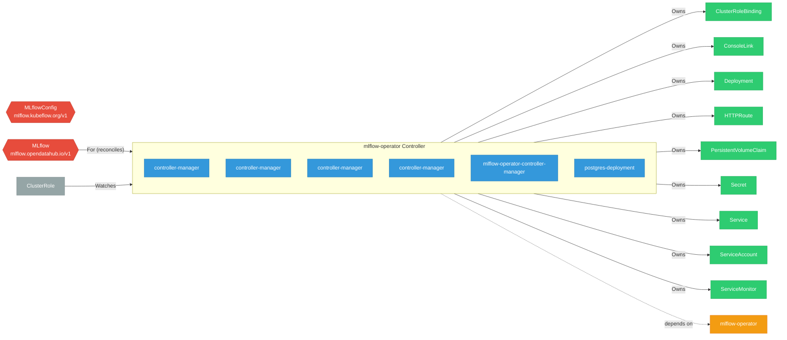

# mlflow-operator

> **Architecture snapshot: 2026-04-24** (2026-04-24)

**Repository:** opendatahub-io/mlflow-operator  
**Analyzer:** arch-analyzer 0.2.0  
**Extracted:** 2026-04-24T08:14:52Z

## Summary

| Metric | Count |
|--------|-------|
| CRDs | 2 |
| Deployments | 6 |
| Services | 2 |
| Secrets | 2 |
| Cluster Roles | 6 |
| Controller Watches | 11 |

## Component Architecture

CRDs, controllers, and owned Kubernetes resources.

### CRDs

| Group | Version | Kind | Scope | Fields | Validation Rules | Source |
|-------|---------|------|-------|--------|------------------|--------|
| mlflow.kubeflow.org | v1 | MLflowConfig | Namespaced | 6 | 4 | [`config/crd/mlflow.kubeflow.org_mlflowconfigs.yaml`](https://github.com/opendatahub-io/mlflow-operator/blob/5a8e5dbe95e606d5d964968f933b3037399805c8/config/crd/mlflow.kubeflow.org_mlflowconfigs.yaml) |
| mlflow.opendatahub.io | v1 | MLflow | Cluster | 287 | 16 | [`config/crd/bases/mlflow.opendatahub.io_mlflows.yaml`](https://github.com/opendatahub-io/mlflow-operator/blob/5a8e5dbe95e606d5d964968f933b3037399805c8/config/crd/bases/mlflow.opendatahub.io_mlflows.yaml) |

## Dependencies

### Internal Platform Dependencies

| Component | Interaction |
|-----------|-------------|
| mlflow-operator | Go module dependency: github.com/opendatahub-io/mlflow-operator/api |

### Key External Dependencies

| Module | Version |
|--------|---------|
| github.com/prometheus-operator/prometheus-operator/pkg/apis/monitoring | v0.89.0 |
| k8s.io/api | v0.34.3 |
| k8s.io/api | v0.34.2 |
| k8s.io/apimachinery | v0.34.3 |
| k8s.io/apimachinery | v0.34.2 |
| k8s.io/client-go | v0.34.3 |
| sigs.k8s.io/controller-runtime | v0.22.4 |
| sigs.k8s.io/controller-runtime | v0.22.4 |

