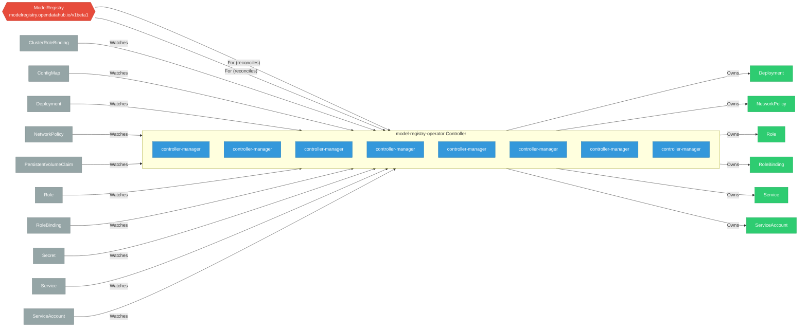

# model-registry-operator

> **Architecture snapshot: 2026-04-30** (2026-04-30)

**Repository:** opendatahub-io/model-registry-operator  
**Analyzer:** arch-analyzer 0.2.0  
**Extracted:** 2026-04-30T15:06:03Z

## Summary

| Metric | Count |
|--------|-------|
| CRDs | 2 |
| Deployments | 8 |
| Services | 1 |
| Secrets | 2 |
| Cluster Roles | 6 |
| Controller Watches | 17 |

## Component Architecture

CRDs, controllers, and owned Kubernetes resources.

### CRDs

| Group | Version | Kind | Scope | Fields | Validation Rules | Source |
|-------|---------|------|-------|--------|------------------|--------|
| modelregistry.opendatahub.io | v1alpha1 | ModelRegistry | Namespaced | 120 | 2 | [`config/crd/bases/modelregistry.opendatahub.io_modelregistries.yaml`](https://github.com/opendatahub-io/model-registry-operator/blob/d56c75fadb1ee4aa2b162859055bf91734084a03/config/crd/bases/modelregistry.opendatahub.io_modelregistries.yaml) |
| modelregistry.opendatahub.io | v1beta1 | ModelRegistry | Namespaced | 113 | 6 | [`config/crd/bases/modelregistry.opendatahub.io_modelregistries.yaml`](https://github.com/opendatahub-io/model-registry-operator/blob/d56c75fadb1ee4aa2b162859055bf91734084a03/config/crd/bases/modelregistry.opendatahub.io_modelregistries.yaml) |

## Dependencies

### Key External Dependencies

| Module | Version |
|--------|---------|
| github.com/go-logr/logr | v1.4.3 |
| k8s.io/api | v0.35.4 |
| k8s.io/apiextensions-apiserver | v0.35.4 |
| k8s.io/apimachinery | v0.35.4 |
| k8s.io/client-go | v0.35.4 |
| sigs.k8s.io/controller-runtime | v0.23.3 |

