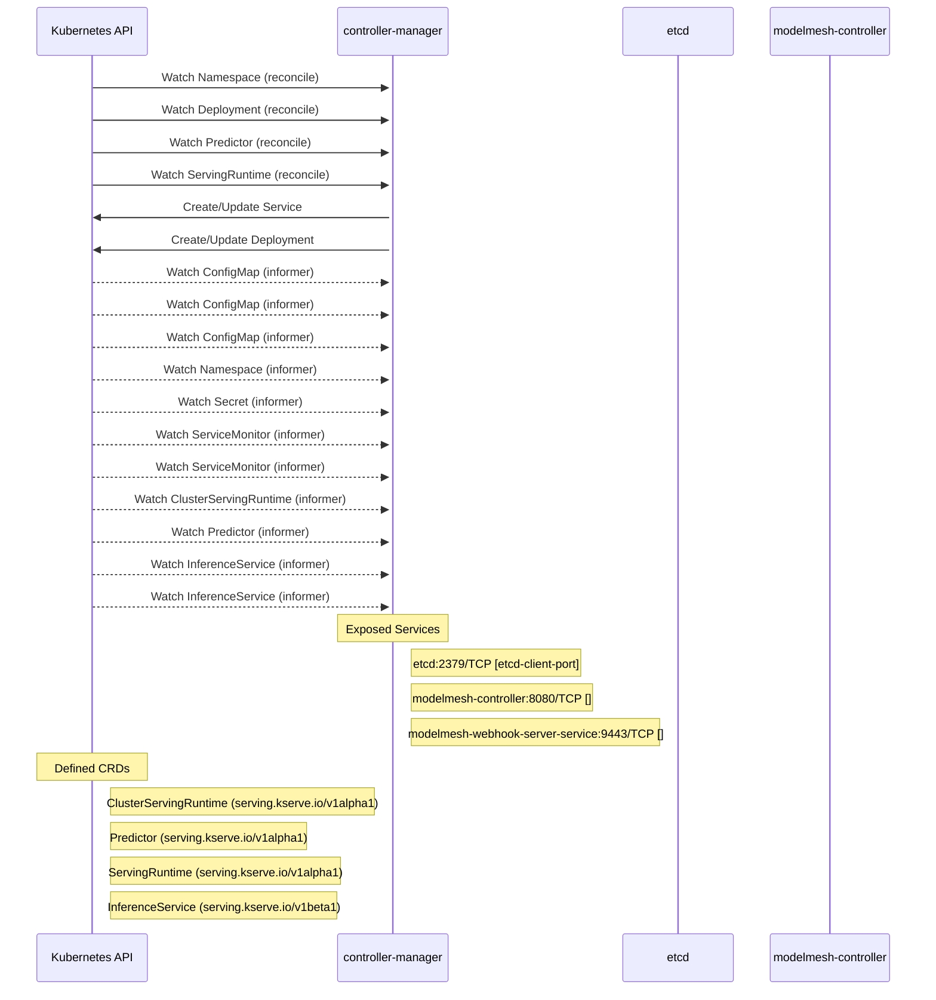

# modelmesh-serving: Dataflow

## Controller Watches

Kubernetes resources this controller monitors for changes. Each watch triggers reconciliation when the watched resource is created, updated, or deleted.

| Type | GVK | Source |
|------|-----|--------|
| For | /v1/Namespace | [`controllers/service_controller.go:476`](https://github.com/kserve/modelmesh-serving/blob/1fcf541d867ceb459fbc76aa1e2bef102c4816db/controllers/service_controller.go#L476) |
| For | apps/v1/Deployment | [`controllers/service_controller.go:449`](https://github.com/kserve/modelmesh-serving/blob/1fcf541d867ceb459fbc76aa1e2bef102c4816db/controllers/service_controller.go#L449) |
| For | serving/v1alpha1/Predictor | [`controllers/predictor_controller.go:594`](https://github.com/kserve/modelmesh-serving/blob/1fcf541d867ceb459fbc76aa1e2bef102c4816db/controllers/predictor_controller.go#L594) |
| For | serving/v1alpha1/ServingRuntime | [`controllers/servingruntime_controller.go:607`](https://github.com/kserve/modelmesh-serving/blob/1fcf541d867ceb459fbc76aa1e2bef102c4816db/controllers/servingruntime_controller.go#L607) |
| Owns | /v1/Service | [`controllers/service_controller.go:433`](https://github.com/kserve/modelmesh-serving/blob/1fcf541d867ceb459fbc76aa1e2bef102c4816db/controllers/service_controller.go#L433) |
| Owns | apps/v1/Deployment | [`controllers/servingruntime_controller.go:608`](https://github.com/kserve/modelmesh-serving/blob/1fcf541d867ceb459fbc76aa1e2bef102c4816db/controllers/servingruntime_controller.go#L608) |
| Watches | /v1/ConfigMap | [`controllers/servingruntime_controller.go:610`](https://github.com/kserve/modelmesh-serving/blob/1fcf541d867ceb459fbc76aa1e2bef102c4816db/controllers/servingruntime_controller.go#L610) |
| Watches | /v1/ConfigMap | [`controllers/service_controller.go:454`](https://github.com/kserve/modelmesh-serving/blob/1fcf541d867ceb459fbc76aa1e2bef102c4816db/controllers/service_controller.go#L454) |
| Watches | /v1/ConfigMap | [`controllers/service_controller.go:477`](https://github.com/kserve/modelmesh-serving/blob/1fcf541d867ceb459fbc76aa1e2bef102c4816db/controllers/service_controller.go#L477) |
| Watches | /v1/Namespace | [`controllers/servingruntime_controller.go:626`](https://github.com/kserve/modelmesh-serving/blob/1fcf541d867ceb459fbc76aa1e2bef102c4816db/controllers/servingruntime_controller.go#L626) |
| Watches | /v1/Secret | [`controllers/servingruntime_controller.go:650`](https://github.com/kserve/modelmesh-serving/blob/1fcf541d867ceb459fbc76aa1e2bef102c4816db/controllers/servingruntime_controller.go#L650) |
| Watches | monitoring/v1/ServiceMonitor | [`controllers/service_controller.go:499`](https://github.com/kserve/modelmesh-serving/blob/1fcf541d867ceb459fbc76aa1e2bef102c4816db/controllers/service_controller.go#L499) |
| Watches | monitoring/v1/ServiceMonitor | [`controllers/service_controller.go:465`](https://github.com/kserve/modelmesh-serving/blob/1fcf541d867ceb459fbc76aa1e2bef102c4816db/controllers/service_controller.go#L465) |
| Watches | serving/v1alpha1/ClusterServingRuntime | [`controllers/servingruntime_controller.go:643`](https://github.com/kserve/modelmesh-serving/blob/1fcf541d867ceb459fbc76aa1e2bef102c4816db/controllers/servingruntime_controller.go#L643) |
| Watches | serving/v1alpha1/Predictor | [`controllers/servingruntime_controller.go:619`](https://github.com/kserve/modelmesh-serving/blob/1fcf541d867ceb459fbc76aa1e2bef102c4816db/controllers/servingruntime_controller.go#L619) |
| Watches | serving/v1beta1/InferenceService | [`controllers/servingruntime_controller.go:633`](https://github.com/kserve/modelmesh-serving/blob/1fcf541d867ceb459fbc76aa1e2bef102c4816db/controllers/servingruntime_controller.go#L633) |
| Watches | serving/v1beta1/InferenceService | [`controllers/predictor_controller.go:602`](https://github.com/kserve/modelmesh-serving/blob/1fcf541d867ceb459fbc76aa1e2bef102c4816db/controllers/predictor_controller.go#L602) |

## Reconciliation Flow

How the controller interacts with the Kubernetes API during reconciliation.

### Webhooks

| Name | Type | Path | Failure Policy | Service | Source |
|------|------|------|----------------|---------|--------|
| servingruntime.modelmesh-webhook-server.default | validating | /validate-serving-modelmesh-io-v1alpha1-servingruntime | Fail | opendatahub/modelmesh-webhook-server-service | [`kustomize:config/overlays/odh (modelmesh-servingruntime.serving.kserve.io)`](https://github.com/kserve/modelmesh-serving/blob/1fcf541d867ceb459fbc76aa1e2bef102c4816db/kustomize:config/overlays/odh (modelmesh-servingruntime.serving.kserve.io)) |

### HTTP Endpoints

| Method | Path | Source |
|--------|------|--------|
| * | /debug/ | [`main.go:339`](https://github.com/kserve/modelmesh-serving/blob/1fcf541d867ceb459fbc76aa1e2bef102c4816db/main.go#L339) |

## Configuration

ConfigMaps and Helm values that control this component's runtime behavior.

