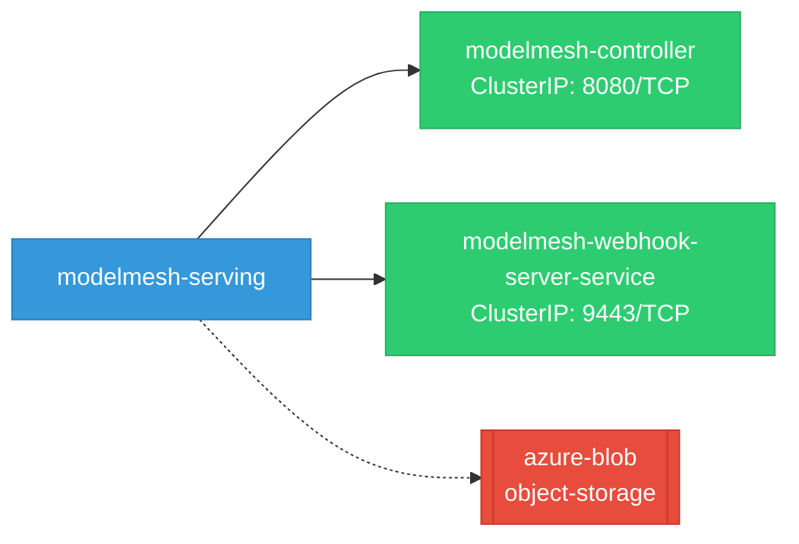
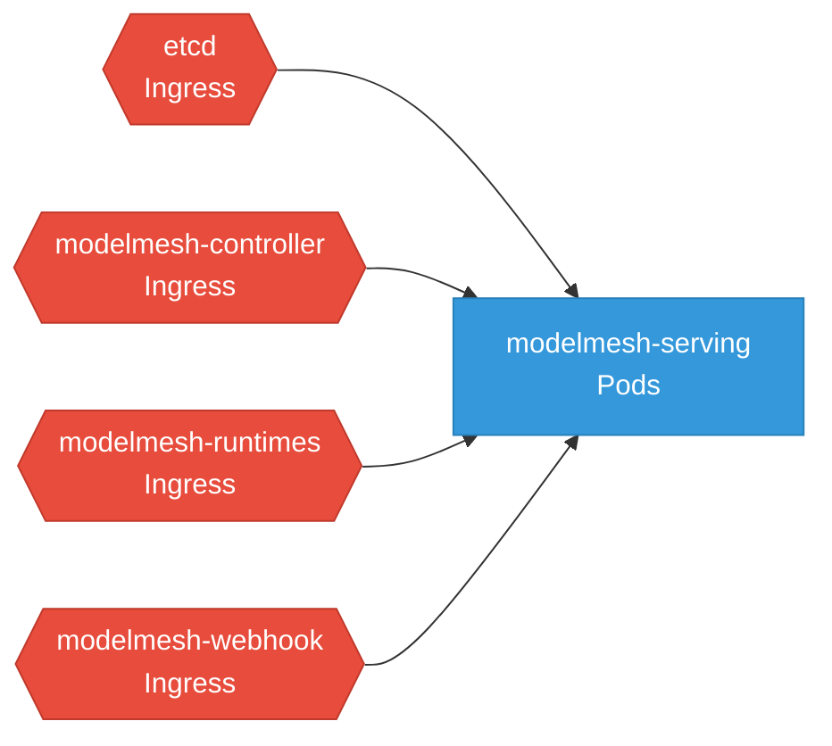

# modelmesh-serving: Network

## Service Map

### Services

| Name | Type | Ports | Source |
|------|------|-------|--------|
| modelmesh-controller | ClusterIP | 8080/TCP | [`config/overlays/odh/manager/service.yaml`](https://github.com/kserve/modelmesh-serving/blob/1fcf541d867ceb459fbc76aa1e2bef102c4816db/config/overlays/odh/manager/service.yaml) |
| modelmesh-webhook-server-service | ClusterIP | 9443/TCP | [`config/webhook/service.yaml`](https://github.com/kserve/modelmesh-serving/blob/1fcf541d867ceb459fbc76aa1e2bef102c4816db/config/webhook/service.yaml) |

### Network Policies

| Name | Policy Types | Source |
|------|-------------|--------|
| etcd | Ingress | [`config/overlays/odh/rbac/networkpolicy_etcd.yaml`](https://github.com/kserve/modelmesh-serving/blob/1fcf541d867ceb459fbc76aa1e2bef102c4816db/config/overlays/odh/rbac/networkpolicy_etcd.yaml) |
| modelmesh-controller | Ingress | [`config/rbac/common/networkpolicy-controller.yaml`](https://github.com/kserve/modelmesh-serving/blob/1fcf541d867ceb459fbc76aa1e2bef102c4816db/config/rbac/common/networkpolicy-controller.yaml) |
| modelmesh-runtimes | Ingress | [`config/rbac/common/networkpolicy-runtimes.yaml`](https://github.com/kserve/modelmesh-serving/blob/1fcf541d867ceb459fbc76aa1e2bef102c4816db/config/rbac/common/networkpolicy-runtimes.yaml) |
| modelmesh-webhook | Ingress | [`config/rbac/common/networkpolicy-webhook.yaml`](https://github.com/kserve/modelmesh-serving/blob/1fcf541d867ceb459fbc76aa1e2bef102c4816db/config/rbac/common/networkpolicy-webhook.yaml) |

## Network Policy Graph

Visual representation of NetworkPolicy rules. Ingress rules show what traffic is allowed into pods, egress rules show what traffic is allowed out.

