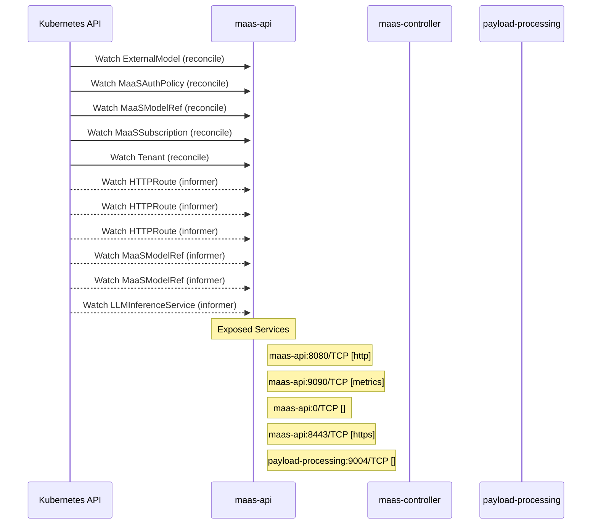

# models-as-a-service: Dataflow

## Controller Watches

Kubernetes resources this controller monitors for changes. Each watch triggers reconciliation when the watched resource is created, updated, or deleted.

| Type | GVK | Source |
|------|-----|--------|
| For | maas/v1alpha1/ExternalModel | [`maas-controller/pkg/reconciler/externalmodel/reconciler.go:299`](https://github.com/opendatahub-io/models-as-a-service/blob/89af85b64950cc6826439a3ef42a136973982f30/maas-controller/pkg/reconciler/externalmodel/reconciler.go#L299) |
| For | maas/v1alpha1/MaaSAuthPolicy | [`maas-controller/pkg/controller/maas/maasauthpolicy_controller.go:1188`](https://github.com/opendatahub-io/models-as-a-service/blob/89af85b64950cc6826439a3ef42a136973982f30/maas-controller/pkg/controller/maas/maasauthpolicy_controller.go#L1188) |
| For | maas/v1alpha1/MaaSModelRef | [`maas-controller/pkg/controller/maas/maasmodelref_controller.go:337`](https://github.com/opendatahub-io/models-as-a-service/blob/89af85b64950cc6826439a3ef42a136973982f30/maas-controller/pkg/controller/maas/maasmodelref_controller.go#L337) |
| For | maas/v1alpha1/MaaSSubscription | [`maas-controller/pkg/controller/maas/maassubscription_controller.go:983`](https://github.com/opendatahub-io/models-as-a-service/blob/89af85b64950cc6826439a3ef42a136973982f30/maas-controller/pkg/controller/maas/maassubscription_controller.go#L983) |
| For | maas/v1alpha1/Tenant | [`maas-controller/pkg/controller/maas/tenant_controller.go:180`](https://github.com/opendatahub-io/models-as-a-service/blob/89af85b64950cc6826439a3ef42a136973982f30/maas-controller/pkg/controller/maas/tenant_controller.go#L180) |
| Watches | apis/v1/HTTPRoute | [`maas-controller/pkg/controller/maas/maasauthpolicy_controller.go:1194`](https://github.com/opendatahub-io/models-as-a-service/blob/89af85b64950cc6826439a3ef42a136973982f30/maas-controller/pkg/controller/maas/maasauthpolicy_controller.go#L1194) |
| Watches | apis/v1/HTTPRoute | [`maas-controller/pkg/controller/maas/maasmodelref_controller.go:343`](https://github.com/opendatahub-io/models-as-a-service/blob/89af85b64950cc6826439a3ef42a136973982f30/maas-controller/pkg/controller/maas/maasmodelref_controller.go#L343) |
| Watches | apis/v1/HTTPRoute | [`maas-controller/pkg/controller/maas/maassubscription_controller.go:996`](https://github.com/opendatahub-io/models-as-a-service/blob/89af85b64950cc6826439a3ef42a136973982f30/maas-controller/pkg/controller/maas/maassubscription_controller.go#L996) |
| Watches | maas/v1alpha1/MaaSModelRef | [`maas-controller/pkg/controller/maas/maasauthpolicy_controller.go:1198`](https://github.com/opendatahub-io/models-as-a-service/blob/89af85b64950cc6826439a3ef42a136973982f30/maas-controller/pkg/controller/maas/maasauthpolicy_controller.go#L1198) |
| Watches | maas/v1alpha1/MaaSModelRef | [`maas-controller/pkg/controller/maas/maassubscription_controller.go:1000`](https://github.com/opendatahub-io/models-as-a-service/blob/89af85b64950cc6826439a3ef42a136973982f30/maas-controller/pkg/controller/maas/maassubscription_controller.go#L1000) |
| Watches | serving/v1alpha1/LLMInferenceService | [`maas-controller/pkg/controller/maas/maasmodelref_controller.go:348`](https://github.com/opendatahub-io/models-as-a-service/blob/89af85b64950cc6826439a3ef42a136973982f30/maas-controller/pkg/controller/maas/maasmodelref_controller.go#L348) |

## Reconciliation Flow

How the controller interacts with the Kubernetes API during reconciliation.

### HTTP Endpoints

| Method | Path | Source |
|--------|------|--------|
| OPTIONS | /*path | [`maas-api/cmd/main.go:101`](https://github.com/opendatahub-io/models-as-a-service/blob/89af85b64950cc6826439a3ef42a136973982f30/maas-api/cmd/main.go#L101) |
| DELETE | /:id | [`maas-api/cmd/main.go:202`](https://github.com/opendatahub-io/models-as-a-service/blob/89af85b64950cc6826439a3ef42a136973982f30/maas-api/cmd/main.go#L202) |
| GET | /:id | [`maas-api/cmd/main.go:201`](https://github.com/opendatahub-io/models-as-a-service/blob/89af85b64950cc6826439a3ef42a136973982f30/maas-api/cmd/main.go#L201) |
| * | /api-keys | [`maas-api/cmd/main.go:197`](https://github.com/opendatahub-io/models-as-a-service/blob/89af85b64950cc6826439a3ef42a136973982f30/maas-api/cmd/main.go#L197) |
| POST | /api-keys/cleanup | [`maas-api/cmd/main.go:207`](https://github.com/opendatahub-io/models-as-a-service/blob/89af85b64950cc6826439a3ef42a136973982f30/maas-api/cmd/main.go#L207) |
| POST | /api-keys/validate | [`maas-api/cmd/main.go:206`](https://github.com/opendatahub-io/models-as-a-service/blob/89af85b64950cc6826439a3ef42a136973982f30/maas-api/cmd/main.go#L206) |
| POST | /bulk-revoke | [`maas-api/cmd/main.go:200`](https://github.com/opendatahub-io/models-as-a-service/blob/89af85b64950cc6826439a3ef42a136973982f30/maas-api/cmd/main.go#L200) |
| GET | /health | [`maas-api/cmd/main.go:168`](https://github.com/opendatahub-io/models-as-a-service/blob/89af85b64950cc6826439a3ef42a136973982f30/maas-api/cmd/main.go#L168) |
| * | /internal/v1 | [`maas-api/cmd/main.go:205`](https://github.com/opendatahub-io/models-as-a-service/blob/89af85b64950cc6826439a3ef42a136973982f30/maas-api/cmd/main.go#L205) |
| * | /metrics | [`maas-api/internal/metrics/server.go:19`](https://github.com/opendatahub-io/models-as-a-service/blob/89af85b64950cc6826439a3ef42a136973982f30/maas-api/internal/metrics/server.go#L19) |
| GET | /model/:model-id/subscriptions | [`maas-api/cmd/main.go:194`](https://github.com/opendatahub-io/models-as-a-service/blob/89af85b64950cc6826439a3ef42a136973982f30/maas-api/cmd/main.go#L194) |
| GET | /models | [`maas-api/cmd/main.go:190`](https://github.com/opendatahub-io/models-as-a-service/blob/89af85b64950cc6826439a3ef42a136973982f30/maas-api/cmd/main.go#L190) |
| POST | /search | [`maas-api/cmd/main.go:199`](https://github.com/opendatahub-io/models-as-a-service/blob/89af85b64950cc6826439a3ef42a136973982f30/maas-api/cmd/main.go#L199) |
| GET | /subscriptions | [`maas-api/cmd/main.go:193`](https://github.com/opendatahub-io/models-as-a-service/blob/89af85b64950cc6826439a3ef42a136973982f30/maas-api/cmd/main.go#L193) |
| POST | /subscriptions/select | [`maas-api/cmd/main.go:208`](https://github.com/opendatahub-io/models-as-a-service/blob/89af85b64950cc6826439a3ef42a136973982f30/maas-api/cmd/main.go#L208) |
| * | /v1 | [`maas-api/cmd/main.go:174`](https://github.com/opendatahub-io/models-as-a-service/blob/89af85b64950cc6826439a3ef42a136973982f30/maas-api/cmd/main.go#L174) |

## Configuration

ConfigMaps and Helm values that control this component's runtime behavior.

