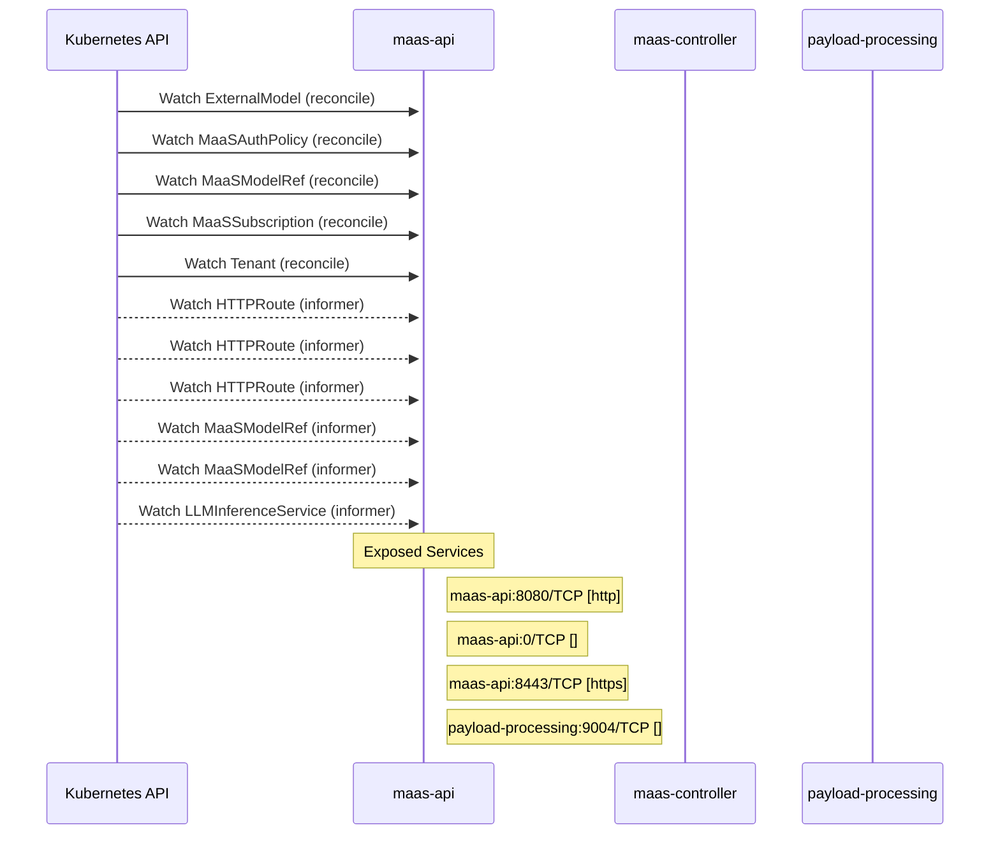

# models-as-a-service: Dataflow

## Controller Watches

Kubernetes resources this controller monitors for changes. Each watch triggers reconciliation when the watched resource is created, updated, or deleted.

| Type | GVK | Source |
|------|-----|--------|
| For | maas/v1alpha1/ExternalModel | [`maas-controller/pkg/reconciler/externalmodel/reconciler.go:299`](https://github.com/opendatahub-io/models-as-a-service/blob/1fb8b5d9eabf2775af3e781cf351d1d967786ab2/maas-controller/pkg/reconciler/externalmodel/reconciler.go#L299) |
| For | maas/v1alpha1/MaaSAuthPolicy | [`maas-controller/pkg/controller/maas/maasauthpolicy_controller.go:1176`](https://github.com/opendatahub-io/models-as-a-service/blob/1fb8b5d9eabf2775af3e781cf351d1d967786ab2/maas-controller/pkg/controller/maas/maasauthpolicy_controller.go#L1176) |
| For | maas/v1alpha1/MaaSModelRef | [`maas-controller/pkg/controller/maas/maasmodelref_controller.go:326`](https://github.com/opendatahub-io/models-as-a-service/blob/1fb8b5d9eabf2775af3e781cf351d1d967786ab2/maas-controller/pkg/controller/maas/maasmodelref_controller.go#L326) |
| For | maas/v1alpha1/MaaSSubscription | [`maas-controller/pkg/controller/maas/maassubscription_controller.go:971`](https://github.com/opendatahub-io/models-as-a-service/blob/1fb8b5d9eabf2775af3e781cf351d1d967786ab2/maas-controller/pkg/controller/maas/maassubscription_controller.go#L971) |
| For | maas/v1alpha1/Tenant | [`maas-controller/pkg/controller/maas/tenant_controller.go:178`](https://github.com/opendatahub-io/models-as-a-service/blob/1fb8b5d9eabf2775af3e781cf351d1d967786ab2/maas-controller/pkg/controller/maas/tenant_controller.go#L178) |
| Watches | apis/v1/HTTPRoute | [`maas-controller/pkg/controller/maas/maasauthpolicy_controller.go:1182`](https://github.com/opendatahub-io/models-as-a-service/blob/1fb8b5d9eabf2775af3e781cf351d1d967786ab2/maas-controller/pkg/controller/maas/maasauthpolicy_controller.go#L1182) |
| Watches | apis/v1/HTTPRoute | [`maas-controller/pkg/controller/maas/maasmodelref_controller.go:332`](https://github.com/opendatahub-io/models-as-a-service/blob/1fb8b5d9eabf2775af3e781cf351d1d967786ab2/maas-controller/pkg/controller/maas/maasmodelref_controller.go#L332) |
| Watches | apis/v1/HTTPRoute | [`maas-controller/pkg/controller/maas/maassubscription_controller.go:984`](https://github.com/opendatahub-io/models-as-a-service/blob/1fb8b5d9eabf2775af3e781cf351d1d967786ab2/maas-controller/pkg/controller/maas/maassubscription_controller.go#L984) |
| Watches | maas/v1alpha1/MaaSModelRef | [`maas-controller/pkg/controller/maas/maasauthpolicy_controller.go:1186`](https://github.com/opendatahub-io/models-as-a-service/blob/1fb8b5d9eabf2775af3e781cf351d1d967786ab2/maas-controller/pkg/controller/maas/maasauthpolicy_controller.go#L1186) |
| Watches | maas/v1alpha1/MaaSModelRef | [`maas-controller/pkg/controller/maas/maassubscription_controller.go:988`](https://github.com/opendatahub-io/models-as-a-service/blob/1fb8b5d9eabf2775af3e781cf351d1d967786ab2/maas-controller/pkg/controller/maas/maassubscription_controller.go#L988) |
| Watches | serving/v1alpha1/LLMInferenceService | [`maas-controller/pkg/controller/maas/maasmodelref_controller.go:337`](https://github.com/opendatahub-io/models-as-a-service/blob/1fb8b5d9eabf2775af3e781cf351d1d967786ab2/maas-controller/pkg/controller/maas/maasmodelref_controller.go#L337) |

## Reconciliation Flow

How the controller interacts with the Kubernetes API during reconciliation.

### HTTP Endpoints

| Method | Path | Source |
|--------|------|--------|
| OPTIONS | /*path | [`maas-api/cmd/main.go:81`](https://github.com/opendatahub-io/models-as-a-service/blob/1fb8b5d9eabf2775af3e781cf351d1d967786ab2/maas-api/cmd/main.go#L81) |
| DELETE | /:id | [`maas-api/cmd/main.go:177`](https://github.com/opendatahub-io/models-as-a-service/blob/1fb8b5d9eabf2775af3e781cf351d1d967786ab2/maas-api/cmd/main.go#L177) |
| GET | /:id | [`maas-api/cmd/main.go:176`](https://github.com/opendatahub-io/models-as-a-service/blob/1fb8b5d9eabf2775af3e781cf351d1d967786ab2/maas-api/cmd/main.go#L176) |
| * | /api-keys | [`maas-api/cmd/main.go:172`](https://github.com/opendatahub-io/models-as-a-service/blob/1fb8b5d9eabf2775af3e781cf351d1d967786ab2/maas-api/cmd/main.go#L172) |
| POST | /api-keys/cleanup | [`maas-api/cmd/main.go:182`](https://github.com/opendatahub-io/models-as-a-service/blob/1fb8b5d9eabf2775af3e781cf351d1d967786ab2/maas-api/cmd/main.go#L182) |
| POST | /api-keys/validate | [`maas-api/cmd/main.go:181`](https://github.com/opendatahub-io/models-as-a-service/blob/1fb8b5d9eabf2775af3e781cf351d1d967786ab2/maas-api/cmd/main.go#L181) |
| POST | /bulk-revoke | [`maas-api/cmd/main.go:175`](https://github.com/opendatahub-io/models-as-a-service/blob/1fb8b5d9eabf2775af3e781cf351d1d967786ab2/maas-api/cmd/main.go#L175) |
| GET | /health | [`maas-api/cmd/main.go:142`](https://github.com/opendatahub-io/models-as-a-service/blob/1fb8b5d9eabf2775af3e781cf351d1d967786ab2/maas-api/cmd/main.go#L142) |
| * | /internal/v1 | [`maas-api/cmd/main.go:180`](https://github.com/opendatahub-io/models-as-a-service/blob/1fb8b5d9eabf2775af3e781cf351d1d967786ab2/maas-api/cmd/main.go#L180) |
| GET | /metrics | [`maas-api/cmd/main.go:143`](https://github.com/opendatahub-io/models-as-a-service/blob/1fb8b5d9eabf2775af3e781cf351d1d967786ab2/maas-api/cmd/main.go#L143) |
| GET | /model/:model-id/subscriptions | [`maas-api/cmd/main.go:169`](https://github.com/opendatahub-io/models-as-a-service/blob/1fb8b5d9eabf2775af3e781cf351d1d967786ab2/maas-api/cmd/main.go#L169) |
| GET | /models | [`maas-api/cmd/main.go:165`](https://github.com/opendatahub-io/models-as-a-service/blob/1fb8b5d9eabf2775af3e781cf351d1d967786ab2/maas-api/cmd/main.go#L165) |
| POST | /search | [`maas-api/cmd/main.go:174`](https://github.com/opendatahub-io/models-as-a-service/blob/1fb8b5d9eabf2775af3e781cf351d1d967786ab2/maas-api/cmd/main.go#L174) |
| GET | /subscriptions | [`maas-api/cmd/main.go:168`](https://github.com/opendatahub-io/models-as-a-service/blob/1fb8b5d9eabf2775af3e781cf351d1d967786ab2/maas-api/cmd/main.go#L168) |
| POST | /subscriptions/select | [`maas-api/cmd/main.go:183`](https://github.com/opendatahub-io/models-as-a-service/blob/1fb8b5d9eabf2775af3e781cf351d1d967786ab2/maas-api/cmd/main.go#L183) |
| * | /v1 | [`maas-api/cmd/main.go:149`](https://github.com/opendatahub-io/models-as-a-service/blob/1fb8b5d9eabf2775af3e781cf351d1d967786ab2/maas-api/cmd/main.go#L149) |
| * | /v1 | [`maas-api/test/fixtures/server_setup.go:116`](https://github.com/opendatahub-io/models-as-a-service/blob/1fb8b5d9eabf2775af3e781cf351d1d967786ab2/maas-api/test/fixtures/server_setup.go#L116) |

## Configuration

ConfigMaps and Helm values that control this component's runtime behavior.

