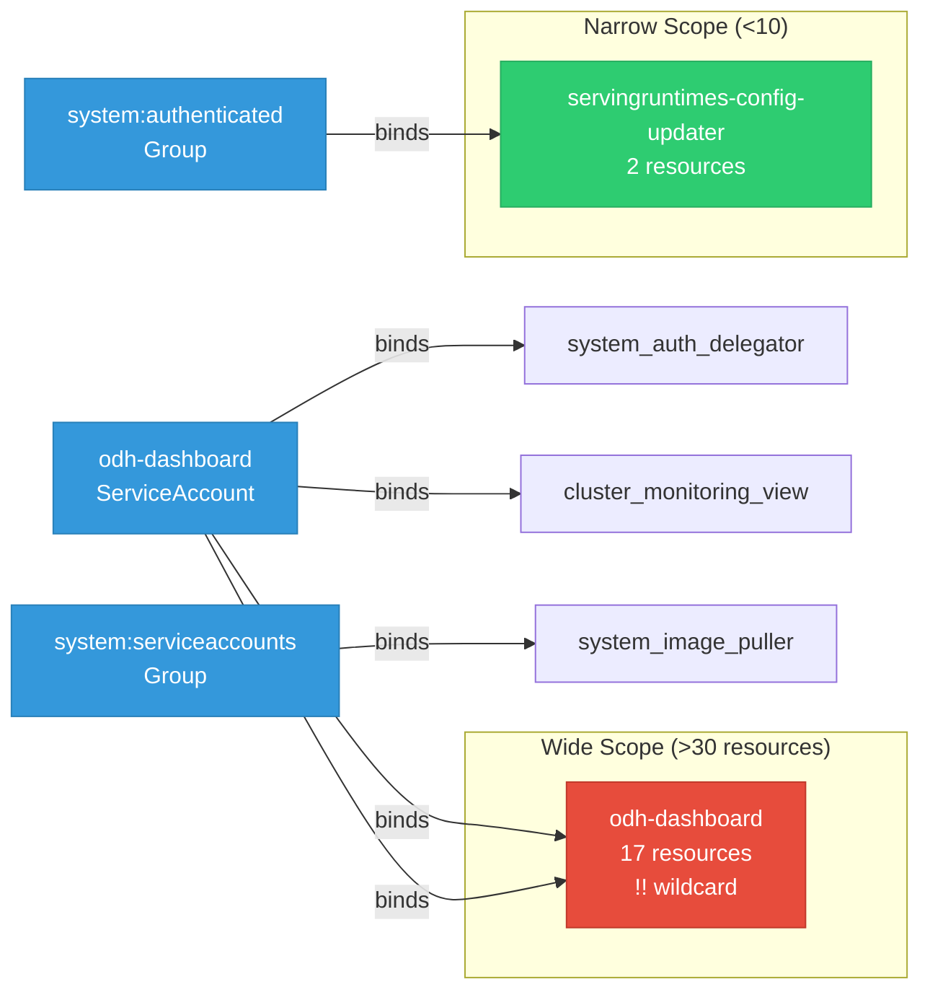

# odh-dashboard: RBAC

ServiceAccount bindings, roles, and resource permissions.

## RBAC Overview

This component defines a large RBAC surface (147 diagram lines). The graph below groups roles by permission scope.

## Bindings

Subject-to-role mappings defining who has access to what.

| Binding | Type | Role | Subject |
|---------|------|------|---------|
| odh-dashboard | ClusterRoleBinding | odh-dashboard | ServiceAccount/odh-dashboard |
| odh-dashboard-auth-delegator | ClusterRoleBinding | system:auth-delegator | ServiceAccount/odh-dashboard |
| odh-dashboard-monitoring | ClusterRoleBinding | cluster-monitoring-view | ServiceAccount/odh-dashboard |
| cluster-image-pullers | RoleBinding | system:image-puller | Group/system:serviceaccounts |
| odh-dashboard | RoleBinding | odh-dashboard | ServiceAccount/odh-dashboard |
| servingruntimes-config-updater | RoleBinding | servingruntimes-config-updater | Group/system:authenticated |

## Role Details

Per-rule breakdown of API groups, resources, and verbs for each role.

| Role | Kind | API Groups | Resources | Verbs |
|------|------|------------|-----------|-------|
| odh-dashboard | ClusterRole |  | storageclasses | update, patch |
| odh-dashboard | ClusterRole |  | nodes | get, list |
| odh-dashboard | ClusterRole |  | machineautoscalers, machinesets | get, list |
| odh-dashboard | ClusterRole |  | clusterversions, ingresses | get, watch, list |
| odh-dashboard | ClusterRole |  | clusterserviceversions, subscriptions | get, list, watch |
| odh-dashboard | ClusterRole |  | imagestreams/layers | get |
| odh-dashboard | ClusterRole |  | configmaps, persistentvolumeclaims, secrets | create, delete, get, list, patch, update, watch |
| odh-dashboard | ClusterRole |  | routes | get, list, watch |
| odh-dashboard | ClusterRole |  | consolelinks | get, list, watch |
| odh-dashboard | ClusterRole |  | consoles | get, list, watch |
| odh-dashboard | ClusterRole |  | rhmis | get, watch, list |
| odh-dashboard | ClusterRole |  | groups | get, list, watch |
| odh-dashboard | ClusterRole |  | users | get, list, watch |
| odh-dashboard | ClusterRole |  | pods, serviceaccounts, services | get, list, watch |
| odh-dashboard | ClusterRole |  | namespaces | patch |
| odh-dashboard | ClusterRole |  | rolebindings, clusterrolebindings, roles | list, get, create, patch, delete |
| odh-dashboard | ClusterRole |  | events | get, list, watch |
| odh-dashboard | ClusterRole |  | notebooks | get, list, watch, create, update, patch, delete |
| odh-dashboard | ClusterRole |  | datascienceclusters | list, watch, get |
| odh-dashboard | ClusterRole |  | dscinitializations | list, watch, get |
| odh-dashboard | ClusterRole |  | inferenceservices | get, list, watch |
| odh-dashboard | ClusterRole |  | modelregistries | get, list, watch, create, update, patch, delete |
| odh-dashboard | ClusterRole |  | endpoints | get |
| odh-dashboard | ClusterRole |  | auths | get |
| odh-dashboard | ClusterRole |  | llamastackdistributions | get, list, watch |
| odh-dashboard | ClusterRole |  | guardrailsorchestrators, evalhubs | get, list, watch |
| odh-dashboard | ClusterRole |  | featurestores | get, list, watch |
| odh-dashboard | ClusterRole |  | mlflows | get, list, watch |
| odh-dashboard | ClusterRole |  | tokenreviews | create |
| odh-dashboard | ClusterRole |  | subjectaccessreviews | create |
| odh-dashboard | Role |  | acceleratorprofiles | create, get, list, update, patch, delete |
| odh-dashboard | Role |  | routes | get, list, watch |
| odh-dashboard | Role |  | cronjobs | get, update, delete |
| odh-dashboard | Role |  | imagestreams | create, get, list, update, patch, delete |
| odh-dashboard | Role |  | builds, buildconfigs | list |
| odh-dashboard | Role |  | deployments | patch, update |
| odh-dashboard | Role |  | deploymentconfigs, deploymentconfigs/instantiate | get, list, watch, create, update, patch, delete |
| odh-dashboard | Role |  | odhdashboardconfigs | get, list, watch, create, update, patch, delete |
| odh-dashboard | Role |  | notebooks | get, list, watch, create, update, patch, delete |
| odh-dashboard | Role |  | odhapplications | get, list |
| odh-dashboard | Role |  | odhdocuments | get, list |
| odh-dashboard | Role |  | odhquickstarts | get, list |
| odh-dashboard | Role |  | templates | * |
| odh-dashboard | Role |  | servingruntimes | * |
| odh-dashboard | Role |  | accounts | get, list, watch, create, update, patch, delete |
| servingruntimes-config-updater | Role |  | templates | get, list |
| servingruntimes-config-updater | Role |  | odhdashboardconfigs | get, list |

### Cluster Roles

| Name | Resources | Verbs | Source |
|------|-----------|-------|--------|
| odh-dashboard | storageclasses | update, patch | [`manifests/core-bases/base/cluster-role.yaml`](https://github.com/opendatahub-io/odh-dashboard/blob/37ad44c6f0e918c8bf8994312c0b99aa2e403a0c/manifests/core-bases/base/cluster-role.yaml) |
| odh-dashboard | nodes | get, list | [`manifests/core-bases/base/cluster-role.yaml`](https://github.com/opendatahub-io/odh-dashboard/blob/37ad44c6f0e918c8bf8994312c0b99aa2e403a0c/manifests/core-bases/base/cluster-role.yaml) |
| odh-dashboard | machineautoscalers, machinesets | get, list | [`manifests/core-bases/base/cluster-role.yaml`](https://github.com/opendatahub-io/odh-dashboard/blob/37ad44c6f0e918c8bf8994312c0b99aa2e403a0c/manifests/core-bases/base/cluster-role.yaml) |
| odh-dashboard | clusterversions, ingresses | get, watch, list | [`manifests/core-bases/base/cluster-role.yaml`](https://github.com/opendatahub-io/odh-dashboard/blob/37ad44c6f0e918c8bf8994312c0b99aa2e403a0c/manifests/core-bases/base/cluster-role.yaml) |
| odh-dashboard | clusterserviceversions, subscriptions | get, list, watch | [`manifests/core-bases/base/cluster-role.yaml`](https://github.com/opendatahub-io/odh-dashboard/blob/37ad44c6f0e918c8bf8994312c0b99aa2e403a0c/manifests/core-bases/base/cluster-role.yaml) |
| odh-dashboard | imagestreams/layers | get | [`manifests/core-bases/base/cluster-role.yaml`](https://github.com/opendatahub-io/odh-dashboard/blob/37ad44c6f0e918c8bf8994312c0b99aa2e403a0c/manifests/core-bases/base/cluster-role.yaml) |
| odh-dashboard | configmaps, persistentvolumeclaims, secrets | create, delete, get, list, patch, update, watch | [`manifests/core-bases/base/cluster-role.yaml`](https://github.com/opendatahub-io/odh-dashboard/blob/37ad44c6f0e918c8bf8994312c0b99aa2e403a0c/manifests/core-bases/base/cluster-role.yaml) |
| odh-dashboard | routes | get, list, watch | [`manifests/core-bases/base/cluster-role.yaml`](https://github.com/opendatahub-io/odh-dashboard/blob/37ad44c6f0e918c8bf8994312c0b99aa2e403a0c/manifests/core-bases/base/cluster-role.yaml) |
| odh-dashboard | consolelinks | get, list, watch | [`manifests/core-bases/base/cluster-role.yaml`](https://github.com/opendatahub-io/odh-dashboard/blob/37ad44c6f0e918c8bf8994312c0b99aa2e403a0c/manifests/core-bases/base/cluster-role.yaml) |
| odh-dashboard | consoles | get, list, watch | [`manifests/core-bases/base/cluster-role.yaml`](https://github.com/opendatahub-io/odh-dashboard/blob/37ad44c6f0e918c8bf8994312c0b99aa2e403a0c/manifests/core-bases/base/cluster-role.yaml) |
| odh-dashboard | rhmis | get, watch, list | [`manifests/core-bases/base/cluster-role.yaml`](https://github.com/opendatahub-io/odh-dashboard/blob/37ad44c6f0e918c8bf8994312c0b99aa2e403a0c/manifests/core-bases/base/cluster-role.yaml) |
| odh-dashboard | groups | get, list, watch | [`manifests/core-bases/base/cluster-role.yaml`](https://github.com/opendatahub-io/odh-dashboard/blob/37ad44c6f0e918c8bf8994312c0b99aa2e403a0c/manifests/core-bases/base/cluster-role.yaml) |
| odh-dashboard | users | get, list, watch | [`manifests/core-bases/base/cluster-role.yaml`](https://github.com/opendatahub-io/odh-dashboard/blob/37ad44c6f0e918c8bf8994312c0b99aa2e403a0c/manifests/core-bases/base/cluster-role.yaml) |
| odh-dashboard | pods, serviceaccounts, services | get, list, watch | [`manifests/core-bases/base/cluster-role.yaml`](https://github.com/opendatahub-io/odh-dashboard/blob/37ad44c6f0e918c8bf8994312c0b99aa2e403a0c/manifests/core-bases/base/cluster-role.yaml) |
| odh-dashboard | namespaces | patch | [`manifests/core-bases/base/cluster-role.yaml`](https://github.com/opendatahub-io/odh-dashboard/blob/37ad44c6f0e918c8bf8994312c0b99aa2e403a0c/manifests/core-bases/base/cluster-role.yaml) |
| odh-dashboard | rolebindings, clusterrolebindings, roles | list, get, create, patch, delete | [`manifests/core-bases/base/cluster-role.yaml`](https://github.com/opendatahub-io/odh-dashboard/blob/37ad44c6f0e918c8bf8994312c0b99aa2e403a0c/manifests/core-bases/base/cluster-role.yaml) |
| odh-dashboard | events | get, list, watch | [`manifests/core-bases/base/cluster-role.yaml`](https://github.com/opendatahub-io/odh-dashboard/blob/37ad44c6f0e918c8bf8994312c0b99aa2e403a0c/manifests/core-bases/base/cluster-role.yaml) |
| odh-dashboard | notebooks | get, list, watch, create, update, patch, delete | [`manifests/core-bases/base/cluster-role.yaml`](https://github.com/opendatahub-io/odh-dashboard/blob/37ad44c6f0e918c8bf8994312c0b99aa2e403a0c/manifests/core-bases/base/cluster-role.yaml) |
| odh-dashboard | datascienceclusters | list, watch, get | [`manifests/core-bases/base/cluster-role.yaml`](https://github.com/opendatahub-io/odh-dashboard/blob/37ad44c6f0e918c8bf8994312c0b99aa2e403a0c/manifests/core-bases/base/cluster-role.yaml) |
| odh-dashboard | dscinitializations | list, watch, get | [`manifests/core-bases/base/cluster-role.yaml`](https://github.com/opendatahub-io/odh-dashboard/blob/37ad44c6f0e918c8bf8994312c0b99aa2e403a0c/manifests/core-bases/base/cluster-role.yaml) |
| odh-dashboard | inferenceservices | get, list, watch | [`manifests/core-bases/base/cluster-role.yaml`](https://github.com/opendatahub-io/odh-dashboard/blob/37ad44c6f0e918c8bf8994312c0b99aa2e403a0c/manifests/core-bases/base/cluster-role.yaml) |
| odh-dashboard | modelregistries | get, list, watch, create, update, patch, delete | [`manifests/core-bases/base/cluster-role.yaml`](https://github.com/opendatahub-io/odh-dashboard/blob/37ad44c6f0e918c8bf8994312c0b99aa2e403a0c/manifests/core-bases/base/cluster-role.yaml) |
| odh-dashboard | endpoints | get | [`manifests/core-bases/base/cluster-role.yaml`](https://github.com/opendatahub-io/odh-dashboard/blob/37ad44c6f0e918c8bf8994312c0b99aa2e403a0c/manifests/core-bases/base/cluster-role.yaml) |
| odh-dashboard | auths | get | [`manifests/core-bases/base/cluster-role.yaml`](https://github.com/opendatahub-io/odh-dashboard/blob/37ad44c6f0e918c8bf8994312c0b99aa2e403a0c/manifests/core-bases/base/cluster-role.yaml) |
| odh-dashboard | llamastackdistributions | get, list, watch | [`manifests/core-bases/base/cluster-role.yaml`](https://github.com/opendatahub-io/odh-dashboard/blob/37ad44c6f0e918c8bf8994312c0b99aa2e403a0c/manifests/core-bases/base/cluster-role.yaml) |
| odh-dashboard | guardrailsorchestrators, evalhubs | get, list, watch | [`manifests/core-bases/base/cluster-role.yaml`](https://github.com/opendatahub-io/odh-dashboard/blob/37ad44c6f0e918c8bf8994312c0b99aa2e403a0c/manifests/core-bases/base/cluster-role.yaml) |
| odh-dashboard | featurestores | get, list, watch | [`manifests/core-bases/base/cluster-role.yaml`](https://github.com/opendatahub-io/odh-dashboard/blob/37ad44c6f0e918c8bf8994312c0b99aa2e403a0c/manifests/core-bases/base/cluster-role.yaml) |
| odh-dashboard | mlflows | get, list, watch | [`manifests/core-bases/base/cluster-role.yaml`](https://github.com/opendatahub-io/odh-dashboard/blob/37ad44c6f0e918c8bf8994312c0b99aa2e403a0c/manifests/core-bases/base/cluster-role.yaml) |
| odh-dashboard | tokenreviews | create | [`manifests/core-bases/base/cluster-role.yaml`](https://github.com/opendatahub-io/odh-dashboard/blob/37ad44c6f0e918c8bf8994312c0b99aa2e403a0c/manifests/core-bases/base/cluster-role.yaml) |
| odh-dashboard | subjectaccessreviews | create | [`manifests/core-bases/base/cluster-role.yaml`](https://github.com/opendatahub-io/odh-dashboard/blob/37ad44c6f0e918c8bf8994312c0b99aa2e403a0c/manifests/core-bases/base/cluster-role.yaml) |

