# opendatahub-operator: Dataflow

## Controller Watches

Kubernetes resources this controller monitors for changes. Each watch triggers reconciliation when the watched resource is created, updated, or deleted.

| Type | GVK | Source |
|------|-----|--------|
| Owns | /v1/ConfigMap | [`internal/controller/components/workbenches/workbenches_controller.go:49`](https://github.com/opendatahub-io/opendatahub-operator/blob/607e20f6a959b75625a7313721aa1ced964187d6/internal/controller/components/workbenches/workbenches_controller.go#L49) |
| Owns | /v1/ConfigMap | [`internal/controller/components/modelcontroller/modelcontroller_controller.go:53`](https://github.com/opendatahub-io/opendatahub-operator/blob/607e20f6a959b75625a7313721aa1ced964187d6/internal/controller/components/modelcontroller/modelcontroller_controller.go#L53) |
| Owns | /v1/ConfigMap | [`internal/controller/components/feastoperator/feastoperator_controller.go:28`](https://github.com/opendatahub-io/opendatahub-operator/blob/607e20f6a959b75625a7313721aa1ced964187d6/internal/controller/components/feastoperator/feastoperator_controller.go#L28) |
| Owns | /v1/ConfigMap | [`internal/controller/components/ray/ray_controller.go:48`](https://github.com/opendatahub-io/opendatahub-operator/blob/607e20f6a959b75625a7313721aa1ced964187d6/internal/controller/components/ray/ray_controller.go#L48) |
| Owns | /v1/ConfigMap | [`internal/controller/services/monitoring/monitoring_controller.go:96`](https://github.com/opendatahub-io/opendatahub-operator/blob/607e20f6a959b75625a7313721aa1ced964187d6/internal/controller/services/monitoring/monitoring_controller.go#L96) |
| Owns | /v1/ConfigMap | [`internal/controller/components/llamastackoperator/llamastackoperator_controller.go:29`](https://github.com/opendatahub-io/opendatahub-operator/blob/607e20f6a959b75625a7313721aa1ced964187d6/internal/controller/components/llamastackoperator/llamastackoperator_controller.go#L29) |
| Owns | /v1/ConfigMap | [`internal/controller/components/modelregistry/modelregistry_controller.go:48`](https://github.com/opendatahub-io/opendatahub-operator/blob/607e20f6a959b75625a7313721aa1ced964187d6/internal/controller/components/modelregistry/modelregistry_controller.go#L48) |
| Owns | /v1/ConfigMap | [`internal/controller/components/mlflowoperator/mlflowoperator_controller.go:48`](https://github.com/opendatahub-io/opendatahub-operator/blob/607e20f6a959b75625a7313721aa1ced964187d6/internal/controller/components/mlflowoperator/mlflowoperator_controller.go#L48) |
| Owns | /v1/ConfigMap | [`internal/controller/components/modelregistry/modelregistry_controller.go:49`](https://github.com/opendatahub-io/opendatahub-operator/blob/607e20f6a959b75625a7313721aa1ced964187d6/internal/controller/components/modelregistry/modelregistry_controller.go#L49) |
| Owns | /v1/ConfigMap | [`internal/controller/components/dashboard/dashboard_controller.go:56`](https://github.com/opendatahub-io/opendatahub-operator/blob/607e20f6a959b75625a7313721aa1ced964187d6/internal/controller/components/dashboard/dashboard_controller.go#L56) |
| Owns | /v1/ConfigMap | [`internal/controller/components/trainer/trainer_controller.go:50`](https://github.com/opendatahub-io/opendatahub-operator/blob/607e20f6a959b75625a7313721aa1ced964187d6/internal/controller/components/trainer/trainer_controller.go#L50) |
| Owns | /v1/ConfigMap | [`internal/controller/components/trustyai/trustyai_controller.go:63`](https://github.com/opendatahub-io/opendatahub-operator/blob/607e20f6a959b75625a7313721aa1ced964187d6/internal/controller/components/trustyai/trustyai_controller.go#L63) |
| Owns | /v1/ConfigMap | [`internal/controller/components/kserve/kserve_controller.go:62`](https://github.com/opendatahub-io/opendatahub-operator/blob/607e20f6a959b75625a7313721aa1ced964187d6/internal/controller/components/kserve/kserve_controller.go#L62) |
| Owns | /v1/ConfigMap | [`internal/controller/components/datasciencepipelines/datasciencepipelines_controller.go:46`](https://github.com/opendatahub-io/opendatahub-operator/blob/607e20f6a959b75625a7313721aa1ced964187d6/internal/controller/components/datasciencepipelines/datasciencepipelines_controller.go#L46) |
| Owns | /v1/ConfigMap | [`internal/controller/components/kueue/kueue_controller.go:59`](https://github.com/opendatahub-io/opendatahub-operator/blob/607e20f6a959b75625a7313721aa1ced964187d6/internal/controller/components/kueue/kueue_controller.go#L59) |
| Owns | /v1/ConfigMap | [`internal/controller/components/trainingoperator/trainingoperator_controller.go:45`](https://github.com/opendatahub-io/opendatahub-operator/blob/607e20f6a959b75625a7313721aa1ced964187d6/internal/controller/components/trainingoperator/trainingoperator_controller.go#L45) |
| Owns | /v1/ConfigMap | [`internal/controller/components/sparkoperator/sparkoperator_controller.go:45`](https://github.com/opendatahub-io/opendatahub-operator/blob/607e20f6a959b75625a7313721aa1ced964187d6/internal/controller/components/sparkoperator/sparkoperator_controller.go#L45) |
| Owns | /v1/Secret | [`internal/controller/components/workbenches/workbenches_controller.go:50`](https://github.com/opendatahub-io/opendatahub-operator/blob/607e20f6a959b75625a7313721aa1ced964187d6/internal/controller/components/workbenches/workbenches_controller.go#L50) |
| Owns | /v1/Secret | [`internal/controller/components/modelcontroller/modelcontroller_controller.go:55`](https://github.com/opendatahub-io/opendatahub-operator/blob/607e20f6a959b75625a7313721aa1ced964187d6/internal/controller/components/modelcontroller/modelcontroller_controller.go#L55) |
| Owns | /v1/Secret | [`internal/controller/components/kserve/kserve_controller.go:60`](https://github.com/opendatahub-io/opendatahub-operator/blob/607e20f6a959b75625a7313721aa1ced964187d6/internal/controller/components/kserve/kserve_controller.go#L60) |
| Owns | /v1/Secret | [`internal/controller/components/datasciencepipelines/datasciencepipelines_controller.go:47`](https://github.com/opendatahub-io/opendatahub-operator/blob/607e20f6a959b75625a7313721aa1ced964187d6/internal/controller/components/datasciencepipelines/datasciencepipelines_controller.go#L47) |
| Owns | /v1/Secret | [`internal/controller/components/modelregistry/modelregistry_controller.go:50`](https://github.com/opendatahub-io/opendatahub-operator/blob/607e20f6a959b75625a7313721aa1ced964187d6/internal/controller/components/modelregistry/modelregistry_controller.go#L50) |
| Owns | /v1/Secret | [`internal/controller/components/ray/ray_controller.go:49`](https://github.com/opendatahub-io/opendatahub-operator/blob/607e20f6a959b75625a7313721aa1ced964187d6/internal/controller/components/ray/ray_controller.go#L49) |
| Owns | /v1/Secret | [`internal/controller/services/monitoring/monitoring_controller.go:97`](https://github.com/opendatahub-io/opendatahub-operator/blob/607e20f6a959b75625a7313721aa1ced964187d6/internal/controller/services/monitoring/monitoring_controller.go#L97) |
| Owns | /v1/Secret | [`internal/controller/components/kueue/kueue_controller.go:60`](https://github.com/opendatahub-io/opendatahub-operator/blob/607e20f6a959b75625a7313721aa1ced964187d6/internal/controller/components/kueue/kueue_controller.go#L60) |
| Owns | /v1/Secret | [`internal/controller/components/dashboard/dashboard_controller.go:57`](https://github.com/opendatahub-io/opendatahub-operator/blob/607e20f6a959b75625a7313721aa1ced964187d6/internal/controller/components/dashboard/dashboard_controller.go#L57) |
| Owns | /v1/Service | [`internal/controller/components/datasciencepipelines/datasciencepipelines_controller.go:53`](https://github.com/opendatahub-io/opendatahub-operator/blob/607e20f6a959b75625a7313721aa1ced964187d6/internal/controller/components/datasciencepipelines/datasciencepipelines_controller.go#L53) |
| Owns | /v1/Service | [`internal/controller/components/modelregistry/modelregistry_controller.go:55`](https://github.com/opendatahub-io/opendatahub-operator/blob/607e20f6a959b75625a7313721aa1ced964187d6/internal/controller/components/modelregistry/modelregistry_controller.go#L55) |
| Owns | /v1/Service | [`internal/controller/components/ray/ray_controller.go:55`](https://github.com/opendatahub-io/opendatahub-operator/blob/607e20f6a959b75625a7313721aa1ced964187d6/internal/controller/components/ray/ray_controller.go#L55) |
| Owns | /v1/Service | [`internal/controller/components/modelcontroller/modelcontroller_controller.go:62`](https://github.com/opendatahub-io/opendatahub-operator/blob/607e20f6a959b75625a7313721aa1ced964187d6/internal/controller/components/modelcontroller/modelcontroller_controller.go#L62) |
| Owns | /v1/Service | [`internal/controller/components/feastoperator/feastoperator_controller.go:34`](https://github.com/opendatahub-io/opendatahub-operator/blob/607e20f6a959b75625a7313721aa1ced964187d6/internal/controller/components/feastoperator/feastoperator_controller.go#L34) |
| Owns | /v1/Service | [`internal/controller/components/sparkoperator/sparkoperator_controller.go:51`](https://github.com/opendatahub-io/opendatahub-operator/blob/607e20f6a959b75625a7313721aa1ced964187d6/internal/controller/components/sparkoperator/sparkoperator_controller.go#L51) |
| Owns | /v1/Service | [`internal/controller/components/trainer/trainer_controller.go:55`](https://github.com/opendatahub-io/opendatahub-operator/blob/607e20f6a959b75625a7313721aa1ced964187d6/internal/controller/components/trainer/trainer_controller.go#L55) |
| Owns | /v1/Service | [`internal/controller/components/kserve/kserve_controller.go:61`](https://github.com/opendatahub-io/opendatahub-operator/blob/607e20f6a959b75625a7313721aa1ced964187d6/internal/controller/components/kserve/kserve_controller.go#L61) |
| Owns | /v1/Service | [`internal/controller/components/trainingoperator/trainingoperator_controller.go:50`](https://github.com/opendatahub-io/opendatahub-operator/blob/607e20f6a959b75625a7313721aa1ced964187d6/internal/controller/components/trainingoperator/trainingoperator_controller.go#L50) |
| Owns | /v1/Service | [`internal/controller/components/trustyai/trustyai_controller.go:69`](https://github.com/opendatahub-io/opendatahub-operator/blob/607e20f6a959b75625a7313721aa1ced964187d6/internal/controller/components/trustyai/trustyai_controller.go#L69) |
| Owns | /v1/Service | [`internal/controller/components/mlflowoperator/mlflowoperator_controller.go:53`](https://github.com/opendatahub-io/opendatahub-operator/blob/607e20f6a959b75625a7313721aa1ced964187d6/internal/controller/components/mlflowoperator/mlflowoperator_controller.go#L53) |
| Owns | /v1/Service | [`internal/controller/components/dashboard/dashboard_controller.go:63`](https://github.com/opendatahub-io/opendatahub-operator/blob/607e20f6a959b75625a7313721aa1ced964187d6/internal/controller/components/dashboard/dashboard_controller.go#L63) |
| Owns | /v1/Service | [`internal/controller/components/llamastackoperator/llamastackoperator_controller.go:35`](https://github.com/opendatahub-io/opendatahub-operator/blob/607e20f6a959b75625a7313721aa1ced964187d6/internal/controller/components/llamastackoperator/llamastackoperator_controller.go#L35) |
| Owns | /v1/Service | [`internal/controller/components/workbenches/workbenches_controller.go:56`](https://github.com/opendatahub-io/opendatahub-operator/blob/607e20f6a959b75625a7313721aa1ced964187d6/internal/controller/components/workbenches/workbenches_controller.go#L56) |
| Owns | /v1/Service | [`internal/controller/components/kueue/kueue_controller.go:66`](https://github.com/opendatahub-io/opendatahub-operator/blob/607e20f6a959b75625a7313721aa1ced964187d6/internal/controller/components/kueue/kueue_controller.go#L66) |
| Owns | /v1/Service | [`internal/controller/services/monitoring/monitoring_controller.go:98`](https://github.com/opendatahub-io/opendatahub-operator/blob/607e20f6a959b75625a7313721aa1ced964187d6/internal/controller/services/monitoring/monitoring_controller.go#L98) |
| Owns | /v1/ServiceAccount | [`internal/controller/components/trustyai/trustyai_controller.go:64`](https://github.com/opendatahub-io/opendatahub-operator/blob/607e20f6a959b75625a7313721aa1ced964187d6/internal/controller/components/trustyai/trustyai_controller.go#L64) |
| Owns | /v1/ServiceAccount | [`internal/controller/components/modelregistry/modelregistry_controller.go:56`](https://github.com/opendatahub-io/opendatahub-operator/blob/607e20f6a959b75625a7313721aa1ced964187d6/internal/controller/components/modelregistry/modelregistry_controller.go#L56) |
| Owns | /v1/ServiceAccount | [`internal/controller/components/kserve/kserve_controller.go:63`](https://github.com/opendatahub-io/opendatahub-operator/blob/607e20f6a959b75625a7313721aa1ced964187d6/internal/controller/components/kserve/kserve_controller.go#L63) |
| Owns | /v1/ServiceAccount | [`internal/controller/components/ray/ray_controller.go:54`](https://github.com/opendatahub-io/opendatahub-operator/blob/607e20f6a959b75625a7313721aa1ced964187d6/internal/controller/components/ray/ray_controller.go#L54) |
| Owns | /v1/ServiceAccount | [`internal/controller/components/workbenches/workbenches_controller.go:55`](https://github.com/opendatahub-io/opendatahub-operator/blob/607e20f6a959b75625a7313721aa1ced964187d6/internal/controller/components/workbenches/workbenches_controller.go#L55) |
| Owns | /v1/ServiceAccount | [`internal/controller/components/trainingoperator/trainingoperator_controller.go:49`](https://github.com/opendatahub-io/opendatahub-operator/blob/607e20f6a959b75625a7313721aa1ced964187d6/internal/controller/components/trainingoperator/trainingoperator_controller.go#L49) |
| Owns | /v1/ServiceAccount | [`internal/controller/services/monitoring/monitoring_controller.go:99`](https://github.com/opendatahub-io/opendatahub-operator/blob/607e20f6a959b75625a7313721aa1ced964187d6/internal/controller/services/monitoring/monitoring_controller.go#L99) |
| Owns | /v1/ServiceAccount | [`internal/controller/components/feastoperator/feastoperator_controller.go:33`](https://github.com/opendatahub-io/opendatahub-operator/blob/607e20f6a959b75625a7313721aa1ced964187d6/internal/controller/components/feastoperator/feastoperator_controller.go#L33) |
| Owns | /v1/ServiceAccount | [`internal/controller/components/mlflowoperator/mlflowoperator_controller.go:54`](https://github.com/opendatahub-io/opendatahub-operator/blob/607e20f6a959b75625a7313721aa1ced964187d6/internal/controller/components/mlflowoperator/mlflowoperator_controller.go#L54) |
| Owns | /v1/ServiceAccount | [`internal/controller/components/trainer/trainer_controller.go:54`](https://github.com/opendatahub-io/opendatahub-operator/blob/607e20f6a959b75625a7313721aa1ced964187d6/internal/controller/components/trainer/trainer_controller.go#L54) |
| Owns | /v1/ServiceAccount | [`internal/controller/components/kueue/kueue_controller.go:65`](https://github.com/opendatahub-io/opendatahub-operator/blob/607e20f6a959b75625a7313721aa1ced964187d6/internal/controller/components/kueue/kueue_controller.go#L65) |
| Owns | /v1/ServiceAccount | [`internal/controller/components/modelcontroller/modelcontroller_controller.go:54`](https://github.com/opendatahub-io/opendatahub-operator/blob/607e20f6a959b75625a7313721aa1ced964187d6/internal/controller/components/modelcontroller/modelcontroller_controller.go#L54) |
| Owns | /v1/ServiceAccount | [`internal/controller/components/datasciencepipelines/datasciencepipelines_controller.go:52`](https://github.com/opendatahub-io/opendatahub-operator/blob/607e20f6a959b75625a7313721aa1ced964187d6/internal/controller/components/datasciencepipelines/datasciencepipelines_controller.go#L52) |
| Owns | /v1/ServiceAccount | [`internal/controller/components/sparkoperator/sparkoperator_controller.go:50`](https://github.com/opendatahub-io/opendatahub-operator/blob/607e20f6a959b75625a7313721aa1ced964187d6/internal/controller/components/sparkoperator/sparkoperator_controller.go#L50) |
| Owns | /v1/ServiceAccount | [`internal/controller/components/llamastackoperator/llamastackoperator_controller.go:34`](https://github.com/opendatahub-io/opendatahub-operator/blob/607e20f6a959b75625a7313721aa1ced964187d6/internal/controller/components/llamastackoperator/llamastackoperator_controller.go#L34) |
| Owns | /v1/ServiceAccount | [`internal/controller/components/dashboard/dashboard_controller.go:62`](https://github.com/opendatahub-io/opendatahub-operator/blob/607e20f6a959b75625a7313721aa1ced964187d6/internal/controller/components/dashboard/dashboard_controller.go#L62) |
| Owns | admissionregistration.k8s.io/v1/MutatingWebhookConfiguration | [`internal/controller/components/kueue/kueue_controller.go:70`](https://github.com/opendatahub-io/opendatahub-operator/blob/607e20f6a959b75625a7313721aa1ced964187d6/internal/controller/components/kueue/kueue_controller.go#L70) |
| Owns | admissionregistration.k8s.io/v1/MutatingWebhookConfiguration | [`internal/controller/components/sparkoperator/sparkoperator_controller.go:53`](https://github.com/opendatahub-io/opendatahub-operator/blob/607e20f6a959b75625a7313721aa1ced964187d6/internal/controller/components/sparkoperator/sparkoperator_controller.go#L53) |
| Owns | admissionregistration.k8s.io/v1/MutatingWebhookConfiguration | [`internal/controller/components/modelregistry/modelregistry_controller.go:58`](https://github.com/opendatahub-io/opendatahub-operator/blob/607e20f6a959b75625a7313721aa1ced964187d6/internal/controller/components/modelregistry/modelregistry_controller.go#L58) |
| Owns | admissionregistration.k8s.io/v1/MutatingWebhookConfiguration | [`internal/controller/components/workbenches/workbenches_controller.go:57`](https://github.com/opendatahub-io/opendatahub-operator/blob/607e20f6a959b75625a7313721aa1ced964187d6/internal/controller/components/workbenches/workbenches_controller.go#L57) |
| Owns | admissionregistration.k8s.io/v1/MutatingWebhookConfiguration | [`internal/controller/components/kserve/kserve_controller.go:69`](https://github.com/opendatahub-io/opendatahub-operator/blob/607e20f6a959b75625a7313721aa1ced964187d6/internal/controller/components/kserve/kserve_controller.go#L69) |
| Owns | admissionregistration.k8s.io/v1/ValidatingAdmissionPolicy | [`internal/controller/components/kserve/kserve_controller.go:71`](https://github.com/opendatahub-io/opendatahub-operator/blob/607e20f6a959b75625a7313721aa1ced964187d6/internal/controller/components/kserve/kserve_controller.go#L71) |
| Owns | admissionregistration.k8s.io/v1/ValidatingAdmissionPolicyBinding | [`internal/controller/components/kserve/kserve_controller.go:72`](https://github.com/opendatahub-io/opendatahub-operator/blob/607e20f6a959b75625a7313721aa1ced964187d6/internal/controller/components/kserve/kserve_controller.go#L72) |
| Owns | admissionregistration.k8s.io/v1/ValidatingWebhookConfiguration | [`internal/controller/components/modelregistry/modelregistry_controller.go:59`](https://github.com/opendatahub-io/opendatahub-operator/blob/607e20f6a959b75625a7313721aa1ced964187d6/internal/controller/components/modelregistry/modelregistry_controller.go#L59) |
| Owns | admissionregistration.k8s.io/v1/ValidatingWebhookConfiguration | [`internal/controller/components/modelcontroller/modelcontroller_controller.go:63`](https://github.com/opendatahub-io/opendatahub-operator/blob/607e20f6a959b75625a7313721aa1ced964187d6/internal/controller/components/modelcontroller/modelcontroller_controller.go#L63) |
| Owns | admissionregistration.k8s.io/v1/ValidatingWebhookConfiguration | [`internal/controller/components/sparkoperator/sparkoperator_controller.go:54`](https://github.com/opendatahub-io/opendatahub-operator/blob/607e20f6a959b75625a7313721aa1ced964187d6/internal/controller/components/sparkoperator/sparkoperator_controller.go#L54) |
| Owns | admissionregistration.k8s.io/v1/ValidatingWebhookConfiguration | [`internal/controller/components/kueue/kueue_controller.go:71`](https://github.com/opendatahub-io/opendatahub-operator/blob/607e20f6a959b75625a7313721aa1ced964187d6/internal/controller/components/kueue/kueue_controller.go#L71) |
| Owns | admissionregistration.k8s.io/v1/ValidatingWebhookConfiguration | [`internal/controller/components/kserve/kserve_controller.go:70`](https://github.com/opendatahub-io/opendatahub-operator/blob/607e20f6a959b75625a7313721aa1ced964187d6/internal/controller/components/kserve/kserve_controller.go#L70) |
| Owns | apis/v1/HTTPRoute | [`internal/controller/components/dashboard/dashboard_controller.go:70`](https://github.com/opendatahub-io/opendatahub-operator/blob/607e20f6a959b75625a7313721aa1ced964187d6/internal/controller/components/dashboard/dashboard_controller.go#L70) |
| Owns | apps/v1/Deployment | [`internal/controller/components/kueue/kueue_controller.go:72`](https://github.com/opendatahub-io/opendatahub-operator/blob/607e20f6a959b75625a7313721aa1ced964187d6/internal/controller/components/kueue/kueue_controller.go#L72) |
| Owns | apps/v1/Deployment | [`internal/controller/components/trainingoperator/trainingoperator_controller.go:51`](https://github.com/opendatahub-io/opendatahub-operator/blob/607e20f6a959b75625a7313721aa1ced964187d6/internal/controller/components/trainingoperator/trainingoperator_controller.go#L51) |
| Owns | apps/v1/Deployment | [`internal/controller/components/ray/ray_controller.go:56`](https://github.com/opendatahub-io/opendatahub-operator/blob/607e20f6a959b75625a7313721aa1ced964187d6/internal/controller/components/ray/ray_controller.go#L56) |
| Owns | apps/v1/Deployment | [`internal/controller/components/workbenches/workbenches_controller.go:58`](https://github.com/opendatahub-io/opendatahub-operator/blob/607e20f6a959b75625a7313721aa1ced964187d6/internal/controller/components/workbenches/workbenches_controller.go#L58) |
| Owns | apps/v1/Deployment | [`internal/controller/components/llamastackoperator/llamastackoperator_controller.go:37`](https://github.com/opendatahub-io/opendatahub-operator/blob/607e20f6a959b75625a7313721aa1ced964187d6/internal/controller/components/llamastackoperator/llamastackoperator_controller.go#L37) |
| Owns | apps/v1/Deployment | [`internal/controller/services/monitoring/monitoring_controller.go:94`](https://github.com/opendatahub-io/opendatahub-operator/blob/607e20f6a959b75625a7313721aa1ced964187d6/internal/controller/services/monitoring/monitoring_controller.go#L94) |
| Owns | apps/v1/Deployment | [`internal/controller/components/datasciencepipelines/datasciencepipelines_controller.go:55`](https://github.com/opendatahub-io/opendatahub-operator/blob/607e20f6a959b75625a7313721aa1ced964187d6/internal/controller/components/datasciencepipelines/datasciencepipelines_controller.go#L55) |
| Owns | apps/v1/Deployment | [`internal/controller/components/sparkoperator/sparkoperator_controller.go:55`](https://github.com/opendatahub-io/opendatahub-operator/blob/607e20f6a959b75625a7313721aa1ced964187d6/internal/controller/components/sparkoperator/sparkoperator_controller.go#L55) |
| Owns | apps/v1/Deployment | [`internal/controller/components/kserve/kserve_controller.go:73`](https://github.com/opendatahub-io/opendatahub-operator/blob/607e20f6a959b75625a7313721aa1ced964187d6/internal/controller/components/kserve/kserve_controller.go#L73) |
| Owns | apps/v1/Deployment | [`internal/controller/components/dashboard/dashboard_controller.go:67`](https://github.com/opendatahub-io/opendatahub-operator/blob/607e20f6a959b75625a7313721aa1ced964187d6/internal/controller/components/dashboard/dashboard_controller.go#L67) |
| Owns | apps/v1/Deployment | [`internal/controller/components/mlflowoperator/mlflowoperator_controller.go:57`](https://github.com/opendatahub-io/opendatahub-operator/blob/607e20f6a959b75625a7313721aa1ced964187d6/internal/controller/components/mlflowoperator/mlflowoperator_controller.go#L57) |
| Owns | apps/v1/Deployment | [`internal/controller/components/trustyai/trustyai_controller.go:70`](https://github.com/opendatahub-io/opendatahub-operator/blob/607e20f6a959b75625a7313721aa1ced964187d6/internal/controller/components/trustyai/trustyai_controller.go#L70) |
| Owns | apps/v1/Deployment | [`internal/controller/components/modelcontroller/modelcontroller_controller.go:65`](https://github.com/opendatahub-io/opendatahub-operator/blob/607e20f6a959b75625a7313721aa1ced964187d6/internal/controller/components/modelcontroller/modelcontroller_controller.go#L65) |
| Owns | apps/v1/Deployment | [`internal/controller/components/trainer/trainer_controller.go:56`](https://github.com/opendatahub-io/opendatahub-operator/blob/607e20f6a959b75625a7313721aa1ced964187d6/internal/controller/components/trainer/trainer_controller.go#L56) |
| Owns | apps/v1/Deployment | [`internal/controller/components/feastoperator/feastoperator_controller.go:35`](https://github.com/opendatahub-io/opendatahub-operator/blob/607e20f6a959b75625a7313721aa1ced964187d6/internal/controller/components/feastoperator/feastoperator_controller.go#L35) |
| Owns | apps/v1/Deployment | [`internal/controller/components/modelregistry/modelregistry_controller.go:57`](https://github.com/opendatahub-io/opendatahub-operator/blob/607e20f6a959b75625a7313721aa1ced964187d6/internal/controller/components/modelregistry/modelregistry_controller.go#L57) |
| Owns | batch/v1/Job | [`internal/controller/services/monitoring/monitoring_controller.go:95`](https://github.com/opendatahub-io/opendatahub-operator/blob/607e20f6a959b75625a7313721aa1ced964187d6/internal/controller/services/monitoring/monitoring_controller.go#L95) |
| Owns | components/v1alpha1/Dashboard | [`internal/controller/datasciencecluster/datasciencecluster_controller.go:46`](https://github.com/opendatahub-io/opendatahub-operator/blob/607e20f6a959b75625a7313721aa1ced964187d6/internal/controller/datasciencecluster/datasciencecluster_controller.go#L46) |
| Owns | components/v1alpha1/DataSciencePipelines | [`internal/controller/datasciencecluster/datasciencecluster_controller.go:54`](https://github.com/opendatahub-io/opendatahub-operator/blob/607e20f6a959b75625a7313721aa1ced964187d6/internal/controller/datasciencecluster/datasciencecluster_controller.go#L54) |
| Owns | components/v1alpha1/FeastOperator | [`internal/controller/datasciencecluster/datasciencecluster_controller.go:57`](https://github.com/opendatahub-io/opendatahub-operator/blob/607e20f6a959b75625a7313721aa1ced964187d6/internal/controller/datasciencecluster/datasciencecluster_controller.go#L57) |
| Owns | components/v1alpha1/Kserve | [`internal/controller/datasciencecluster/datasciencecluster_controller.go:55`](https://github.com/opendatahub-io/opendatahub-operator/blob/607e20f6a959b75625a7313721aa1ced964187d6/internal/controller/datasciencecluster/datasciencecluster_controller.go#L55) |
| Owns | components/v1alpha1/Kueue | [`internal/controller/datasciencecluster/datasciencecluster_controller.go:51`](https://github.com/opendatahub-io/opendatahub-operator/blob/607e20f6a959b75625a7313721aa1ced964187d6/internal/controller/datasciencecluster/datasciencecluster_controller.go#L51) |
| Owns | components/v1alpha1/LlamaStackOperator | [`internal/controller/datasciencecluster/datasciencecluster_controller.go:58`](https://github.com/opendatahub-io/opendatahub-operator/blob/607e20f6a959b75625a7313721aa1ced964187d6/internal/controller/datasciencecluster/datasciencecluster_controller.go#L58) |
| Owns | components/v1alpha1/MLflowOperator | [`internal/controller/datasciencecluster/datasciencecluster_controller.go:59`](https://github.com/opendatahub-io/opendatahub-operator/blob/607e20f6a959b75625a7313721aa1ced964187d6/internal/controller/datasciencecluster/datasciencecluster_controller.go#L59) |
| Owns | components/v1alpha1/ModelController | [`internal/controller/datasciencecluster/datasciencecluster_controller.go:56`](https://github.com/opendatahub-io/opendatahub-operator/blob/607e20f6a959b75625a7313721aa1ced964187d6/internal/controller/datasciencecluster/datasciencecluster_controller.go#L56) |
| Owns | components/v1alpha1/ModelRegistry | [`internal/controller/datasciencecluster/datasciencecluster_controller.go:49`](https://github.com/opendatahub-io/opendatahub-operator/blob/607e20f6a959b75625a7313721aa1ced964187d6/internal/controller/datasciencecluster/datasciencecluster_controller.go#L49) |
| Owns | components/v1alpha1/Ray | [`internal/controller/datasciencecluster/datasciencecluster_controller.go:48`](https://github.com/opendatahub-io/opendatahub-operator/blob/607e20f6a959b75625a7313721aa1ced964187d6/internal/controller/datasciencecluster/datasciencecluster_controller.go#L48) |
| Owns | components/v1alpha1/SparkOperator | [`internal/controller/datasciencecluster/datasciencecluster_controller.go:60`](https://github.com/opendatahub-io/opendatahub-operator/blob/607e20f6a959b75625a7313721aa1ced964187d6/internal/controller/datasciencecluster/datasciencecluster_controller.go#L60) |
| Owns | components/v1alpha1/Trainer | [`internal/controller/datasciencecluster/datasciencecluster_controller.go:53`](https://github.com/opendatahub-io/opendatahub-operator/blob/607e20f6a959b75625a7313721aa1ced964187d6/internal/controller/datasciencecluster/datasciencecluster_controller.go#L53) |
| Owns | components/v1alpha1/TrainingOperator | [`internal/controller/datasciencecluster/datasciencecluster_controller.go:52`](https://github.com/opendatahub-io/opendatahub-operator/blob/607e20f6a959b75625a7313721aa1ced964187d6/internal/controller/datasciencecluster/datasciencecluster_controller.go#L52) |
| Owns | components/v1alpha1/TrustyAI | [`internal/controller/datasciencecluster/datasciencecluster_controller.go:50`](https://github.com/opendatahub-io/opendatahub-operator/blob/607e20f6a959b75625a7313721aa1ced964187d6/internal/controller/datasciencecluster/datasciencecluster_controller.go#L50) |
| Owns | components/v1alpha1/Workbenches | [`internal/controller/datasciencecluster/datasciencecluster_controller.go:47`](https://github.com/opendatahub-io/opendatahub-operator/blob/607e20f6a959b75625a7313721aa1ced964187d6/internal/controller/datasciencecluster/datasciencecluster_controller.go#L47) |
| Owns | console/v1/ConsoleLink | [`internal/controller/components/dashboard/dashboard_controller.go:71`](https://github.com/opendatahub-io/opendatahub-operator/blob/607e20f6a959b75625a7313721aa1ced964187d6/internal/controller/components/dashboard/dashboard_controller.go#L71) |
| Owns | console/v1/ConsoleLink | [`internal/controller/components/mlflowoperator/mlflowoperator_controller.go:55`](https://github.com/opendatahub-io/opendatahub-operator/blob/607e20f6a959b75625a7313721aa1ced964187d6/internal/controller/components/mlflowoperator/mlflowoperator_controller.go#L55) |
| Owns | monitoring/v1/PodMonitor | [`internal/controller/components/trainingoperator/trainingoperator_controller.go:46`](https://github.com/opendatahub-io/opendatahub-operator/blob/607e20f6a959b75625a7313721aa1ced964187d6/internal/controller/components/trainingoperator/trainingoperator_controller.go#L46) |
| Owns | monitoring/v1/PodMonitor | [`internal/controller/components/kueue/kueue_controller.go:68`](https://github.com/opendatahub-io/opendatahub-operator/blob/607e20f6a959b75625a7313721aa1ced964187d6/internal/controller/components/kueue/kueue_controller.go#L68) |
| Owns | monitoring/v1/PodMonitor | [`internal/controller/components/sparkoperator/sparkoperator_controller.go:52`](https://github.com/opendatahub-io/opendatahub-operator/blob/607e20f6a959b75625a7313721aa1ced964187d6/internal/controller/components/sparkoperator/sparkoperator_controller.go#L52) |
| Owns | monitoring/v1/PodMonitor | [`internal/controller/components/trainer/trainer_controller.go:51`](https://github.com/opendatahub-io/opendatahub-operator/blob/607e20f6a959b75625a7313721aa1ced964187d6/internal/controller/components/trainer/trainer_controller.go#L51) |
| Owns | monitoring/v1/PrometheusRule | [`internal/controller/components/kueue/kueue_controller.go:69`](https://github.com/opendatahub-io/opendatahub-operator/blob/607e20f6a959b75625a7313721aa1ced964187d6/internal/controller/components/kueue/kueue_controller.go#L69) |
| Owns | monitoring/v1/ServiceMonitor | [`internal/controller/components/datasciencepipelines/datasciencepipelines_controller.go:54`](https://github.com/opendatahub-io/opendatahub-operator/blob/607e20f6a959b75625a7313721aa1ced964187d6/internal/controller/components/datasciencepipelines/datasciencepipelines_controller.go#L54) |
| Owns | monitoring/v1/ServiceMonitor | [`internal/controller/components/modelcontroller/modelcontroller_controller.go:56`](https://github.com/opendatahub-io/opendatahub-operator/blob/607e20f6a959b75625a7313721aa1ced964187d6/internal/controller/components/modelcontroller/modelcontroller_controller.go#L56) |
| Owns | monitoring/v1/ServiceMonitor | [`internal/controller/components/mlflowoperator/mlflowoperator_controller.go:56`](https://github.com/opendatahub-io/opendatahub-operator/blob/607e20f6a959b75625a7313721aa1ced964187d6/internal/controller/components/mlflowoperator/mlflowoperator_controller.go#L56) |
| Owns | networking.k8s.io/v1/NetworkPolicy | [`internal/controller/components/kueue/kueue_controller.go:67`](https://github.com/opendatahub-io/opendatahub-operator/blob/607e20f6a959b75625a7313721aa1ced964187d6/internal/controller/components/kueue/kueue_controller.go#L67) |
| Owns | networking.k8s.io/v1/NetworkPolicy | [`internal/controller/components/dashboard/dashboard_controller.go:73`](https://github.com/opendatahub-io/opendatahub-operator/blob/607e20f6a959b75625a7313721aa1ced964187d6/internal/controller/components/dashboard/dashboard_controller.go#L73) |
| Owns | networking.k8s.io/v1/NetworkPolicy | [`internal/controller/components/modelcontroller/modelcontroller_controller.go:57`](https://github.com/opendatahub-io/opendatahub-operator/blob/607e20f6a959b75625a7313721aa1ced964187d6/internal/controller/components/modelcontroller/modelcontroller_controller.go#L57) |
| Owns | networking.k8s.io/v1/NetworkPolicy | [`internal/controller/services/monitoring/monitoring_controller.go:93`](https://github.com/opendatahub-io/opendatahub-operator/blob/607e20f6a959b75625a7313721aa1ced964187d6/internal/controller/services/monitoring/monitoring_controller.go#L93) |
| Owns | networking.k8s.io/v1/NetworkPolicy | [`internal/controller/components/kserve/kserve_controller.go:68`](https://github.com/opendatahub-io/opendatahub-operator/blob/607e20f6a959b75625a7313721aa1ced964187d6/internal/controller/components/kserve/kserve_controller.go#L68) |
| Owns | policy/v1/PodDisruptionBudget | [`internal/controller/components/llamastackoperator/llamastackoperator_controller.go:36`](https://github.com/opendatahub-io/opendatahub-operator/blob/607e20f6a959b75625a7313721aa1ced964187d6/internal/controller/components/llamastackoperator/llamastackoperator_controller.go#L36) |
| Owns | rbac.authorization.k8s.io/v1/ClusterRole | [`internal/controller/components/mlflowoperator/mlflowoperator_controller.go:49`](https://github.com/opendatahub-io/opendatahub-operator/blob/607e20f6a959b75625a7313721aa1ced964187d6/internal/controller/components/mlflowoperator/mlflowoperator_controller.go#L49) |
| Owns | rbac.authorization.k8s.io/v1/ClusterRole | [`internal/controller/components/kserve/kserve_controller.go:66`](https://github.com/opendatahub-io/opendatahub-operator/blob/607e20f6a959b75625a7313721aa1ced964187d6/internal/controller/components/kserve/kserve_controller.go#L66) |
| Owns | rbac.authorization.k8s.io/v1/ClusterRole | [`internal/controller/components/workbenches/workbenches_controller.go:52`](https://github.com/opendatahub-io/opendatahub-operator/blob/607e20f6a959b75625a7313721aa1ced964187d6/internal/controller/components/workbenches/workbenches_controller.go#L52) |
| Owns | rbac.authorization.k8s.io/v1/ClusterRole | [`internal/controller/components/trainingoperator/trainingoperator_controller.go:48`](https://github.com/opendatahub-io/opendatahub-operator/blob/607e20f6a959b75625a7313721aa1ced964187d6/internal/controller/components/trainingoperator/trainingoperator_controller.go#L48) |
| Owns | rbac.authorization.k8s.io/v1/ClusterRole | [`internal/controller/components/sparkoperator/sparkoperator_controller.go:49`](https://github.com/opendatahub-io/opendatahub-operator/blob/607e20f6a959b75625a7313721aa1ced964187d6/internal/controller/components/sparkoperator/sparkoperator_controller.go#L49) |
| Owns | rbac.authorization.k8s.io/v1/ClusterRole | [`internal/controller/components/modelregistry/modelregistry_controller.go:53`](https://github.com/opendatahub-io/opendatahub-operator/blob/607e20f6a959b75625a7313721aa1ced964187d6/internal/controller/components/modelregistry/modelregistry_controller.go#L53) |
| Owns | rbac.authorization.k8s.io/v1/ClusterRole | [`internal/controller/components/dashboard/dashboard_controller.go:59`](https://github.com/opendatahub-io/opendatahub-operator/blob/607e20f6a959b75625a7313721aa1ced964187d6/internal/controller/components/dashboard/dashboard_controller.go#L59) |
| Owns | rbac.authorization.k8s.io/v1/ClusterRole | [`internal/controller/services/auth/auth_controller.go:60`](https://github.com/opendatahub-io/opendatahub-operator/blob/607e20f6a959b75625a7313721aa1ced964187d6/internal/controller/services/auth/auth_controller.go#L60) |
| Owns | rbac.authorization.k8s.io/v1/ClusterRole | [`internal/controller/components/trustyai/trustyai_controller.go:66`](https://github.com/opendatahub-io/opendatahub-operator/blob/607e20f6a959b75625a7313721aa1ced964187d6/internal/controller/components/trustyai/trustyai_controller.go#L66) |
| Owns | rbac.authorization.k8s.io/v1/ClusterRole | [`internal/controller/components/kueue/kueue_controller.go:62`](https://github.com/opendatahub-io/opendatahub-operator/blob/607e20f6a959b75625a7313721aa1ced964187d6/internal/controller/components/kueue/kueue_controller.go#L62) |
| Owns | rbac.authorization.k8s.io/v1/ClusterRole | [`internal/controller/components/llamastackoperator/llamastackoperator_controller.go:33`](https://github.com/opendatahub-io/opendatahub-operator/blob/607e20f6a959b75625a7313721aa1ced964187d6/internal/controller/components/llamastackoperator/llamastackoperator_controller.go#L33) |
| Owns | rbac.authorization.k8s.io/v1/ClusterRole | [`internal/controller/components/ray/ray_controller.go:51`](https://github.com/opendatahub-io/opendatahub-operator/blob/607e20f6a959b75625a7313721aa1ced964187d6/internal/controller/components/ray/ray_controller.go#L51) |
| Owns | rbac.authorization.k8s.io/v1/ClusterRole | [`internal/controller/components/feastoperator/feastoperator_controller.go:32`](https://github.com/opendatahub-io/opendatahub-operator/blob/607e20f6a959b75625a7313721aa1ced964187d6/internal/controller/components/feastoperator/feastoperator_controller.go#L32) |
| Owns | rbac.authorization.k8s.io/v1/ClusterRole | [`internal/controller/components/modelcontroller/modelcontroller_controller.go:59`](https://github.com/opendatahub-io/opendatahub-operator/blob/607e20f6a959b75625a7313721aa1ced964187d6/internal/controller/components/modelcontroller/modelcontroller_controller.go#L59) |
| Owns | rbac.authorization.k8s.io/v1/ClusterRole | [`internal/controller/components/trainer/trainer_controller.go:53`](https://github.com/opendatahub-io/opendatahub-operator/blob/607e20f6a959b75625a7313721aa1ced964187d6/internal/controller/components/trainer/trainer_controller.go#L53) |
| Owns | rbac.authorization.k8s.io/v1/ClusterRole | [`internal/controller/services/monitoring/monitoring_controller.go:91`](https://github.com/opendatahub-io/opendatahub-operator/blob/607e20f6a959b75625a7313721aa1ced964187d6/internal/controller/services/monitoring/monitoring_controller.go#L91) |
| Owns | rbac.authorization.k8s.io/v1/ClusterRole | [`internal/controller/components/datasciencepipelines/datasciencepipelines_controller.go:49`](https://github.com/opendatahub-io/opendatahub-operator/blob/607e20f6a959b75625a7313721aa1ced964187d6/internal/controller/components/datasciencepipelines/datasciencepipelines_controller.go#L49) |
| Owns | rbac.authorization.k8s.io/v1/ClusterRoleBinding | [`internal/controller/components/trainingoperator/trainingoperator_controller.go:47`](https://github.com/opendatahub-io/opendatahub-operator/blob/607e20f6a959b75625a7313721aa1ced964187d6/internal/controller/components/trainingoperator/trainingoperator_controller.go#L47) |
| Owns | rbac.authorization.k8s.io/v1/ClusterRoleBinding | [`internal/controller/services/auth/auth_controller.go:59`](https://github.com/opendatahub-io/opendatahub-operator/blob/607e20f6a959b75625a7313721aa1ced964187d6/internal/controller/services/auth/auth_controller.go#L59) |
| Owns | rbac.authorization.k8s.io/v1/ClusterRoleBinding | [`internal/controller/components/kueue/kueue_controller.go:61`](https://github.com/opendatahub-io/opendatahub-operator/blob/607e20f6a959b75625a7313721aa1ced964187d6/internal/controller/components/kueue/kueue_controller.go#L61) |
| Owns | rbac.authorization.k8s.io/v1/ClusterRoleBinding | [`internal/controller/components/llamastackoperator/llamastackoperator_controller.go:32`](https://github.com/opendatahub-io/opendatahub-operator/blob/607e20f6a959b75625a7313721aa1ced964187d6/internal/controller/components/llamastackoperator/llamastackoperator_controller.go#L32) |
| Owns | rbac.authorization.k8s.io/v1/ClusterRoleBinding | [`internal/controller/components/modelcontroller/modelcontroller_controller.go:61`](https://github.com/opendatahub-io/opendatahub-operator/blob/607e20f6a959b75625a7313721aa1ced964187d6/internal/controller/components/modelcontroller/modelcontroller_controller.go#L61) |
| Owns | rbac.authorization.k8s.io/v1/ClusterRoleBinding | [`internal/controller/components/trainer/trainer_controller.go:52`](https://github.com/opendatahub-io/opendatahub-operator/blob/607e20f6a959b75625a7313721aa1ced964187d6/internal/controller/components/trainer/trainer_controller.go#L52) |
| Owns | rbac.authorization.k8s.io/v1/ClusterRoleBinding | [`internal/controller/components/dashboard/dashboard_controller.go:58`](https://github.com/opendatahub-io/opendatahub-operator/blob/607e20f6a959b75625a7313721aa1ced964187d6/internal/controller/components/dashboard/dashboard_controller.go#L58) |
| Owns | rbac.authorization.k8s.io/v1/ClusterRoleBinding | [`internal/controller/components/ray/ray_controller.go:50`](https://github.com/opendatahub-io/opendatahub-operator/blob/607e20f6a959b75625a7313721aa1ced964187d6/internal/controller/components/ray/ray_controller.go#L50) |
| Owns | rbac.authorization.k8s.io/v1/ClusterRoleBinding | [`internal/controller/components/feastoperator/feastoperator_controller.go:31`](https://github.com/opendatahub-io/opendatahub-operator/blob/607e20f6a959b75625a7313721aa1ced964187d6/internal/controller/components/feastoperator/feastoperator_controller.go#L31) |
| Owns | rbac.authorization.k8s.io/v1/ClusterRoleBinding | [`internal/controller/components/mlflowoperator/mlflowoperator_controller.go:50`](https://github.com/opendatahub-io/opendatahub-operator/blob/607e20f6a959b75625a7313721aa1ced964187d6/internal/controller/components/mlflowoperator/mlflowoperator_controller.go#L50) |
| Owns | rbac.authorization.k8s.io/v1/ClusterRoleBinding | [`internal/controller/components/trustyai/trustyai_controller.go:65`](https://github.com/opendatahub-io/opendatahub-operator/blob/607e20f6a959b75625a7313721aa1ced964187d6/internal/controller/components/trustyai/trustyai_controller.go#L65) |
| Owns | rbac.authorization.k8s.io/v1/ClusterRoleBinding | [`internal/controller/components/kserve/kserve_controller.go:67`](https://github.com/opendatahub-io/opendatahub-operator/blob/607e20f6a959b75625a7313721aa1ced964187d6/internal/controller/components/kserve/kserve_controller.go#L67) |
| Owns | rbac.authorization.k8s.io/v1/ClusterRoleBinding | [`internal/controller/components/modelregistry/modelregistry_controller.go:54`](https://github.com/opendatahub-io/opendatahub-operator/blob/607e20f6a959b75625a7313721aa1ced964187d6/internal/controller/components/modelregistry/modelregistry_controller.go#L54) |
| Owns | rbac.authorization.k8s.io/v1/ClusterRoleBinding | [`internal/controller/components/workbenches/workbenches_controller.go:51`](https://github.com/opendatahub-io/opendatahub-operator/blob/607e20f6a959b75625a7313721aa1ced964187d6/internal/controller/components/workbenches/workbenches_controller.go#L51) |
| Owns | rbac.authorization.k8s.io/v1/ClusterRoleBinding | [`internal/controller/services/monitoring/monitoring_controller.go:92`](https://github.com/opendatahub-io/opendatahub-operator/blob/607e20f6a959b75625a7313721aa1ced964187d6/internal/controller/services/monitoring/monitoring_controller.go#L92) |
| Owns | rbac.authorization.k8s.io/v1/ClusterRoleBinding | [`internal/controller/components/datasciencepipelines/datasciencepipelines_controller.go:48`](https://github.com/opendatahub-io/opendatahub-operator/blob/607e20f6a959b75625a7313721aa1ced964187d6/internal/controller/components/datasciencepipelines/datasciencepipelines_controller.go#L48) |
| Owns | rbac.authorization.k8s.io/v1/ClusterRoleBinding | [`internal/controller/components/sparkoperator/sparkoperator_controller.go:48`](https://github.com/opendatahub-io/opendatahub-operator/blob/607e20f6a959b75625a7313721aa1ced964187d6/internal/controller/components/sparkoperator/sparkoperator_controller.go#L48) |
| Owns | rbac.authorization.k8s.io/v1/Role | [`internal/controller/components/modelregistry/modelregistry_controller.go:51`](https://github.com/opendatahub-io/opendatahub-operator/blob/607e20f6a959b75625a7313721aa1ced964187d6/internal/controller/components/modelregistry/modelregistry_controller.go#L51) |
| Owns | rbac.authorization.k8s.io/v1/Role | [`internal/controller/components/dashboard/dashboard_controller.go:60`](https://github.com/opendatahub-io/opendatahub-operator/blob/607e20f6a959b75625a7313721aa1ced964187d6/internal/controller/components/dashboard/dashboard_controller.go#L60) |
| Owns | rbac.authorization.k8s.io/v1/Role | [`internal/controller/components/sparkoperator/sparkoperator_controller.go:47`](https://github.com/opendatahub-io/opendatahub-operator/blob/607e20f6a959b75625a7313721aa1ced964187d6/internal/controller/components/sparkoperator/sparkoperator_controller.go#L47) |
| Owns | rbac.authorization.k8s.io/v1/Role | [`internal/controller/components/workbenches/workbenches_controller.go:53`](https://github.com/opendatahub-io/opendatahub-operator/blob/607e20f6a959b75625a7313721aa1ced964187d6/internal/controller/components/workbenches/workbenches_controller.go#L53) |
| Owns | rbac.authorization.k8s.io/v1/Role | [`internal/controller/components/kueue/kueue_controller.go:63`](https://github.com/opendatahub-io/opendatahub-operator/blob/607e20f6a959b75625a7313721aa1ced964187d6/internal/controller/components/kueue/kueue_controller.go#L63) |
| Owns | rbac.authorization.k8s.io/v1/Role | [`internal/controller/components/trustyai/trustyai_controller.go:67`](https://github.com/opendatahub-io/opendatahub-operator/blob/607e20f6a959b75625a7313721aa1ced964187d6/internal/controller/components/trustyai/trustyai_controller.go#L67) |
| Owns | rbac.authorization.k8s.io/v1/Role | [`internal/controller/services/auth/auth_controller.go:61`](https://github.com/opendatahub-io/opendatahub-operator/blob/607e20f6a959b75625a7313721aa1ced964187d6/internal/controller/services/auth/auth_controller.go#L61) |
| Owns | rbac.authorization.k8s.io/v1/Role | [`internal/controller/components/feastoperator/feastoperator_controller.go:30`](https://github.com/opendatahub-io/opendatahub-operator/blob/607e20f6a959b75625a7313721aa1ced964187d6/internal/controller/components/feastoperator/feastoperator_controller.go#L30) |
| Owns | rbac.authorization.k8s.io/v1/Role | [`internal/controller/components/kserve/kserve_controller.go:64`](https://github.com/opendatahub-io/opendatahub-operator/blob/607e20f6a959b75625a7313721aa1ced964187d6/internal/controller/components/kserve/kserve_controller.go#L64) |
| Owns | rbac.authorization.k8s.io/v1/Role | [`internal/controller/components/modelcontroller/modelcontroller_controller.go:58`](https://github.com/opendatahub-io/opendatahub-operator/blob/607e20f6a959b75625a7313721aa1ced964187d6/internal/controller/components/modelcontroller/modelcontroller_controller.go#L58) |
| Owns | rbac.authorization.k8s.io/v1/Role | [`internal/controller/components/mlflowoperator/mlflowoperator_controller.go:51`](https://github.com/opendatahub-io/opendatahub-operator/blob/607e20f6a959b75625a7313721aa1ced964187d6/internal/controller/components/mlflowoperator/mlflowoperator_controller.go#L51) |
| Owns | rbac.authorization.k8s.io/v1/Role | [`internal/controller/components/llamastackoperator/llamastackoperator_controller.go:31`](https://github.com/opendatahub-io/opendatahub-operator/blob/607e20f6a959b75625a7313721aa1ced964187d6/internal/controller/components/llamastackoperator/llamastackoperator_controller.go#L31) |
| Owns | rbac.authorization.k8s.io/v1/Role | [`internal/controller/components/datasciencepipelines/datasciencepipelines_controller.go:50`](https://github.com/opendatahub-io/opendatahub-operator/blob/607e20f6a959b75625a7313721aa1ced964187d6/internal/controller/components/datasciencepipelines/datasciencepipelines_controller.go#L50) |
| Owns | rbac.authorization.k8s.io/v1/Role | [`internal/controller/services/monitoring/monitoring_controller.go:89`](https://github.com/opendatahub-io/opendatahub-operator/blob/607e20f6a959b75625a7313721aa1ced964187d6/internal/controller/services/monitoring/monitoring_controller.go#L89) |
| Owns | rbac.authorization.k8s.io/v1/Role | [`internal/controller/components/ray/ray_controller.go:52`](https://github.com/opendatahub-io/opendatahub-operator/blob/607e20f6a959b75625a7313721aa1ced964187d6/internal/controller/components/ray/ray_controller.go#L52) |
| Owns | rbac.authorization.k8s.io/v1/RoleBinding | [`internal/controller/components/llamastackoperator/llamastackoperator_controller.go:30`](https://github.com/opendatahub-io/opendatahub-operator/blob/607e20f6a959b75625a7313721aa1ced964187d6/internal/controller/components/llamastackoperator/llamastackoperator_controller.go#L30) |
| Owns | rbac.authorization.k8s.io/v1/RoleBinding | [`internal/controller/services/auth/auth_controller.go:62`](https://github.com/opendatahub-io/opendatahub-operator/blob/607e20f6a959b75625a7313721aa1ced964187d6/internal/controller/services/auth/auth_controller.go#L62) |
| Owns | rbac.authorization.k8s.io/v1/RoleBinding | [`internal/controller/components/ray/ray_controller.go:53`](https://github.com/opendatahub-io/opendatahub-operator/blob/607e20f6a959b75625a7313721aa1ced964187d6/internal/controller/components/ray/ray_controller.go#L53) |
| Owns | rbac.authorization.k8s.io/v1/RoleBinding | [`internal/controller/components/dashboard/dashboard_controller.go:61`](https://github.com/opendatahub-io/opendatahub-operator/blob/607e20f6a959b75625a7313721aa1ced964187d6/internal/controller/components/dashboard/dashboard_controller.go#L61) |
| Owns | rbac.authorization.k8s.io/v1/RoleBinding | [`internal/controller/components/feastoperator/feastoperator_controller.go:29`](https://github.com/opendatahub-io/opendatahub-operator/blob/607e20f6a959b75625a7313721aa1ced964187d6/internal/controller/components/feastoperator/feastoperator_controller.go#L29) |
| Owns | rbac.authorization.k8s.io/v1/RoleBinding | [`internal/controller/components/sparkoperator/sparkoperator_controller.go:46`](https://github.com/opendatahub-io/opendatahub-operator/blob/607e20f6a959b75625a7313721aa1ced964187d6/internal/controller/components/sparkoperator/sparkoperator_controller.go#L46) |
| Owns | rbac.authorization.k8s.io/v1/RoleBinding | [`internal/controller/components/datasciencepipelines/datasciencepipelines_controller.go:51`](https://github.com/opendatahub-io/opendatahub-operator/blob/607e20f6a959b75625a7313721aa1ced964187d6/internal/controller/components/datasciencepipelines/datasciencepipelines_controller.go#L51) |
| Owns | rbac.authorization.k8s.io/v1/RoleBinding | [`internal/controller/components/mlflowoperator/mlflowoperator_controller.go:52`](https://github.com/opendatahub-io/opendatahub-operator/blob/607e20f6a959b75625a7313721aa1ced964187d6/internal/controller/components/mlflowoperator/mlflowoperator_controller.go#L52) |
| Owns | rbac.authorization.k8s.io/v1/RoleBinding | [`internal/controller/components/workbenches/workbenches_controller.go:54`](https://github.com/opendatahub-io/opendatahub-operator/blob/607e20f6a959b75625a7313721aa1ced964187d6/internal/controller/components/workbenches/workbenches_controller.go#L54) |
| Owns | rbac.authorization.k8s.io/v1/RoleBinding | [`internal/controller/components/kueue/kueue_controller.go:64`](https://github.com/opendatahub-io/opendatahub-operator/blob/607e20f6a959b75625a7313721aa1ced964187d6/internal/controller/components/kueue/kueue_controller.go#L64) |
| Owns | rbac.authorization.k8s.io/v1/RoleBinding | [`internal/controller/components/modelregistry/modelregistry_controller.go:52`](https://github.com/opendatahub-io/opendatahub-operator/blob/607e20f6a959b75625a7313721aa1ced964187d6/internal/controller/components/modelregistry/modelregistry_controller.go#L52) |
| Owns | rbac.authorization.k8s.io/v1/RoleBinding | [`internal/controller/services/monitoring/monitoring_controller.go:90`](https://github.com/opendatahub-io/opendatahub-operator/blob/607e20f6a959b75625a7313721aa1ced964187d6/internal/controller/services/monitoring/monitoring_controller.go#L90) |
| Owns | rbac.authorization.k8s.io/v1/RoleBinding | [`internal/controller/components/trustyai/trustyai_controller.go:68`](https://github.com/opendatahub-io/opendatahub-operator/blob/607e20f6a959b75625a7313721aa1ced964187d6/internal/controller/components/trustyai/trustyai_controller.go#L68) |
| Owns | rbac.authorization.k8s.io/v1/RoleBinding | [`internal/controller/components/kserve/kserve_controller.go:65`](https://github.com/opendatahub-io/opendatahub-operator/blob/607e20f6a959b75625a7313721aa1ced964187d6/internal/controller/components/kserve/kserve_controller.go#L65) |
| Owns | rbac.authorization.k8s.io/v1/RoleBinding | [`internal/controller/components/modelcontroller/modelcontroller_controller.go:60`](https://github.com/opendatahub-io/opendatahub-operator/blob/607e20f6a959b75625a7313721aa1ced964187d6/internal/controller/components/modelcontroller/modelcontroller_controller.go#L60) |
| Owns | route/v1/Route | [`internal/controller/components/dashboard/dashboard_controller.go:69`](https://github.com/opendatahub-io/opendatahub-operator/blob/607e20f6a959b75625a7313721aa1ced964187d6/internal/controller/components/dashboard/dashboard_controller.go#L69) |
| Owns | route/v1/Route | [`internal/controller/services/monitoring/monitoring_controller.go:101`](https://github.com/opendatahub-io/opendatahub-operator/blob/607e20f6a959b75625a7313721aa1ced964187d6/internal/controller/services/monitoring/monitoring_controller.go#L101) |
| Owns | security/v1/SecurityContextConstraints | [`internal/controller/components/ray/ray_controller.go:57`](https://github.com/opendatahub-io/opendatahub-operator/blob/607e20f6a959b75625a7313721aa1ced964187d6/internal/controller/components/ray/ray_controller.go#L57) |
| Owns | security/v1/SecurityContextConstraints | [`internal/controller/components/datasciencepipelines/datasciencepipelines_controller.go:56`](https://github.com/opendatahub-io/opendatahub-operator/blob/607e20f6a959b75625a7313721aa1ced964187d6/internal/controller/components/datasciencepipelines/datasciencepipelines_controller.go#L56) |
| Owns | template/v1/Template | [`internal/controller/components/modelcontroller/modelcontroller_controller.go:64`](https://github.com/opendatahub-io/opendatahub-operator/blob/607e20f6a959b75625a7313721aa1ced964187d6/internal/controller/components/modelcontroller/modelcontroller_controller.go#L64) |
| Watches | /v1/Namespace | [`internal/controller/components/kueue/kueue_controller.go:124`](https://github.com/opendatahub-io/opendatahub-operator/blob/607e20f6a959b75625a7313721aa1ced964187d6/internal/controller/components/kueue/kueue_controller.go#L124) |
| Watches | /v1/Namespace | [`internal/controller/components/modelregistry/modelregistry_controller.go:67`](https://github.com/opendatahub-io/opendatahub-operator/blob/607e20f6a959b75625a7313721aa1ced964187d6/internal/controller/components/modelregistry/modelregistry_controller.go#L67) |
| Watches | /v1/Namespace | [`internal/controller/components/workbenches/workbenches_controller.go:66`](https://github.com/opendatahub-io/opendatahub-operator/blob/607e20f6a959b75625a7313721aa1ced964187d6/internal/controller/components/workbenches/workbenches_controller.go#L66) |
| Watches | apis/v1/HTTPRoute | [`internal/controller/components/mlflowoperator/mlflowoperator_controller.go:66`](https://github.com/opendatahub-io/opendatahub-operator/blob/607e20f6a959b75625a7313721aa1ced964187d6/internal/controller/components/mlflowoperator/mlflowoperator_controller.go#L66) |
| Watches | rbac.authorization.k8s.io/v1/ClusterRole | [`internal/controller/components/kueue/kueue_controller.go:118`](https://github.com/opendatahub-io/opendatahub-operator/blob/607e20f6a959b75625a7313721aa1ced964187d6/internal/controller/components/kueue/kueue_controller.go#L118) |
| Watches | services/v1alpha1/Auth | [`internal/controller/components/kueue/kueue_controller.go:135`](https://github.com/opendatahub-io/opendatahub-operator/blob/607e20f6a959b75625a7313721aa1ced964187d6/internal/controller/components/kueue/kueue_controller.go#L135) |

## Reconciliation Flow

How the controller interacts with the Kubernetes API during reconciliation.

```mermaid
sequenceDiagram
    %% Static dataflow for opendatahub-operator

    participant KubernetesAPI as Kubernetes API
    participant azure_cloud_manager_operator as azure-cloud-manager-operator
    participant controller_manager as controller-manager
    participant coreweave_cloud_manager_operator as coreweave-cloud-manager-operator
    participant rhods_operator as rhods-operator

    azure_cloud_manager_operator->>KubernetesAPI: Create/Update ConfigMap
    azure_cloud_manager_operator->>KubernetesAPI: Create/Update ConfigMap
    azure_cloud_manager_operator->>KubernetesAPI: Create/Update ConfigMap
    azure_cloud_manager_operator->>KubernetesAPI: Create/Update ConfigMap
    azure_cloud_manager_operator->>KubernetesAPI: Create/Update ConfigMap
    azure_cloud_manager_operator->>KubernetesAPI: Create/Update ConfigMap
    azure_cloud_manager_operator->>KubernetesAPI: Create/Update ConfigMap
    azure_cloud_manager_operator->>KubernetesAPI: Create/Update ConfigMap
    azure_cloud_manager_operator->>KubernetesAPI: Create/Update ConfigMap
    azure_cloud_manager_operator->>KubernetesAPI: Create/Update ConfigMap
    azure_cloud_manager_operator->>KubernetesAPI: Create/Update ConfigMap
    azure_cloud_manager_operator->>KubernetesAPI: Create/Update ConfigMap
    azure_cloud_manager_operator->>KubernetesAPI: Create/Update ConfigMap
    azure_cloud_manager_operator->>KubernetesAPI: Create/Update ConfigMap
    azure_cloud_manager_operator->>KubernetesAPI: Create/Update ConfigMap
    azure_cloud_manager_operator->>KubernetesAPI: Create/Update ConfigMap
    azure_cloud_manager_operator->>KubernetesAPI: Create/Update ConfigMap
    azure_cloud_manager_operator->>KubernetesAPI: Create/Update Secret
    azure_cloud_manager_operator->>KubernetesAPI: Create/Update Secret
    azure_cloud_manager_operator->>KubernetesAPI: Create/Update Secret
    azure_cloud_manager_operator->>KubernetesAPI: Create/Update Secret
    azure_cloud_manager_operator->>KubernetesAPI: Create/Update Secret
    azure_cloud_manager_operator->>KubernetesAPI: Create/Update Secret
    azure_cloud_manager_operator->>KubernetesAPI: Create/Update Secret
    azure_cloud_manager_operator->>KubernetesAPI: Create/Update Secret
    azure_cloud_manager_operator->>KubernetesAPI: Create/Update Secret
    azure_cloud_manager_operator->>KubernetesAPI: Create/Update Service
    azure_cloud_manager_operator->>KubernetesAPI: Create/Update Service
    azure_cloud_manager_operator->>KubernetesAPI: Create/Update Service
    azure_cloud_manager_operator->>KubernetesAPI: Create/Update Service
    azure_cloud_manager_operator->>KubernetesAPI: Create/Update Service
    azure_cloud_manager_operator->>KubernetesAPI: Create/Update Service
    azure_cloud_manager_operator->>KubernetesAPI: Create/Update Service
    azure_cloud_manager_operator->>KubernetesAPI: Create/Update Service
    azure_cloud_manager_operator->>KubernetesAPI: Create/Update Service
    azure_cloud_manager_operator->>KubernetesAPI: Create/Update Service
    azure_cloud_manager_operator->>KubernetesAPI: Create/Update Service
    azure_cloud_manager_operator->>KubernetesAPI: Create/Update Service
    azure_cloud_manager_operator->>KubernetesAPI: Create/Update Service
    azure_cloud_manager_operator->>KubernetesAPI: Create/Update Service
    azure_cloud_manager_operator->>KubernetesAPI: Create/Update Service
    azure_cloud_manager_operator->>KubernetesAPI: Create/Update Service
    azure_cloud_manager_operator->>KubernetesAPI: Create/Update ServiceAccount
    azure_cloud_manager_operator->>KubernetesAPI: Create/Update ServiceAccount
    azure_cloud_manager_operator->>KubernetesAPI: Create/Update ServiceAccount
    azure_cloud_manager_operator->>KubernetesAPI: Create/Update ServiceAccount
    azure_cloud_manager_operator->>KubernetesAPI: Create/Update ServiceAccount
    azure_cloud_manager_operator->>KubernetesAPI: Create/Update ServiceAccount
    azure_cloud_manager_operator->>KubernetesAPI: Create/Update ServiceAccount
    azure_cloud_manager_operator->>KubernetesAPI: Create/Update ServiceAccount
    azure_cloud_manager_operator->>KubernetesAPI: Create/Update ServiceAccount
    azure_cloud_manager_operator->>KubernetesAPI: Create/Update ServiceAccount
    azure_cloud_manager_operator->>KubernetesAPI: Create/Update ServiceAccount
    azure_cloud_manager_operator->>KubernetesAPI: Create/Update ServiceAccount
    azure_cloud_manager_operator->>KubernetesAPI: Create/Update ServiceAccount
    azure_cloud_manager_operator->>KubernetesAPI: Create/Update ServiceAccount
    azure_cloud_manager_operator->>KubernetesAPI: Create/Update ServiceAccount
    azure_cloud_manager_operator->>KubernetesAPI: Create/Update ServiceAccount
    azure_cloud_manager_operator->>KubernetesAPI: Create/Update MutatingWebhookConfiguration
    azure_cloud_manager_operator->>KubernetesAPI: Create/Update MutatingWebhookConfiguration
    azure_cloud_manager_operator->>KubernetesAPI: Create/Update MutatingWebhookConfiguration
    azure_cloud_manager_operator->>KubernetesAPI: Create/Update MutatingWebhookConfiguration
    azure_cloud_manager_operator->>KubernetesAPI: Create/Update MutatingWebhookConfiguration
    azure_cloud_manager_operator->>KubernetesAPI: Create/Update ValidatingAdmissionPolicy
    azure_cloud_manager_operator->>KubernetesAPI: Create/Update ValidatingAdmissionPolicyBinding
    azure_cloud_manager_operator->>KubernetesAPI: Create/Update ValidatingWebhookConfiguration
    azure_cloud_manager_operator->>KubernetesAPI: Create/Update ValidatingWebhookConfiguration
    azure_cloud_manager_operator->>KubernetesAPI: Create/Update ValidatingWebhookConfiguration
    azure_cloud_manager_operator->>KubernetesAPI: Create/Update ValidatingWebhookConfiguration
    azure_cloud_manager_operator->>KubernetesAPI: Create/Update ValidatingWebhookConfiguration
    azure_cloud_manager_operator->>KubernetesAPI: Create/Update HTTPRoute
    azure_cloud_manager_operator->>KubernetesAPI: Create/Update Deployment
    azure_cloud_manager_operator->>KubernetesAPI: Create/Update Deployment
    azure_cloud_manager_operator->>KubernetesAPI: Create/Update Deployment
    azure_cloud_manager_operator->>KubernetesAPI: Create/Update Deployment
    azure_cloud_manager_operator->>KubernetesAPI: Create/Update Deployment
    azure_cloud_manager_operator->>KubernetesAPI: Create/Update Deployment
    azure_cloud_manager_operator->>KubernetesAPI: Create/Update Deployment
    azure_cloud_manager_operator->>KubernetesAPI: Create/Update Deployment
    azure_cloud_manager_operator->>KubernetesAPI: Create/Update Deployment
    azure_cloud_manager_operator->>KubernetesAPI: Create/Update Deployment
    azure_cloud_manager_operator->>KubernetesAPI: Create/Update Deployment
    azure_cloud_manager_operator->>KubernetesAPI: Create/Update Deployment
    azure_cloud_manager_operator->>KubernetesAPI: Create/Update Deployment
    azure_cloud_manager_operator->>KubernetesAPI: Create/Update Deployment
    azure_cloud_manager_operator->>KubernetesAPI: Create/Update Deployment
    azure_cloud_manager_operator->>KubernetesAPI: Create/Update Deployment
    azure_cloud_manager_operator->>KubernetesAPI: Create/Update Job
    azure_cloud_manager_operator->>KubernetesAPI: Create/Update Dashboard
    azure_cloud_manager_operator->>KubernetesAPI: Create/Update DataSciencePipelines
    azure_cloud_manager_operator->>KubernetesAPI: Create/Update FeastOperator
    azure_cloud_manager_operator->>KubernetesAPI: Create/Update Kserve
    azure_cloud_manager_operator->>KubernetesAPI: Create/Update Kueue
    azure_cloud_manager_operator->>KubernetesAPI: Create/Update LlamaStackOperator
    azure_cloud_manager_operator->>KubernetesAPI: Create/Update MLflowOperator
    azure_cloud_manager_operator->>KubernetesAPI: Create/Update ModelController
    azure_cloud_manager_operator->>KubernetesAPI: Create/Update ModelRegistry
    azure_cloud_manager_operator->>KubernetesAPI: Create/Update Ray
    azure_cloud_manager_operator->>KubernetesAPI: Create/Update SparkOperator
    azure_cloud_manager_operator->>KubernetesAPI: Create/Update Trainer
    azure_cloud_manager_operator->>KubernetesAPI: Create/Update TrainingOperator
    azure_cloud_manager_operator->>KubernetesAPI: Create/Update TrustyAI
    azure_cloud_manager_operator->>KubernetesAPI: Create/Update Workbenches
    azure_cloud_manager_operator->>KubernetesAPI: Create/Update ConsoleLink
    azure_cloud_manager_operator->>KubernetesAPI: Create/Update ConsoleLink
    azure_cloud_manager_operator->>KubernetesAPI: Create/Update PodMonitor
    azure_cloud_manager_operator->>KubernetesAPI: Create/Update PodMonitor
    azure_cloud_manager_operator->>KubernetesAPI: Create/Update PodMonitor
    azure_cloud_manager_operator->>KubernetesAPI: Create/Update PodMonitor
    azure_cloud_manager_operator->>KubernetesAPI: Create/Update PrometheusRule
    azure_cloud_manager_operator->>KubernetesAPI: Create/Update ServiceMonitor
    azure_cloud_manager_operator->>KubernetesAPI: Create/Update ServiceMonitor
    azure_cloud_manager_operator->>KubernetesAPI: Create/Update ServiceMonitor
    azure_cloud_manager_operator->>KubernetesAPI: Create/Update NetworkPolicy
    azure_cloud_manager_operator->>KubernetesAPI: Create/Update NetworkPolicy
    azure_cloud_manager_operator->>KubernetesAPI: Create/Update NetworkPolicy
    azure_cloud_manager_operator->>KubernetesAPI: Create/Update NetworkPolicy
    azure_cloud_manager_operator->>KubernetesAPI: Create/Update NetworkPolicy
    azure_cloud_manager_operator->>KubernetesAPI: Create/Update PodDisruptionBudget
    azure_cloud_manager_operator->>KubernetesAPI: Create/Update ClusterRole
    azure_cloud_manager_operator->>KubernetesAPI: Create/Update ClusterRole
    azure_cloud_manager_operator->>KubernetesAPI: Create/Update ClusterRole
    azure_cloud_manager_operator->>KubernetesAPI: Create/Update ClusterRole
    azure_cloud_manager_operator->>KubernetesAPI: Create/Update ClusterRole
    azure_cloud_manager_operator->>KubernetesAPI: Create/Update ClusterRole
    azure_cloud_manager_operator->>KubernetesAPI: Create/Update ClusterRole
    azure_cloud_manager_operator->>KubernetesAPI: Create/Update ClusterRole
    azure_cloud_manager_operator->>KubernetesAPI: Create/Update ClusterRole
    azure_cloud_manager_operator->>KubernetesAPI: Create/Update ClusterRole
    azure_cloud_manager_operator->>KubernetesAPI: Create/Update ClusterRole
    azure_cloud_manager_operator->>KubernetesAPI: Create/Update ClusterRole
    azure_cloud_manager_operator->>KubernetesAPI: Create/Update ClusterRole
    azure_cloud_manager_operator->>KubernetesAPI: Create/Update ClusterRole
    azure_cloud_manager_operator->>KubernetesAPI: Create/Update ClusterRole
    azure_cloud_manager_operator->>KubernetesAPI: Create/Update ClusterRole
    azure_cloud_manager_operator->>KubernetesAPI: Create/Update ClusterRole
    azure_cloud_manager_operator->>KubernetesAPI: Create/Update ClusterRoleBinding
    azure_cloud_manager_operator->>KubernetesAPI: Create/Update ClusterRoleBinding
    azure_cloud_manager_operator->>KubernetesAPI: Create/Update ClusterRoleBinding
    azure_cloud_manager_operator->>KubernetesAPI: Create/Update ClusterRoleBinding
    azure_cloud_manager_operator->>KubernetesAPI: Create/Update ClusterRoleBinding
    azure_cloud_manager_operator->>KubernetesAPI: Create/Update ClusterRoleBinding
    azure_cloud_manager_operator->>KubernetesAPI: Create/Update ClusterRoleBinding
    azure_cloud_manager_operator->>KubernetesAPI: Create/Update ClusterRoleBinding
    azure_cloud_manager_operator->>KubernetesAPI: Create/Update ClusterRoleBinding
    azure_cloud_manager_operator->>KubernetesAPI: Create/Update ClusterRoleBinding
    azure_cloud_manager_operator->>KubernetesAPI: Create/Update ClusterRoleBinding
    azure_cloud_manager_operator->>KubernetesAPI: Create/Update ClusterRoleBinding
    azure_cloud_manager_operator->>KubernetesAPI: Create/Update ClusterRoleBinding
    azure_cloud_manager_operator->>KubernetesAPI: Create/Update ClusterRoleBinding
    azure_cloud_manager_operator->>KubernetesAPI: Create/Update ClusterRoleBinding
    azure_cloud_manager_operator->>KubernetesAPI: Create/Update ClusterRoleBinding
    azure_cloud_manager_operator->>KubernetesAPI: Create/Update ClusterRoleBinding
    azure_cloud_manager_operator->>KubernetesAPI: Create/Update Role
    azure_cloud_manager_operator->>KubernetesAPI: Create/Update Role
    azure_cloud_manager_operator->>KubernetesAPI: Create/Update Role
    azure_cloud_manager_operator->>KubernetesAPI: Create/Update Role
    azure_cloud_manager_operator->>KubernetesAPI: Create/Update Role
    azure_cloud_manager_operator->>KubernetesAPI: Create/Update Role
    azure_cloud_manager_operator->>KubernetesAPI: Create/Update Role
    azure_cloud_manager_operator->>KubernetesAPI: Create/Update Role
    azure_cloud_manager_operator->>KubernetesAPI: Create/Update Role
    azure_cloud_manager_operator->>KubernetesAPI: Create/Update Role
    azure_cloud_manager_operator->>KubernetesAPI: Create/Update Role
    azure_cloud_manager_operator->>KubernetesAPI: Create/Update Role
    azure_cloud_manager_operator->>KubernetesAPI: Create/Update Role
    azure_cloud_manager_operator->>KubernetesAPI: Create/Update Role
    azure_cloud_manager_operator->>KubernetesAPI: Create/Update Role
    azure_cloud_manager_operator->>KubernetesAPI: Create/Update RoleBinding
    azure_cloud_manager_operator->>KubernetesAPI: Create/Update RoleBinding
    azure_cloud_manager_operator->>KubernetesAPI: Create/Update RoleBinding
    azure_cloud_manager_operator->>KubernetesAPI: Create/Update RoleBinding
    azure_cloud_manager_operator->>KubernetesAPI: Create/Update RoleBinding
    azure_cloud_manager_operator->>KubernetesAPI: Create/Update RoleBinding
    azure_cloud_manager_operator->>KubernetesAPI: Create/Update RoleBinding
    azure_cloud_manager_operator->>KubernetesAPI: Create/Update RoleBinding
    azure_cloud_manager_operator->>KubernetesAPI: Create/Update RoleBinding
    azure_cloud_manager_operator->>KubernetesAPI: Create/Update RoleBinding
    azure_cloud_manager_operator->>KubernetesAPI: Create/Update RoleBinding
    azure_cloud_manager_operator->>KubernetesAPI: Create/Update RoleBinding
    azure_cloud_manager_operator->>KubernetesAPI: Create/Update RoleBinding
    azure_cloud_manager_operator->>KubernetesAPI: Create/Update RoleBinding
    azure_cloud_manager_operator->>KubernetesAPI: Create/Update RoleBinding
    azure_cloud_manager_operator->>KubernetesAPI: Create/Update Route
    azure_cloud_manager_operator->>KubernetesAPI: Create/Update Route
    azure_cloud_manager_operator->>KubernetesAPI: Create/Update SecurityContextConstraints
    azure_cloud_manager_operator->>KubernetesAPI: Create/Update SecurityContextConstraints
    azure_cloud_manager_operator->>KubernetesAPI: Create/Update Template
    KubernetesAPI-->>+azure_cloud_manager_operator: Watch Namespace (informer)
    KubernetesAPI-->>+azure_cloud_manager_operator: Watch Namespace (informer)
    KubernetesAPI-->>+azure_cloud_manager_operator: Watch Namespace (informer)
    KubernetesAPI-->>+azure_cloud_manager_operator: Watch HTTPRoute (informer)
    KubernetesAPI-->>+azure_cloud_manager_operator: Watch ClusterRole (informer)
    KubernetesAPI-->>+azure_cloud_manager_operator: Watch Auth (informer)

    Note over azure_cloud_manager_operator: Exposed Services
    Note right of azure_cloud_manager_operator: webhook-service:443/TCP []
    Note right of azure_cloud_manager_operator: webhook-service:443/TCP []
    Note right of azure_cloud_manager_operator: webhook-service:443/TCP []
```

## Configuration

ConfigMaps and Helm values that control this component's runtime behavior.

