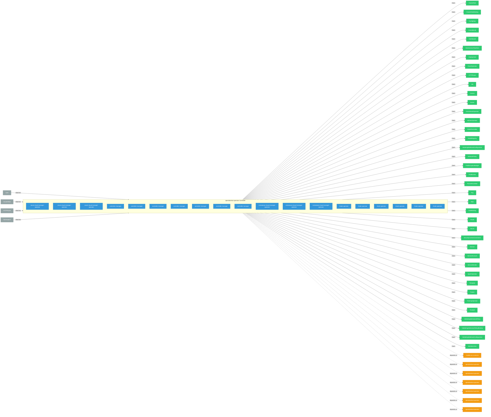

# opendatahub-operator

> **Architecture snapshot: 2026-05-05** (2026-05-05)

**Repository:** opendatahub-io/opendatahub-operator  
**Analyzer:** arch-analyzer 0.2.0  
**Extracted:** 2026-05-05T15:10:56Z

## Summary

| Metric | Count |
|--------|-------|
| CRDs | 0 |
| Deployments | 19 |
| Services | 3 |
| Secrets | 2 |
| Cluster Roles | 23 |
| Controller Watches | 194 |

## Component Architecture

CRDs, controllers, and owned Kubernetes resources.

### CRDs

No CRDs defined.

## Dependencies

### Internal Platform Dependencies

| Component | Interaction |
|-----------|-------------|
| models-as-a-service | Go module dependency: github.com/opendatahub-io/models-as-a-service/maas-controller |
| opendatahub-operator | Go module dependency: github.com/opendatahub-io/opendatahub-operator/pkg/clusterhealth |
| opendatahub-operator | Go module dependency: github.com/opendatahub-io/opendatahub-operator/v2/pkg/failureclassifier |
| opendatahub-operator | Go module dependency: github.com/opendatahub-io/opendatahub-operator/pkg/clusterhealth |
| opendatahub-operator | Go module dependency: github.com/opendatahub-io/opendatahub-operator/pkg/clusterhealth |
| opendatahub-operator | Go module dependency: github.com/opendatahub-io/opendatahub-operator/v2/pkg/failureclassifier |
| opendatahub-operator | Go module dependency: github.com/opendatahub-io/opendatahub-operator/pkg/clusterhealth |

### Key External Dependencies

| Module | Version |
|--------|---------|
| github.com/go-logr/logr | v1.4.3 |
| github.com/operator-framework/api | v0.42.0 |
| github.com/prometheus-operator/prometheus-operator/pkg/apis/monitoring | v0.68.0 |
| github.com/prometheus/client_golang | v1.23.2 |
| k8s.io/api | v0.35.2 |
| k8s.io/api | v0.35.2 |
| k8s.io/api | v0.35.3 |
| k8s.io/apiextensions-apiserver | v0.35.3 |
| k8s.io/apimachinery | v0.35.3 |
| k8s.io/apimachinery | v0.35.2 |
| k8s.io/apimachinery | v0.35.2 |
| k8s.io/apimachinery | v0.35.2 |
| k8s.io/client-go | v0.35.2 |
| k8s.io/client-go | v0.35.2 |
| k8s.io/client-go | v0.35.3 |
| k8s.io/client-go | v0.35.2 |
| sigs.k8s.io/controller-runtime | v0.23.3 |
| sigs.k8s.io/controller-runtime | v0.22.4 |
| sigs.k8s.io/controller-runtime | v0.22.4 |
| sigs.k8s.io/controller-runtime | v0.22.4 |

