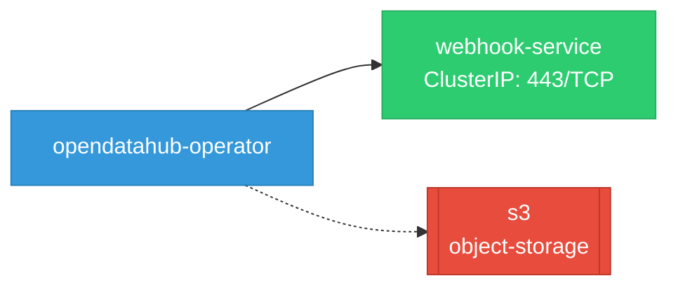

# opendatahub-operator: Network

## Service Map

*1 unique services (3 total, duplicates from test fixtures collapsed).*

### Services

| Name | Type | Ports | Source |
|------|------|-------|--------|
| webhook-service | ClusterIP | 443/TCP | [`config/rhaii/webhook/service.yaml`](https://github.com/opendatahub-io/opendatahub-operator/blob/d3ea1b8f029ac1156a79ef6440acd7a8831935de/config/rhaii/webhook/service.yaml) |
| webhook-service | ClusterIP | 443/TCP | [`config/rhoai/webhook/service.yaml`](https://github.com/opendatahub-io/opendatahub-operator/blob/d3ea1b8f029ac1156a79ef6440acd7a8831935de/config/rhoai/webhook/service.yaml) |
| webhook-service | ClusterIP | 443/TCP | [`config/webhook/service.yaml`](https://github.com/opendatahub-io/opendatahub-operator/blob/d3ea1b8f029ac1156a79ef6440acd7a8831935de/config/webhook/service.yaml) |

!!! warning "No Network Policies"
    No NetworkPolicy resources found. All pod-to-pod traffic is allowed by default.

