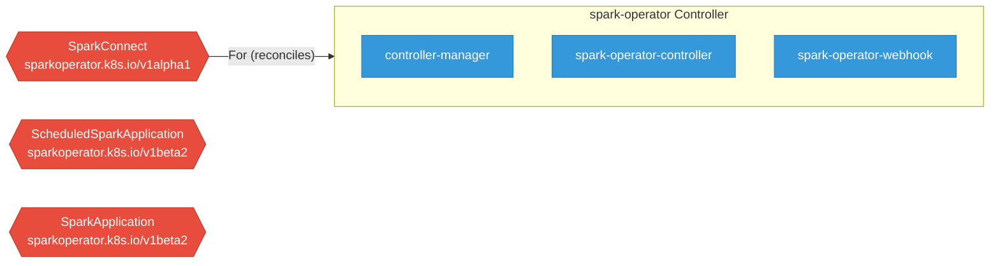

# spark-operator

> **Architecture snapshot: 2026-05-05** (2026-05-05)

**Repository:** kubeflow/spark-operator  
**Analyzer:** arch-analyzer 0.2.0  
**Extracted:** 2026-05-05T15:10:40Z

## Summary

| Metric | Count |
|--------|-------|
| CRDs | 3 |
| Deployments | 3 |
| Services | 1 |
| Secrets | 1 |
| Cluster Roles | 5 |
| Controller Watches | 1 |

## Component Architecture

CRDs, controllers, and owned Kubernetes resources.

### CRDs

| Group | Version | Kind | Scope | Fields | Validation Rules | Source |
|-------|---------|------|-------|--------|------------------|--------|
| sparkoperator.k8s.io | v1alpha1 | SparkConnect | Namespaced | 95 | 0 | [`config/crd/bases/sparkoperator.k8s.io_sparkconnects.yaml`](https://github.com/kubeflow/spark-operator/blob/b8a995788a0bd700354170600d0813db8a597241/config/crd/bases/sparkoperator.k8s.io_sparkconnects.yaml) |
| sparkoperator.k8s.io | v1beta2 | ScheduledSparkApplication | Namespaced | 1676 | 0 | [`config/crd/bases/sparkoperator.k8s.io_scheduledsparkapplications.yaml`](https://github.com/kubeflow/spark-operator/blob/b8a995788a0bd700354170600d0813db8a597241/config/crd/bases/sparkoperator.k8s.io_scheduledsparkapplications.yaml) |
| sparkoperator.k8s.io | v1beta2 | SparkApplication | Namespaced | 1679 | 0 | [`config/crd/bases/sparkoperator.k8s.io_sparkapplications.yaml`](https://github.com/kubeflow/spark-operator/blob/b8a995788a0bd700354170600d0813db8a597241/config/crd/bases/sparkoperator.k8s.io_sparkapplications.yaml) |

## Dependencies

### Key External Dependencies

| Module | Version |
|--------|---------|
| github.com/go-logr/logr | v1.4.3 |
| github.com/prometheus/client_golang | v1.23.2 |
| k8s.io/api | v0.32.5 |
| k8s.io/apiextensions-apiserver | v0.32.5 |
| k8s.io/apimachinery | v0.32.5 |
| k8s.io/apiserver | v0.32.5 |
| k8s.io/client-go | v0.32.5 |
| sigs.k8s.io/controller-runtime | v0.20.4 |

