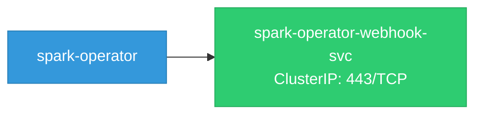
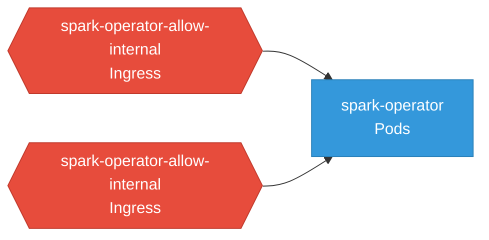

# spark-operator: Network

## Service Map

### Services

| Name | Type | Ports | Source |
|------|------|-------|--------|
| spark-operator-webhook-svc | ClusterIP | 443/TCP | [`config/webhook/service.yaml`](https://github.com/kubeflow/spark-operator/blob/39b1d20a7fd4163c7c0efa15c3e0194942aa1df1/config/webhook/service.yaml) |

### Network Policies

| Name | Policy Types | Source |
|------|-------------|--------|
| spark-operator-allow-internal | Ingress | [`config/overlays/odh/networkpolicy.yaml`](https://github.com/kubeflow/spark-operator/blob/39b1d20a7fd4163c7c0efa15c3e0194942aa1df1/config/overlays/odh/networkpolicy.yaml) |
| spark-operator-allow-internal | Ingress | [`config/overlays/rhoai/networkpolicy.yaml`](https://github.com/kubeflow/spark-operator/blob/39b1d20a7fd4163c7c0efa15c3e0194942aa1df1/config/overlays/rhoai/networkpolicy.yaml) |

## Network Policy Graph

Visual representation of NetworkPolicy rules. Ingress rules show what traffic is allowed into pods, egress rules show what traffic is allowed out.

