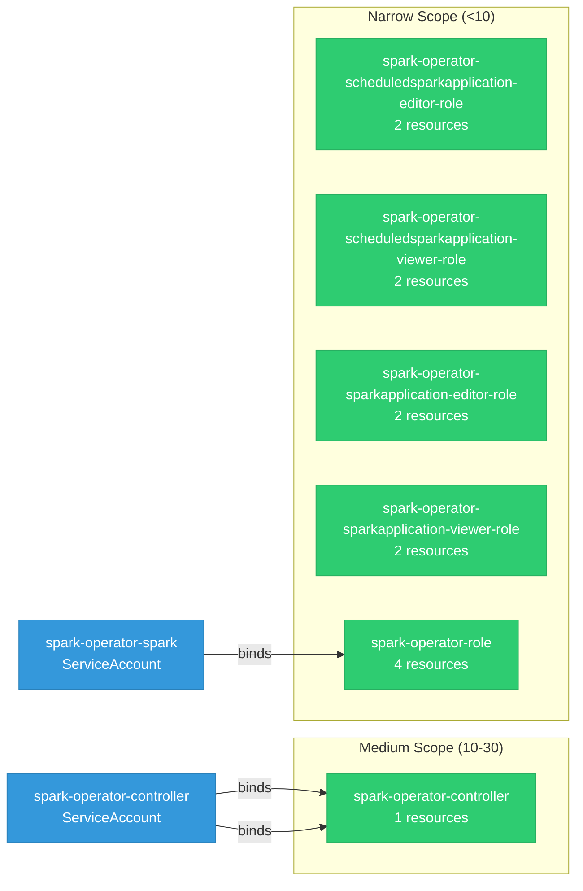

# spark-operator: RBAC

ServiceAccount bindings, roles, and resource permissions.

## RBAC Overview

This component defines a large RBAC surface (73 diagram lines). The graph below groups roles by permission scope.

## Bindings

Subject-to-role mappings defining who has access to what.

| Binding | Type | Role | Subject |
|---------|------|------|---------|
| spark-operator-controller | ClusterRoleBinding | spark-operator-controller | ServiceAccount/spark-operator-controller |
| spark-operator-controller | RoleBinding | spark-operator-controller | ServiceAccount/spark-operator-controller |
| spark-operator-rolebinding | RoleBinding | spark-operator-role | ServiceAccount/spark-operator-spark |

## Role Details

Per-rule breakdown of API groups, resources, and verbs for each role.

| Role | Kind | API Groups | Resources | Verbs |
|------|------|------------|-----------|-------|
| spark-operator-controller | ClusterRole |  | pods | create, delete, get, list, update, watch |
| spark-operator-controller | ClusterRole |  | configmaps | create, get, list, patch, update, watch |
| spark-operator-controller | ClusterRole |  | services | create, delete, get, list, patch, update, watch |
| spark-operator-controller | ClusterRole |  | persistentvolumeclaims | list, watch |
| spark-operator-controller | ClusterRole |  | events | create, patch, update |
| spark-operator-controller | ClusterRole |  | customresourcedefinitions | get |
| spark-operator-controller | ClusterRole |  | ingresses | create, delete, get, update |
| spark-operator-controller | ClusterRole |  | sparkapplications | create, delete, get, list, watch |
| spark-operator-controller | ClusterRole |  | scheduledsparkapplications | get, list, watch |
| spark-operator-controller | ClusterRole |  | scheduledsparkapplications/finalizers | update, patch |
| spark-operator-controller | ClusterRole |  | sparkconnects | get, list, watch |
| spark-operator-controller | ClusterRole |  | sparkapplications/finalizers | update |
| spark-operator-controller | ClusterRole |  | sparkapplications/status, scheduledsparkapplications/status, sparkconnects/status | update |
| spark-operator-scheduledsparkapplication-editor-role | ClusterRole |  | scheduledsparkapplications | create, delete, get, list, patch, update, watch |
| spark-operator-scheduledsparkapplication-editor-role | ClusterRole |  | scheduledsparkapplications/status | get |
| spark-operator-scheduledsparkapplication-viewer-role | ClusterRole |  | scheduledsparkapplications | get, list, watch |
| spark-operator-scheduledsparkapplication-viewer-role | ClusterRole |  | scheduledsparkapplications/status | get |
| spark-operator-sparkapplication-editor-role | ClusterRole |  | sparkapplications | create, delete, get, list, patch, update, watch |
| spark-operator-sparkapplication-editor-role | ClusterRole |  | sparkapplications/status | get |
| spark-operator-sparkapplication-viewer-role | ClusterRole |  | sparkapplications | get, list, watch |
| spark-operator-sparkapplication-viewer-role | ClusterRole |  | sparkapplications/status | get |
| spark-operator-controller | Role |  | leases | create, get, update |
| spark-operator-role | Role |  | pods, configmaps, persistentvolumeclaims, services | get, list, watch, create, update, patch, delete, deletecollection |

### Cluster Roles

| Name | Resources | Verbs | Source |
|------|-----------|-------|--------|
| spark-operator-controller | pods | create, delete, get, list, update, watch | [`config/rbac/clusterrole.yaml`](https://github.com/kubeflow/spark-operator/blob/39b1d20a7fd4163c7c0efa15c3e0194942aa1df1/config/rbac/clusterrole.yaml) |
| spark-operator-controller | configmaps | create, get, list, patch, update, watch | [`config/rbac/clusterrole.yaml`](https://github.com/kubeflow/spark-operator/blob/39b1d20a7fd4163c7c0efa15c3e0194942aa1df1/config/rbac/clusterrole.yaml) |
| spark-operator-controller | services | create, delete, get, list, patch, update, watch | [`config/rbac/clusterrole.yaml`](https://github.com/kubeflow/spark-operator/blob/39b1d20a7fd4163c7c0efa15c3e0194942aa1df1/config/rbac/clusterrole.yaml) |
| spark-operator-controller | persistentvolumeclaims | list, watch | [`config/rbac/clusterrole.yaml`](https://github.com/kubeflow/spark-operator/blob/39b1d20a7fd4163c7c0efa15c3e0194942aa1df1/config/rbac/clusterrole.yaml) |
| spark-operator-controller | events | create, patch, update | [`config/rbac/clusterrole.yaml`](https://github.com/kubeflow/spark-operator/blob/39b1d20a7fd4163c7c0efa15c3e0194942aa1df1/config/rbac/clusterrole.yaml) |
| spark-operator-controller | customresourcedefinitions | get | [`config/rbac/clusterrole.yaml`](https://github.com/kubeflow/spark-operator/blob/39b1d20a7fd4163c7c0efa15c3e0194942aa1df1/config/rbac/clusterrole.yaml) |
| spark-operator-controller | ingresses | create, delete, get, update | [`config/rbac/clusterrole.yaml`](https://github.com/kubeflow/spark-operator/blob/39b1d20a7fd4163c7c0efa15c3e0194942aa1df1/config/rbac/clusterrole.yaml) |
| spark-operator-controller | sparkapplications | create, delete, get, list, watch | [`config/rbac/clusterrole.yaml`](https://github.com/kubeflow/spark-operator/blob/39b1d20a7fd4163c7c0efa15c3e0194942aa1df1/config/rbac/clusterrole.yaml) |
| spark-operator-controller | scheduledsparkapplications | get, list, watch | [`config/rbac/clusterrole.yaml`](https://github.com/kubeflow/spark-operator/blob/39b1d20a7fd4163c7c0efa15c3e0194942aa1df1/config/rbac/clusterrole.yaml) |
| spark-operator-controller | scheduledsparkapplications/finalizers | update, patch | [`config/rbac/clusterrole.yaml`](https://github.com/kubeflow/spark-operator/blob/39b1d20a7fd4163c7c0efa15c3e0194942aa1df1/config/rbac/clusterrole.yaml) |
| spark-operator-controller | sparkconnects | get, list, watch | [`config/rbac/clusterrole.yaml`](https://github.com/kubeflow/spark-operator/blob/39b1d20a7fd4163c7c0efa15c3e0194942aa1df1/config/rbac/clusterrole.yaml) |
| spark-operator-controller | sparkapplications/finalizers | update | [`config/rbac/clusterrole.yaml`](https://github.com/kubeflow/spark-operator/blob/39b1d20a7fd4163c7c0efa15c3e0194942aa1df1/config/rbac/clusterrole.yaml) |
| spark-operator-controller | sparkapplications/status, scheduledsparkapplications/status, sparkconnects/status | update | [`config/rbac/clusterrole.yaml`](https://github.com/kubeflow/spark-operator/blob/39b1d20a7fd4163c7c0efa15c3e0194942aa1df1/config/rbac/clusterrole.yaml) |
| spark-operator-scheduledsparkapplication-editor-role | scheduledsparkapplications | create, delete, get, list, patch, update, watch | [`config/rbac/scheduledsparkapplication_editor_role.yaml`](https://github.com/kubeflow/spark-operator/blob/39b1d20a7fd4163c7c0efa15c3e0194942aa1df1/config/rbac/scheduledsparkapplication_editor_role.yaml) |
| spark-operator-scheduledsparkapplication-editor-role | scheduledsparkapplications/status | get | [`config/rbac/scheduledsparkapplication_editor_role.yaml`](https://github.com/kubeflow/spark-operator/blob/39b1d20a7fd4163c7c0efa15c3e0194942aa1df1/config/rbac/scheduledsparkapplication_editor_role.yaml) |
| spark-operator-scheduledsparkapplication-viewer-role | scheduledsparkapplications | get, list, watch | [`config/rbac/scheduledsparkapplication_viewer_role.yaml`](https://github.com/kubeflow/spark-operator/blob/39b1d20a7fd4163c7c0efa15c3e0194942aa1df1/config/rbac/scheduledsparkapplication_viewer_role.yaml) |
| spark-operator-scheduledsparkapplication-viewer-role | scheduledsparkapplications/status | get | [`config/rbac/scheduledsparkapplication_viewer_role.yaml`](https://github.com/kubeflow/spark-operator/blob/39b1d20a7fd4163c7c0efa15c3e0194942aa1df1/config/rbac/scheduledsparkapplication_viewer_role.yaml) |
| spark-operator-sparkapplication-editor-role | sparkapplications | create, delete, get, list, patch, update, watch | [`config/rbac/sparkapplication_editor_role.yaml`](https://github.com/kubeflow/spark-operator/blob/39b1d20a7fd4163c7c0efa15c3e0194942aa1df1/config/rbac/sparkapplication_editor_role.yaml) |
| spark-operator-sparkapplication-editor-role | sparkapplications/status | get | [`config/rbac/sparkapplication_editor_role.yaml`](https://github.com/kubeflow/spark-operator/blob/39b1d20a7fd4163c7c0efa15c3e0194942aa1df1/config/rbac/sparkapplication_editor_role.yaml) |
| spark-operator-sparkapplication-viewer-role | sparkapplications | get, list, watch | [`config/rbac/sparkapplication_viewer_role.yaml`](https://github.com/kubeflow/spark-operator/blob/39b1d20a7fd4163c7c0efa15c3e0194942aa1df1/config/rbac/sparkapplication_viewer_role.yaml) |
| spark-operator-sparkapplication-viewer-role | sparkapplications/status | get | [`config/rbac/sparkapplication_viewer_role.yaml`](https://github.com/kubeflow/spark-operator/blob/39b1d20a7fd4163c7c0efa15c3e0194942aa1df1/config/rbac/sparkapplication_viewer_role.yaml) |

