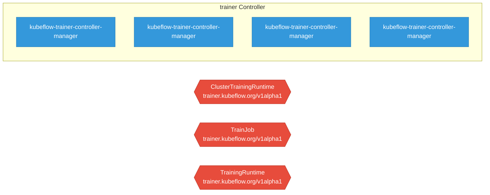

# trainer

> **Architecture snapshot: 2026-05-05** (2026-05-05)

**Repository:** kubeflow/trainer  
**Analyzer:** arch-analyzer 0.2.0  
**Extracted:** 2026-05-05T15:09:15Z

## Summary

| Metric | Count |
|--------|-------|
| CRDs | 3 |
| Deployments | 4 |
| Services | 0 |
| Secrets | 1 |
| Cluster Roles | 8 |
| Controller Watches | 0 |

## Component Architecture

CRDs, controllers, and owned Kubernetes resources.

### CRDs

| Group | Version | Kind | Scope | Fields | Validation Rules | Source |
|-------|---------|------|-------|--------|------------------|--------|
| trainer.kubeflow.org | v1alpha1 | ClusterTrainingRuntime | Cluster | 1246 | 9 | [`manifests/base/crds/trainer.kubeflow.org_clustertrainingruntimes.yaml`](https://github.com/kubeflow/trainer/blob/5adde88079bb88d4fcb58072110bbbbd9c8692f7/manifests/base/crds/trainer.kubeflow.org_clustertrainingruntimes.yaml) |
| trainer.kubeflow.org | v1alpha1 | TrainJob | Namespaced | 562 | 5 | [`manifests/base/crds/trainer.kubeflow.org_trainjobs.yaml`](https://github.com/kubeflow/trainer/blob/5adde88079bb88d4fcb58072110bbbbd9c8692f7/manifests/base/crds/trainer.kubeflow.org_trainjobs.yaml) |
| trainer.kubeflow.org | v1alpha1 | TrainingRuntime | Namespaced | 1246 | 9 | [`manifests/base/crds/trainer.kubeflow.org_trainingruntimes.yaml`](https://github.com/kubeflow/trainer/blob/5adde88079bb88d4fcb58072110bbbbd9c8692f7/manifests/base/crds/trainer.kubeflow.org_trainingruntimes.yaml) |

## Dependencies

### Key External Dependencies

| Module | Version |
|--------|---------|
| github.com/go-logr/logr | v1.4.3 |
| k8s.io/api | v0.34.1 |
| k8s.io/apimachinery | v0.34.1 |
| k8s.io/client-go | v0.34.1 |
| sigs.k8s.io/controller-runtime | v0.22.3 |

