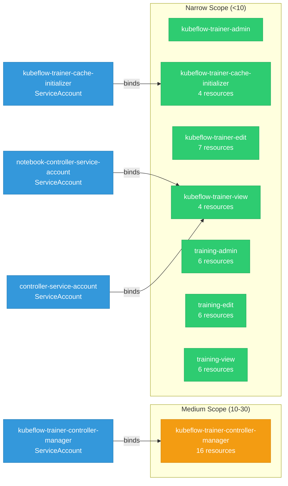

# trainer: RBAC

ServiceAccount bindings, roles, and resource permissions.

## RBAC Overview

This component defines a large RBAC surface (119 diagram lines). The graph below groups roles by permission scope.

## Bindings

Subject-to-role mappings defining who has access to what.

| Binding | Type | Role | Subject |
|---------|------|------|---------|
| kubeflow-trainer-controller-manager | ClusterRoleBinding | kubeflow-trainer-controller-manager | ServiceAccount/kubeflow-trainer-controller-manager |
| kubeflow-trainer-view | ClusterRoleBinding | kubeflow-trainer-view | ServiceAccount/notebook-controller-service-account |
| kubeflow-trainer-view | ClusterRoleBinding | kubeflow-trainer-view | ServiceAccount/controller-service-account |
| kubeflow-trainer-cache-initializer | RoleBinding | kubeflow-trainer-cache-initializer | ServiceAccount/kubeflow-trainer-cache-initializer |

## Role Details

Per-rule breakdown of API groups, resources, and verbs for each role.

| Role | Kind | API Groups | Resources | Verbs |
|------|------|------------|-----------|-------|
| kubeflow-trainer-cache-initializer | ClusterRole |  | leaderworkersets, services | create, get, list, watch |
| kubeflow-trainer-cache-initializer | ClusterRole |  | serviceaccounts | create, delete, get, list, watch |
| kubeflow-trainer-cache-initializer | ClusterRole |  | trainjobs | get, list, watch |
| kubeflow-trainer-controller-manager | ClusterRole |  | configmaps, secrets | create, get, list, patch, update, watch |
| kubeflow-trainer-controller-manager | ClusterRole |  | events | create, patch, update, watch |
| kubeflow-trainer-controller-manager | ClusterRole |  | limitranges | get, list, watch |
| kubeflow-trainer-controller-manager | ClusterRole |  | validatingwebhookconfigurations | get, list, update, watch |
| kubeflow-trainer-controller-manager | ClusterRole |  | leases | create, get, list, update |
| kubeflow-trainer-controller-manager | ClusterRole |  | jobsets | create, get, list, patch, update, watch |
| kubeflow-trainer-controller-manager | ClusterRole |  | runtimeclasses | get, list, watch |
| kubeflow-trainer-controller-manager | ClusterRole |  | podgroups | create, get, list, patch, update, watch |
| kubeflow-trainer-controller-manager | ClusterRole |  | clustertrainingruntimes, trainingruntimes, trainjobs | get, list, patch, update, watch |
| kubeflow-trainer-controller-manager | ClusterRole |  | clustertrainingruntimes/finalizers, trainingruntimes/finalizers, trainjobs/finalizers, trainjobs/status | get, patch, update |
| kubeflow-trainer-edit | ClusterRole |  | clustertrainingruntimes, trainingruntimes | get, list, watch |
| kubeflow-trainer-edit | ClusterRole |  | trainjobs | create, delete, get, list, patch, update, watch |
| kubeflow-trainer-edit | ClusterRole |  | trainjobs/status | get |
| kubeflow-trainer-edit | ClusterRole |  | pods | list |
| kubeflow-trainer-edit | ClusterRole |  | pods/log | get |
| kubeflow-trainer-edit | ClusterRole |  | events | get, list, watch |
| kubeflow-trainer-view | ClusterRole |  | clustertrainingruntimes, trainingruntimes, trainjobs | get, list, watch |
| kubeflow-trainer-view | ClusterRole |  | trainjobs/status | get |
| training-admin | ClusterRole |  | trainjobs, trainingruntimes, clustertrainingruntimes | create, delete, get, list, patch, update, watch |
| training-admin | ClusterRole |  | trainjobs/status, trainingruntimes/status, clustertrainingruntimes/status | get |
| training-edit | ClusterRole |  | trainjobs | create, delete, get, list, patch, update, watch |
| training-edit | ClusterRole |  | trainjobs/status | get |
| training-edit | ClusterRole |  | trainingruntimes, clustertrainingruntimes | get, list, watch |
| training-edit | ClusterRole |  | trainingruntimes/status, clustertrainingruntimes/status | get |
| training-view | ClusterRole |  | trainjobs, trainingruntimes, clustertrainingruntimes | get, list, watch |
| training-view | ClusterRole |  | trainjobs/status, trainingruntimes/status, clustertrainingruntimes/status | get |

### Cluster Roles

| Name | Resources | Verbs | Source |
|------|-----------|-------|--------|
| kubeflow-trainer-cache-initializer | leaderworkersets, services | create, get, list, watch | [`manifests/overlays/data-cache/cluster_role.yaml`](https://github.com/kubeflow/trainer/blob/5adde88079bb88d4fcb58072110bbbbd9c8692f7/manifests/overlays/data-cache/cluster_role.yaml) |
| kubeflow-trainer-cache-initializer | serviceaccounts | create, delete, get, list, watch | [`manifests/overlays/data-cache/cluster_role.yaml`](https://github.com/kubeflow/trainer/blob/5adde88079bb88d4fcb58072110bbbbd9c8692f7/manifests/overlays/data-cache/cluster_role.yaml) |
| kubeflow-trainer-cache-initializer | trainjobs | get, list, watch | [`manifests/overlays/data-cache/cluster_role.yaml`](https://github.com/kubeflow/trainer/blob/5adde88079bb88d4fcb58072110bbbbd9c8692f7/manifests/overlays/data-cache/cluster_role.yaml) |
| kubeflow-trainer-controller-manager | configmaps, secrets | create, get, list, patch, update, watch | [`manifests/base/rbac/role.yaml`](https://github.com/kubeflow/trainer/blob/5adde88079bb88d4fcb58072110bbbbd9c8692f7/manifests/base/rbac/role.yaml) |
| kubeflow-trainer-controller-manager | events | create, patch, update, watch | [`manifests/base/rbac/role.yaml`](https://github.com/kubeflow/trainer/blob/5adde88079bb88d4fcb58072110bbbbd9c8692f7/manifests/base/rbac/role.yaml) |
| kubeflow-trainer-controller-manager | limitranges | get, list, watch | [`manifests/base/rbac/role.yaml`](https://github.com/kubeflow/trainer/blob/5adde88079bb88d4fcb58072110bbbbd9c8692f7/manifests/base/rbac/role.yaml) |
| kubeflow-trainer-controller-manager | validatingwebhookconfigurations | get, list, update, watch | [`manifests/base/rbac/role.yaml`](https://github.com/kubeflow/trainer/blob/5adde88079bb88d4fcb58072110bbbbd9c8692f7/manifests/base/rbac/role.yaml) |
| kubeflow-trainer-controller-manager | leases | create, get, list, update | [`manifests/base/rbac/role.yaml`](https://github.com/kubeflow/trainer/blob/5adde88079bb88d4fcb58072110bbbbd9c8692f7/manifests/base/rbac/role.yaml) |
| kubeflow-trainer-controller-manager | jobsets | create, get, list, patch, update, watch | [`manifests/base/rbac/role.yaml`](https://github.com/kubeflow/trainer/blob/5adde88079bb88d4fcb58072110bbbbd9c8692f7/manifests/base/rbac/role.yaml) |
| kubeflow-trainer-controller-manager | runtimeclasses | get, list, watch | [`manifests/base/rbac/role.yaml`](https://github.com/kubeflow/trainer/blob/5adde88079bb88d4fcb58072110bbbbd9c8692f7/manifests/base/rbac/role.yaml) |
| kubeflow-trainer-controller-manager | podgroups | create, get, list, patch, update, watch | [`manifests/base/rbac/role.yaml`](https://github.com/kubeflow/trainer/blob/5adde88079bb88d4fcb58072110bbbbd9c8692f7/manifests/base/rbac/role.yaml) |
| kubeflow-trainer-controller-manager | clustertrainingruntimes, trainingruntimes, trainjobs | get, list, patch, update, watch | [`manifests/base/rbac/role.yaml`](https://github.com/kubeflow/trainer/blob/5adde88079bb88d4fcb58072110bbbbd9c8692f7/manifests/base/rbac/role.yaml) |
| kubeflow-trainer-controller-manager | clustertrainingruntimes/finalizers, trainingruntimes/finalizers, trainjobs/finalizers, trainjobs/status | get, patch, update | [`manifests/base/rbac/role.yaml`](https://github.com/kubeflow/trainer/blob/5adde88079bb88d4fcb58072110bbbbd9c8692f7/manifests/base/rbac/role.yaml) |
| kubeflow-trainer-edit | clustertrainingruntimes, trainingruntimes | get, list, watch | [`manifests/overlays/kubeflow-platform/kubeflow-trainer-roles.yaml`](https://github.com/kubeflow/trainer/blob/5adde88079bb88d4fcb58072110bbbbd9c8692f7/manifests/overlays/kubeflow-platform/kubeflow-trainer-roles.yaml) |
| kubeflow-trainer-edit | trainjobs | create, delete, get, list, patch, update, watch | [`manifests/overlays/kubeflow-platform/kubeflow-trainer-roles.yaml`](https://github.com/kubeflow/trainer/blob/5adde88079bb88d4fcb58072110bbbbd9c8692f7/manifests/overlays/kubeflow-platform/kubeflow-trainer-roles.yaml) |
| kubeflow-trainer-edit | trainjobs/status | get | [`manifests/overlays/kubeflow-platform/kubeflow-trainer-roles.yaml`](https://github.com/kubeflow/trainer/blob/5adde88079bb88d4fcb58072110bbbbd9c8692f7/manifests/overlays/kubeflow-platform/kubeflow-trainer-roles.yaml) |
| kubeflow-trainer-edit | pods | list | [`manifests/overlays/kubeflow-platform/kubeflow-trainer-roles.yaml`](https://github.com/kubeflow/trainer/blob/5adde88079bb88d4fcb58072110bbbbd9c8692f7/manifests/overlays/kubeflow-platform/kubeflow-trainer-roles.yaml) |
| kubeflow-trainer-edit | pods/log | get | [`manifests/overlays/kubeflow-platform/kubeflow-trainer-roles.yaml`](https://github.com/kubeflow/trainer/blob/5adde88079bb88d4fcb58072110bbbbd9c8692f7/manifests/overlays/kubeflow-platform/kubeflow-trainer-roles.yaml) |
| kubeflow-trainer-edit | events | get, list, watch | [`manifests/overlays/kubeflow-platform/kubeflow-trainer-roles.yaml`](https://github.com/kubeflow/trainer/blob/5adde88079bb88d4fcb58072110bbbbd9c8692f7/manifests/overlays/kubeflow-platform/kubeflow-trainer-roles.yaml) |
| kubeflow-trainer-view | clustertrainingruntimes, trainingruntimes, trainjobs | get, list, watch | [`manifests/overlays/kubeflow-platform/kubeflow-trainer-roles.yaml`](https://github.com/kubeflow/trainer/blob/5adde88079bb88d4fcb58072110bbbbd9c8692f7/manifests/overlays/kubeflow-platform/kubeflow-trainer-roles.yaml) |
| kubeflow-trainer-view | trainjobs/status | get | [`manifests/overlays/kubeflow-platform/kubeflow-trainer-roles.yaml`](https://github.com/kubeflow/trainer/blob/5adde88079bb88d4fcb58072110bbbbd9c8692f7/manifests/overlays/kubeflow-platform/kubeflow-trainer-roles.yaml) |
| training-admin | trainjobs, trainingruntimes, clustertrainingruntimes | create, delete, get, list, patch, update, watch | [`manifests/rhoai/kubeflow-training-roles.yaml`](https://github.com/kubeflow/trainer/blob/5adde88079bb88d4fcb58072110bbbbd9c8692f7/manifests/rhoai/kubeflow-training-roles.yaml) |
| training-admin | trainjobs/status, trainingruntimes/status, clustertrainingruntimes/status | get | [`manifests/rhoai/kubeflow-training-roles.yaml`](https://github.com/kubeflow/trainer/blob/5adde88079bb88d4fcb58072110bbbbd9c8692f7/manifests/rhoai/kubeflow-training-roles.yaml) |
| training-edit | trainjobs | create, delete, get, list, patch, update, watch | [`manifests/rhoai/kubeflow-training-roles.yaml`](https://github.com/kubeflow/trainer/blob/5adde88079bb88d4fcb58072110bbbbd9c8692f7/manifests/rhoai/kubeflow-training-roles.yaml) |
| training-edit | trainjobs/status | get | [`manifests/rhoai/kubeflow-training-roles.yaml`](https://github.com/kubeflow/trainer/blob/5adde88079bb88d4fcb58072110bbbbd9c8692f7/manifests/rhoai/kubeflow-training-roles.yaml) |
| training-edit | trainingruntimes, clustertrainingruntimes | get, list, watch | [`manifests/rhoai/kubeflow-training-roles.yaml`](https://github.com/kubeflow/trainer/blob/5adde88079bb88d4fcb58072110bbbbd9c8692f7/manifests/rhoai/kubeflow-training-roles.yaml) |
| training-edit | trainingruntimes/status, clustertrainingruntimes/status | get | [`manifests/rhoai/kubeflow-training-roles.yaml`](https://github.com/kubeflow/trainer/blob/5adde88079bb88d4fcb58072110bbbbd9c8692f7/manifests/rhoai/kubeflow-training-roles.yaml) |
| training-view | trainjobs, trainingruntimes, clustertrainingruntimes | get, list, watch | [`manifests/rhoai/kubeflow-training-roles.yaml`](https://github.com/kubeflow/trainer/blob/5adde88079bb88d4fcb58072110bbbbd9c8692f7/manifests/rhoai/kubeflow-training-roles.yaml) |
| training-view | trainjobs/status, trainingruntimes/status, clustertrainingruntimes/status | get | [`manifests/rhoai/kubeflow-training-roles.yaml`](https://github.com/kubeflow/trainer/blob/5adde88079bb88d4fcb58072110bbbbd9c8692f7/manifests/rhoai/kubeflow-training-roles.yaml) |

### Kubebuilder RBAC Markers

Kubebuilder `+kubebuilder:rbac` markers declare the RBAC requirements of controller reconcilers. These are the source of truth for generated ClusterRole manifests. 2 markers found.

| File | Line | Groups | Resources | Verbs |
|------|------|--------|-----------|-------|
| [`pkg/util/cert/cert.go:51`](https://github.com/kubeflow/trainer/blob/5adde88079bb88d4fcb58072110bbbbd9c8692f7/pkg/util/cert/cert.go#L51) | 51 | "" | secrets | get, list, watch, update |
| [`pkg/util/cert/cert.go:52`](https://github.com/kubeflow/trainer/blob/5adde88079bb88d4fcb58072110bbbbd9c8692f7/pkg/util/cert/cert.go#L52) | 52 | "admissionregistration.k8s.io" | validatingwebhookconfigurations | get, list, watch, update |

