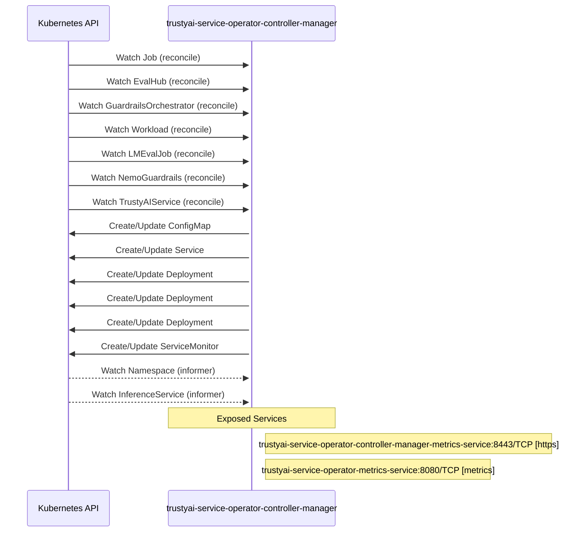

# trustyai-service-operator: Dataflow

## Controller Watches

Kubernetes resources this controller monitors for changes. Each watch triggers reconciliation when the watched resource is created, updated, or deleted.

| Type | GVK | Source |
|------|-----|--------|
| For | batch/v1/Job | [`controllers/evalhub/evaluation_job_failure_reconciler.go:185`](https://github.com/trustyai-explainability/trustyai-service-operator/blob/2ca2fc6525317403966e3289e78c836843f3146a/controllers/evalhub/evaluation_job_failure_reconciler.go#L185) |
| For | evalhub/v1alpha1/EvalHub | [`controllers/evalhub/evalhub_controller.go:267`](https://github.com/trustyai-explainability/trustyai-service-operator/blob/2ca2fc6525317403966e3289e78c836843f3146a/controllers/evalhub/evalhub_controller.go#L267) |
| For | gorch/v1alpha1/GuardrailsOrchestrator | [`controllers/gorch/guardrailsorchestrator_controller.go:410`](https://github.com/trustyai-explainability/trustyai-service-operator/blob/2ca2fc6525317403966e3289e78c836843f3146a/controllers/gorch/guardrailsorchestrator_controller.go#L410) |
| For | kueue/v1beta1/Workload | [`controllers/evalhub/evaluation_failed_kueue_workloads_reconciler.go:76`](https://github.com/trustyai-explainability/trustyai-service-operator/blob/2ca2fc6525317403966e3289e78c836843f3146a/controllers/evalhub/evaluation_failed_kueue_workloads_reconciler.go#L76) |
| For | lmes/v1alpha1/LMEvalJob | [`controllers/lmes/lmevaljob_controller.go:299`](https://github.com/trustyai-explainability/trustyai-service-operator/blob/2ca2fc6525317403966e3289e78c836843f3146a/controllers/lmes/lmevaljob_controller.go#L299) |
| For | nemo_guardrails/v1alpha1/NemoGuardrails | [`controllers/nemo_guardrails/nemoguardrail_controller.go:215`](https://github.com/trustyai-explainability/trustyai-service-operator/blob/2ca2fc6525317403966e3289e78c836843f3146a/controllers/nemo_guardrails/nemoguardrail_controller.go#L215) |
| For | tas/v1alpha1/TrustyAIService | [`controllers/tas/trustyaiservice_controller.go:279`](https://github.com/trustyai-explainability/trustyai-service-operator/blob/2ca2fc6525317403966e3289e78c836843f3146a/controllers/tas/trustyaiservice_controller.go#L279) |
| Owns | /v1/ConfigMap | [`controllers/evalhub/evalhub_controller.go:270`](https://github.com/trustyai-explainability/trustyai-service-operator/blob/2ca2fc6525317403966e3289e78c836843f3146a/controllers/evalhub/evalhub_controller.go#L270) |
| Owns | /v1/Service | [`controllers/evalhub/evalhub_controller.go:269`](https://github.com/trustyai-explainability/trustyai-service-operator/blob/2ca2fc6525317403966e3289e78c836843f3146a/controllers/evalhub/evalhub_controller.go#L269) |
| Owns | apps/v1/Deployment | [`controllers/gorch/guardrailsorchestrator_controller.go:411`](https://github.com/trustyai-explainability/trustyai-service-operator/blob/2ca2fc6525317403966e3289e78c836843f3146a/controllers/gorch/guardrailsorchestrator_controller.go#L411) |
| Owns | apps/v1/Deployment | [`controllers/tas/trustyaiservice_controller.go:280`](https://github.com/trustyai-explainability/trustyai-service-operator/blob/2ca2fc6525317403966e3289e78c836843f3146a/controllers/tas/trustyaiservice_controller.go#L280) |
| Owns | apps/v1/Deployment | [`controllers/evalhub/evalhub_controller.go:268`](https://github.com/trustyai-explainability/trustyai-service-operator/blob/2ca2fc6525317403966e3289e78c836843f3146a/controllers/evalhub/evalhub_controller.go#L268) |
| Owns | monitoring/v1/ServiceMonitor | [`controllers/evalhub/evalhub_controller.go:274`](https://github.com/trustyai-explainability/trustyai-service-operator/blob/2ca2fc6525317403966e3289e78c836843f3146a/controllers/evalhub/evalhub_controller.go#L274) |
| Watches | /v1/Namespace | [`controllers/evalhub/evalhub_controller.go:271`](https://github.com/trustyai-explainability/trustyai-service-operator/blob/2ca2fc6525317403966e3289e78c836843f3146a/controllers/evalhub/evalhub_controller.go#L271) |
| Watches | serving/v1beta1/InferenceService | [`controllers/tas/trustyaiservice_controller.go:281`](https://github.com/trustyai-explainability/trustyai-service-operator/blob/2ca2fc6525317403966e3289e78c836843f3146a/controllers/tas/trustyaiservice_controller.go#L281) |

## Reconciliation Flow

How the controller interacts with the Kubernetes API during reconciliation.

## Configuration

ConfigMaps and Helm values that control this component's runtime behavior.

