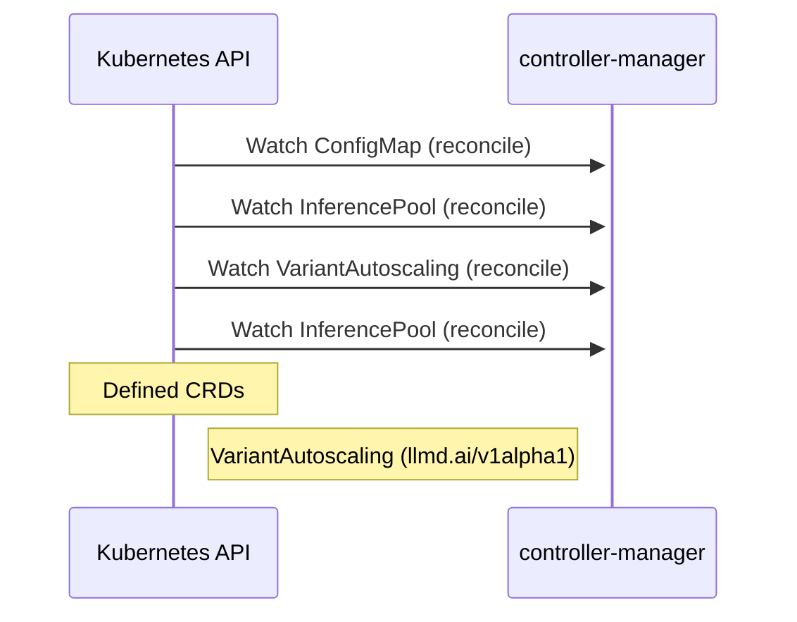

# workload-variant-autoscaler: Dataflow

## Controller Watches

Kubernetes resources this controller monitors for changes. Each watch triggers reconciliation when the watched resource is created, updated, or deleted.

| Type | GVK | Source |
|------|-----|--------|
| For | /v1/ConfigMap | [`internal/controller/configmap_reconciler.go:97`](https://github.com/llm-d/workload-variant-autoscaler/blob/e8fb8f01571f92111e7b68c8766a2bfca7dcec35/internal/controller/configmap_reconciler.go#L97) |
| For | api/v1/InferencePool | [`internal/controller/inferencepool_reconciler.go:113`](https://github.com/llm-d/workload-variant-autoscaler/blob/e8fb8f01571f92111e7b68c8766a2bfca7dcec35/internal/controller/inferencepool_reconciler.go#L113) |
| For | api/v1alpha1/VariantAutoscaling | [`internal/controller/variantautoscaling_controller.go:362`](https://github.com/llm-d/workload-variant-autoscaler/blob/e8fb8f01571f92111e7b68c8766a2bfca7dcec35/internal/controller/variantautoscaling_controller.go#L362) |
| For | apix/v1alpha2/InferencePool | [`internal/controller/inferencepool_reconciler.go:109`](https://github.com/llm-d/workload-variant-autoscaler/blob/e8fb8f01571f92111e7b68c8766a2bfca7dcec35/internal/controller/inferencepool_reconciler.go#L109) |

## Reconciliation Flow

How the controller interacts with the Kubernetes API during reconciliation.

## Configuration

ConfigMaps and Helm values that control this component's runtime behavior.

### ConfigMaps

| Name | Data Keys | Source |
|------|-----------|--------|
| saturation-scaling-config | default | [`config/manager/configmap-saturation-scaling.yaml`](https://github.com/llm-d/workload-variant-autoscaler/blob/e8fb8f01571f92111e7b68c8766a2bfca7dcec35/config/manager/configmap-saturation-scaling.yaml) |
| service-classes-config | freemium.yaml, premium.yaml | [`deploy/configmap-serviceclass.yaml`](https://github.com/llm-d/workload-variant-autoscaler/blob/e8fb8f01571f92111e7b68c8766a2bfca7dcec35/deploy/configmap-serviceclass.yaml) |
| wva-queueing-model-config | default | [`deploy/configmap-queueing-model.yaml`](https://github.com/llm-d/workload-variant-autoscaler/blob/e8fb8f01571f92111e7b68c8766a2bfca7dcec35/deploy/configmap-queueing-model.yaml) |
| wva-saturation-scaling-config | default | [`deploy/configmap-saturation-scaling.yaml`](https://github.com/llm-d/workload-variant-autoscaler/blob/e8fb8f01571f92111e7b68c8766a2bfca7dcec35/deploy/configmap-saturation-scaling.yaml) |
| wva-variantautoscaling-config | GLOBAL_OPT_INTERVAL, PROMETHEUS_BASE_URL, PROMETHEUS_METRICS_CACHE_CLEANUP_INTERVAL, PROMETHEUS_METRICS_CACHE_FETCH_INTERVAL, PROMETHEUS_METRICS_CACHE_FRESH_THRESHOLD, PROMETHEUS_METRICS_CACHE_MAX_SIZE, PROMETHEUS_METRICS_CACHE_STALE_THRESHOLD, PROMETHEUS_METRICS_CACHE_TTL, PROMETHEUS_METRICS_CACHE_UNAVAILABLE_THRESHOLD, PROMETHEUS_TLS_INSECURE_SKIP_VERIFY, WVA_LIMITED_MODE, WVA_NODE_SELECTOR, WVA_SCALE_TO_ZERO | [`config/manager/configmap.yaml`](https://github.com/llm-d/workload-variant-autoscaler/blob/e8fb8f01571f92111e7b68c8766a2bfca7dcec35/config/manager/configmap.yaml) |
| wva-variantautoscaling-config | GLOBAL_OPT_INTERVAL, PROMETHEUS_BASE_URL, PROMETHEUS_METRICS_CACHE_CLEANUP_INTERVAL, PROMETHEUS_METRICS_CACHE_FETCH_INTERVAL, PROMETHEUS_METRICS_CACHE_FRESH_THRESHOLD, PROMETHEUS_METRICS_CACHE_STALE_THRESHOLD, PROMETHEUS_METRICS_CACHE_TTL, PROMETHEUS_METRICS_CACHE_UNAVAILABLE_THRESHOLD, PROMETHEUS_TLS_INSECURE_SKIP_VERIFY | [`config/openshift/configmap-patch.yaml`](https://github.com/llm-d/workload-variant-autoscaler/blob/e8fb8f01571f92111e7b68c8766a2bfca7dcec35/config/openshift/configmap-patch.yaml) |

### Helm

**Chart:** workload-variant-autoscaler v0.5.1

